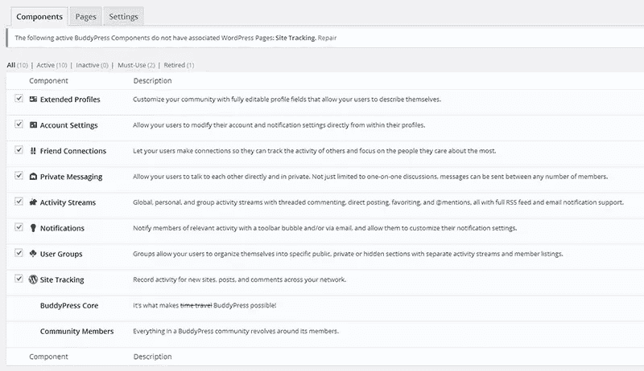
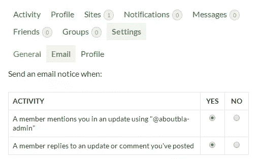
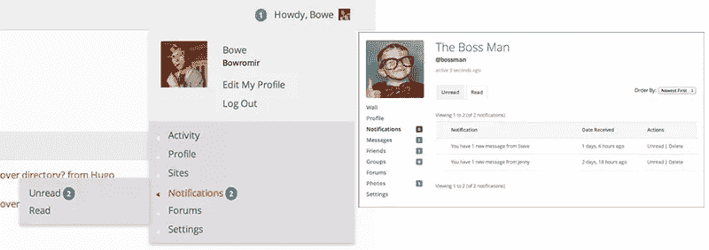
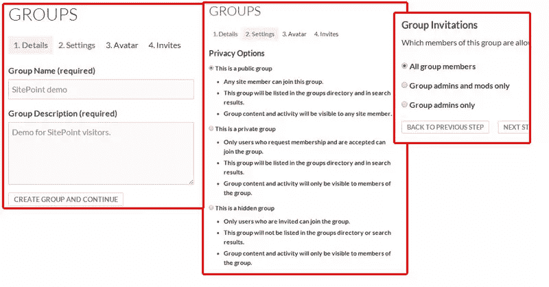
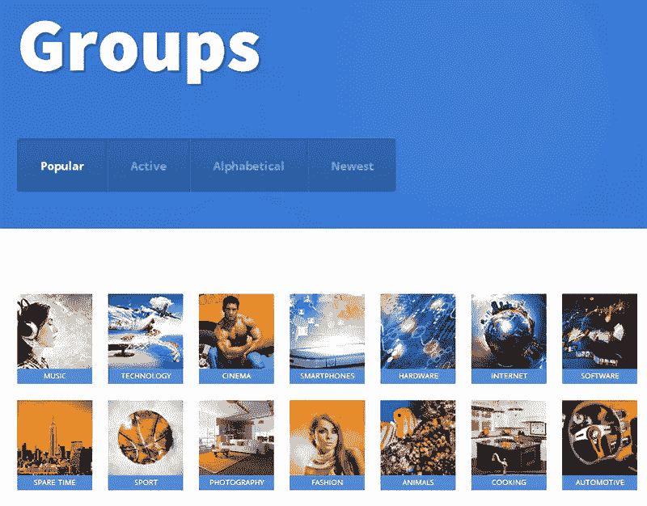
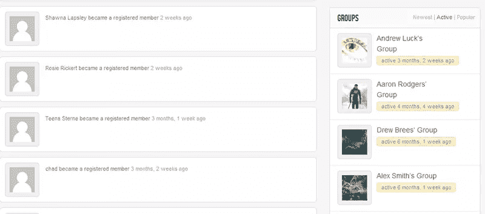

# 社交化的 WordPress——BuddyPress

> 原文：<https://www.sitepoint.com/wordpress-gone-social-buddypress/>

我们大多数人都知道 WordPress 是一个博客平台或全功能 CMS，能够以许多不同的方式转变。但是你知道你甚至可以把 WordPress 变成你自己的社交网络吗？它叫做 **BuddyPress** ，是一个扩展 WordPress 的插件，为你提供创建自己的社交网络和在线社区所需的所有组件。

在这篇文章中，我将仔细研究 BuddyPress 提供的所有优点，包括各种合适的主题。我还将向您展示一个工作演示，以及管理您自己的社区是多么容易。

## 为什么要用 BuddyPress？

你可以尝试推出“新脸书”,目标是实现数十亿美元的估值，但这可能有点牵强。BuddyPress 旨在为你的校园、公司甚至家庭建立一个专门的社区。它不仅对你认识每个成员的小社区有用，你可以很容易地管理一个有成千上万成员的社区，以非常复杂的方式相互交流。

BuddyPress 的一个很好的例子是 [Shift.ms](http://shift.ms/) ，这是一个为那些被诊断患有多发性硬化症的人建立的社交网络。在这个网络中，用户分享他们的知识，互相询问问题，或者只是在困难的时候提供支持。WordPress 和 BuddyPress 的结合使其成为一个完美的资源，可以通过各种方式提供有用的信息。

使用 BuddyPress 的另一个原因是活跃用户和开发者社区。因为 BuddyPress(像 WordPress 一样)是开源的，有很多伟大的人不断地把 BuddyPress 做得更好。

## 你从盒子里得到了什么？

BuddyPress 附带了各种组件，但是您可以根据需要为您的网络打开或关闭这些组件。下面列出了这些组件，您应该可以很好地了解 BuddyPress 所提供的特性和功能类型:

### 扩展配置文件

这允许您在管理仪表板中设置自定义配置文件字段。这里有一个例子:

### 帐户设置

这个比常规的 WordPress 账户设置更进一步，尤其是在通知设置方面(注意:截图只提供了一小部分可用的设置)。

### 朋友关系

这个我们都知道来自脸书，在那里你可以和你的朋友保持联系。

### 私人信息

一种完美的交流方式，不那么社交化，更个人化。

### 活动流

类似于脸书时间表，这是你记录你的联系、群提及等的地方。一个完整的网站流也是可用的，就像在 [Shift.ms](http://shift.ms/) 上的那个。

信用:[佛教法典](http://codex.buddypress.org/buddypress-components-and-features/notifications/)

### 通知

这一款带有工具栏和专用收件箱，并通过电子邮件通知。

### 用户组

在你的社区中有更多专门的焦点小组，允许独立的活动流和成员组。再次 [Shift.ms 很好地解决了](http://shift.ms/groups/)这个问题。

### 网站跟踪

指定一个页面，您可以在其中跟踪整个站点/网络中的新站点(处于管理部门模式时)、帖子和评论。

此外，您还可以轻松地建立一个论坛。让它运行起来只需要几个小步骤，[这里有一个简单的例子](http://swbhengage.com/discussions/epilepsy/)。

如果你已经熟悉 WordPress 本身，你会发现管理 BuddyPress 是一件轻而易举的事情。例如，当涉及到设置时，创建组是非常简单的，但是仍然为您提供了足够的选项。

您可以像管理评论一样管理活动流，并照看常规用户系统中的成员。有时候只是命名不同的问题，但这绝对降低了使用 BuddyPress 的门槛。

## 伸展芽压

### BuddyPress 插件

BuddyPress 本身是一个平台，如果你不能在它的基础上构建大量不同的插件，并根据主题定制它，它就不会像今天这样受欢迎。

在写这篇文章的时候，有 548 个插件是专门为 BuddyPress 开发的。你也可以为你的 BuddyPress 站点使用许多标准的 WordPress 插件，但是这很大程度上取决于它的用途。

BuddyPress 本身已经是一个具有定制功能的插件，你需要确保如果你安装另一个插件，它也将与 BuddyPress 集成。在大多数情况下，只需要查看插件文档或者自己测试一下。

大多数流行的 WordPress 插件都提供 BuddyPress 集成。此外，很高兴知道 BuddyPress 的博客功能可以与所有标准插件一起工作，因为这是一个普通的 WordPress 博客。

### BuddyPress 主题

BuddyPress 可以处理任何在 WordPress 上运行的主题。但是，这并不意味着你不应该考虑使用一个专门的 BuddyPress 主题。

为什么？和 WordPress 的大多数高级定制一样，有时使用一个专用的主题来实现特定的功能会更好。以 WooCommerce 商店为例:常规主题很好，但如果你想充分利用这个插件，有时最好使用专用的电子商务主题。它只是有一个更好的布局，并确保自定义功能(例如活动流)以最方便的方式呈现。

专门的 BuddyPress 主题的一个完美的例子是社区连接。它的导航中有所有重要的 BuddyPress 功能，他们设计群组部分的方式真的很棒。

有些主题采取了不同的方式，将 BuddyPress 完全融入主题本身。另一个很好的例子是一个完整的 BuddyPress 主题。它在一个页面上结合了 WordPress 和 BuddyPress 的功能，包括右边的小部件。这个主题将你的常规 WordPress 安装提升到了一个全新的水平，他们设法让 BuddyPress 完美地融入其中。

## 需要灵感？

由于其广泛的定制选项，BuddyPress 可以有许多不同的面孔。现在让我们回顾一些真实世界的例子。

我已经在这篇文章中提到了 [Shift.ms](http://shift.ms/) ，但它绝对值得再提一次。除非看代码，否则你甚至不知道它运行在 BuddyPress 上。他们不仅定制了主题，还对某些标签进行了重命名。活动流被称为“怎么回事”，而“地下酒吧”是他们对自己论坛的称呼(如果你问我，这是一个极好的名字)。我也喜欢他们使用[自定义个人资料字段为他们的成员过滤](http://shift.ms/members/)相关信息的方式。

VentureCapital4Africa 有一个 BuddyPress 装置正在运行，他们对其进行了大量修改，以满足他们的需求。“[风险投资](https://vc4africa.biz/ventures/)”部分就是一个很好的例子。这些基本上是他们用附加字段如“总结计划”和“成员”修改的组(这也做得很好，因为这些是常规的成员配置文件)。这是广泛利用 BuddyPress 功能的一个很好的例子。

如果你想寻找更多的例子，[WordPress.org 有一个 BuddyPress 展示区](https://wordpress.org/showcase/flavor/buddypress/),里面列出了很多 BuddyPress 支持的社区的例子。

## 结论

如你所见，BuddyPress 不仅仅是一种为你的 WordPress 站点增加交互性的方式。它的默认功能可以让你轻松地建立一个专业社区。将此与多(多！)你可以定制 BuddyPress 的方法，也许你最终会拥有下一个脸书？

你可以在 BuddyPress.org 了解更多关于 BuddyPress 的信息。

## 分享这篇文章