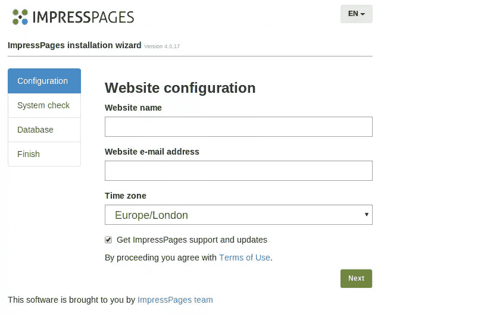
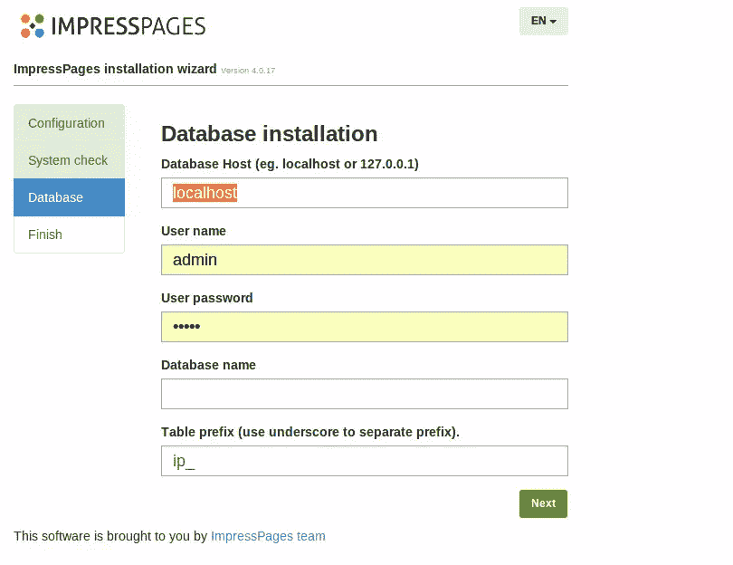
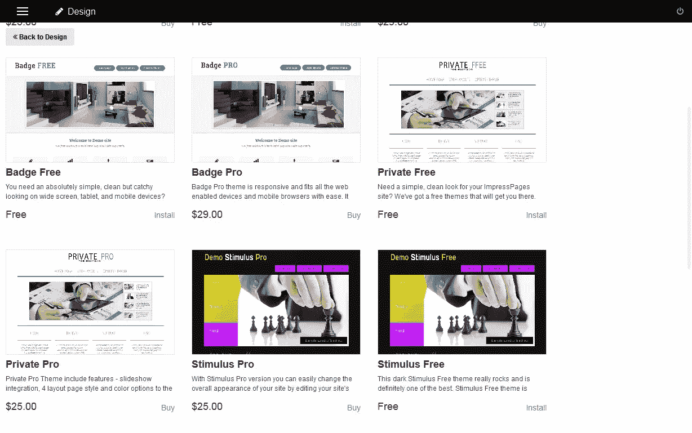
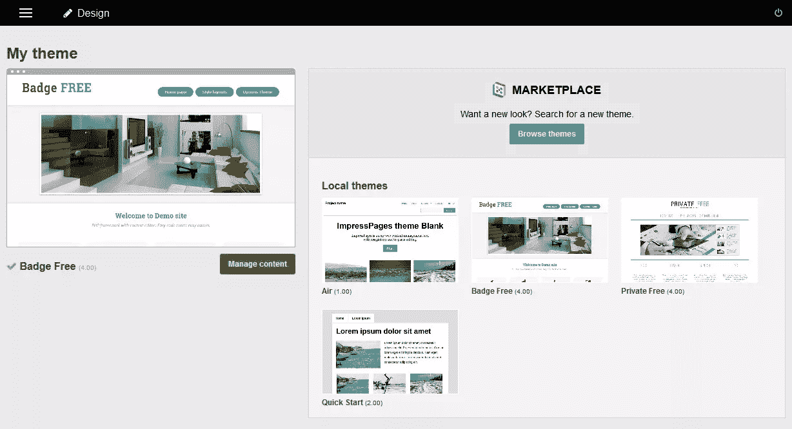
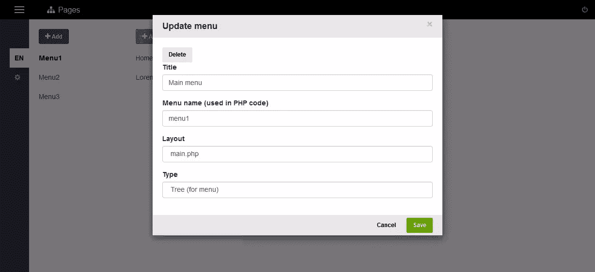
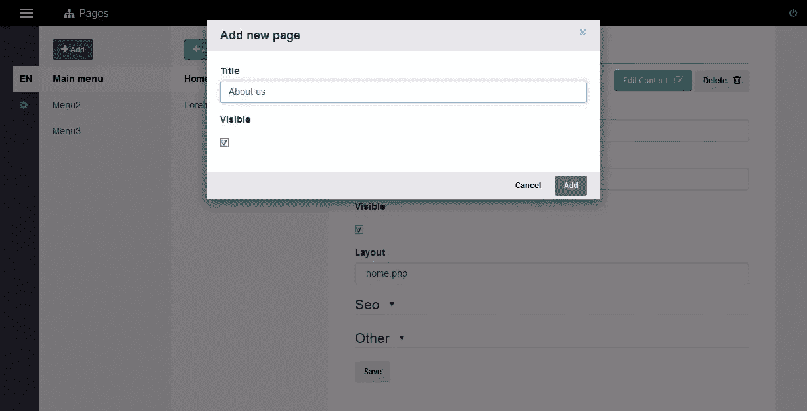
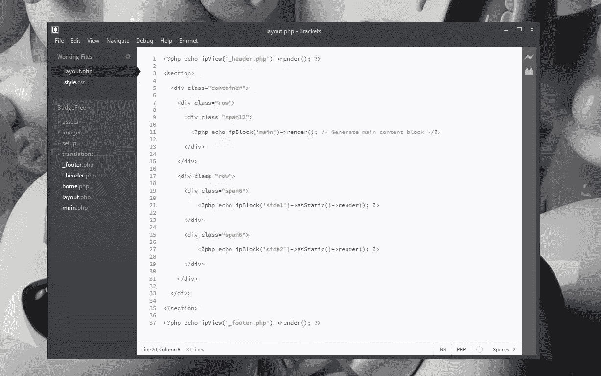
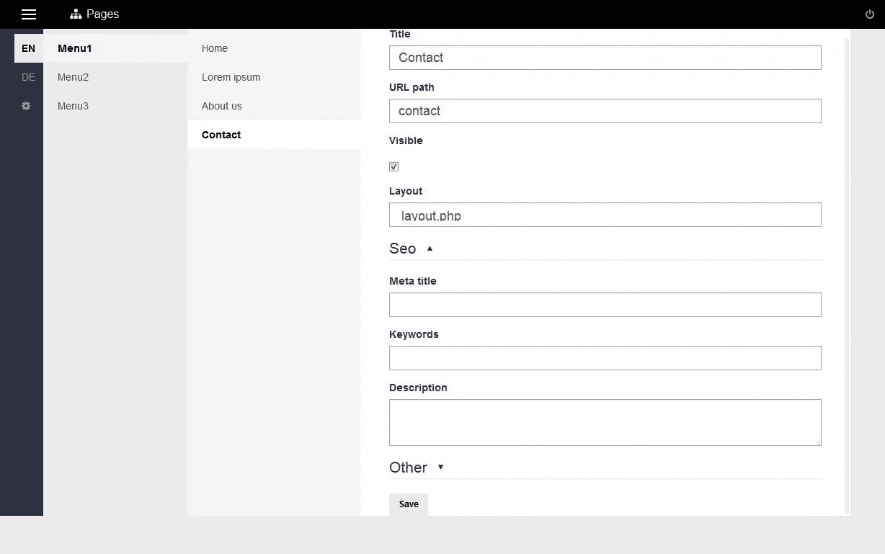
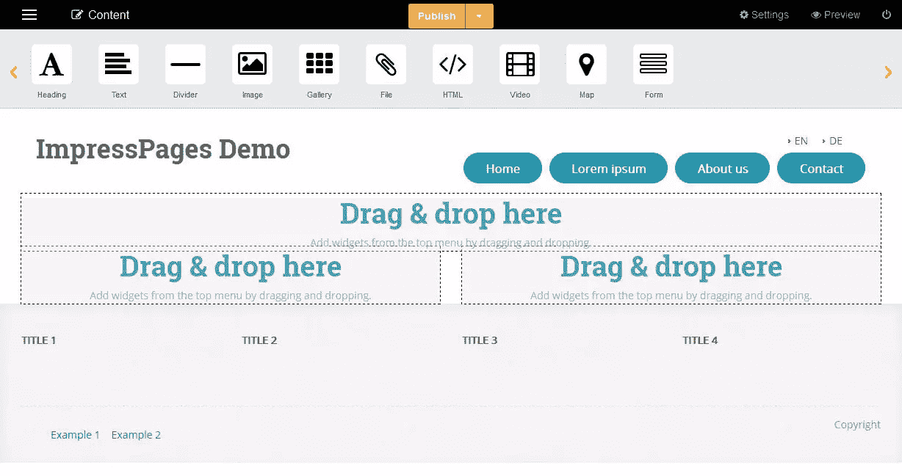
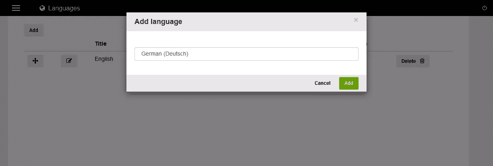

# ImpressPages 入门

> 原文：<https://www.sitepoint.com/getting-started-impresspages/>

内容管理系统(CMSs)是当今最常用的网络工具之一。用户范围从设计师和开发人员，到博客和项目经理。然而，即使市场上有各种各样的产品，用户也经常忽视尝试新系统和体验新的可能性。

为了拓宽我的视野，我决定探索市场，看看其他合作医疗机构能提供什么。这次我将研究 ImpressPages，这是一个基于 PHP 的 CMS，构建在 MVC 引擎之上。

ImpressPages 与其他 CMS 的不同之处在于代码结构、可定制性、基于 Bootstrap 构建的管理面板和内嵌拖放编辑器。在这个循序渐进的教程中，我将讲述在 ImpressPages 上创建网站的最初步骤。

## 下载和安装 ImpressPages

[先下载 impression pages](http://www.impresspages.org/download)。检查您的系统是否满足运行 CMS 的所有要求非常重要:

*   带有“mod_rewrite”的 Apache 服务器(根据需要适应 Nginx)
*   PHP 5.3.3 或更新版本；
*   PHP GD 库；
*   PHP mbstring 库；
*   PHP curl 库；
*   PHP PDO 库；
*   MySQL 5 及以上；
*   30+ MB 可用磁盘空间；
*   ini_set 功能使能。

在 MySQL 中创建 ImpressPages 将使用的数据库后，将其归档文件的内容解压缩到您的 web 服务器的根目录下，或者您想要提供服务的任何地方，并运行它(通过 localhost，或者通过您设置的虚拟主机，这取决于您的配置)。

**注意:**你也可以用[这个快速提示](https://www.sitepoint.com/quick-tip-impresspages4-homestead/)把它安装到一个流浪虚拟机里。

安装过程已经[最近更新了](http://www.impresspages.org/impresspages-4-0-17-released-with-simplified-install)，现在只需要两步而不是六步。

配置您的站点信息(网站名称、电子邮件和时区)后，您将被自动转移到数据库安装。如果您的系统不满足所有要求，将会显示一个错误，并提供需要修复的信息。

安装完成后，您将被直接转移到您的新网站。您可以在那里更改管理员的凭证。

## 简短的 UI 概述

登录后，您会立即看到内容页面。这是一种有点不寻常的体验，因为大多数其他系统会带您通过“后门”进行第一次配置等。ImpressPages 基于行内编辑，可以直接显示。这里的 UI 非常简洁明了，整个页面分为三个主要部分:preheader、widget 栏和内容区。

从左到右，在前置区域，您会看到标有汉堡图标的主导航。旁边有一个导航指示器。前置区域的中央有一个状态指示器，右侧有“设置”、“预览”和“注销”按钮。preheader 下面的部分是小部件栏，其中包含所有用于页面编辑的拖放工具。最后也是最大的是显示内容的页面内容区域。

## 安装主题

先从网站设计开始吧。将鼠标悬停在汉堡图标上，主导航将会出现。如果您选择 Design，您将看到当前选择的主题(默认情况下是“Air”主题)。您可以前往[impression pages 主题市场选择您喜欢的主题。](http://market.impresspages.org/)

我选择了“徽章免费”的主题后，预览它的行动。当你点击“安装”将它添加到你的本地主题时，你将再次被转到设计页面。要激活所选的主题，请单击“安装”按钮，当您将鼠标悬停在页面右侧的主题图像上时，该按钮就会出现。

就是这样，页面左侧会显示已安装并激活的主题。用 ImpressPages 安装主题非常简单。主题预览类似于 WordPress，所以任何使用过 WP 的人都会找到自己的路。

## 使用菜单

安装好主题后，就该开始编辑了。我开始在我的新网站上添加一些页面。在页面部分，您可以看到哪些页面和菜单已经存在。要编辑第一个菜单，将鼠标悬停在它上面并单击齿轮图标。您可以设置标题、编辑菜单名称、布局类型和菜单类型。

点击右侧的“菜单 1”，您将看到与之相关的菜单项。点击“主页”，页面属性将出现(标题，网址路径，可见性控制等)。另外，搜索引擎优化相关的选项在这里很方便。如果您想添加新页面，只需选择“添加”按钮。我是用下面两页关于我们和联系的内容做的。

## 在布局中进行更改

让我们看看如何创建自定义页面模板。主题文件存储在 ImpressPages 安装的主题文件夹中。在我的例子中有三个文件夹:默认的“Air”主题，我选择安装的主题(BadgeFree)和允许我们从头开始创建主题的 QuickStart。

我打开了“BadgeFree”主题文件夹。有四个文件夹和相同数量的。php 文件。assets 目录存储图像、css、less css 文件和 javascript 文件，images 目录存储这个主题使用的滑块和一些图标的图像。

安装目录包含用于在管理界面的“设计”选项卡中设置和预览主题选项的安装文件；翻译包含主题界面字符串的多语言翻译。至于。php 文件中，有以下划线为前缀的页眉和页脚文件，因为它们不是完整的布局，只是页面的一部分。另外，这里有两个布局文件——“home . PHP”和“main.php”。

为了开始创建自定义布局，我打开了我的文本编辑器，创建了一个。php 文件，并将其命名为“布局”。我插入了你可以在下图中看到的代码。

使用这段代码，我在第 1 行和第 37 行插入了 header 和 footer，在第 11 行插入了主内容块，在第 21 行和第 27 行又创建了两个块(侧栏),我可以使用拖放编辑器在其中添加内容。

要开始使用这个模板，你需要到管理面板，页面部分，从菜单 1 选择联系页面，并在布局组合框中选择 layout.php。单击“保存”并选择“编辑内容”按钮，查看模板的外观。

## 添加多语言选项

当您还在页面部分时，您可以为您的网站添加多语言选项。

这在 ImpressPages 中是默认支持的，这非常方便——这意味着在你的网站上添加更多的语言不需要安装插件和/或 PHP 扩展，这是你处理其他 CMS 时的情况。

添加另一种语言可以通过两种方式:点击屏幕左侧语言指示器下方的齿轮图标；或者从屏幕左上角的主菜单中选择语言。

点击屏幕左上角的“添加”按钮，当“添加语言”对话框打开时，选择您选择的语言(目前，ImpressPages 有 17 种语言，并支持在 [Transifex](https://www.transifex.com/projects/p/impresspages/) 上提供的翻译)。

语言菜单将自动添加到网站。在我的例子中，安装了这个模板，它显示在我的网站的右上角。要更改语言顺序，只需使用十字箭头图标上下拖动即可。你也可以编辑语言记录:标题，缩写，可见性，网址等。

## 结论

总而言之，使用 ImpressPages 是天衣无缝的，而且相当有趣。即使对于新用户来说，整个系统也非常容易理解。我在不到一小时的时间里创建了这个临时网站。在此期间，我甚至编写了一个微小的布局模板。

拖放界面非常适合处理内容和小部件。使用在线内容编辑，每个人都可以在一分钟内添加和编辑内容。本地化和简单的 SEO 配置也是一大优势，让用户可以更好地控制他们的网站。

你试过 ImpressPages 吗？你喜欢/不喜欢它的什么？让我们知道！

## 分享这篇文章