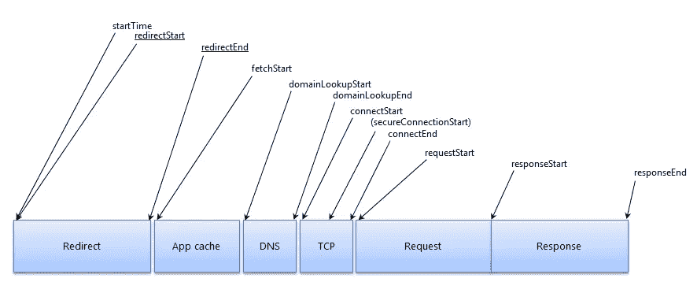

# 资源计时 API 简介

> 原文：<https://www.sitepoint.com/introduction-resource-timing-api/>

SitePoint 最近发表了一些关于性能的好文章。特别是，Craig Buckler 写了一篇题为[2013 年平均页面权重增加 32%](https://www.sitepoint.com/average-page-weights-increase-32-2013/)的文章，以及另一篇讨论[降低网站权重的一些简单方法](https://www.sitepoint.com/complete-guide-reducing-page-weight/)。

但是提高我们网站和应用程序的速度不仅仅是缩小 JavaScript 文件和使用图像压缩器的问题。在许多情况下，我们必须处理外部资源(来自 CDN 的库、来自 YouTube 的视频、来自 Flickr 的图像等等)或内部资源，这些资源需要被精确地测量，以确定是什么减缓了我们页面的加载速度。

我以前介绍过一些可以帮助测试网站性能的 API。比如[高分辨率时间 API](https://www.sitepoint.com/discovering-the-high-resolution-time-api/) 和[用户计时 API](https://www.sitepoint.com/discovering-user-timing-api/) 。在本文中，我将向您介绍这一类别中的另一个 API:**资源定时 API** 。

## 什么是资源计时 API？

[资源计时 API](https://www.w3.org/TR/resource-timing/) 允许您收集与文档中的资源相关的完整计时信息。它使您能够测量用户延迟，这对于测试网页是至关重要的。这个 API 是 W3C 的候选推荐标准，所以我们可以确定重要的特性大部分都被锁定了，但是将来可能会有一些小的变化。

使用资源计时 API，我们可以检索和分析页面上每个资源的所有网络计时数据的详细配置文件。我们将在下一节讨论这些数据是什么。目前，重要的是您要理解这个 API 如何帮助我们跟踪页面资源的性能，并确定我们需要优化多少和哪些资源。

现在我们知道了这个 API 是什么，让我们深入研究它的特性。

## 方法、属性和事件

资源计时 API 通过`window`对象的`performance`属性公开。我们可以使用`getEntriesByType()`方法检索为每个资源收集的信息。如果这听起来很熟悉，这是因为这是用户计时 API 使用的相同方法。不同之处在于，要检索关于这些资源的信息，我们必须将字符串`resource`传递给`getEntriesByType()`。

`getEntriesByType()`方法返回一列`PerformanceResourceTiming`对象，它们扩展了`PerformanceEntry`接口。因此，这些对象中的每一个都公开下列继承的属性:

*   `name`–所请求资源的解析 URL
*   `entryType`–该值始终等于`resource`
*   `startTime`–用户代理开始将资源排队以获取之前的时间
*   `duration`—`responseEnd`和`startTime`的区别

除了这些属性，资源计时 API 还公开了另一个名为`initiatorType`的属性。如果请求已经被页面上的一个元素初始化，它的值等于标签的名称(例如，`img`代表``，`script`代表`<script>`，等等)。其他可能的值有`css`(对于使用`url()`语法下载的 CSS 资源—例如`background: url(...)`)和`xmlhttprequest`(对于`XMLHttpRequest`对象)。

每个`PerformanceResourceTiming`对象提供以下特定的只读属性:

*   `initiatorType`
*   `redirectStart`
*   `redirectEnd`
*   `fetchStart`
*   `domainLookupStart`
*   `domainLookupEnd`
*   `connectStart`
*   `connectEnd`
*   `secureConnectionStart`
*   `requestStart`
*   `responseStart`
*   `responseEnd`

下图提供了这些属性的图形表示。从不同来源获取资源时，带下划线的可能不可用:



从第三方获取的资源必须提供额外的 HTTP 头(`Timing-Allow-Origin: *`)，以允许站点收集详细的网络计时数据。如果没有标头，唯一可用的数据是请求的总持续时间。这似乎是对该 API 使用的一个重要限制。然而，正如伊利亚·格里戈利克在他的文章[用资源计时 API](http://googledevelopers.blogspot.co.uk/2013/12/measuring-network-performance-with.html) 测量网络性能中所写的，像谷歌、脸书和 Disqus 这样的几个网站已经实现了头部来提供这些信息。

正如我们已经看到的，资源计时 API 提供了许多属性，我们可以阅读这些属性来了解每个资源的时间花费在哪里。但是，它也提供了两种方法:`clearResourceTimings()`和`setResourceTimingBufferSize()`。前者清空用于存储当前`PerformanceResourceTiming`资源列表的缓冲区。

后者设置存储在缓冲区中的对象的最大数量。它接受一个整数来指定限制。如果该方法没有被显式调用，规范规定用户代理应该存储至少 150 个`PerformanceResourceTiming`资源。当达到存储资源的限制时，API 触发一个名为`onresourcetimingbufferfull`的事件。

既然我们已经学习了属性、方法和公开的事件，让我们看看有多少浏览器支持这个 API。

## 浏览器兼容性

浏览器对这个 API 的支持在桌面上相当不错，因为它已经在 Chrome 25+、Internet Explorer 10+和 Opera 15+中实现。在手机上，随着最新版本的 Android 浏览器的加入，情况非常相似。

测试一个浏览器是否支持这个 API 有点棘手，因为我们必须测试几个条件。首先，我们必须测试`window`对象的`performance`属性是否存在。然后，我们必须测试`getEntriesByType()`方法是否存在，以及它是否能够收集资源。最后一个条件可以通过检查对`getEntriesByType('resource')`的调用是否返回一个数组来验证。

将此描述转换成代码会产生以下代码片段:

```
if ( !('performance' in window) ||
    !('getEntriesByType' in window.performance) ||
    !(window.performance.getEntriesByType('resource') instanceof Array)
  ) {
  // API not supported
} else {
   // API supported. Hurray!
}
```

## 构建演示

在这一节中，我们将构建一个简单的演示，让我们可以看到这个 API 的运行情况以及它所提供的信息。这个演示程序加载了两个资源:一个来自 SitePoint.com 的图片，通过一个``标签；另一个来自 Google CDN 的 jQuery 库，通过一个`<script>`标签。

虽然两者都是外部资源，但后者允许我们通过`Timing-Allow-Origin: *`头收集定时信息。这意味着即使它是一个外部资源，我们也将获得 API 公开的所有信息。

标记就绪后，我们要做的第一件事是测试浏览器是否支持资源计时 API。如果 API 不受支持，我们会显示消息“API 不受支持”。在浏览器实现 API 的情况下，我们将一个监听器附加到`window`对象的`load`事件。通过这种方式，我们可以确定在所有的资源都被加载后*执行任何动作。在处理程序内部，我们动态创建一个列表来显示通过 API 获得的度量。*

我们的演示页面将使用以下 HTML:

```
<span id="rt-unsupported" class="hidden">API not supported</span>

  <div>
     <h2>Test 1 - jQuery</h2>

     <ul id="script-list">
     </ul>
  </div>
  <div>
     <h2>Test 2 - Image</h2>

     
     <ul id="img-list">
     </ul>
  </div>

  <script src="//ajax.googleapis.com/ajax/libs/jquery/1.11.1/jquery.min.js"></script>
```

这里的 JavaScript 将显示一些我们可以检查的数据，这将向我们展示 API 可以做什么:

```
if ( !('performance' in window) ||
       !('getEntriesByType' in window.performance) ||
       !(window.performance.getEntriesByType('resource') instanceof Array)
     ) {
     document.getElementById('rt-unsupported').classList.remove('hidden');
  } else {
     window.addEventListener('load', function() {
        var resources = window.performance.getEntriesByType('resource');
        for(var obj in resources) {
           var list = '';
           for(var properties in resources[obj]) {
              list += '<li>' + properties + ': <span class="value">' + resources[obj][properties] + '</span></li>';
           }
           document.getElementById(resources[obj].initiatorType + '-list').innerHTML = list;
        }
     });
  }
```

你可以[在这里](http://aurelio.audero.it/demo/resource-timing-api-demo.html)查看代码直播。

## 结论

正如我们所看到的，在未来的项目中使用这个 API 应该不会太难。不幸的是，浏览器之间的支持并不理想，但三个主要浏览器(Chrome、Opera 和 Internet Explorer)支持它仍然是一个好消息。

没有更多的借口来改善你的网站的性能，这个新的 API 将使它变得更加容易。

## 分享这篇文章