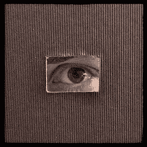
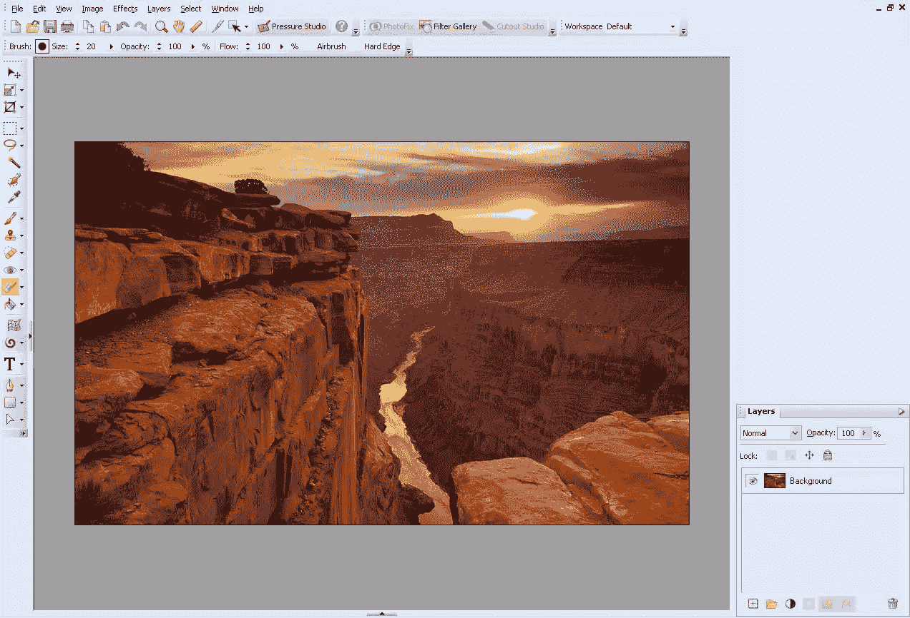
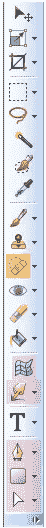
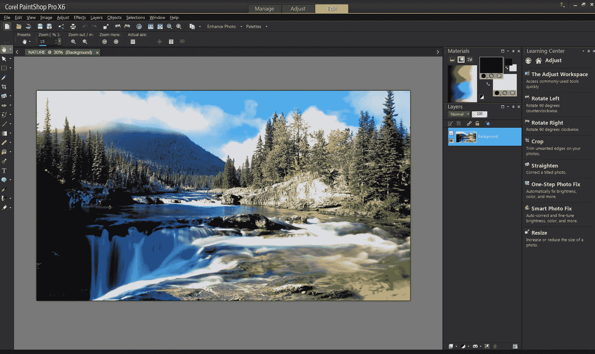
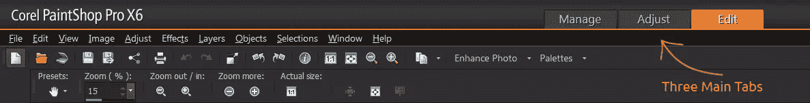
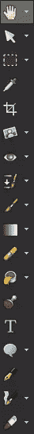
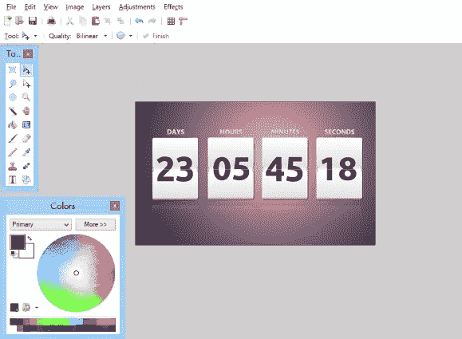
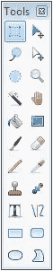

# Windows 的最佳免费(或廉价)图形编辑器

> 原文：<https://www.sitepoint.com/best-free-graphics-editor-for-windows/>

照片:moudezor part

毫无疑问，Adobe Photoshop 仍然不是 windows 的行业标准图形编辑器，无论是从头创建新图像还是编辑现有照片。

但是，Photoshop 肯定不是你唯一的选择。许多出于简单目的使用该软件的人并不真的需要该软件提供的所有功能。此外，对于我们大多数人来说，Photoshop 是一笔很大的支出:如果你刚刚接触设计世界，在一个应用程序上投入这么多预算可能是不明智的。

令人高兴的是，除了 Photoshop 之外，还有一些有效且便宜(如果不是免费的话)的 Windows 替代品可以很好地满足你的需求。

那么，让我们来看看三个最好的候选人。

## PhotoPlus 入门版

[Photo Plus 入门版](http://www.serif.com/free-photo-editing-software/)是 Serif 打造的免费设计工具。它的特点是非常直观，使得程序非常容易使用。此外，它有一个用户界面，可以让你想起 Photoshop，这样，如果你需要从一个编辑器切换到另一个编辑器，你就不会有任何适应的问题。

*PhotoPlus SE* 支持不同的图像格式，因此您可以导入和处理各种图像。多亏了一些特殊的工具，你可以解决常见的问题，如讨厌的红眼，或者你可以添加效果到你的图片转换成艺术品。

由于这是一个免费版本的程序，一些功能被禁用。例如，您不能使用减淡和加深工具，这些工具在照片编辑中非常重要。

如果你对网页设计而不是照片处理更感兴趣，你应该知道一些设计师选择 PhotoPlus SE 来创建图形元素。

事实上，徽标、横幅或用户界面都可以用这个程序实现，即使你不会得到与 Photoshop 相当的结果。

重点是，PhotoPlus SE 是摄影编辑的主要思想，所以你没有可能对几个重要的图形参数采取行动，如文本行距或文字格式。

尽管 PhotoPlus SE 没有 Photoshop 的所有功能，但考虑到这个软件可以免费下载，我认为它是 Photoshop 的一个很好的替代品。

## 为 X6 键跳

Photoshop 的另一个流行替代品是 Corel 的 PaintShop Pro X6。这是一个程序，它可以帮助你编辑你的照片，而不是创建新的图形项目。

PaintShop Pro X6 有一些有用的功能，可以让你在短时间内提高照片的质量:实际上，只需点击几下，你就可以裁剪图片，处理阴影，平衡颜色或光线。该软件还提供一些“即时效果”，即现成的艺术滤镜，以及更复杂的功能来创建高质量的照片。

PaintShop Pro X6 的用户界面经过了全新的设计，所以你不会面临之前版本的杂乱无章。现在，该计划传达了更清晰的外观和更现代的感觉。与杂乱的菜单和按钮不同，你会发现只有三个主要的选项卡，通过它们你可以访问所有的工具。

这个项目的一个不利方面是速度慢。Corel 建立了一个 64 位架构的软件，使 X6 版本比以前的版本更快，但打开大量图像仍然需要太多时间。

综合考虑，PaintShop Pro X6 不如 Photoshop 有成就。然而，如果你正在寻找一个更便宜的选择，或者如果你是照片处理世界的新手，这个软件可能正是你要找的。

PaintShop Pro X6 可以从 Corel 官方网站下载，价格为 69.99 欧元或 99.95 美元。

## Paint.NET

Paint.net 是微软开发的一款编辑软件。该程序是免费的，它具有高度的通用性，因为它可以用来编辑照片以及设计图形。

从一开始你就会注意到，Paint.net 并没有用太多的编辑工具来压倒你，这些工具甚至可能对一些偶尔出现的设计师毫无用处。事实上，微软开发人员注意创造一个友好的工作环境，既适合高级用户，也适合不太熟练的用户。

打开 Paint.net 后，您可以使用最标准的工具，如画笔、形状和曲线、文本工具或克隆图章。

正如你所期望的，这个程序也有一些很棒的特效，你可以把它们应用到你的图片上，给它们一点魔力。不同于一些免费的 Photoshop 替代品，图层出现在 Paint.net，因此你可以保持你的项目有序

Paint.net 最积极的一面是，它有自己的社区，你可以从那里下载许多插件或额外的画笔。通过这种方式，你提高了软件的功能，并使它适应你的需要。

## 你应该选择哪个？

当然，PhotoPlus SE、Paint-Shop Pro X6 或 Paint.net 都不完全与 Adobe Photoshop 处于同一水平，但对于要求不太高的作品，它们肯定可以取代 Adobe Photoshop。对于那些没有先进电脑的人来说，它们也很有用，这些电脑可以运行像 Adobe one 这样的繁重程序。事实上，所有这些替代品都有点轻。

我个人建议你使用 PhotoPlus SE 进行照片处理，因为它快速、直观，甚至可以用于专业的照片编辑。

另一方面，如果你对平面设计更感兴趣，最好的选择是[Paint.net](http://www.getpaint.net/)。它为您提供了将您的想法转化为具体项目的方法，并且它由一个活跃的社区提供支持，在那里您可以找到教程和有用的提示。

## 分享这篇文章