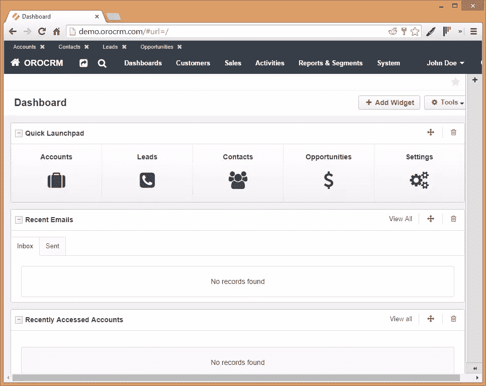
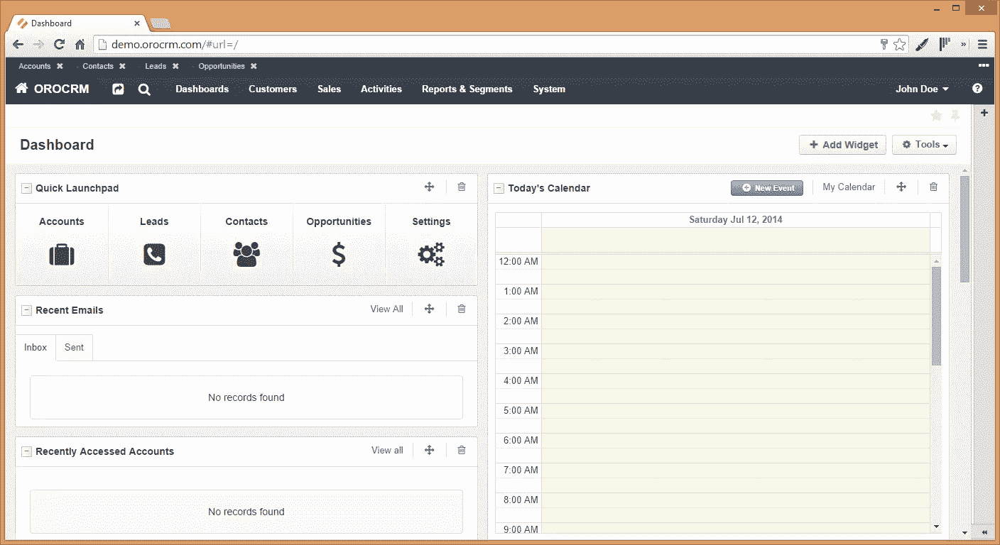
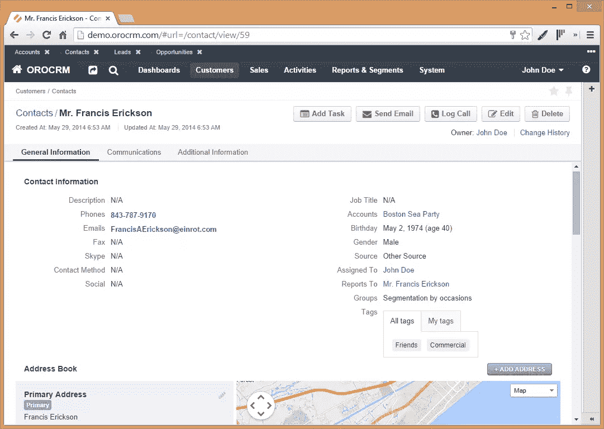
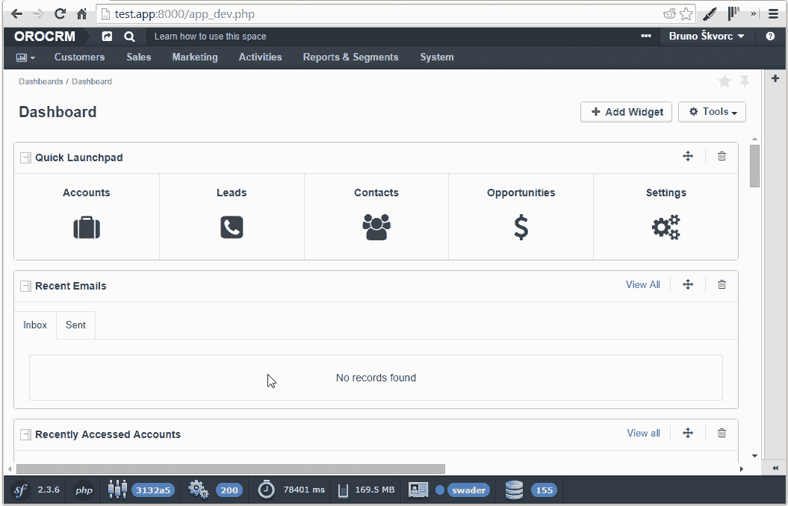
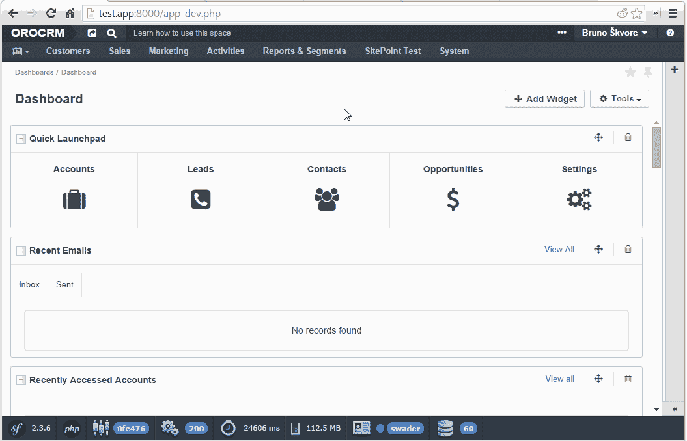

# OroCRM 和捆绑包扩展初探

> 原文：<https://www.sitepoint.com/first-look-orocrm-extending-bundles/>

客户关系管理是一件棘手的事情。一些开发人员认为“只记录用户的一切”的应用程序，其他人认为是非常先进和复杂的商业应用程序，不仅可以监控你与用户的互动，还可以改善你与他们的沟通*和*他们与你的体验——而你们都不知道。

## 什么是客户关系管理？

客户关系管理应用程序经常被低估和使用不足，而且过于频繁地被“包含”在公司应用程序的基础中。如果你曾经在一家大公司的办公室隔间里日复一日地做着琐碎的工作，你很可能已经在 Windows XP 上运行了该公司的(古老的 Java)应用程序，如果你刚刚与之交谈的客户出现了重要的事情，它会被标记在屏幕上一个不起眼的角落里他们名字旁边的一个愚蠢的评论框中。

CRM 不仅仅是你通常被引导去相信的东西——它不仅仅是关于你曾经与之做生意的人的半相关和主观的信息——它是关于你的互动的所有知识的收集和整理，以及统计上帮助你获得你的通信者的好感的所有参数的呈现。

## OroCRM

虽然 PHP 世界的 CRM 领域还不太成熟，但 Oro 最近的发展引起了我足够的兴趣，让我看一看。OroCRM 是一个基于 PHP 5.4+和 Symfony 框架的多语言 CRM。它本身就是一个庞然大物，并且很好地调整了与 Oro 平台的合作，Oro 平台是一个业务应用程序框架，您可以使用它来构建自己的 custuom 业务应用程序，利用 OroCRM 提供的数据。不过，对于这篇文章来说，这有点过了，所以这次我们只看一下 OroCRM。但是，请注意，OroCRM 安装自带 Oro 平台的底层实例，Oro 平台是基于 Oro 平台的。

OroCRM 也在 Symfony2 的博客上发布了，所以如果你对它的年轻感兴趣的话，可以读一读它——它才发布了四个月。

在其他功能中，OroCRM 以其第三方插件和扩展市场、客户细分以及从 Magento 等各种成熟工具导入数据而自豪。让我们看看它在本地部署的演示应用程序中的表现。

### 安装

安装 OroCRM 相对简单。这些步骤在他们的 [Github 自述文件](https://github.com/orocrm/crm-application)中有很好的介绍，或者你可以遵循我们详细的[指南来安装并运行流浪者](https://www.sitepoint.com/guide-install-orocrm-vagrant-box/)，所以如果你想跟随你自己的安装，跳过这些步骤。

### 演示

一旦我们安装了应用程序(演示应用程序也可以在[demo.orocrm.com](http://demo.orocrm.com/)试用)，迎接我们的是一个现代外观的仪表盘，上面随机显示着销售信息。



作为一个构建了内部 CRM 的人，在查看这个应用程序时，我将更多地关注技术方面，而不是实际的业务方面，但是全面的业务审查以及与我们其他渠道上的竞争对手进行比较也不是不可能的。关于实际的用户指南，[请参见此处的](http://www.orocrm.com/documentation/index/current/user-guide)。

我注意到的第一件事是主题的响应是多么流畅。即使在这个图表丰富的屏幕上，调整浏览器窗口的大小也不会导致水平滚动条，并立即将破折号元素一个接一个地放置，而不是像全屏模式下的默认设置那样将它们分成两列(上图是单列，下图是双列)。



如果你试着点击“最近的邮件”框中的“已发送”，你可以在那里看到一封邮件。可以预览电子邮件，单击收件人的姓名会将您带到他们详尽的用户屏幕:



作为一个不得不将内部 CRM 与每月 1000 万封电子邮件的定制标题支持的常规 IMAP 收件箱相结合的人，我可以欣赏这个功能——我充分意识到在不混淆用户(主要是贵公司的员工)的情况下很好地构建它是多么困难。

还要注意，它都是用 ajax 构建的——这里没有页面重载，这使得整个体验更加流畅。

您可以轻松创建仪表板、用户组和角色等，只需探索上面的选项。但是如果我们想扩展这个应用程序呢？如果我们需要稍微调整一下呢？

### 延伸

OroCRM 是 Symfony 的一款应用，也通过捆绑包进行了扩展——调整现有的或构建新的，一切都在进行。

值得注意的是，由于与 Symfony 的紧密联系，人们应该对 Symfony 及其工作方式非常熟悉。这可能会让一些新来者感到沮丧，因为 Symfony 是一个非常复杂的框架。

#### 创建新的包

捆绑包的创建就像普通的 Symfony 应用程序一样。如果你想跟着做，你可以用 Symfony 控制台:

```
php app/console generate:bundle
```

控制台将要求输入各种信息。我给了它名称空间`SitePoint/Bundle/TestBundle`。我对所有其他输入使用了默认建议，只对最后两项说不:自动更新内核和自动更新路由。Oro 有一种特殊的方式来启用捆绑包，对这些问题回答“不”是很重要的。

为了启用它，我们创建了包含以下内容的文件`src/SitePoint/Bundle/TestBundle/Resources/config/oro/bundles.yml`:

```
bundles:                                               
    - SitePoint\Bundle\TestBundle\SitePointTestBundle
```

要在开发模式下查看 Oro 安装，请通过`app_dev.php` url 访问它，如下所示:

```
http://test.app:8000/app_dev.php
```

要做到这一点，您需要从`app_dev.php`中移除阻塞检查，移除整个阻塞，或者调整它，使其更加宽松:

```
// This check prevents access to debug front controllers that are deployed by accident to production servers.
// Feel free to remove this, extend it, or make something more sophisticated.
if (isset($_SERVER['HTTP_CLIENT_IP'])
    || isset($_SERVER['HTTP_X_FORWARDED_FOR'])
    || !in_array(@$_SERVER['REMOTE_ADDR'], array('127.0.0.1', 'fe80::1', '::1'))
) {
    header('HTTP/1.0 403 Forbidden');
    exit('You are not allowed to access this file. Check '.basename(__FILE__).' for more information.');
}
```

之后，我们清空缓存(`php app/console cache:clear`)。这需要一段时间，但完成后，您的包将被“安装”。您可以通过开发控制台看到它，尽管它不会在任何地方实际使用。



#### 添加新的屏幕和菜单选项

基于我们新创建的包，让我们给 Oro 一个新的菜单选项和该选项的默认视图。

通过上面指定的方法创建的包将添加一些默认文件——包括一个默认视图和一个默认控制器。我们将稍微改变一下，并解释一下我们为什么要这样做。

##### 第一步

更改默认控制器。给文件`src\SitePoint\Bundle\TestBundle\Controller\DefaultController.php`以下内容，而不是它当前包含的内容:

```
<?php

namespace SitePoint\Bundle\TestBundle\Controller;

use Symfony\Bundle\FrameworkBundle\Controller\Controller;
use Sensio\Bundle\FrameworkExtraBundle\Configuration\Route;
use Sensio\Bundle\FrameworkExtraBundle\Configuration\Template;

class DefaultController extends Controller
{
    /**
     * @Route("/hello", name="sitepoint_link")
     * @Template()
     */
    public function indexAction()
    {
        return array('name' => "hello link");
    }
}
```

我们需要添加“Route”和“Template”use 语句，因为 Symfony 非常依赖于读取注释文本来解决依赖性。注意我是如何在注释中告诉它一个新的@Route 的？这就是我在上面“使用”的“路线”。模板也一样。如果您正在使用像 PhpStorm 这样的 IDE，不要让“alias never used”的警告把您弄糊涂了——PhpStorm 不知道注释就是使用它们的那个。

在操作中，我们只是给一个变量一个随机值，并将其传递给模板。这样，我们就完成了一个基本的控制器。

##### 第二步

创建文件`src\SitePoint\Bundle\TestBundle\Resources\config\navigation.yml`并赋予其以下内容:

```
oro_menu_config:
    items:
        sitepoint_tab:
            label: SitePoint Test
            uri:   '#'
            extras:
                position: 300
        sitepoint_tab_link:
            label: SitePoint Link 1
            route: sitepoint_link
            extras:
                routes: ['/^sitepoint_link/']
                description: This is a SitePoint link
    tree:
        application_menu:
            children:
                sitepoint_tab:
                    children:
                        sitepoint_tab_link: ~

oro_titles:
    sitepoint_link: My link page title
```

这将构建一个新的菜单项。首先，它定义了一个名为“SitePoint Test”的新选项卡——这将是已经存在的可能菜单选项中的主菜单项。然后，它给它一个子链接，就像在底部的“树”部分中定义的那样。链接(如上定义)的名称为“SitePoint Link 1”，使用路由“sitepoint_link”(尚未定义，但也在控制器的@Route 声明中使用)。

##### 第三步

删除默认的 routing.yml 文件(`src\SitePoint\Bundle\TestBundle\Resources\config\routing.yml`)并在`src\SitePoint\Bundle\TestBundle\Resources\config\oro\routing.yml`创建一个新文件，内容如下:

```
sitepoint_link:
    resource:     "@SitePointTestBundle/Controller"
    type:         annotation
    prefix:       /user
```

这确保了 Oro 加载新的路由配置，从默认控制器的注释中读取其功能，并在其前面添加一个“user”前缀。

##### 第四步

将默认模板`src\SitePoint\Bundle\TestBundle\Resources\views\Default\index.html.twig`更改如下:

```


    {{ name }}!

```

由于 Oro 的 ajax 特性，这一点很重要。应用程序希望返回特定的格式，除非它返回特定的类型(从默认的 OroUI 模板扩展而来),否则它会变得混乱和混乱。

##### 第五步

重新加载导航生成，并清除缓存:

```
php app/console oro:navigation:init
php app/console cache:clear
```

现在，您应该能够访问浏览器中的新菜单选项，并看到“Hello link”:



其他的[定制](http://www.orocrm.com/documentation/index/current/book/customization)也是可能的，但是超出了这篇文章的范围，如果有足够的兴趣，可能会在后续文章中涉及。

## 结论

如您所见，OroCRM 是一个功能全面、高度健壮、可扩展性极强的现代 CRM。它使用了强大的框架，并采用了现代设计。

然而，它也极度浮于水面。它把 Zend 和 Symfony 都拉了进来？为什么？仅这些框架就有超过 100 兆的重量，每个都有依赖关系。我觉得他们太拼命地试图涵盖他们能想到的所有选项*和*而不是重新发明轮子，以我的经验来看，这不是一个健康的组合。

你会尝试一下吗？你在生产中使用它吗？让我们知道——如果你已经建立了一些复杂的开源 Oro 扩展，我们很乐意发布你的工作流程！[取得联系](mailto:bruno.skvorc@sitepoint.com)！

## 分享这篇文章