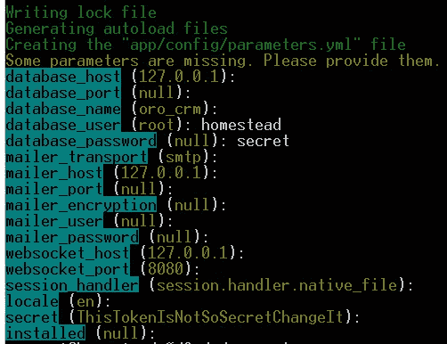
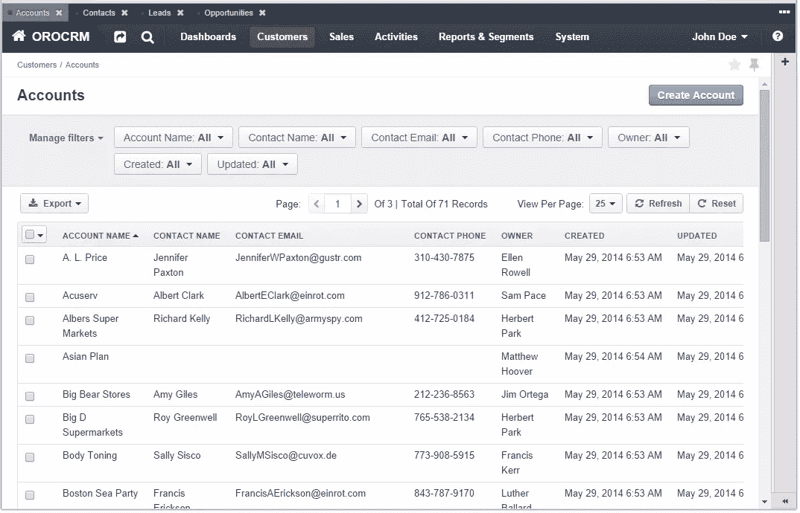

# 指南:如何在流浪盒上安装 OroCRM

> 原文：<https://www.sitepoint.com/guide-install-orocrm-vagrant-box/>

OroCRM 是一个 CRM 应用程序，我们将在明天的帖子中专门介绍它。本指南仅仅介绍了它的安装和在一个流浪板上的首次运行——特别是，我们古老的家园得到了改善。如果您需要使用 Homestead，请参见[原始快速提示](https://www.sitepoint.com/quick-tip-get-homestead-vagrant-vm-running/)。如果你想继续关注 OroCRM 的明天的帖子，先按照下面的步骤安装它吧！

## 装置

在我们开始之前，确保你原来的家园改进实例工作正常，然后摧毁它。如果您需要符号链接支持并且在 Windows 上，请重新运行命令提示符和/或 Git Bash 窗口，通过该窗口，您将使用具有管理员权限的漫游命令:


这是可选的–Oro 工作不需要符号链接。

### 步骤 1:添加站点

在`Homestead.yaml`中，添加站点:

```
- map: test.app
      to: /home/vagrant/Code/orocrm/web
```

由于 Symfony 是 Oro 的基础，所以需要有`web`子文件夹。

为了确保 Symfony 可以写入其父文件夹，我们需要改变共享文件夹的挂载模式。在 scripts/homestead.rb 中，更新以下代码行:

```
config.vm.synced_folder folder["map"], folder["to"], type: folder["type"] ||= nil
```

到

```
config.vm.synced_folder folder["map"], folder["to"], type: folder["type"] ||= nil, :mount_options => ["dmode=777,fmode=777"]
```

这是我们将在虚拟机外部执行的最后一项操作。运行`vagrant up`后，现在用`vagrant ssh`输入。

### 第二步:克隆

```
cd Code
git clone http://github.com/orocrm/crm-application.git orocrm
```

### 步骤 3:创建数据库

```
mysql -u homestead -psecret
CREATE SCHEMA `oro_crm` DEFAULT CHARACTER SET utf8 COLLATE utf8_general_ci;
```

### 步骤 4:配置 Nginx 和 PHP

在这种情况下，OroCRM 所需的配置如下(如有必要，用您自己的路径替换文件夹路径)。将此内容放入`/etc/nginx/sites-available/test.app`，替换原来的内容:

```
server {
        listen 80;
        server_name test.app;
        root /home/vagrant/Code/orocrm/web;

        index app.php;

        access_log /var/log/nginx/test.app.access_log;
        error_log /var/log/nginx/test.app.error_log info;

	    location = /favicon.ico { access_log off; log_not_found off; }
	    location = /robots.txt  { access_log off; log_not_found off; }

        try_files $uri $uri/ @rewrite;
	    sendfile off;

        location @rewrite { rewrite ^/(.*)$ /app.php/$1; }

        location ~ [^/]\.php(/|$) {
                fastcgi_split_path_info ^(.+?\.php)(/.*)$;
                if (!-f $document_root$fastcgi_script_name) {
                        return 404;
                }
                fastcgi_index app.php;
                fastcgi_read_timeout 10m;
                fastcgi_pass unix:/var/run/php5-fpm.sock;
                fastcgi_param SCRIPT_FILENAME $document_root$fastcgi_script_name;
				include fastcgi_params;
		}
}
```

别忘了用`sudo service nginx restart`重启 Nginx。

由于 Composer 中的一些错误，或者依赖项设置的方式，我们需要将 PHP 命令行实例的 RAM 使用限制提高到 1G。我们运行的虚拟机有一个保留的 2G，所以这没问题。

```
sudo vim /etc/php5/cli/php.ini
```

进入文件后，如果你使用 Vim 进入搜索模式，点击正斜杠按钮，输入“memory”并按回车键进入显示 512M 的行。用“I”进入插入模式，用“1G”替换“512M”。保存并退出。

接下来，我们需要在 php-fpm 中激活 pathinfo，按照[这个 StackOverflow 回答](http://stackoverflow.com/questions/23390531/access-denied-403-for-php-files-with-nginx-php-fpm)。

```
sudo vim /etc/php5/fpm/php.ini
```

搜索行`cgi.fix_pathinfo`并将值设置为 1。另外，将 PHP 脚本的最大执行时间从 30 秒增加到 300 秒(搜索`max_execution`)，因为 Symfony 应用程序难以置信地溢出，并且在第一次请求时需要很长时间来生成缓存，然后在后续运行中使用。

最后，我们还需要做一点调整。

```
sudo vim /etc/php5/mods-available/xdebug.ini
```

将行`xdebug.max_nesting_level = 1000`添加到该文件中。我们这样做是因为在处理 Symfony 的膨胀时，Xdebug 在默认的嵌套级别 100 上阻塞了。有了这个，我们让它“更深入”。保存并退出，重启 php5-fpm ( `sudo service php5-fpm restart`)。

和大多数 Symfony 项目一样，我们还需要安装 php-intl 扩展。

```
sudo apt-get update
sudo apt-get install php5-intl
```

### 第五步:作曲

首先，让我们加速 Symfony。进入`app/AppKernel.php`并将以下两个方法添加到该类中:

```
public function getCacheDir()
    {
        if (in_array($this->environment, array('dev', 'test', 'prod'))) {
            return '/dev/shm/appname/cache/' .  $this->environment;
        }

        return parent::getCacheDir();
    }

    public function getLogDir()
    {
        if (in_array($this->environment, array('dev', 'test', 'prod'))) {
            return '/dev/shm/appname/logs';
        }

        return parent::getLogDir();
    }
```

根据[这篇文章](http://www.whitewashing.de/2013/08/19/speedup_symfony2_on_vagrant_boxes.html)，这将日志和缓存文件夹移到共享的来宾/主机文件夹之外，并将 IO 操作保留在虚拟机内部。Symfony 因超高 IO 而臭名昭著，让这些文件夹留在默认位置对任何 Symfony 的流浪者项目来说都是死刑判决。

最后，让我们安装 CRM 的依赖项。

```
cd orocrm
export COMPOSER_PROCESS_TIMEOUT=3000; composer install --prefer-dist --no-dev
```

“安装”命令之前的“导出”命令是为了确保 Composer 即使遇到大得惊人的 repo 也能继续运行。prefer dist 选项意味着依赖项不是作为版本控制下的源代码下载的，而是仅仅作为源代码或 phar 包下载的。当使用`--prefer-sources`(默认)时，整个版本树也被下载，这减慢了下载速度并增加了所需的磁盘空间，如果你不想破坏实际的依赖关系，这是没有意义的。

在安装过程中(由于 Symfony 的依赖关系过于膨胀，这很容易需要 30 分钟以上)，由于 Github 的匿名下载速率限制政策，您将被要求输入 Github 的用户名和密码。这没什么好担心的。下载结束时，会要求您输入一些关于数据库、邮件程序等的配置参数。



然后，运行`php app/console oro:install --env dev`完全安装应用程序，或在您的主机浏览器中访问`http://test.app:8000`。这还需要 10 分钟左右，但这是最后一步。出于某种原因，将这里的`--env`标志设置为“prod”会失败，并出现一个类未找到错误，但对“dev”有效，所以我使用它。如果你试一试，解决了问题，请告诉我。

您可能还必须激活 WebSockets 服务器和 crontab，尽管它们是可选的:

```
php app/console clank:server --env prod
php app/console oro:cron --env prod
```

### 步骤 6:演示[可选]

OroCRM 附带了一组演示数据，您可以将它们导入到您的实例中，这样您就有东西可玩了。这与你可以在他们的演示页面上找到的内容相同，但更灵活，因为它允许你修改源代码，扩展应用程序，并在其中进行适当的调整。

要安装演示数据，只需在`orocrm`文件夹中运行以下命令:

```
php app/console oro:migration:data:load --fixtures-type=demo --env=prod
```



## 结论

太复杂了吗？也许吧。不过，目前还没有多少框架和应用程序开发人员针对虚拟机安装优化他们的应用程序，所以这并不奇怪。无论如何，Oro 团队能做的不多，因为他们依赖于一些最大的框架(Zend 和 Symfony 都是在 Composer 安装期间安装的，在`--prefer-sources`模式下，整个文件夹最终达到 420MB，这对任何口径的 web 应用程序来说都是荒谬的；`--prefer-dist`包起来 190MB 左右)。

我希望他们能找到让程序更简单的方法，或者他们至少会专注于让 2.0 版本从一开始就对流浪者更加友好，更加多平台——特别是因为现在众所周知 Symfony 应用程序经常在流浪者上出现问题。你试过这个安装程序了吗？如果你在某个地方遇到困难，请告诉我，我们会一起努力解决。

## 分享这篇文章