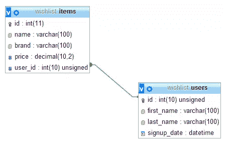

# FluentPDO 入门

> 原文：<https://www.sitepoint.com/getting-started-fluentpdo/>

你知道这个故事:写 SQL 查询是如此的无聊。尤其是你没时间做的时候。如果你和我感觉一样，今天我们将会看到一些非常酷的东西:[流畅的 PDO](http://fluentpdo.com/) 。如果“PDO”这个词对你来说很陌生，不要担心。这是一个非常简单的概念:在 PHP 世界中，PDO 代表持久数据对象，它帮助你抽象一些基本的数据库相关操作(如插入、更新、删除等)。).它是你和数据库之间的一层。

结果呢？不再有 SQL 查询。也许这不是你看到的第一个:有许多类似的项目，每一个都有其关键特征。Fluent 的主要特性是一个很棒的连接查询生成器。

## 我们的 FluentPDO 测试项目

首先，我们需要一个样本项目来工作。让我们想想……简单的多用户愿望清单怎么样？

会有很多用户，每个人都会有喜欢的产品。对于每个用户，我们将存储名字，姓氏和注册日期。对于每一个项目，我们将存储名称，品牌，价格和相关的用户 id。

我将使用一个简单的 MySQL 数据库。我们的数据结构如下:



…这是 SQL 转储(带有一些虚拟数据)。

```
CREATE TABLE IF NOT EXISTS items (   
        id int(11) NOT NULL AUTO_INCREMENT,   
        name varchar(100) NOT NULL,   
        brand varchar(100) NOT NULL,   
        price decimal(10,2) NOT NULL,   
        user_id int(10) unsigned NOT NULL,   
        PRIMARY KEY (id),   
        KEY user_id (user_id) ) ENGINE=InnoDB  
        DEFAULT CHARSET=utf8 AUTO_INCREMENT=5 ;

    INSERT INTO items (id, name, brand, price, user_id) 
    VALUES 
    (1, 'Last Awesome Phone', 'Awesome Brand', '550.00', 1), 
    (2, 'Last Awesome TV', 'Awesome Brand', '1200.00', 1), 
    (3, 'Fantastic E-Car', 'E-Cars Inc.', '80000.00', 2), 
    (4, 'Fantastic E-Bike', 'E-Bikes Co. Ltd.', '16000.00', 2);

    CREATE TABLE IF NOT EXISTS users (
        id int(10) unsigned NOT NULL AUTO_INCREMENT,   
        first_name varchar(100) NOT NULL,   
        last_name varchar(100) NOT NULL,   
        signup_date datetime NOT NULL,   
        PRIMARY KEY (id) ) ENGINE=InnoDB  
        DEFAULT CHARSET=utf8 AUTO_INCREMENT=3;

    INSERT INTO users (id, first_name, last_name, signup_date) 
    VALUES 
    (1, 'Francesco', 'Malatesta', '2014-06-29 13:00:00'), 
    (2, 'John', 'Foo Bar', '2014-06-20 11:16:39');

    ALTER TABLE items   ADD CONSTRAINT items_ibfk_1 FOREIGN KEY (user_id) REFERENCES users (id);
```

**注:**正如你很容易想象的，这不会是一个“完整”的项目。我们只是在尝试 FluentPDO，所以我们不会涉及登录、注册或应用程序结构等内容。

## 装置

您将 Fluent 与 Composer 一起安装，包括作为依赖项的库:

```
"require": {
        ...
        "lichtner/fluentpdo": "dev-master"  
    }
```

完成后，您需要像这样实例化:

```
$pdo = new PDO("mysql:dbname=wishlist", "root", "password");
    $fpdo = new FluentPDO($pdo);
```

您必须在 PDO 构造函数方法中指定您的连接细节。在第一个参数的`dbname=`后面输入您的数据库名称，然后将您的用户名和密码作为第二个和第三个参数。

然后，将 PDO 对象作为参数传递给 FluentPDO 对象构造函数。

仅此而已，FluentPDO 不需要任何其他东西来工作。没有额外的配置。

## 基本选择操作

我们已经有一些虚拟数据了。让我们从 SQL 查询的“Hello World”开始。一个简单的 select，使用 where 和用户主键`id`作为参数来检索基本信息。

```
$user_id = 1;

    $query = $fpdo->from('users')->where('id', $user_id);

    foreach($query as $row){
        echo 'Hello, ' . $row['first_name'] . ' ' . $row['last_name'] . '!';    
    }
```

这里没什么难理解的。FluentPDO 有一个很好的、可读性很强的语法，所以很容易理解我们在做什么。

`from()`方法用于设置右表。`where()`方法用于过滤具有相同名称子句的结果。默认情况下，在`where()`方法中，您只需指定字段名和值。“=”是隐含的。当然，也可以使用不同的比较运算符。在这种情况下，你必须把它们写在字段名的后面。

```
$fpdo->from('items')->where('price >', 1000);
```

获得结果非常容易:它们存储在我们刚刚使用的`$query`对象中。您可以用 foreach 循环迭代它，如示例所示。

在这种特定情况下(通过主 id 搜索一个项目)，我们也可以在`from()`方法中使用快捷方式:

```
$query = fpdo->from('users', $user_id);

    // will be the same thing as...

    $query = $fpdo->from('users')->where('id', $user_id);
```

让我们看看比这更复杂的东西。

### 选择特定字段

如果您愿意，您可以在`from()`之后使用`select()`方法选择特定的字段。你所要做的就是告诉 FluentPDO 你想用一个数组选择哪些字段。

这里有一个例子:

```
$query = $fpdo->from('users')->select(array('first_name', 'last_name'))->where('id', $user_id);
```

### 极限和偏移

很容易设置限制和偏移参数，以便只从数据库中检索一定数量的行。可以像这样使用`limit()`和`offset()`方法。

```
// selecting the first ten results...
    $query = $fpdo->from('users')->where('id', $user_id)->limit(10)->offset(0);
```

这两种方法的唯一参数是一个整数，它指定了所需的值(`limit()`的项目数，`offset()`要跳过的项目数)。

### Having、Group By 和 Order By

“HAVING”、“GROUP BY”和“ORDER BY”指令也有可用的方法。

让我们用一些例子来看看它们。

#### 以...排序

`orderBy()`方法用于根据特定标准对结果进行排序。举个例子:下面是如何按价格排序结果，从最便宜到最贵。

```
$query = $fpdo->from('items')->orderBy('price');
```

如果你想颠倒顺序(从最贵的到最便宜的)你只需要在你选择的列后面加上“DESC”。

```
$query = $fpdo->from('items')->orderBy('price DESC');
```

#### 拥有

`having()`方法的语法非常简单。在下一个示例中，我们将过滤价格低于 2000 美元的所有商品。

```
$query = $fpdo->from('items')->having('price < 2000');
```

很简单。

您可以使用任何需要的比较运算符。

#### 分组依据

使用`groupBy()`方法，您可以使用特定字段作为标准对结果进行分组。这里我们展示了每个品牌的商品数量。

```
$query = $fpdo->from('items')->select('brand, COUNT(*) AS c')->groupBy('brand');
```

**注意:**您可以像在经典 SQL 中一样为字段指定别名。

### 获取方法

#### 取得

使用 foreach 并不是获取结果的唯一方式。如果我们只想从集合中检索第一个结果呢？

只需使用`fetch()`方法:

```
$query = $fpdo->from('users');
    $row = $query->fetch();

    var_dump($row);
    // will output:
    // array(4) { ["id"]=> string(1) "1" ["first_name"]=> string(9) "Francesco" ["last_name"]=> string(9) "Malatesta" ["signup_date"]=> string(19) "2014-06-29 13:00:00" }
```

您还可以获取一个列，将其名称指定为参数。

```
$query = $fpdo->from('users');
    $firstName = $query->fetch('first_name');

    var_dump($firstName);
    // will output:
    // string(9) "Francesco"
```

#### 提取对

使用`fetchPairs()`,您可以以关联数组的形式检索结果。使用如下语法:

```
fetchPairs($column1, $column2);
```

您将得到如下输出

```
// [column1_value] => "column2_value"
```

下面是一个例子，使用用户唯一 id 和名字。

```
$query = $fpdo->from('users');
    $row = $query->fetchPairs('id', 'first_name');

    var_dump($row);
    // will output:
    // array(2) { [1]=> string(9) "Francesco" [2]=> string(4) "John" }
```

#### 费特查尔

最后，但同样重要的是，我们有`fetchAll()`方法。

下面是语法:

```
fetchAll($index = '', $selectOnly = '')
```

有了`fetchAll()`,我们可以完全控制我们从结果中得到什么。第一个参数`$index`是用作索引的字段，`$selectOnly`用于指定您想要选取的字段。

这里有一个例子:

```
$query = $fpdo->from('users');
    $row = $query->fetchAll('id', 'first_name, last_name');

    var_dump($row);
    // will output:
    // array(2) { [1]=> array(3) { ["id"]=> string(1) "1" ["first_name"]=> string(9) "Francesco" ["last_name"]=> string(9) "Malatesta" } [2]=> array(3) { ["id"]=> string(1) "2" ["first_name"]=> string(4) "John" ["last_name"]=> string(7) "Foo Bar" } }
```

**注意:**用作索引的列(本例中为 id)也包含在最终数组中。

好了，选择操作就够了。让我们看看其他的 CRUD 操作。

## 插入、更新和删除

FluentPDO 不仅仅是选择东西。它也有以简单的方式操作数据的类。

让我们从插入操作开始。

### 插入

```
$values = array('first_name' => 'Joe', 'last_name' => 'Doe', 'signup_date' => '2014-06-30 11:00:00');       
    $query = $fpdo->insertInto('users')->values(values);    
    $insert = $query->execute();

    var_dump($insert);
    // will output:
    // string(1) "3"
```

方法`insertInto()`用于指定您想要使用什么表进行操作。然后，您必须使用`values()`方法来分配想要的值(在这种情况下，它们存储在`$values`关联数组中)。

最后一步是`execute()`方法，它将返回新记录的主键。

如果需要，您也可以使用此快捷方式:

```
$query = $fpdo->insertInto('users', $values);
```

### 更新

更新方法真的差不多。让我们看一个例子。

```
$set = array('last_name' => 'Foo Foo Bar');
    $query = $fpdo->update('users')->set($set)->where('id', 2);

    // you can also use this shortcut:
    $query = $fpdo->update('users', $set, 1);
    $query->execute();
```

使用`set()`方法，你可以为你的更新操作指定新的值。

使用`where()`方法，我们过滤受影响的行。还有一条捷径，和以前一样。

### 删除

删除操作更加简单。这里有一个简单的例子。

```
$query = $fpdo->deleteFrom('users')->where('id', 3);

    // ... or you can use this:
    $query = $fpdo->deleteFrom('users', 3);
    $query->execute();
```

如果你想删除一个已知主键的记录，你可以使用上面的`deleteFrom()`快捷键。

**注意:**从这里的例子可以看出，您必须使用`execute()`方法来运行删除查询。如果不这样做，就不会改变数据库中的任何内容。同样的事情也适用于插入和更新。牢记在心。

## 高级功能

正如我以前告诉你的那样，每一个这类项目都有其独特的特点。FluentPDO 也不例外:我们将分析其中的两个特性:连接查询构建器和调试器。

### 连接查询生成器

可能是 FluentPDO 最重要的独特之处。如果你想简化工作，少写代码，构建器真的很有用。让我们看看如何使用它。

我们将从一个用 FluentPDO 创建的“经典”连接查询开始。

大概是这样的:

```
$query = $fpdo->from('items')->leftJoin('user ON user.id = items.user_id')->select('user.first_name');
```

好的:我们在特殊方法`leftJoin()`中使用了经典语法。还不错。

然而，我们可以做得更好。如果在表结构中使用约定，可以使用以下代码:

```
$query = $fpdo->from('article')->leftJoin('user')->select('user.name');
```

很棒吧。嗯，快速真的很酷…但是聪明呢？

请看这里:

```
$query = $fpdo->from('items')->select('users.first_name');
```

越来越好了。

实际上，FluentPDO 理解您想要做什么，并使用您在`select()`方法中提供的数据和一个`table.field_name`格式的字符串自动构建查询。

在这里，您可以阅读最后一个示例的最终构建查询:

```
SELECT items.*, users.first_name 
    FROM items 
    LEFT JOIN users ON users.id = items.user_id
```

那看起来确实不错。

当然，如果需要，您可以为字段创建别名:

```
$query = $fpdo->from('items')->select('users.first_name AS user_first_name');
```

### 调试器

FluentPDO 提供了一个内置的调试器系统，您可以使用它来测试和检查您的查询。

它与一个简单的闭合系统一起工作。如果您想使用 debug，只需将这段代码放在您的连接代码之后。

```
$fpdo->debug = function($BaseQuery) {
        echo "query: " . $BaseQuery->getQuery(false) . "<br/>";
        echo "parameters: " . implode(', ', $BaseQuery->getParameters()) . "<br/>";
        echo "rowCount: " . $BaseQuery->getResult()->rowCount() . "<br/>";  
    };
```

您可以随意定制闭包，只需记住作为参数的`$BaseQuery`对象。

`$BaseQuery`对象是 [BaseQuery](https://github.com/lichtner/fluentpdo/blob/master/FluentPDO/BaseQuery.php) 类的一个实例。

## 结论

FluentPDO 是一个小而简单的项目。它绝对不适合每一个项目，可以改进——特别是考虑到它已经休眠了六个月——但是如果你不想在游戏中包含一个大的框架，它可能是一个中小型应用程序的好选择。多亏了一些特性，比如连接查询构建器，这是一个很好的折衷。

## 分享这篇文章