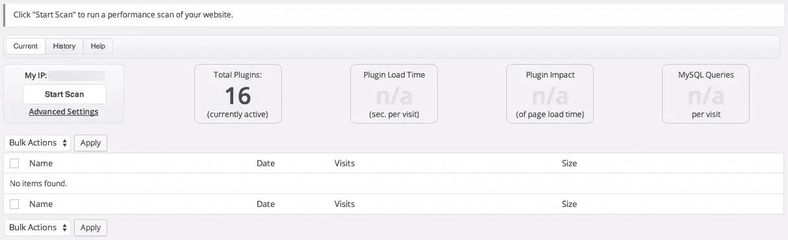
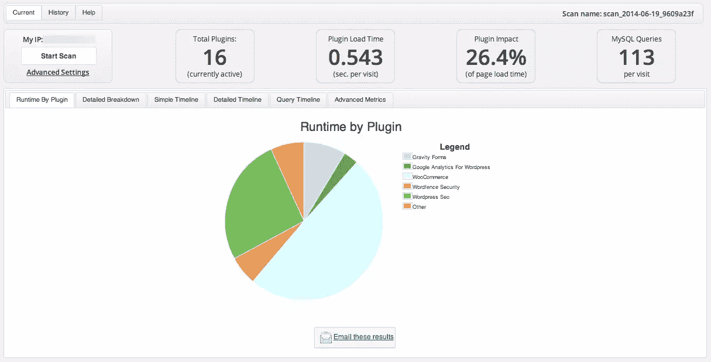
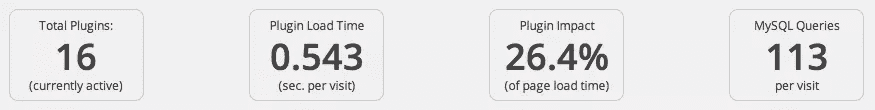
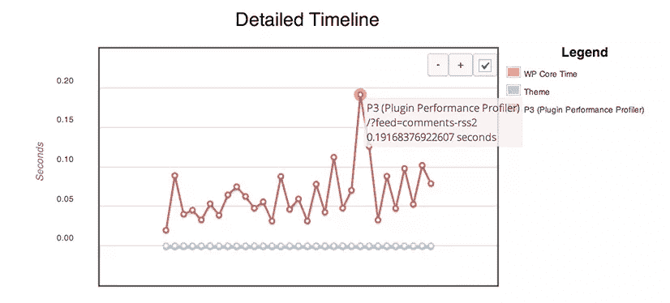
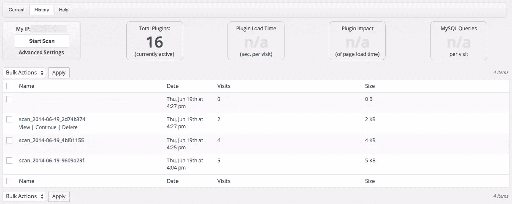
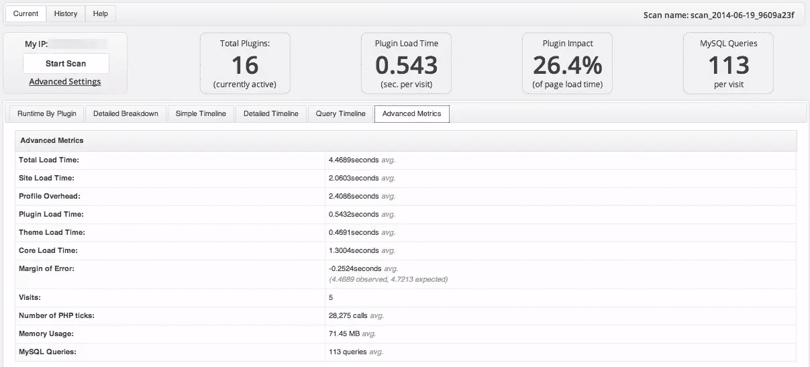
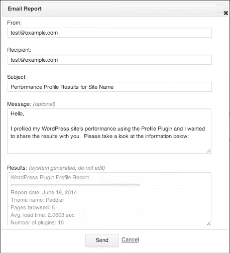

# 用 P3 优化 WordPress 的性能

> 原文：<https://www.sitepoint.com/optimizing-wordpress-performance-with-p3/>

P3 ( **插件性能分析器**)是一个非常方便的免费 WordPress 插件。它捕捉你的 WordPress 网站上安装的所有插件的信息，然后测量、报告并可视化它们对你的网站加载时间的影响。

虽然 WordPress 插件目录是 WordPress 社区最大的资产之一，但事实是一些插件会对你网站的性能产生负面影响。配置不当、滥用或开发不当的插件会损害你的网站，在某些情况下，会让你的网站慢如蜗牛。幸运的是，P3 可以快速轻松地指出 WordPress 的性能问题，帮助你测试让你的网站运行更快的方法，并解决有问题的插件。

作为网络专业人员，我们不断面临着优化越来越多的技术的挑战，包括更丰富的内容，以及为各种设备和更高分辨率设计的媒体。当我们努力应对这些挑战时，性能(以及像 P3 这样的性能监控工具)变得越来越重要。

## 关于 P3

P3 是由 GoDaddy 的 PHP 开发人员 Kurt Payne 开发的，他也是 WordPress 的核心贡献者。P3 已被下载 266，502 次(截至编写本报告时)。它的评级为 4.6 星，最近一次更新是在一周前，在过去的两个月里，15 个支持线程中有 14 个得到了解决。

P3 通过监控 WordPress 在服务页面时发出的 PHP 函数调用来工作。它包含了各种有用的特性，值得在每个 WordPress 用户和开发者的工具箱中占有一席之地。

### 如何安装 P3

P3 很容易安装:使用和你安装任何其他 WordPress 插件一样的过程:

1.  打开你的 WordPress 仪表盘
2.  点击插件
3.  点击添加新的
4.  在搜索框中输入 P3
5.  在 P3 插件性能分析器结果上，单击“立即安装”
6.  激活 P3

*[您也可以在这里手动下载 P3 插件](https://wordpress.org/plugins/p3-profiler/)*

一旦 P3 被安装并激活，你将会看到类似这样的东西:



## 执行扫描

要执行扫描，您只需点击“开始扫描”按钮。然后，您将看到两个选项:

*   **自动扫描**:该选项对您的网站进行自动扫描。
*   **手动扫描**:此选项允许您浏览网站内选定的页面，进行您自己的性能测试，并在您喜欢的任何时候停止测试。

### 自动扫描

这是一个快速简单的选择。大多数情况下，自动扫描会检测到任何严重的问题。这种类型的扫描的缺点是，它将您视为已登录，这可能并不理想。

### 手动扫描

这个选项给你更多的控制你正在测试的东西。一旦你选择了手动扫描选项，你需要做的就是访问你的网站，如果你从你的 IP 地址访问，P3 将开始收集数据。

值得一提的是，你可能想打开另一个浏览器或一个匿名标签/窗口，从那里浏览你的网站。这样，您可以作为普通用户测试您的站点，而不是作为登录到仪表板的用户。

有一个选项(在高级设置下)可以配置此 IP 地址(或其他 IP 地址)。但是，默认情况下，这被设置为您的 IP 地址。

### 扫描特定页面

您也可以将 P3 配置为仅扫描特定页面。如果您正在对站点的某个区域进行故障诊断，如购物车或图片库，这将非常有用。

要指定要扫描的 URL，请将以下内容添加到位于主题目录中的`functions.php`中。

```
function my_p3_auto_scan_pages() {
    return array(
        'http://www.example.com/',
        'http://www.example.com/foo/',
        'http://www.example.com/foo/bar/',
    );
}
add_filter( 'p3_automatic_scan_urls', 'my_p3_auto_scan_pages' ); 
```

## 扫描结果

P3 生成的结果非常直观。下图显示了扫描的结果。



大多数时候，尤其是在解决性能问题时，您会看到一个问题插件非常突出。一眼就能看出:

*   您站点上安装的插件总数
*   插件加载时间
*   插件影响
*   每次访问的 MySQL 查询

这些结果因地点而异。对于“目标”来说，并没有一个硬性规定。最重要的是你要建立一个基线。所有这些数字越低越好。较低的数字通常意味着网站访问者的加载时间更快。Kurt Payne 在 P3 支持论坛上发布了一个很好的答案。



“扫描结果”选项卡显示最重要的数据，但也有一些您可能一眼看不到的漂亮功能，包括:

*   时间表
*   扫描历史记录
*   高级指标
*   电子邮件扫描结果

### 时间表

有几种视图可用于深入查看扫描结果。详细的时间表绝对值得一看。下面是一个简单的例子。



### 扫描历史记录

扫描历史是所有插件性能测试的在线存档。它允许您查看旧的扫描数据，并将其与新的结果进行比较，这样您就可以跟踪插件随时间的变化。插件在第一次安装时运行良好的情况并不少见，但是随着时间的推移，特别是当处理更多的请求/数据或服务器资源发生变化时，就会变得很困难。



### 高级指标

“高级度量”提供了测试结果的多种可视化视图，包括关于总加载时间、站点加载时间、配置文件开销、内存使用、误差范围和 MySQL 查询的数据。



### 电子邮件扫描结果

顾名思义，电子邮件扫描结果允许你通过电子邮件直接从 WordPress 仪表盘发送扫描结果到你的收件箱，或者只需轻轻一点就可以和你的团队分享。



### P3 有多准确？

鉴于 P3 测量的性质和进行测量的方式，P3 不可能 100%准确。扫描结果可能会改变，也确实会改变。许多因素都会影响 P3 扫描的结果:服务器环境、扫描时网站流量的波动、插件本身的活动以及服务器上的其他活动。缓存也会影响测试。

但是，您可以在高级指标部分查看误差幅度。从数字上来说，误差幅度相对较低。

确保 P3 获得最准确结果的最佳方式是进行更多扫描。扫描次数越多，效果越好。不要假设一两次扫描的结果是 100%可靠的。

## 结论

P3 是测试插件性能和插件对你的 WordPress 网站影响的有用工具。作为一个指南，P3 可以帮助您查明潜在的问题，并保持您的网站快速有效地运行。

如果你有兴趣了解更多关于 WordPress 性能优化的知识，请查看我们最近的文章[如何加速 WordPress](https://www.sitepoint.com/speed-wordpress/) 。

想了解更多关于 P3 的信息，请访问 WordPress 插件目录下的 [P3 项目页面](https://wordpress.org/plugins/p3-profiler/)。

## 分享这篇文章