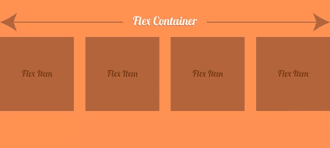

# 我们准备好使用 Flexbox 了吗？

> 原文：<https://www.sitepoint.com/are-we-ready-to-use-flexbox/>

**灵活** *形容词*
1。能够弯曲或者被弯曲，能够容易地改变以适应变化的环境或者条件。

**方框** *名词*
1。一种坚硬的典型的长方形容器。

柔性盒模块，又名 flexbox，是目前最新最棒的。它深入研究了 CSS 盒子模型的基本原理，为我们提供了一个强大且非常有用的布局配置模块。它很容易在我们的 CSS 和标记中定义，响应性的修改只是一个媒体查询。想象一下这样一个世界，我们不必[清除浮动](https://www.sitepoint.com/clearing-floats-overview-different-clearfix-methods/)或者利用框架或大量代码[来创建响应网格](https://www.sitepoint.com/easy-responsive-css-grid-layouts/)。Flexbox 做了所有的脏活。对我们来说，这只是一个简单的实现。我们定义了一个 flex 容器，其中有 flex 项。



## Flexbox 到底是什么？

下面是根据 MDN 对 flexbox[的定义:](https://developer.mozilla.org/en-US/docs/Web/Guide/CSS/Flexible_boxes)

> CSS3 Flexible Box 或 flexbox 是一种布局模式，用于在页面上排列元素，以便当页面布局必须适应不同的屏幕大小和不同的显示设备时，元素的行为是可预测的。

简而言之，我们可以在一个 flex 容器中标记一些 flex 项目，并用我们的 CSS 定义布局安排。在定义布局安排时，我们有许多选项，让可能性无穷无尽。以下是一些例子:

1.  `flex-direction`–使用该属性，我们可以指定是否希望项目在一行或一列中，以及是否希望项目按照标记外观的顺序排列或反转。
2.  让我们来声明浏览器应该如何在元素之间分配可用空间。换句话说，如果我们有 3 个元素，它们的总宽度为容器的 50%，我们可以指定是否将元素打包到左侧、右侧、中间，从左到右均匀分布，以及其他一些选项。
3.  利用这个属性，我们可以指定如果 flex 容器空间不足，我们是否希望我们的 flex 项目跳转到新的一行。

以上几点只是 flexbox 功能的一小部分，您可以通过访问 MDN 上的 [flexbox 指南获得更多的见解和文档。我鼓励你去尝试，去熟悉，但我不会用更多的理论来轰炸你。让我们看看 flexbox 这些年来是如何发展的。](https://developer.mozilla.org/en-US/docs/Web/Guide/CSS/Flexible_boxes)

## Flexbox 的历史

随着时间的推移，Flexbox 的支持越来越多，现在使用越来越广泛，但实际上它从 2009 年就已经存在了。考虑到这一点，现在网上有很多利用旧版本的文档和例子(尽管这种情况正在逐渐消失)。

简而言之:

*   2009 规范发布了，随之而来的还有所有的`box-`类型声明。如果你看到任何使用`box-*`类型属性的教程或示例 CSS，你看到的是最初的，现在已经过时的 flexbox 版本。[这是 2009 年规格](https://www.w3.org/TR/2009/WD-css3-flexbox-20090723/#property)的房地产指数。
*   2011 年，该规范笨拙地改变了一点。使用`display: flexbox`或`display: inline-flexbox` ( [，你可以在这里看到](https://www.w3.org/TR/2011/WD-css3-flexbox-20110322/#display-flexbox))定义了一个 flex 容器。还有[一个 flex()函数](https://www.w3.org/TR/2011/WD-css3-flexbox-20110322/#flex-function)。
*   2012 年，该规范更新为我们今天所知的内容。如果你在 flex 容器上看到属性`display: flex`,那么你就与时俱进了。

看起来当前的版本已经存在，而且非常全面。这是 W3C 的最新规范，包含了所有的细节。

## Flexbox 正在运行

关于 flexbox 已经说得够多了，现在让我们来看一个基本的例子。这是我们的标记:

```
<div class="container">
  <div class="item">
    <h2>Item 1</h2>
  </div>
  <div class="item">
    <h2>Item 2</h2>
  </div>
  <div class="item">
    <h2>Item 3</h2>
  </div>
  <div class="item">
    <h2>Item 4</h2>
  </div>
</div>
```

下面是让 flexbox 发挥作用的 CSS:

```
.container {
  display: flex;
  justify-content: space-between;
  align-items: center;
  flex-wrap: wrap;
}

.item {
  padding: 20px;
  width: 22%;
  background-color: rgb(255,150,100);
}
```

这使得`.container`元素成为我们的 flex 容器，而`.item`元素成为我们的 flex 项目。这是一个 CodePen 演示:

在 [CodePen](http://codepen.io) 上通过 SitePoint ( [@SitePoint](http://codepen.io/SitePoint) )看笔 [imJGz](http://codepen.io/SitePoint/pen/imJGz/) 。