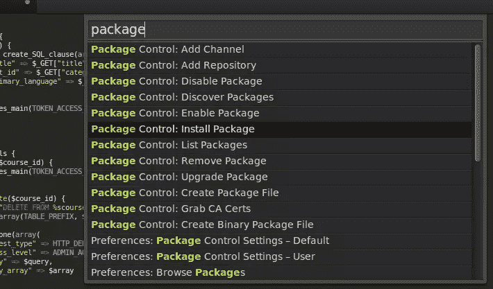
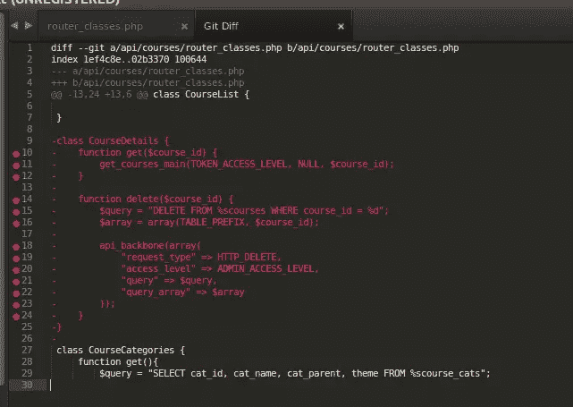
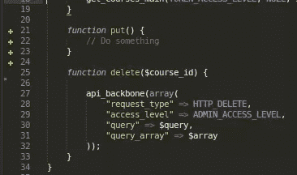
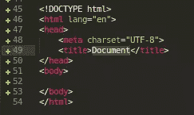
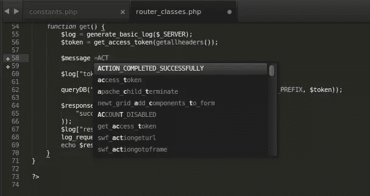
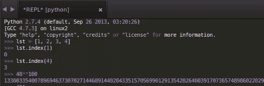
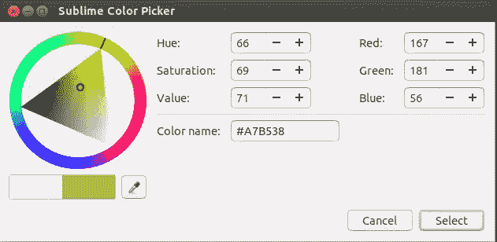
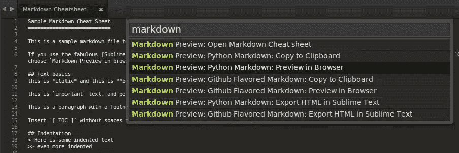
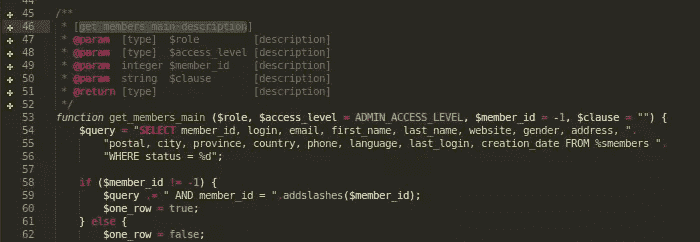

# 面向全栈开发者的 10 个重要的崇高文本插件

> 原文：<https://www.sitepoint.com/10-essential-sublime-text-plugins-full-stack-developer/>

当我几年前开始从事 web 开发时，Vim 是我的首选文本编辑器。这很容易操作，我可以毫不费力地完成基本工作。此外，许多开发人员喜欢基于终端的文本编辑器，因为他们可以在本地开发机器和远程服务器上获得相同的环境。尽管存在“ [Vim vs Emacs](http://stackoverflow.com/questions/1430164/differences-between-emacs-and-vim) ”的争论，但大约一年前，我决定尝试一个原生文本编辑器，Twitter 上正热烈讨论其中一个编辑器(猜猜是哪个也没什么意思。)

Sublime Text 的创建者说，这是一个你会爱上的文本编辑器，在使用了将近一年之后，我必须说我完全同意他们的观点。它有一个不定时的试用期，单个用户的许可证费用为 70 美元。如果你每天大部分时间都在使用文本编辑器，我会说这是一项值得的投资！

让 Sublime Text 更加出色的是它的可扩展性。所以，让我们来看看那些让已经很棒的编辑器变得真正卓越的插件。

## 1.[包装控制](https://sublime.wbond.net/installation)

安装 Sublime 文本插件的一种方法是下载文件，并将其复制到包目录中。然而，你应该经历这个过程一次，因为有一个插件叫做包控制:一个包管理器，使你能够安装其他插件而不留下崇高的文本。就像`apt-get`对于 Ubuntu，`pip`对于 Python，`npm`对于 node.js

遵循这里的安装说明，你就再也不用手动安装其他插件了。

为了验证它已经被正确安装，按下`Ctrl/Cmd + Shift + p`并输入‘package control’——你应该能够看到一个选项列表。

## 2.[去](https://github.com/kemayo/sublime-text-git)

这些天，更多的时候，你会使用版本控制软件，最流行的 VCS 是 Git。您是否厌倦了保存文本文件并切换回终端来运行一些 Git 命令？如果可以从文本编辑器本身执行 Git 命令，那不是很好吗？安装 Git 插件，事半功倍！

## 3.[排水沟](https://github.com/jisaacks/GitGutter)

虽然您可以在 Sublime Text 中运行 Git 命令，但是当您可以实时查看文件时，为什么要通过运行单独的命令来检查文件与上次提交时的差异呢？

有了 GitGutter，你可以看到哪些行在 Gutter 中被添加、删除或修改了。

## 4.[埃米特](http://emmet.io/)

Emmet 是一个有用的插件，通过让你写得更少来节省时间，从而提高你的生产力。Emmet 可用于其他文本编辑器，如 Notepad++和 Eclipse。

有[很多事情](http://www.hongkiat.com/blog/html-css-faster-emmet/)你可以用 Emmet 完成，但我在这里只告诉你我最喜欢的。键入`html:5`并按下`Ctrl/Cmd + e`，它被扩展为一个基本的 HTML 5 页面模板。简单！

## 5.[全部自动完成](https://github.com/alienhard/SublimeAllAutocomplete)

Sublime Text 的默认自动完成功能只考虑当前文件中存在的单词。然而，AllAutocomplete 插件会搜索所有打开的文件，在建议单词的同时查找匹配项。

## 6.[终端](https://github.com/wbond/sublime_terminal)

万一你想在当前文件的目录下打开一个终端，这个插件会很有用。但默认情况下，它将`Ctrl/Cmd + Shift + t`设置为打开终端的快捷方式，这也是打开最后一个关闭文件的快捷方式。您应该更改其中一个快捷方式，以便能够使用这两种功能！

## 7. [SublimeREPL](https://github.com/wuub/SublimeREPL)

这可能是对程序员最有用的插件了。SublimeREPL 允许您在 Sublime 文本中运行一系列语言(NodeJS、Python、Ruby、Scala 和 Haskell 等)的解释器。让我们运行一个 Python 解释器，看看它是否工作。执行一些`list`检查并计算 48 的 100 次幂。

## 8.[颜色选择器](http://weslly.github.io/ColorPicker/)

通常，如果你想使用颜色选择器，你可能会打开 Photoshop 或 GIMP 并使用内置的颜色选择器。ColorPicker 插件允许您在 Sublime 文本中使用颜色选择器！安装完成后，按`Ctrl/Cmd + Shift + c`即可。

## 9\. [MarkdownPreview](https://github.com/revolunet/sublimetext-markdown-preview)

虽然许多开发者更喜欢在云中创建 Markdown 文件(GitHub Gists，StackEdit，Markable)，但这是为那些喜欢在本地保存文件的“老派”作者准备的。虽然 MarkdownPreview 主要是预览 Markdown 文件，但您可以更进一步，安装[markdowndediting](https://github.com/SublimeText-Markdown/MarkdownEditing)，它可以为您提供适当的颜色突出显示。

## 10. [DocBlockr](https://github.com/spadgos/sublime-jsdocs)

如果你严格遵循编码指南，这是一个使你的任务更容易的插件。DocBlokr 通过解析函数、参数、变量和自动添加基本项，帮助您为代码创建适当的注释。从“/**”开始，DocBlockr 会为您完成剩下的工作。例如，看看 DocBlockr 如何通过创建一个基于我的评论的格式让我的生活变得更容易。

至此，我们来到了插件列表的末尾，以提高您的工作效率。我们错过了什么重要的吗？请在下面的评论中告诉我们你最喜欢的。

* * *

*你可能也会对我们的[与崇高文本](https://www.sitepoint.com/premium/screencasts/working-with-sublime-text)一起工作的视频感兴趣。*

## 分享这篇文章