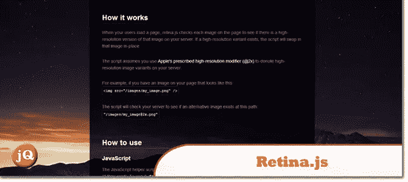
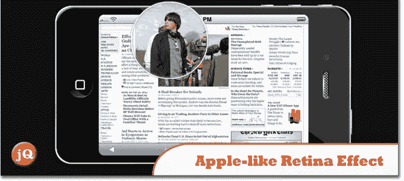
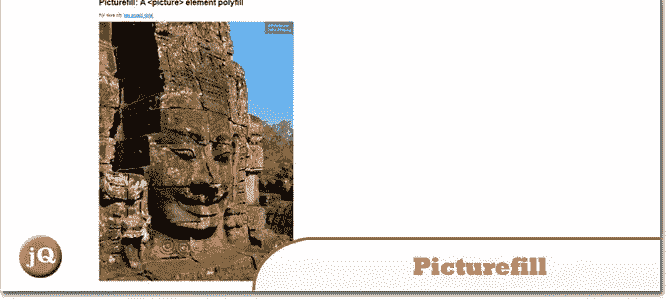
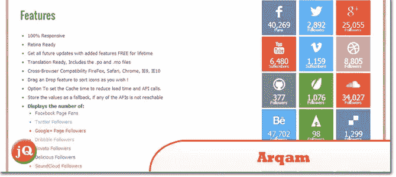
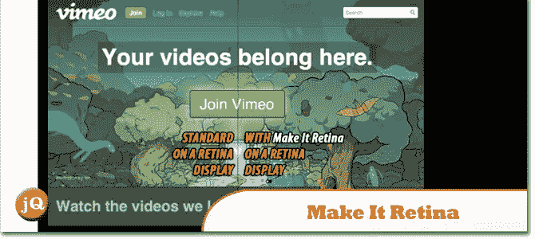

# 6 个最好的 Retina 显示屏 jQuery 插件和演示

> 原文：<https://www.sitepoint.com/5-retina-display-jquery-plugins-demos/>

高分辨率显示器越来越普遍，各种设备都达到了所谓的“视网膜显示”水平。你的网站和应用需要在这些屏幕分辨率上看起来不错，所以这里有一些插件可以帮助你。

## 1.视网膜. js

一个[开源脚本](http://retinajs.com/),使得向带有 retina 显示屏的设备提供高分辨率图像变得容易

## 2.用 jQuery 实现类似苹果的视网膜效果

这里有一个 jQuery 插件来实现视网膜质量的图像。查看一个[演示](http://demo.tutorialzine.com/2010/06/apple-like-retina-effect-jquery-css/demo.html)

## 3.反应灵敏的视网膜就绪菜单

一个丰富多彩、视网膜就绪且反应灵敏的菜单,其灵感来自于《边陲之地》游戏制造商马里万的颜色。根据浏览器窗口的大小，该菜单会自动切换到三种不同布局中的一种:“桌面”内嵌版本、两列平板电脑优化版本以及带有菜单链接的移动版本，该链接可显示和隐藏较小屏幕的导航。查看一个[演示](http://tympanus.net/Tutorials/ResponsiveRetinaReadyMenu/)

## 4.图片填充

你可以使用的[响应图像](https://github.com/scottjehl/picturefill)方法。查看一个[演示](http://scottjehl.github.io/picturefill/)。

 
来源

## 5.arqam–Retina Responsive WP 社交计数器插件

这个[插件](http://codecanyon.net/item/arqam-retina-responsive-wp-social-counter-plugin/5085289?ref=sdeering)从你最喜欢的社交网络中抓取你的粉丝/追随者等的最新数据，然后显示在你的博客上。这是鼓励更多用户加入你的网络的完美解决方案。查看一个[演示](http://codecanyon.net/item/arqam-retina-responsive-wp-social-counter-plugin/full_screen_preview/5085289?ref=sdeering)。

## 6.让它变成视网膜

一个用于视网膜显示的 jQuery 插件。查看一个[演示](http://codecanyon.net/item/make-it-retina-jquery-plugin-for-retina-display/full_screen_preview/2680313?ref=sdeering)

## 分享这篇文章