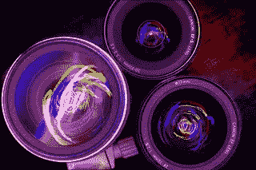
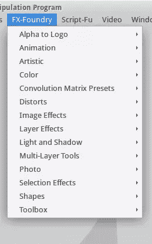
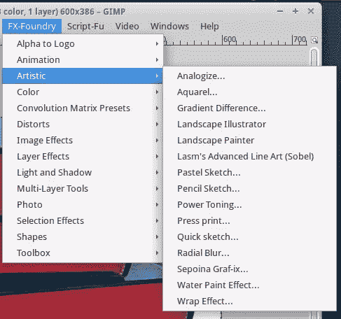
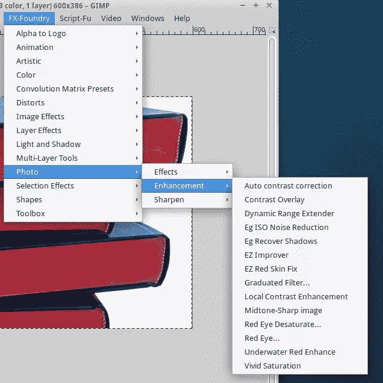
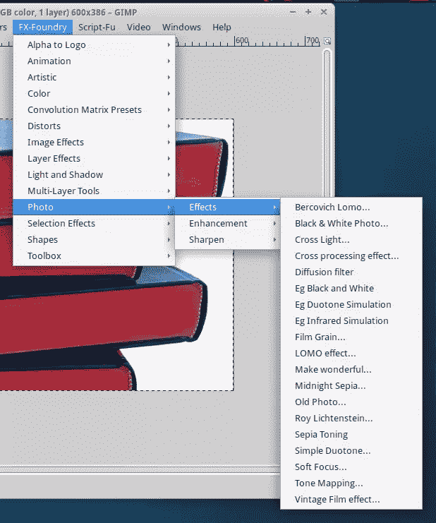
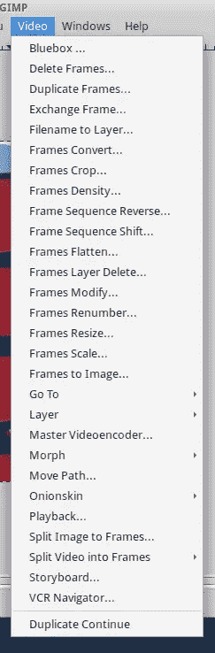
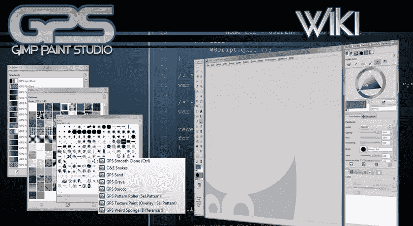
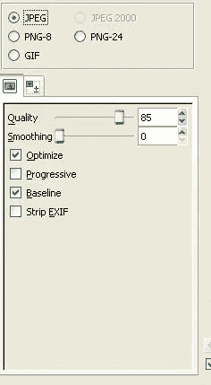
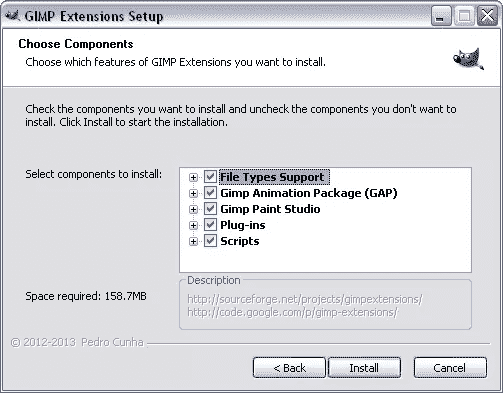

# 面向设计师的 5 款优秀 GIMP 插件

> 原文：<https://www.sitepoint.com/5-great-gimp-plugins-for-designers/>

图片来源:kcolwell

GIMP 最大的优点之一是大量插件、脚本、扩展和其他资源的可用性。多亏了这些好东西，你可以在你需要的方向上扩展程序的功能。

有几十个很棒的 GIMP 扩展，所以只选择 5 个是一个挑战，但是因为这些选择是 GIMP 的能力和灵活性的象征，我认为它们应该得到这个荣誉。

所以，这里是我的 5 个伟大的 GIMP 插件，大多数设计师应该特别欣赏。

## 1.FX 铸造厂

FX Foundry 几乎可以肯定是最著名的 GIMP 扩展。这样做有一个很好的理由:它是一个由 100 多个独立的图像处理脚本组成的巨型包。

事实上，在过去，这个包包含多达 150 个脚本，但管理员明智地将集合精简为最高质量、维护良好的工具。

无论如何，FX Foundry 包中的脚本数量仍然令人生畏，老实说，我怀疑任何设计师会在他们的工作生涯中使用所有可用的脚本。

然而，很高兴知道你不必一个一个地下载和安装它们。

链接中的包没有为 GIMP 2.8 更新——它是为 GIMP 2.6 更新的。不管怎样，在我最新的 GIMP 安装中使用这些都没有问题。虽然我不能声称已经彻底测试了每一个脚本，但在我进行的大量测试中，我没有遇到任何问题。

当您下载并安装 FX Foundry 时，它会出现在屏幕截图右侧的菜单中。

我发现照片和图层工具特别有用，但它是照片效果的宝库。

下面是这个包中包含的一些子菜单选项:

图层、多层和照片工具特别有趣，因为它们具有很酷的功能，如镜像、边框或多层操作，如复制、缩放、裁剪、变换、编辑或删除图层。

照片工具提供了许多效果和增强功能，如消除红眼、双色调、自动对比度校正等。如果你要探索所有这些，你可能需要几天时间，但我保证，你不会感到无聊。

## 2.缝隙

GIMP 动画包 (GAP)是另一个插件设计者可能会喜欢的。它不像 Blender 这样的动画套件那样功能齐全，但如果你想制作一些快速、专注的动画，它是完美的。

在 Linux 上，你可以通过 Synaptic 安装 GAP，也可以自己编译。在 Windows 上，你可以得到一个现成的安装程序。安装之后，您可能会花一些时间在 GIMP 中的某个地方寻找它。

GAP 没有像 GAP 一样安装，而是添加了一个视频菜单——如果你已经安装了大量的脚本/扩展，却不记得你有什么，那就非常令人困惑了。当然，这是一个小问题，但是除此之外，这个插件非常好。

我最近没有使用 GAP，所以我不太熟悉它的所有功能，但快速浏览一下它菜单中的命令，让我觉得它应该不仅仅适用于动画和电影。

## 3.GIMP 油漆工作室

GIMP Paint Studio (GPS)是一个提供更多画笔、渐变、调色板、图案、喷溅、工具预置等的包。

这些对于更高级的设计任务很有用，但是即使你只是偶尔使用 GIMP 做简单的事情，你也可能会对它们感兴趣。

下面是你可以期待的截图:

http://code.google.com/p/gps-gimp-paint-studio/wiki/Introduction

如果你想知道这些好东西能做什么，这里有一个雷蒙·米兰达的艺术画廊。

## 4.保存为 Web 格式

与列表中的其他插件相比，这个插件非常小，但是如果你是为网络设计的，我怀疑你会经常使用它。[保存为网页](http://registry.gimp.org/node/33)易于使用。只需安装它，从文件菜单中选择它，并选择您想要的设置。

如果我是正确的，“保存网页”曾经是 FX Foundry 软件包的一部分，但后来被拆分成自己的产品。如果你是 Windows 用户，想下载 GIMP Extensions Pack for Windows，我看到 Save for Web 就在那里，所以你不必像 Linux 那样自己编译它。

使用这个插件的关键是找到图像质量和小尺寸之间的理想平衡。它的工作与独立的图像压缩工具类似，明显的优点是不需要离开 GIMP 就可以压缩一两张图像。

## 5.用于 Windows 的 GIMP 扩展包

如果你在 Windows 下使用 GIMP，那么你可能想要获得用于 Windows 的 GIMP 扩展包。它包含了上面所有的插件，以及大量的其他插件。

当你拿到包的时候，你就不用一个一个的安装插件了。然而，你肯定会得到很多你不会使用的插件，它们只会把你的空间弄得乱七八糟。然而，将所有必要的插件放在一个易于安装的包中是很方便的。

如果你想了解更多关于包里到底有什么，你可以查看[这个](http://code.google.com/p/gimp-extensions/)。

我知道还有很多更值得一提的 GIMP 插件。然而，我决定挑选一些对大多数设计师有用的更通用的。

当然，这只是我个人的选择，如果你能在评论中分享你最常用的 GIMP 插件，我会很感兴趣。

## 分享这篇文章