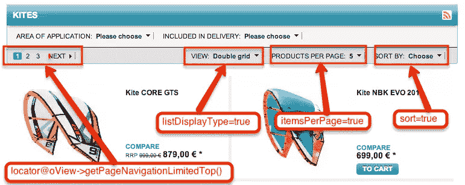
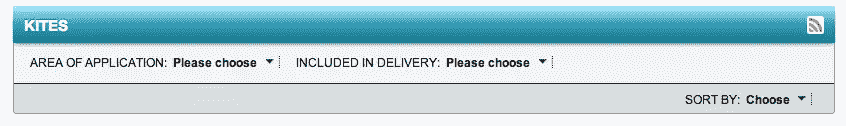
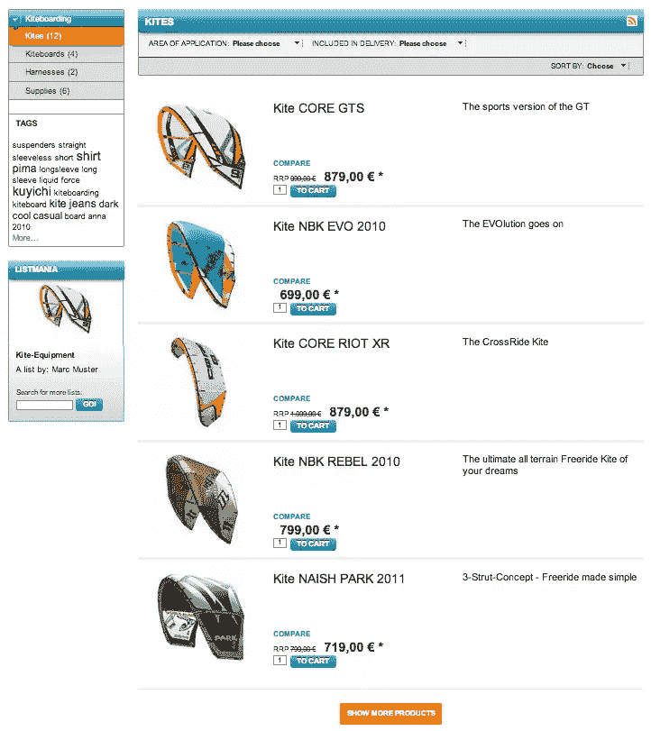
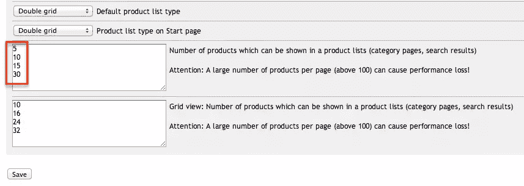

# 为 OXID eShop 构建无限滚动列表–实施

> 原文：<https://www.sitepoint.com/build-infinite-scroll-list-oxid-eshop-implementation/>

在[前一部分](https://www.sitepoint.com/build-infinite-scroll-list-oxid-eshop-basics/)中，我们已经检查了为`infinite scrolling`列表服务的模块的后端实现的逐步过程。我们还为控制器添加了一些代码，但当时并没有带来任何明确的结果。

这第二部分将帮助您完成剩余的任务，以实现无限滚动列表。让我们看看如何使用新模板和 JavaScript 代码来处理无限滚动的逻辑。然后我会向你展示激活一个新模块的正确方法，并且会包括一些提示，让你远离意想不到的问题。

### 自定义 OXID 定位栏

发现你只需要替换当前模板的一些块，感觉很好。有时候，你没有那么幸运，你需要替换整个模板文件。

请打开模板`/application/views/azure/tpl/page/list/list.tpl`，复制其内容并粘贴到新文件`/modules/aho_infinitescroll/views/page/list/aho_infinitescroll_list.tpl`中。

打开文件`aho_infinitescroll_list.tpl`，搜索包含以下代码的行:

```
[{include file="widget/locator/listlocator.tpl" locator=$oView->getPageNavigationLimitedTop() attributes=$oView->getAttributes() listDisplayType=true itemsPerPage=true sort=true }]
```

*   将显示不再需要的传统分页。
*   `listDisplayType=true`列出所有可用的视图选项。我们也不需要这个。新模块将使用模块设置中定义的视图类型。
*   `itemsPerPage=true`决定用户是否可以选择每页显示多少文章。在本教程中，我们也将关闭此功能。
*   `sort=true`控制分拣条件。我们会让它开着。

让我们检查下图，研究定位器的元素及其相应的位置:

* * *



* * *

请用下面的行替换上面的行，删除不必要的元素:

```
[{include file="widget/locator/listlocator.tpl" attributes=$oView->getAttributes() listDisplayType=false itemsPerPage=false sort=true }]
```

我们还查找并删除下面的行来关闭底部定位器:

```
[{include file="widget/locator/listlocator.tpl" locator=$oView->getPageNavigationLimitedBottom() place="bottom"}]
```

结果如下:



### 实现无限滚动加载

**1-准备样式表**

打开文件`/modules/aho_infinitescroll/out/css/infiniteloading.css`并粘贴以下代码:

```
.loader-container{
    border-top: 2px solid #EAEAEA;
    margin:20px 0;
    text-align: center;
    width:100%;
}
#loader-btn{
    border-radius: 3px;
    color:#FFF;
    cursor:pointer;
    padding:10px;
    margin:20px 0;
    -moz-border-radius: 3px;
    -webkit-border-radius: 3px;
    -khtml-border-radius: 3px;
}
.endlist{
    background-color: #F5F5F5;
    color: #909090 !important;
    cursor: not-allowed !important;
}
#loader-icon{
    display:none;
}
```

**2- HTML 元素**
重新打开`aho_infinitescroll_list.tpl`。在包含模板`locator.tpl`的那一行之后，我们放入以下几行:

```
[{assign var="sModuleUrl" value=$oViewConf->getModuleUrl('aho_infinitescroll')}]
[{oxstyle include="`$sModuleUrl`out/css/infiniteloading.css"}]

<div id="newList"></div>

<div class="loader-container">
    
    <button id="loader-btn" class="FXgradOrange">[{oxmultilang ident="BTN_LOAD_MORE"}]</button>
</div>
```

*   第一行定义了一个变量来获取正确的模块 URL。如果您有几个 JavaScript 或 CSS 文件要包含，这将非常有用。请注意，你不应该为这些文件添加任何原始 URL，它们可能会由于不同的 OXID 版本而无法加载。
*   第二行将包含该模块的样式表。
*   第三行添加了一个 div，用于临时保存下一页加载的文章。
*   下一个块将创建一个带有两个后续元素的包装器:loader 图标和触发 Ajax 请求的按钮。

应用 CSS 后的结果将是:

* * *



* * *

**3-添加 JavaScript 代码**

将下面的 JavaScript 代码放入开头的`aho_infinitescroll_list.tpl`，紧接在`div.loader-container`之后

```
[{assign var="pages" value=$oView->getPageNavigationLimitedBottom() }]

[{capture assign="js_infiniteloading"}]
    $(document).ready(function(){
        var oBtn = $('#loader-btn');
        var oLoaderImg = $('#loader-icon');
        var oList = $('#productList');
        var oNewList = $('#newList');
        var iCurPgNr = parseInt("[{$pages->actPage}]");
        var iMaxPgNr = parseInt("[{$pages->NrOfPages}]");
        if(iCurPgNr == iMaxPgNr){
            oBtn.remove();
            return false;
        }
        var sUrl = "[{$pages->firstpage}]" ;
        var blFlag = true;
        oBtn.on('click', function(e){
            e.preventDefault();
            var iNextPgNr = iCurPgNr + 1;
            if(iNextPgNr <= iMaxPgNr ){
                oBtn.hide();
                oLoaderImg.show();
                blFlag = false;
                oNewList.load(sUrl + iNextPgNr +" #productList", function(response, status){
                    if(status == 'success'){
                        oList.append(oNewList.find('ul').html());
                        oNewList.html("");
                        iCurPgNr += 1;
                        if(iCurPgNr == iMaxPgNr){
                            oBtn.removeClass("FXgradOrange")
                                .addClass("endlist")
                                .text("[{oxmultilang ident="NO_MORE_ARTICLE"}]");
                        }else{
                            blFlag = true;
                        }
                        oBtn.show();
                        oLoaderImg.hide();
                    }
                });
            }else{
                oBtn.removeClass("FXgradOrange")
                    .addClass("endlist")
                    .text("[{oxmultilang ident="NO_MORE_ARTICLE"}]");
            }
        });
    });
[{/capture}]
[{oxscript add=$js_infiniteloading priority=12}]
```

*   第一行定义了一个重要的模板变量。它将获取重要的值，如总页数，当前页，下一页，第一页，最后一页和每一页返回的网址。您可以使用 *`[{$pages|var_dump}]`* 来检查`$pages`的所有值。

*   剩下的代码用下面的工作流实现无限加载的逻辑。

    *   我们将有一个额外的按钮来触发加载下一页文章的请求。
    *   隐藏的加载图像切换，以防止再次点击。
    *   新文章将被添加到列表的末尾。
    *   每次点击按钮都会重复这个过程，直到不再有文章要加载为止。此时，按钮被禁用。

**4-前端平移**

请前往`/modules/aho_infinitescroll/translations/`。
对于`en/aho_infinitescroll_lang.php`和`de/aho_infinitescroll_lang.php`，我们添加以下内容:

```
<?php
$sLangName = 'Deustch'; // 'English' for en file OR 'Deustch' for de file

$aLang = array(
    'charset' => 'UTF-8',
    'BTN_LOAD_MORE' => 'SHOW MORE PRODUCTS',
    'NO_MORE_ARTICLE' => 'NO MORE ARTICLE FOUND'
);
```

请为每个文件分配变量`$sLangName`的正确值。前端语言文件的名称始终遵循以下公式:

> `module folder name` + `_` + `lang.php`

### 激活模块

激活模块通常看起来完全不费力，只需在后端点击几下。然而，有时该模块可能会因为未知的原因而无法工作。如果您遇到这样的问题，请检查以下步骤:

*   如果您在`metadata.php`中做了任何更改，您必须*禁用模块*，然后*重新启用*。

*   如果您对数据库进行了任何更改，您必须更新数据库视图。你可以通过 ***服务*** > ***工具*** > ***更新数据库视图现在*** 。

*   您必须清除 ***tmp*** 文件夹中的任何更改。

*   您应该始终为`/log/EXCEPTION_LOG.txt`设置合适的权限模式来检查日志。

为了帮助您的测试顺利进行，您可以进入后端并减少每页的项目数量。
转到 ***扩展*** >主题>***{选择活动主题}*** > ***设置*** > ***显示*** ，更改值如下图所示:

* * *



* * *

以上调整只是针对 OXID 的默认数据，文章不多。如果你已经安装了一长串你自己数据的文章，这种改变是不必要的。

### 进一步增强

将有多种方法来实现 OXID eShop 的无限滚动。我们试图为您带来从后端到前端的基本实现。您可以对本模块进行许多改进:

*   使用第三方 jQuery 插件实现无限滚动效果，而不是使用手动触发。你可以从[infinite-scroll.com](http://www.infinite-scroll.com)的[保罗爱尔兰](http://paulirish.com/)那里获得一个好的插件。

*   我们已经将视图选项设置为默认值`line`。您可以对此进行自定义，使其适用于所有视图选项。

*   为你的模块应用 SEO 友好的方法。[这篇文章](https://www.sitepoint.com/seo-friendly-infinite-scroll/)看起来很有参考价值。

*   将功能扩展到搜索页面。

### 结论

你可以在 YouTube 上观看[最终结果，](http://youtu.be/GnEslLfzNa0)[从 GitHub](https://github.com/sitepoint-examples/aho_infinitescroll) 下载代码。

尽管后端的外观很老式，但 OXID eShop 足够灵活，可以实现与其他电子商务系统一样多的功能。我希望这篇教程教会你一些新的东西，并且你会发现 OXID 是你下一个电子商店值得考虑的选择。

请在下面的评论中与我分享你的观点！

## 分享这篇文章