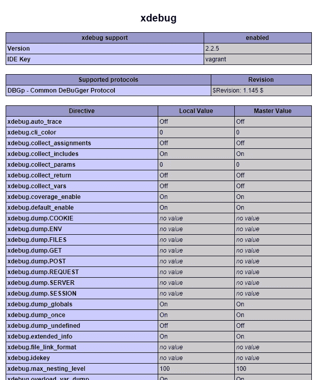
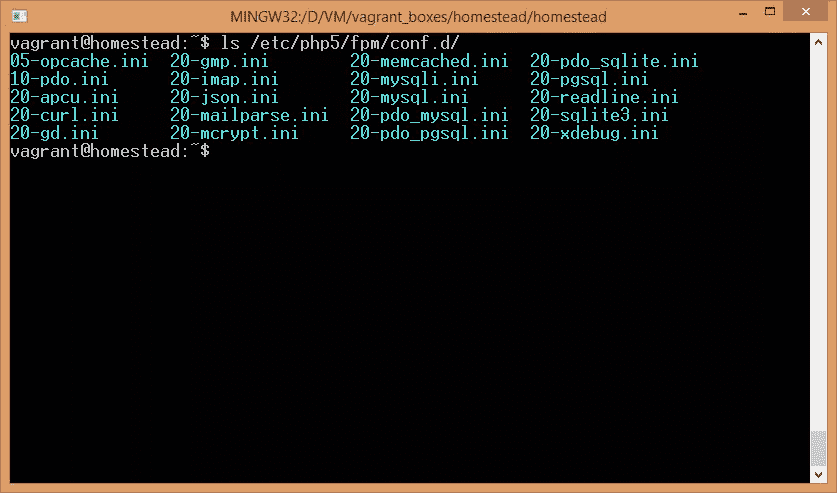
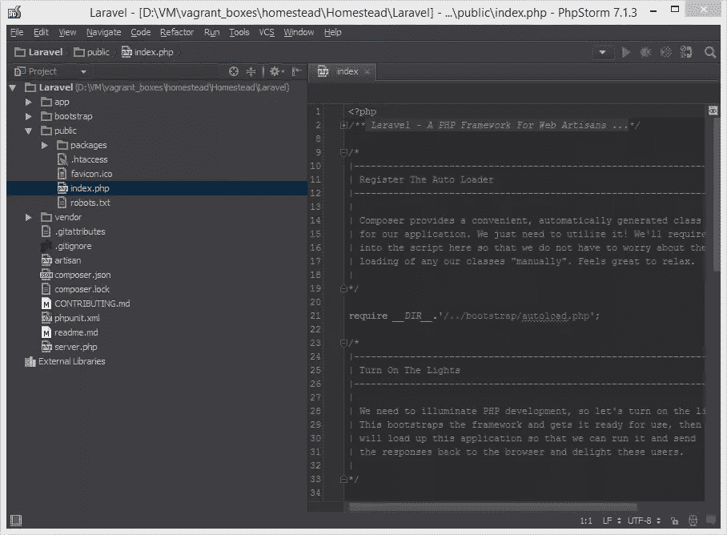
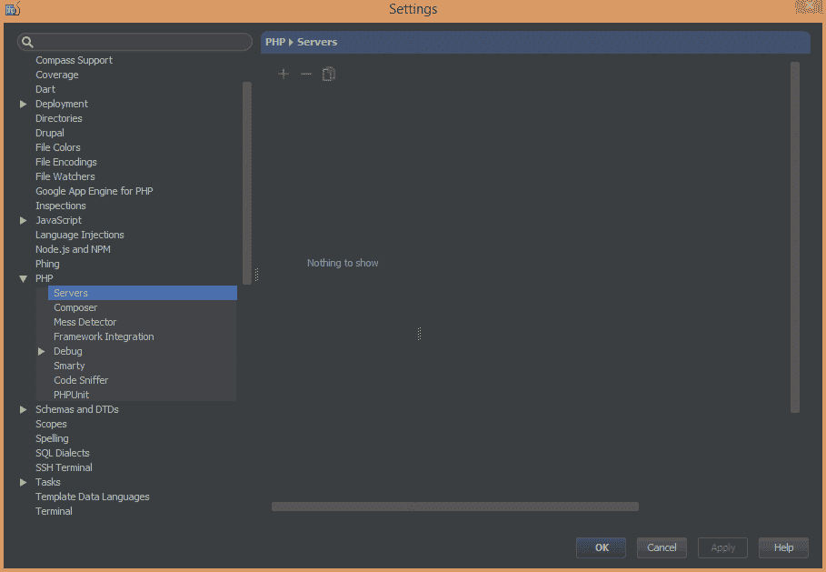
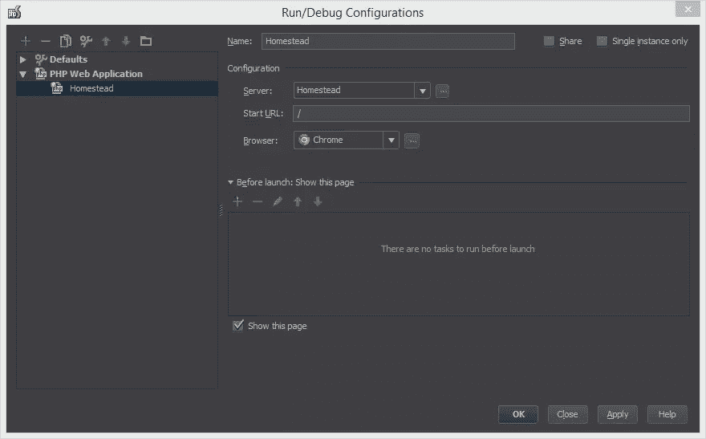
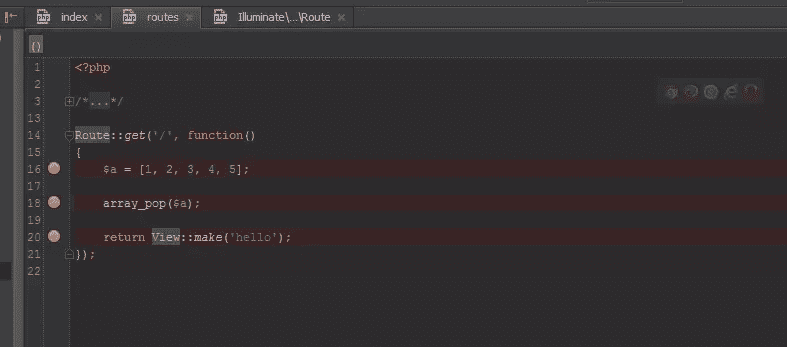
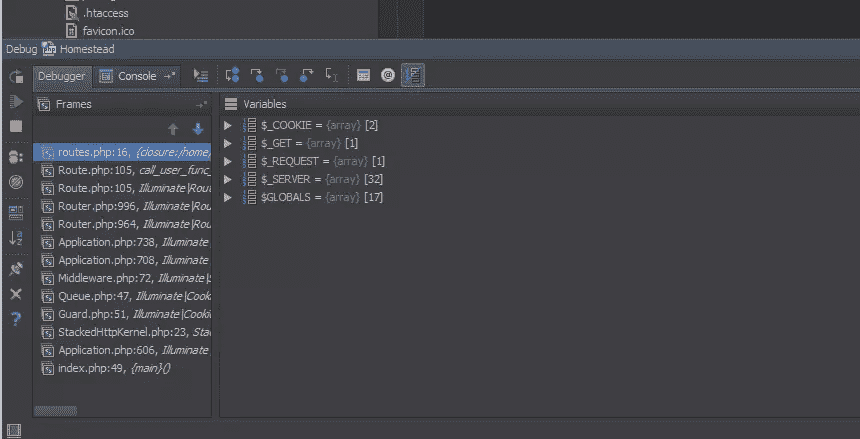
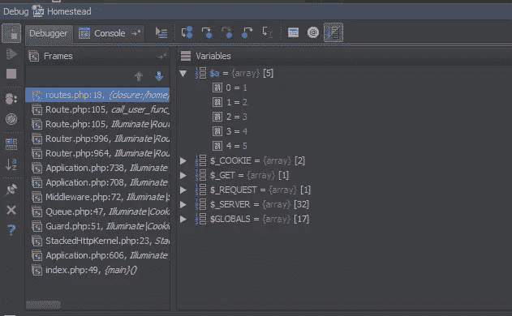
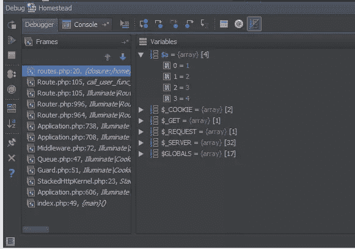

# 如何用 PHPStorm 和 vagger 安装 Xdebug

> 原文：<https://www.sitepoint.com/install-xdebug-phpstorm-vagrant/>

到目前为止，我们都已经开始喜欢上了流浪者和它所提供的开发灵活性。无论是什么平台，你都可以很容易地建立并运行一个开发环境，它不仅稳定，而且与你的同事、导师或学员使用的环境在各个方面都完全相同。但是，由于我们开发的应用程序驻留在虚拟机中，所以用 Xdebug 调试它们有点棘手，默认情况下，Xdebug 是针对本地主机进行调优的。

Xdebug 是一个 PHP 扩展，它允许你调试和分析你的代码，当错误发生时查看详细的和可读的堆栈跟踪，等等。详细的演练见 [Shameer 的帖子](https://www.sitepoint.com/debugging-and-profiling-php-with-xdebug/)。如果你对它完全不熟悉，你最好先按照下面的步骤安装它，然后参考上面链接的帖子，了解 Xdebug 可以为你和你的应用做的一切。

在本教程中，我们将设置 Xdebug 与 PHPStorm 的流浪托管 PHP 应用程序。

## 准备

要准备环境，请[安装并引导 Homestead](https://www.sitepoint.com/quick-tip-get-homestead-vagrant-vm-running/) 。

一旦启动，进入它，并安装一个示例 Laravel 应用程序。您可以通过执行以下命令来实现这一点:

```
composer create-project laravel/laravel Laravel --prefer-dist
```

当您看到 Laravel 问候屏幕时，您就可以开始了。

## 安装 Xdebug

这一步可以跳过。Homestead 安装并启用了 Xdebug。您可以在引导 Homestead 后查看 phpinfo()来了解这一点:



或者查看 PHP FPM 和 PHP CLI 的 conf.d 文件夹:

```
ls /etc/php5/fpm/conf.d
ls /etc/php5/cli/conf.d
```



如果你看到`xdebug.ini`在那里，它是上膛的。如果你使用任何其他的流浪盒，而 xdebug 不存在，请参考 [Shameer 的帖子](https://www.sitepoint.com/debugging-and-profiling-php-with-xdebug/)获取安装说明。

## 配置 xdebug.ini

为了允许远程使用 Xdebug，我们需要修改`ini`文件，并给它一些默认关闭的参数。Homestead 的默认`xdebug.ini`文件(在`/etc/php5/mods-available`中找到)最初只包含告诉 PHP 启用它的指令，没有其他内容:

```
zend_extension=xdebug.so
```

在该行下，添加以下选项:

```
xdebug.remote_enable = on
xdebug.remote_connect_back = on
xdebug.idekey = "vagrant"
```

关闭文件，重启 php-fpm: `sudo service php5-fpm restart`。这就是我们在 Xdebug 端需要配置的全部内容。

## 配置 PHP storm–服务器

PHPStorm 也需要一些配置。首先，使用它打开我们在步骤 1 中创建的 Laravel 应用程序的目录:



然后，进入项目设置，在 PHP ->服务器下添加一个新的。将端口 8000 作为您选择的名称，并在 host 下输入您站点的虚拟主机的名称(默认:`homestead.app`)。然后，使用路径映射来映射路径，以便您的代码库在主机上的位置对应于在 VM 上的位置。对`public`子文件夹做同样的操作。基本上，把`Homestead.yaml`的`folders`块移植到这个窗口。以我为榜样:



## 配置 PHP storm–调试配置

要在应用程序上运行调试器，我们需要创建一个调试环境。进入`Run -> Edit Configurations`。在那里，为“PHP Web 应用程序”创建一个新的配置:



应用新设置并关闭配置。

## 测试

这就是设置它的全部内容。让我们看看它是否像预期的那样工作。

在`app/routes.php`中，改变归航路线的闭合，使其看起来像下面的代码:

```
Route::get('/', function()
{
    $a = [1, 2, 3, 4, 5];

    array_pop($a);

	return View::make('hello');
});
```

然后，在执行某项操作的闭包的每一行旁边放置一个断点，如下所示:



让我们测试这些断点。如果你已经在浏览器中打开了这个应用，现在就关闭那个标签，否则 PHPStorm 将无法重新运行它。然后，转到`Run -> Debug`并运行预定义的调试配置。应该会启动一个新的选项卡，并立即返回到 PHPStorm，输出如下:



左边的框架列出了 stack trace——请求已经通过的文件——并在我们的文件`routes.php`处停止。您会注意到右边的面板中只声明了超级全局变量——此时没有其他变量。单击 Resume 按钮移动到下一个断点，并产生以下输出:



注意我们的`$a`变量现在在那里。另请注意，您可以展开它来查看它包含的内容。再次单击 Resume 按钮会产生稍微不同的输出:



由于执行了`array_pop`操作，我们的`$a`数组少了一个元素。这证明我们的断点工作正常，Xdebug 已经成功设置。

## 结论

尽管最初的印象，Xdebug 是非常容易安装的，当你知道要做什么的时候，可以通过 vagger 使用。这些指令也很容易适用于 Xdebug 与任何其他 IDE 的集成，因此可以随意修改它们——只有 PHPStorm 部分可能需要更改。

你通过 VM 层调试吗？你使用其他方法吗？有什么我们没提到的问题吗？让我们知道！

## 分享这篇文章