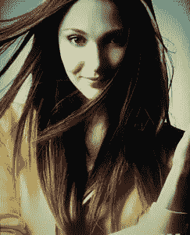
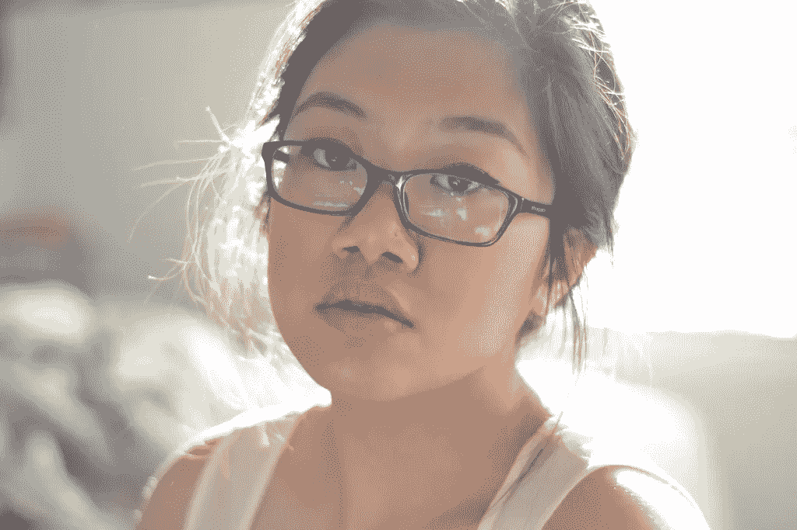
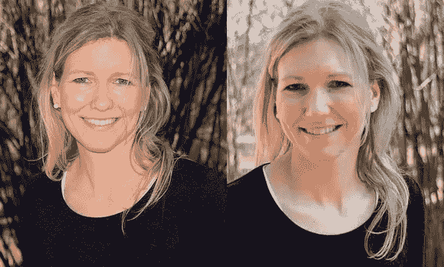
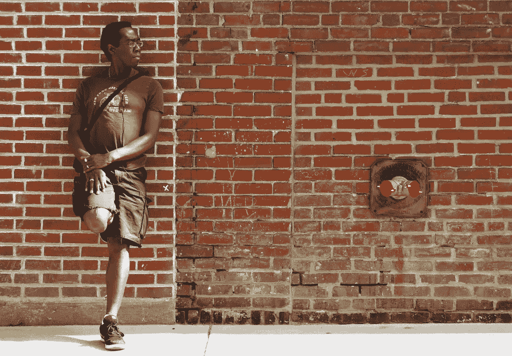
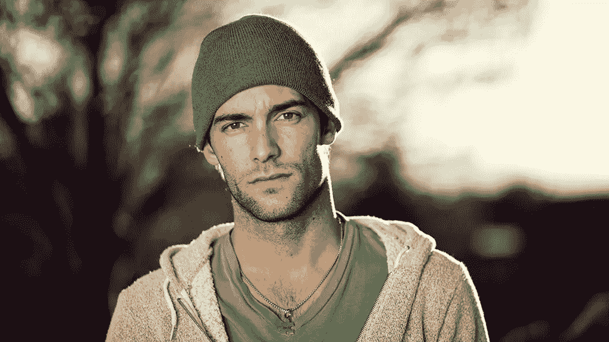
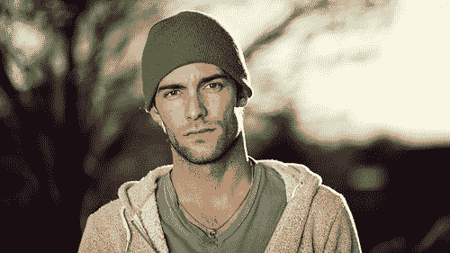
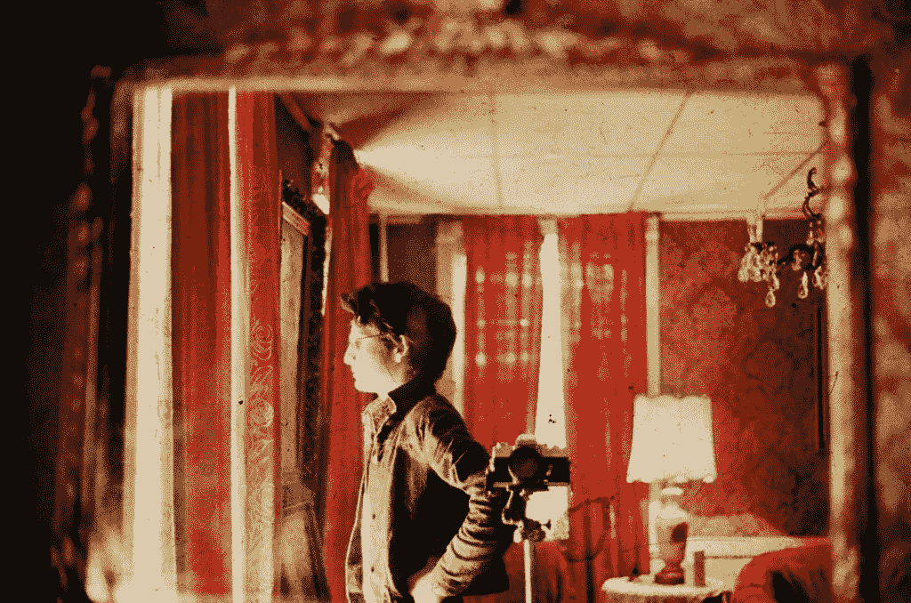

# 用你的手机相机伪造专业肖像

> 原文：<https://www.sitepoint.com/faking-pro-portraits-phone-camera/>

照片:Ishak J

由于我们的移动设备增加了摄像头，拍照变得前所未有的简单。我们不再被迫通过文本或实际的电话交谈来描述一个物体、人或场景。

只需简单地点击一个按钮，按下值得信赖的“发送”按钮，我们就可以在几秒钟内(取决于你的服务)分享我们所看到的。

它还催生了通过 Instagram 等流行的社交网络在网上发布“自拍”的流行现象。

虽然这个想法令人讨厌，也让一些人挠头，但轻松使用拍照手机肯定有很多好处。我们现在可以随时随地以低廉的价格拍照。这包括那些寻找经典网站“生物/关于我们的照片”的人。

对于我们中的许多人来说，除了休闲之外，还需要一个图像或头像来伴随我们的社交媒体资料。

事实是，并不是所有人都能负担得起花费数百——如果不是数千——美元购买高质量的 DSLR，仅仅是为了得到一幅可行的画像。专业摄影师永远是一个选择，尽管预算可能不会总是那么紧张。

幸运的是，对于我们大多数人来说，只需要几个技巧，就可以用普通的智能手机和一些家居用品获得专业质量的头像。

请继续阅读，查看更好的智能手机照片的基本分类和实践。

## 照明设备

[https://www.flickr.com/photos/shakethesky/6799007500](https://www.flickr.com/photos/shakethesky/6799007500 "The original image on Flickr")

专业照片和业余照片的区别在于照明。

良好的照明实践绝对是获得一张吸引人的照片的关键，更是一张吸引人的肖像。试着回忆一下你最后一次尝试用手机甚至相机拍照，并且对最终结果不满意的时候。

也许你需要一把梳子、一个熨斗或一个不同的面部表情，但我敢打赌，你的灯光是驱使你以响亮的“恶”声尽可能快地用力按下删除键的罪魁祸首。

现在，照明可能看起来像是那些需要你注册一门课程来了解它的要点的事情之一，但是当你看基础的时候，它真的没有那么难。毕竟你只想要一张看起来很专业，足够好代表你的大头照。你不想成为下一个大摄影师，所以你需要知道:

*   你需要足够的光线
*   **你需要在正确的地方有灯光**

我怀疑你们中的一些人会抱怨这一点帮助都没有，但是请继续关注我。

澄清一下“你需要足够的光线”，这基本上意味着你需要确保在你想要的肖像的情况下，你手头有足够的光线，这样你就可以在你自己和你的背景之间创造对比。

“你需要在正确的地方照明”是很重要的，因为把灯放在错误的地方会让你看起来像被吹走了一样。也就是说，任何人告诉你在阳光明媚的日子里出去拍照都是在伤害你。

任何摄影师或摄像师都会告诉你不要在正午拍摄，这是有道理的。

此时太阳正处于最高点，会给你或你的拍摄对象投下刺眼的阴影。更不用说阳光灿烂，容易让人眯起眼睛。如果你在室外拍摄，最好是阴天或者正午前后。

全阳光(左)在皮肤上产生更多高对比度的阴影和镜面光泽反射。照片:吉姆·拉里森

除了这些基本原则之外，这里还有一些小技巧可以让你获得更好的照明:

*   尽可能使用自然光，因为无论你的肤色或类型都更讨人喜欢，因为人造光会发出各种颜色，导致不均匀的外观。

*   试着在关灯的窗户旁边拍摄，或者走到室外，但不要在阳光直射的地方。寻找阴凉处。

*   如果你有皱纹或希望减少面部重量，例如皮肤松弛，那么向上而不是向下照明。你可以在膝盖上放一个反光板，甚至白色的海报板，让光源从卡片上向上反射，以柔化面部特征。

*   一块白色的海报板，甚至是汽车反光镜都可以作为你肖像的补光灯。如果两者都没有，你也可以取一个平面，用箔纸覆盖。

*   灯可以用来代替照明套件。只要确保它放得足够近，因为它会让你的灯光看起来柔和。

*   如果在户外拍摄，并且在你的智能手机上有闪光灯，使用它，因为这会给你一个动态的外观并增加细节。

## 摆姿势

[https://www.flickr.com/photos/tilaneseven/2588346029](https://www.flickr.com/photos/tilaneseven/2588346029)

漂亮的脸和良好的灯光造就了一幅好的肖像，但这并不意味着你需要忘记所有的姿势。

取决于你用你的肖像做什么，以及你想让观众从你的肖像中带走的态度类型，真的决定了你的设置。没有一套姿势可以拍出好的生物照片，因为我们中的一些人只是觉得在镜头前摆姿势太傻了，即使是我们自己拍的。

为了帮助确定需要的姿势，你必须首先确定需要你的肖像的目的，也就是说，是为了工作还是你自己的博客，你要穿什么，你会被看到多少。

如果你是一家财富 500 强公司的首席执行官，十有八九你会穿着一件价值 1000 美元的西装做后空翻。

更多的休闲公司和自由职业者更有可能走这条路。总的来说，你的肖像将是中景，换句话说，肩膀朝上。你可能会从腰部以上拍摄，但这种可能性很小，所以请确保你穿了一件漂亮的衬衫。

对于我们大多数需要简历的人来说，一件简单的衬衫就可以被认为是专业的，尽管你也有可能需要穿上西装打领带，看起来更专业，而不是商务休闲装。

无论哪种方式，在挑选服装时，你都要记住自己的背景。穿着绿色衬衫站在绿草如茵的田野中间是不行的。对比颜色和姿势是关键。

**姿势自然。如果你对自己的姿势感到奇怪，它会在镜头中表现出来。进入这种放松的感觉，这样你会感觉更轻松。**

虽然交叉双臂可能看起来像是一个必要的姿势，或者甚至将拳头支撑在下巴下面，但请尽量避免这种情况。

试着把肩膀靠在墙上或柱子上，让自己看起来无忧无虑、舒适自在。不管你的职业是什么，这都是可行的。其他需要注意的事项:

*   除了姿势，你的表情还能告诉我很多关于你的事情。只是因为它是一幅肖像并不意味着你必须微笑。很多时候微笑是被迫的，所以如果你感觉不到，也不用担心。别皱眉头。

*   给你的肖像一些头部空间。呼吸空间或头部空间，也就是你头部上方的空间，会让你的照片呼吸，整体上给完成的项目一个更好的外观和感觉。

*   试着改变你的角度。不要正面拍摄，试着倾斜你的手机或者甚至改变你自己的高度来获得动态的肖像。

*   三分法，要么遵循它，要么把它扔出窗外。谁知道你最后会得到什么。

## 背景

好的背景很难找到，这不是因为没有地方可以拍摄，而是因为这些背景不讨人喜欢。虽然你们中的一些人可能会非常满意使用周围最近的没有污点的白色墙壁，但我必须诚实。这不太合适。

普通的白墙会让你的构图乏味，如果你的照明不完美，你可能会看起来曝光过度或曝光不足。在 Photoshop 中纠正这两个问题是很痛苦的，所以最好是尽量避免。

虽然你不希望身后有一个忙碌的背景，但它可以产生一个有趣的最终结果。

虽然我有一个工作室背景，但我发现在彩色墙前或室外拍摄会产生更吸引眼球的效果。不仅如此，它似乎带来了更舒适的反应，因为彩色的墙壁和更自然的环境通常更放松。

有了彩色背景，你会一直想要留意你穿的是什么，就像我之前提到的那样。你不想成为背景的一部分而迷路。对于更繁忙的背景，可能有自然，建筑，甚至人，你可以修复它，并通过创建模糊的背景创建一个动态的外观。

所以你需要记住以下几点:

*   简单的背景非常适合专业肖像和那些商业头脑，但流行的颜色可以让它更上一层楼。

*   你可以用一张压制好的纸或几码布料来创建自己的 DIY 工作室，制作自己的背景。

*   砖墙、木栅栏和其他有纹理的表面是很好的补充，如果你能找到一个在前面拍摄的话。

*   景深是你的朋友，可以让你很好地脱颖而出。

## 图像稳定器

除了确保你在照片中看起来很舒服，光线合适，有吸引人的背景来配合你的风格，你还需要确保你的最终图像不会模糊。

实现这一点的最简单方法是创建一个图像稳定器。换句话说，你需要给自己买一个支架或三脚架，或者自己做一个，这样你就可以拍出清晰的照片。

有一个支架不仅能让你的肖像看起来好十倍，还能防止你产生“自拍”的效果。你知道的，每个人都能看出你拿着相机。当然，这种方式可能很可爱，但如果你想表现出专业精神，“傻乎乎的自拍”可能不是理想的信息。

你的智能手机有多种三脚架选择，包括 [GripTight Mount](http://joby.com/smartphones/griptight-mount/) 和[棒棒糖](http://lollipod.com/)，如果你愿意为它支付几美元的话。

否则，你可以走 DIY 路线，用一个手机壳，一些螺丝，胶水和一些其他物品，建立我们自己的。让你的手机保持稳定并且不用手不仅可以防止你不小心掉下手机，还可以让你尝试比平时更多的姿势，这总是一个优势。

你也将避免失真和模糊的图像，以及能够发挥角度和相机高度。如果你正在使用稳定器，这里有更多的提示:

*   如果你自己拍摄肖像，你可以用耳机作为遥控器来拍照。只要确保电线不碍事就行。

*   检查你手机的相机是否有定时器。如果没有，如果你没有耳机充当遥控器，你需要下载一个应用程序。

*   在拍摄过程中调整你的三脚架，改变你的角度，尝试最适合你的方式。

就这样了。一旦你掌握了基本原则，这真的没什么难的。如果你有自己用智能手机在网上拍摄的自拍照，请随意分享。

## 分享这篇文章