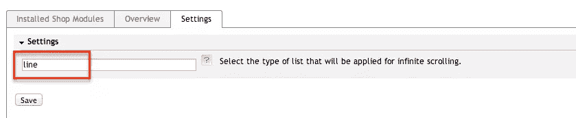

# 为 OXID eShop 构建无限滚动列表-基础

> 原文：<https://www.sitepoint.com/build-infinite-scroll-list-oxid-eshop-basics/>

*OXID eShop* ，正式名称为 **OXID eSales** ，是一个强大且可扩展的电子商务标准平台，针对在线业务的各个领域进行了优化。作为一名开发人员，我的大部分“朝九晚五”工作都是用 OXID 完成的，我发现这个电子商务系统非常容易定制和扩展。

如果你是 OXID 的新手，或者正在为自己的在线业务寻找一个简单而有效的平台，我建议你阅读马修·塞特关于 OXID eSales 的系列文章，该系列文章提出了一个标准实施方案，以开始使用 OXID 系统。

在这个 2 部分的教程中，我们将创建一个新的 OXID 模块扩展，实现对文章列表的无限滚动[](http://www.infinite-scroll.com/)*，而不是传统的分页。在这篇文章中，我试图分享我的个人经验，如果你以后遇到任何 OXID 开发，可能会帮助你加快工作进程。*

 *这里的是你将实现的目标。

[//www.youtube.com/embed/GnEslLfzNa0](//www.youtube.com/embed/GnEslLfzNa0)

完整的源代码将在本系列的最后提供。

#### 教程将涵盖以下领域:

**第一部分:**

*   为新模块扩展创建适当的文件夹结构。
*   与`metadata.php`合作:
    *   扩展必要的控制器。
    *   用新模板替换现有模板。
    *   添加新的模块配置选项。
*   如何使用后端语言文件为模块设置创建显示名称和帮助文本。
*   使用新的模块控制器。

**第二部分:**

*   使用新模板:
    *   如何正确获取模块 URL？
    *   回顾使用 OXID 模板引擎。
    *   为新模板添加内容。
*   添加 JavaScript 来处理文章列表上无限滚动的执行。
*   更新数据库视图并激活模块。

> **注**:我假设你*有一些使用 OXID eShop 的工作经验*(如果没有，参见上面链接的 Matthew 的文章)。因此，对于 OXID 的基本概念就不多解释了。

### OXID 模块文件夹结构

你首先要做的最重要的任务是创建一个标准的文件夹结构。

*   请转到{your_web_root}/oxid/modules/
*   创建一个名为 **aho_infinitescroll** 的新文件夹，后跟其后续文件夹/文件。

```
aho_infinitescroll/
|	
|--- controllers/
|		|-- aho_infinite_alist.php 	# A new controller that extends alist.php
|
|--- out/
|	|--admin/
|		|--en/
|			|-- aho_infinitescroll_lang.php 	# Back-end English text.
|		|--de/
|			|-- aho_infinitescroll_lang.php 	# Back-end Deustch text.
|
|	|--css/
|		|--> infinitescroll.css  	# Style for infinite scrolling elements.
|		
|	|--img/
|		|--> ajax-loader.gif     # image indicates the loading status.
|	|--js/
|
|--- translations/
|		|--de/
|			|--> aho_infinitescroll_lang.php  # Front-end Deustch text.     
|		|--en/ 
|			|--> aho_infinitescroll_lang.php  # Front-end English text.
|
|--- views/
|		|-- page/
|			|-- list/
|				|--> aho_infinitescroll_list.tpl  # new template file.
|	
|--- metadata.php  # Define extension name, classes and other infos. 
|--- picture.jpg   # A thumbnail for the module's functionality.
```

> **注:**
> 命名新模块的最佳实践是将供应商/开发人员/团队的名称和模块的功能结合起来。它有助于即时显示团队协作的新模块的供应商和功能。
> 因此，公式可以如下:
> 
> ***厂商名称*** + ***下划线*** + ***功能***
> 
> *   即:sitepoint_infinitescroll
> 
> 供应商名称可以替换为`developer name`或`group name`。这取决于你。

### 与 Metadata.php 合作

`Metadata.php`对任何模块开发都是必不可少的。该文件提供了关于模块、要扩展的类、要覆盖的块、要替换的模板、前端和后端的设置等的基本细节。

请打开文件`metadata.php`并将以下代码行添加到其中:

```
<?php

$sMetadataVersion = '1.0';  # Define version of this file

// An array to store modules' details
$aModule = array
(
    'id' => 'aho_infinitescroll',
    'title' => '[AHO] Infinite Scrolling List', 
    'description' => 'Infinite Scrolling for article list',
    'thumbnail' => 'picture.jpg',
    'version' => '1.0.0',
    'author' => 'Tuan Anh Ho',
    'url' => '',
    'email' => 'anhhothai@gmail.com'
);
```

*   我们刚刚插入了新模块的基本信息，所有元素都可以用术语进行自我描述。

*   请注意， **`id`** 和 **`title`** 是强制变量。特别是， **`id`** 的值必须与模块的文件夹名相同。

*   **`thumbnail`** 是可视化描述你的模块的可选元素。我通常会准备一个好看的缩略图，因为我相信一张图胜过千言万语。有时，你打算通过 OXID market 出售一些你最喜欢的自主开发模块，一个设计更好的缩略图会吸引更多的买家。

接下来，我们将定义更多的元素，就在`email`之后。

```
'extend' => array(
        'alist' => 'aho_infinitescroll/controllers/aho_infinitescroll_alist'
    ),
    'templates' => array(
        'aho_infinitescroll_list.tpl' 
            => 'aho_infinitescroll/views/page/list/aho_infinitescroll_list.tpl'
    )
```

*   值 **`extend`** 指定新模块将从其扩展的特定核心/控制器类别。本例中为 **`alist.php`** ，位于`/oxid/application/controllers/`。

*   值 **`templates`** 是一个数组，存储新模块的所有注册模板。建议我们为要替换的模板创建相同的文件夹结构，以便于团队协作。请注意，`templates`的项目和值都需要包含文件扩展名`.tpl`

    > **注**:
    > 
    > *   命名新模板的正确方式是" *`module name`* + `_` + `the old template name`"
    > *   即:aho_infinitescroll_list.tpl

我们现在让新的模板文件为空，继续使用文件`metadata.php`。请在项目 **`templates`** 后插入一个名为 **`settings`** 的数组:

```
'settings' => array(
    array(
        'group' => 'aho_infinitescroll',
        'name' => 'sInfiniteScrollListType',
        'type' => 'str',
        'value' => 'line'
    )
)
```

*   值 **`settings`** 是注册新模块所有配置选项的地方。 **`group`** 始终具有与模块 id 相同的值。

*   值:这个新设置有助于管理列表的视图类型。在本教程的范围内，我将设置默认值为 *`line`* ，并一直使用到最后。

*   当我们第一次激活该模块时，该设置被插入到两个表格 *`oxconfig`* 和 *`oxconfigdisplay`* 中。OXID 会自动将值`module:aho_infinitescroll`插入到值为`module:aho_infinitescroll`的 *`OXMODULE`* (表`oxconfig`)和 *`OXCFGMODULE`* (表 oxconfigdisplay)列中。这非常方便，因为它是自动发生的。

您可以跟随[这个扩展元数据的在线文档](http://wiki.oxidforge.org/Features/Extension_metadata_file)来阅读更多关于其他可能的参数。

接下来，我们研究后端翻译。

### 添加后端翻译

在上一节中，我们添加了新模块的设置。现在是时候进行翻译了。
请打开文件`aho_infinitescroll/out/admin/en/aho_infinitescroll_lang.php`并在其中添加以下几行。

```
<?php
$sLangName = 'English'; // English or Deustch

$aLang = array(
    'charset' => 'UTF-8',
    'SHOP_MODULE_GROUP_aho_infinitescroll' => 'Settings', 

    'SHOP_MODULE_sInfiniteScrollListType' => 'Select the type of list that will be applied for infinite scrolling.',

    'HELP_SHOP_MODULE_sInfiniteScrollListType' => 'OXID supports 3 default view types as `line`,`grid` and  `infogrid`. If you define an extra view type, make sure it has been created in your shop directory.'
);
```

*   为配置选项`SHOP_MODULE` + `_` + `setting_column_name`添加翻译的语法。

*   为配置选项`HELP_SHOP_MODULE` + `_` + `setting_colum_name`添加帮助文本的语法。

上述代码行将产生如下图所示的输出。稍后，当您激活模块时，请在文本框中输入`line`:

* * *



* * *

请对文件`aho_infinitescroll/out/admin/de/aho_infinitescroll_lang.php`进行同样的操作。给变量`$sLangName`赋值`Deustch`，让专门研究语言的人把所有文本翻译成德语，或者只是在里面放些胡言乱语，只要不同于英语，你就能看出区别。

### 使用新控制器

请打开`aho_infinitescroll/controllers/aho_infinite_alist.php`并在其中添加以下行:

```
<?php

class aho_infinitescroll_alist extends aho_infinitescroll_alist_parent 
{
    protected $_sThisTemplate = 'aho_infinitescroll_list.tpl';

    /**
     * @Todo: Change the template view
     * @return string
     */
    public function render(){
        parent::render();
        return $this->_sThisTemplate;
    }

    /** @Todo: Get the module option of view type 
     *  @return string
     */
    public function getViewTypeList(){
        return $this->getConfig()->getConfigParam('sInfiniteScrollListType');
    }
}
```

这个新控制器只做几件事:

*   将`$_sThisTemplate`的值改为`aho_infinitescroll.tpl`，我们已经在`metadata.php`中定义了:请注意，我们只需要在这里指定模板名称。因此，模板名称应该是唯一的。它帮助系统快速找到正确的模板。

*   函数`render`什么也不做，只是返回新的模板名。

*   函数`getViewTypeList`将返回在`metadata.php`中定义的数据列`sInfiniteScrollListType`的值。模板`aho_infinitescroll.tpl`将利用这个值来确定哪个视图类型将被应用于文章列表。

*   你可以注意到扩展类的名字是`aho_infinitescroll_alist_parent`。公式为`module controller name` + `_` + `parent`。

#### 找到需要扩展的类的提示

*   你通常需要知道哪些类需要扩展。有一种简单的方法可以找出哪个类正在当前视图中运行。您只需浏览文件`/application/views/{theme_name}/tpl/layout/page.tpl`，并在文件顶部插入以下行:

```
[{$oViewConf->getActiveClassName()}]
```

上面一行帮助打印出当前视图中使用的核心类。如果您想检测执行 Ajax 请求的核心类，您将需要更多的努力来使用 [ChromeDev 工具](https://developer.chrome.com/devtools/index)。

### 结论

到目前为止，我们已经逐步完成了后端实现，以开发新的模块扩展。目前，我们能够激活该模块，以查看我们将在管理控制面板中拥有什么。如果出现任何问题，请随时在这里留下您的评论。我会尽力帮助你。

下一部分将详细介绍基本的前端实现，包括定制模板和添加 JavaScript 来处理无限滚动的工作流。* 

## *分享这篇文章*