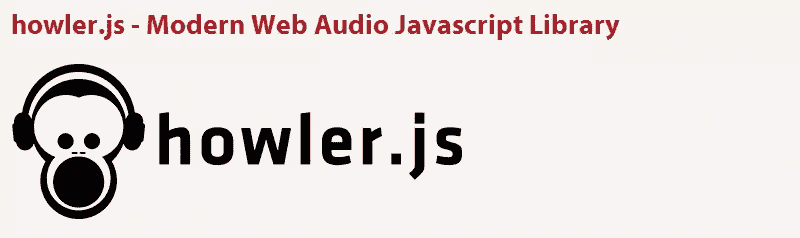
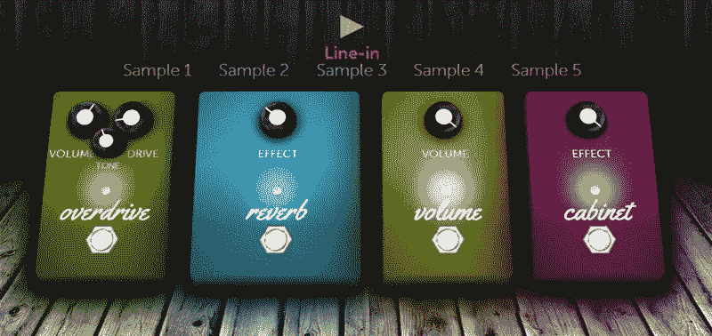
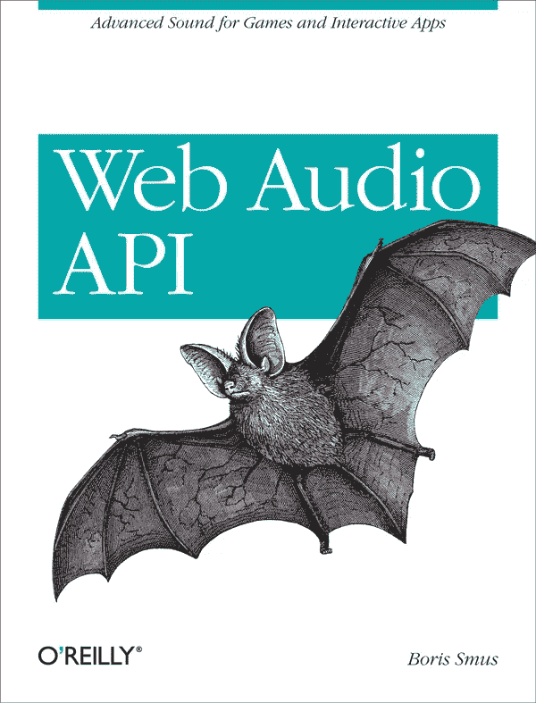
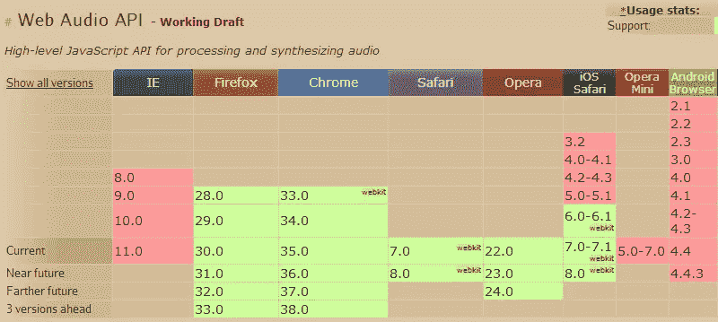

# 5 个用于处理 HTML5 音频的库和 API

> 原文：<https://www.sitepoint.com/5-libraries-html5-audio-api/>

在过去的几个月里，我遇到了许多不同的库，它们利用了相对较新的 [HTML5 音频 API](http://webaudio.github.io/web-audio-api/) ，以及更广为人知的 [HTML5 音频元素](http://www.whatwg.org/specs/web-apps/current-work/multipage/the-video-element.html#the-audio-element)及其更简单的 API。

我想我会在这篇文章中分享一小部分这些库，向你展示如果你选择创建一个需要处理声音文件的游戏或应用程序，有什么可能和你有什么选择。

这些库中包含的一些演示非常好，每个库的代码都非常简洁易用。

## 1.webaudiox.js

[Webaudiox.js](https://github.com/jeromeetienne/webaudiox) 不完全是一个库，而是一组使用 Web Audio API 的助手。它没有依赖性，可以在任何支持网络音频 API 的浏览器中工作。

文档以样板文件的形式提供了一个简单的代码示例，如下所示:

```
// after including the webaudiox library
var context = new AudioContext()

// Create lineOut
var lineOut = new WebAudiox.LineOut(context)

// load a sound and play it immediatly
WebAudiox.loadBuffer(context, 'sound.wav', function(buffer){
    // init AudioBufferSourceNode
    var source  = context.createBufferSource();
    source.buffer = buffer
    source.connect(lineOut.destination)

    // start the sound now
    source.start(0);
});
```

正如在第一个代码注释中所指出的，必须首先包含 webaudiox.js helpers 文件，这样才能工作。

除了它们的语法看起来如何之外，这并没有告诉我们关于这些助手的太多信息。要了解它是如何工作的，请看一下[分析器 2 画布助手](http://jeromeetienne.github.io/webaudiox/examples/analyser2canvas.html)。这个助手利用[分析器节点接口](http://webaudio.github.io/web-audio-api/#the-analysernode-interface)实时显示播放声音的图像。

[](http://jeromeetienne.github.io/webaudiox/examples/analyser2canvas.html)

webaudiox.js GitHub repo 还有许多其他的例子可以尝试。当然，为了让这些演示工作，您的浏览器必须支持 Web 音频 API(稍后会有更多介绍)。这组助手不是多填充的，所以如果您需要旧版本的浏览器支持，这不是一个好的选择，除非您计划将它与另一个脚本或库结合起来，或者某种后备。

在我看来，webaudiox.js 可能是 HTML5 游戏中的一个不错的选择。

## 2.Howler.js

Howler.js 被简单地吹捧为“现代网络的 JavaScript 音频库”，默认为网络音频 API，并退回到 [HTML5 音频](http://www.whatwg.org/specs/web-apps/current-work/#the-audio-element)。

[](https://github.com/goldfire/howler.js)

这个图书馆的特点是广泛的。一些亮点包括:

*   支持多种文件格式，以获得更广泛的浏览器支持
*   网络音频 API 和 HTML5 音频的缓存功能
*   同步多声道回放
*   全局和每个音轨静音/取消静音和音量控制
*   方法链接
*   3KB gzip 压缩，无依赖性

描述该库的官方博客文章包含了许多页面演示，展示了可以做些什么，所以一定要去看看。

为了演示语法，这里有一个叫做“声音精灵”的很酷的例子，在这个例子中，您可以定义单个声音文件中不同声音的位置:

```
var sound = new Howl({
  urls: ['sounds.mp3', 'sounds.ogg'],
  sprite: {
    blast: [0, 1000],
    laser: [2000, 3000],
    winner: [4000, 7500]
  }
});

// shoot the laser!
sound.play('laser');
```

我喜欢这个语法，API 有一个漂亮干净的外观，看起来很容易理解和开始使用。因为这使用了新的 Web 音频 API，并退回到 HTML5 音频，所以浏览器支持很强。

该库的作者将其描述为“非常适合游戏”，但对任何其他与音频相关的网络应用程序来说都一样好。

## 3.Pedalboard.js

与之前讨论的库一样， [Pedalboard.js](http://dashersw.github.io/pedalboard.js/) 也使用 Web Audio API，但这次它用于在声源上创建音频效果，特别关注吉他效果。简而言之，您可以使用这个 API 来创建自己的踏板，通过它可以操纵吉他声音。向您展示此 API 威力的一个很好的例子是 Pedals.io，“云中的吉他效果”:



API 的语法是面向对象的，所以它简洁易用。这里有一个例子:

```
// initialize the stage and get the context
var stage = new pb.Stage();
var ctx = stage.getContext();

// initialize the board and pedals
var board = new pb.Board(ctx);
var od = new pb.stomp.Overdrive(ctx);
var reverb = new pb.stomp.Reverb(ctx);
var vol = new pb.stomp.Volume(ctx);

// add pedals to board
board.addPedals([od, reverb]);
board.addPedalsAt(1, vol);

// tweak pedal settings
od.setDrive(0.7);
od.setLevel(0.7);
reverb.setLevel(0.3);
vol.setLevel(0.2);

// set the board on stage and start playing!
stage.setBoard(board);
```

上面的代码建立在一个“stage”对象上，该对象包含“board”，而“board”又包含能够创建所需效果的“pedals”。

诚然，这不一定是构建游戏或其他应用程序的最有用的库，但我相信通过一些创造性的思维，你可以用它来制作一些很酷的东西。这个库可以在任何支持 Web 音频 API 的浏览器中工作。

顺便说一下，如果你喜欢这个库，你可能还想看看 [Band.js](https://github.com/meenie/band.js) ，这是一个支持节奏、多种乐器、重复部分和复杂拍号的“音乐作曲家”API。

## 4.填料

Wad 表示网络音频工作站(Web Audio DAW ),它被描述为“jQuery for your ears”。这是一个使用网络音频 API 帮助简化音频操作的库。

下面是一个语法示例，它引入了一个使用“方波”合成的钢琴轨道:

```
var piano = new Wad({
    source : 'square', 
    env : {
        attack : .01, 
        decay : .005, 
        sustain : .2, 
        hold : .015, 
        release : .3
    }, 
    filter : {
        type : 'lowpass', 
        frequency : 1200, 
        q : 8.5, 
        env : {
            attack : .2, 
            frequency : 600
        }
    }
})

piano.play({ pitch : 'C5' })
piano.play({ pitch : 'Eb5', filter : { q : 15 } })
piano.play({ pitch : 'F5', env : { release : .2 } })
```

再一次，一个有很多特性的非常干净的 API。你可以用一些其他的例子来测试上面的代码(小军鼓，长笛，hihat 等等)。)在[这个演示页面](http://www.codecur.io/us/songdemo)。

[](http://www.codecur.io/us/songdemo)

功能包括平移、3D 平移、滤镜(如上面的代码所示)、混响、麦克风输入，以及从外部库合并效果的能力。

这个库的一个主要缺陷是它似乎不能在 Firefox 中工作，作者在文档中指出了这一点。

## 5.吹横笛的人

Fifer 是 HTML5 音频 API 的“微库”,在旧浏览器中回退到轻量级 Flash 版本。

语法包括许多简单和可链接的方法来处理游戏或其他应用程序的音频。

该 API 的功能包括:

*   预加载和注册文件
*   使用可选的循环和结束回调播放文件
*   同时停止或静音单个文件或所有文件

下面是一个语法示例:

```
Fifer({ swf : '../Fifer.swf' }).loaded(function(files) {
    console.log('loaded');
    this.bang();
}).onAudioProcess(function(arr) {
    console.log(arr);
}).registerAudio('bang','bang.mp3',true)
```

这个库相当简单明了，所以对于想要在 Fifer 基础上构建更大的东西的项目来说，它可能是一个不错的选择。最大的好处是，如前所述，当网络音频 API 不可用时，它将退回到 Flash。

请注意，该 API 基于 HTML5 音频，而不是 Web 音频 API，因此对 HTML5 和 IE8 的支持可以追溯到 IE9 以及更早的 Flash 回退。

回购有[一个非常简单的例子](https://github.com/f5io/fifer-js/tree/master/example)，可以在这里预览[。没有什么花哨的，只是一个“砰”的声音在 MP3 格式与 SWF 回退。](http://htmlpreview.github.io/?https://github.com/f5io/fifer-js/blob/master/example/index.html)

## 网络音频 API 资源

上面讨论的所有库都允许您使用 Web Audio API 的强大功能和特性，而不必过于深入地研究规范，提供了一个非常干净的 API。

但是，如果你想学习 API 来构建自己的东西，可以看看 Boris Smus 的书 [Web Audio API，可以从 O'Reilly 免费在线获得，也可以购买印刷版或典型的电子版。](http://chimera.labs.oreilly.com/books/1234000001552)

[](http://chimera.labs.oreilly.com/books/1234000001552)

HTML5 Rocks 上也有[这个网络音频介绍](http://www.html5rocks.com/en/tutorials/webaudio/intro/)，MDN 上还有[一个主题为](https://developer.mozilla.org/en-US/docs/Web/API/Web_Audio_API)的文档。

## 浏览器支持

如果你选择的库使用 HTML5 音频，那么到处都有支持[，包括 IE9+](http://caniuse.com/#search=audio%20element) 。但是如果这个库使用 Web Audio API，除了 Fifer，上面所有的库都是这种情况，那么[的支持就不如](http://caniuse.com/#search=web%20audio%20api)了。

[](http://caniuse.com/#search=web%20audio%20api)

一些移动浏览器缺少支持，Safari 需要供应商前缀。然而，最糟糕的消息是，没有任何版本的 IE 支持网络音频 API，甚至没有 IE11。对于 IE 团队来说，这是一个未解决的问题，所以希望这能很快改变。

## 分享这篇文章