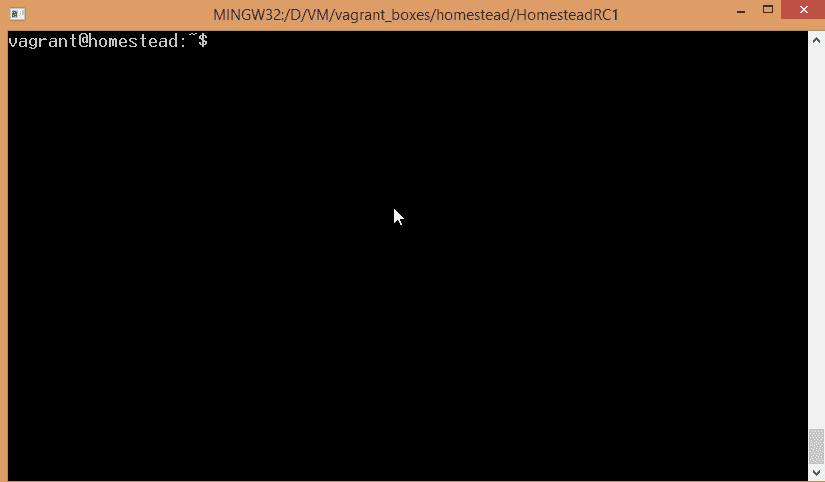
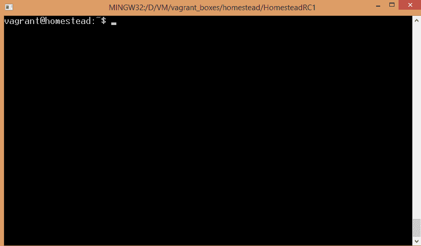
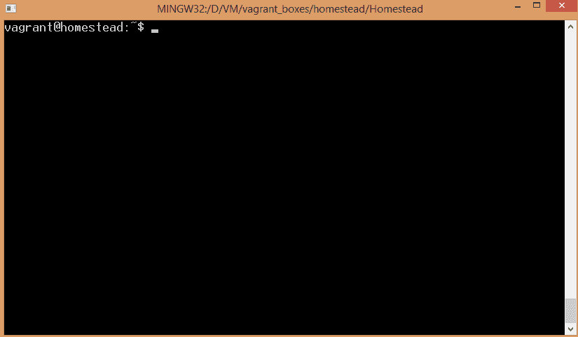
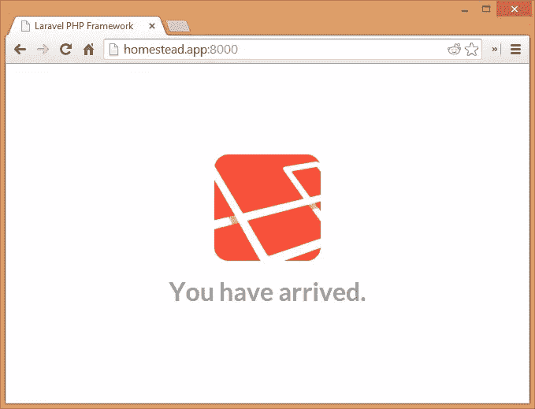

# 用 ApacheBench 对您的 PHP 应用程序进行压力测试

> 原文：<https://www.sitepoint.com/stress-test-php-app-apachebench/>

*本文由[新遗迹](https://docs.newrelic.com/docs/php/new-relic-for-php)赞助。感谢支持 SitePoint 的赞助商！*

没有人知道你的应用程序什么时候可能会立刻吸引一大群访客——可能是在一天中特定时间的特定时刻提交的黑客新闻帖子(因为那里的帖子往往会起作用)，可能是在 Reddit 上发布的特别好的帖子，可能它实际上很好，人们注意到了它，并像病毒一样传播它。不管原因是什么，大量访问者的涌入是一把双刃剑:他们给你带来了你一直想要的东西——一个向大量互联网用户证明你的价值的机会——但也经常带来你一直担心的东西:绝对停机时间。

有几种方法可以尝试并防止这种情况发生——其中最流行的方法是在亚马逊、谷歌应用引擎或 Heroku 等服务上部署您的应用程序，这些服务不仅能够根据您的命令快速扩展和收缩，而且还支持自动扩展，如果您不担心 DDoS 攻击也会在您睡觉时增加您的账单。这些平台通常提供可以优化应用程序的插件，因此您可以在运行过程中对其进行微调，但是为什么不在本地开发的同时尝试并预测问题，从而从长远来看节省您的时间、金钱和精力呢？

### Apache 基准测试

ApacheBench(也称为“ab”，运行它的命令)是一种工具，旨在利用请求和负载测试 web 服务器来攻击端点。它支持大量的参数和选项，您可以调整这些参数和选项来模拟不同的负载，比如请求数量、并发请求数量、额外的头、伪造的 cookies 等等。

ab 通常包含在每个 Apache 安装中，但是如果没有，您可以通过运行`sudo apt-get install apache2-utils`轻松安装它。当前版本的 [Laravel Homestead](https://www.sitepoint.com/6-reasons-move-laravel-homestead/) 没有它，所以如果你正在跟进，请在你`vagrant up`和通过 SSH 连接时将它安装到那个 VM 中。

您可以通过运行`ab`来验证您已经安装了它，这将产生一个支持选项的列表:



在我们的演示中，我在 VM 中的 Code 下创建了一个子文件夹 Laravel，添加了一个名为“public”的子文件夹，并在其中放了一个 index.php 文件，内容如下:

```
<?php

echo "Hello Test";
```

在`homestead.yaml`中，我把这个网站叫做“homestead.app”，在我主机上的`hosts`文件中，我添加了`127.0.0.1 homestead.app`。这允许我通过[http://Homestead . app:8000](http://homestead.app:8000)，从主机的浏览器运行托管在 [Homestead](https://www.sitepoint.com/6-reasons-move-laravel-homestead/) VM 上的站点，所有这些都是我们在之前[讨论过的标准内容。然而，这也允许你从虚拟机内部卷曲`homestead.app`——当用`ab`轰炸我们的应用时，我们可以利用这一点。](https://www.sitepoint.com/6-reasons-move-laravel-homestead/)



### 试运转

首先，让我们试着用一个样品`ab`手榴弹炸我们的`homestead.app`——只需在 URL 上运行`ab`,没有任何选项。注意，你**必须**在 URL 后面加一个斜杠，否则你会从 ab 得到一个无效的 URL 错误。

```
ab homestead.app/
```



我们可以看到基准测试几乎立即完成——每秒的请求数和并发负载太不真实，太简单，无法产生有用的结果。事实上，多次运行该工作台将每秒产生 50 到 200 个可能的请求。为了提供更切实的结果，我们需要提升我们的游戏。

### 演示应用程序

走到 Laravel 文件夹外面，用`rm -rf Laravel`将其完全移除。接下来，我们将创建一个包含所有依赖项的默认示例 Laravel 应用程序。如果您还没有在全球范围内安装 Composer，请[安装](https://getcomposer.org/doc/00-intro.md#globally)，这既简单又快捷。然后，运行以下命令:

```
composer create-project laravel/laravel Laravel  --prefer-dist
```

这将下载 Laravel 框架、所有依赖项，并生成所需的自动加载和锁定文件。您可以通过在您的主机上访问[http://homestead . app:8000](http://homestead.app:8000)，或者在虚拟机中打开`homestead.app`来验证它是否工作:



让我们调整基本的长凳命令，并适当地踩在我们的应用程序的脚趾。运行`ab -n 500 -c 100 homestead.app/`进行更真实的测试。`n` param 表示“请求的数量”，而`c`表示并发性，即一次有多少个请求。因此，该命令将执行 5 批 100 个并发请求。

您在输出末尾得到的默认结果格式将告诉您在给定的时间范围内执行了多少请求(以百分比表示),从 50%到 100 %, 10 乘 10%。换句话说，如果第一行是 50% 3200，这意味着总请求的一半在 3.2 秒内被执行。对于 250 个请求来说，这并不坏，尤其是在这样一台弱机器上。

让我们试着故意放慢节奏。进入`app/controllers/HomeController.php`并将`showWelcome`功能改为:

```
 public  function showWelcome()  {  if  (isset($_GET['slower'])  && $_GET['slower']  ==  'true')  { sleep(1);  }  else  { usleep(1);  }  return  View::make('hello');  }
```

如果你想得到更一致的结果，可以随意删除从`hello.php`对 Google Fonts 的调用，因为这消除了获取字体时的下载延迟，并把一切留在本地的 VM 手中。此外，在`routes.php`文件中，用以下内容替换当前基于闭包的路线:

```
Route::get('/',  'HomeController@showWelcome');
```

现在尝试测试两个不同的 URL:`homestead.app`和`homestead.app?slower=true`。正如所料，你会注意到结果大相径庭。这是一个完全荒谬的例子，但它足以证明当你的访问者蜂拥而至时，一个长脚本会对他们产生什么样的影响。如果您有像这样长时间运行的脚本，最好通过消息队列或其他方式将它们委托给后台，并确保您的面向客户端的脚本尽可能快。

### 结论

在对 ApacheBench 的介绍中，我们看到了脚本效率对巨大流量的影响。我们将会添加更多的教程，但是同时，你应该从这里学到的是——不要低估小的优化。存在过早优化的可能性，但如果您能够更快地检测并移除道路上的巨石，从长远来看，道路将会更加平坦。试用 ab，测试它，切换参数和选项，将数据库连接添加到我们试用的示例 Laravel 应用程序中——破坏它，修复它，再破坏它。让我们知道您的发现–我们很乐意发布您的高级使用案例！

## 分享这篇文章