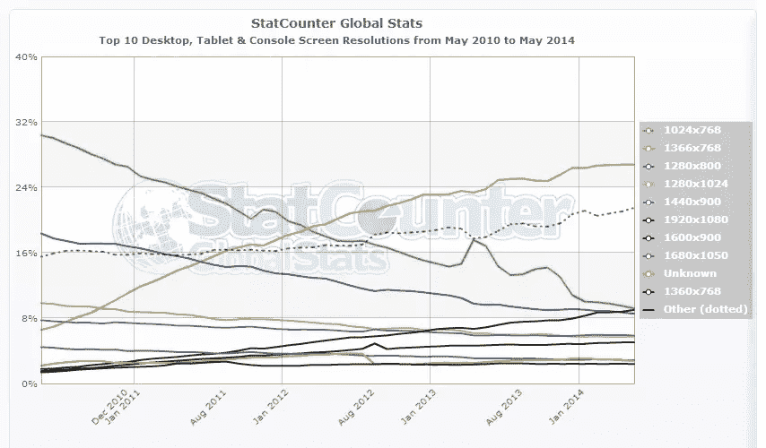

# 网站没有最佳尺寸

> 原文：<https://www.sitepoint.com/best-size-website/>

随着 responsive 几乎成为标准，定义一个网站的最佳大小比以往任何时候都难。在响应式成为主流之前，我们曾经根据当时流行的屏幕尺寸来设计宽度。

这样你就知道了，至少有很大一部分网站的访问者会按照你的意愿来浏览网站。但是随着屏幕变大，我们的网站也变大了。随后是更小的屏幕，因为更小的笔记本电脑越来越受欢迎。

幸运的是，响应式网站解决了很多这种上下跳动的问题，所以你可以让你的网站在大多数屏幕上都很好看。但它仍然没有回答网站的最佳尺寸是多少的问题。是时候做些研究了。

## 一点屏幕尺寸的历史

来源: [Statcounter](https://gs.statcounter.com/#resolution-ww-monthly-201005-201405)

我们先来看看这些年来最流行的一些屏幕尺寸。根据 Statcounter(一个受欢迎的免费游客计数器)提供的数据，直到 2012 年 3 月，1024×768 是最受欢迎的尺寸。当月被 1366×768 超越，至今仍是最流行的。

这两个尺码的区别？1366×768 是具有 16:9 比率的宽屏，而 1024×768 具有更传统的 4:3 比率。这一转变标志着普通台式机显示器向仍然非常流行的宽屏笔记本电脑的转变。

1366×768 的尺寸只适用于 10.1 到 16 英寸的显示屏，但你可以想象它在后者上看起来不会那么漂亮。

所以可以肯定地说，如果您决定使用静态大小，1366×768 是您最安全的选择。也就是说，如果你迎合普通观众。

1920×1080(全高清屏幕)也在增加，尤其是面向技术的观众。这意味着这些人会看到你的 1366×768 的网站，左右两边都有很大的空间。

还有你看到 StatCounter 截图里大大的“其他”一行了吗？有一系列不同的屏幕尺寸可供设计，不属于列出的尺寸类别。这就是反应性发挥作用的地方。

## 有求必应怎么样？

让网站变得有响应性比以往任何时候都更受欢迎。它允许在任何尺寸的屏幕上全幅显示一个设计。调整网站的视图大小是由 CSS 控制的，并且基于访问者使用的设备的视窗。视窗是网站的可见部分，没有滚动条。

安娜丽塔在 SitePoint.com 写了一篇关于响应式设计概念的优秀文章。这里可以看[。](https://www.sitepoint.com/responsive-web-design-tips-and-notes/)

一个普遍的假设是，你可以使用响应式设计让一个网站在任何类型的设备上看起来都不错。这并不完全正确。响应式设计可以确保在浏览网站时，每个设备的最大浏览空间都得到利用。它基本上意味着没有水平滚动条。但这并不意味着它实际上会很好看。

要看一个真实的例子，请看看我的一个使用响应式设计的网站。它使用了一整页的背景图像，我相信在全高清显示器上看起来很棒(我自己也在用)。侧边栏仍然是默认设置。

我使用的 WordPress 主题针对响应进行了优化，这意味着，例如，即使是行动号召“应用”框也可以缩小。

现在重新调整你的浏览器，看看会发生什么。侧边栏被移动到主要内容的下方，因此不再作为侧边栏使用。它们变成了一堆盒子，没有人会花力气向下滚动来看它们。想象一下，如果你有广告放在那里:这将严重减少你的收入。它在手机上看起来更糟糕，太拥挤了，让你的小手机屏幕感觉更小。

虽然我不喜欢内容下面的侧边栏，但我也不希望它们出现在内容之间。我可能有点偏见，因为我真的不喜欢响应式(我决定买一个更大的手机，用桌面尺寸来代替)，但如果你想正确使用侧栏，你必须真正有创意。

你基本上必须接受这样一个事实，你需要在内容中包含你最重要的链接和广告，否则它们可能不会被看到。但你需要非常确定这种设计在桌面或平板电脑上看起来仍然不错(对此你应该禁用 responsive)，因为如果你不留意它，它肯定会弄乱你的布局。

响应式设计更适合那些一开始就不包含边栏的布局。但小屏幕上的空间有限，所以即使有了优化的移动布局，你也需要决定你最想展示的内容。

那么响应式是网站的最佳“尺寸”吗？可能是的，但是当我们都使用相同的屏幕时，生活要容易得多。

请在评论中告诉我你认为网站的最佳尺寸，或者你对响应式设计的总体看法。

## 分享这篇文章