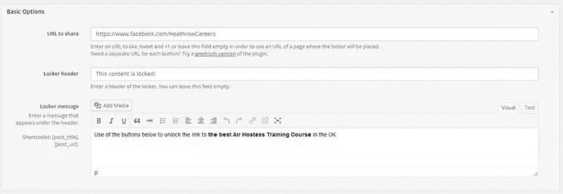
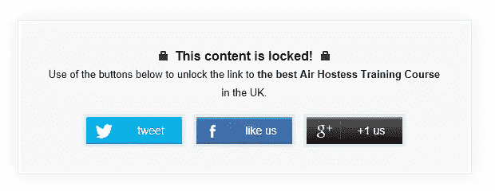
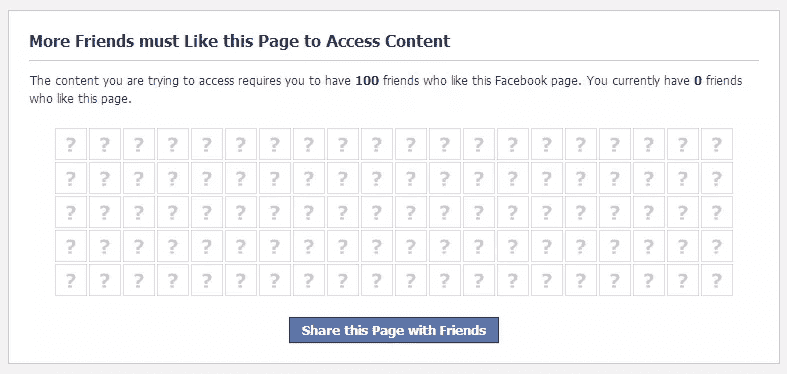
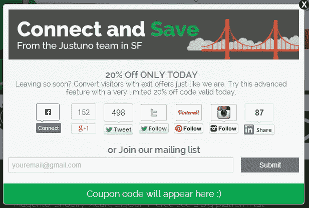
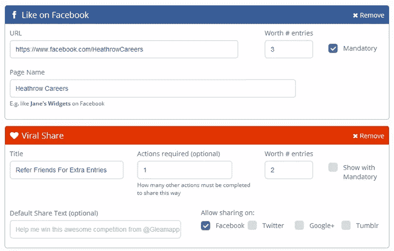
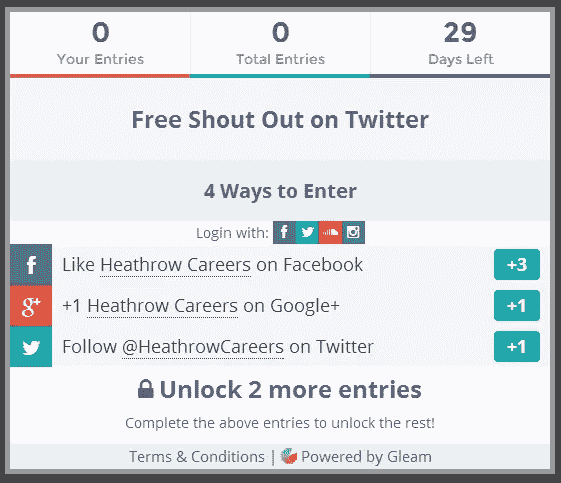
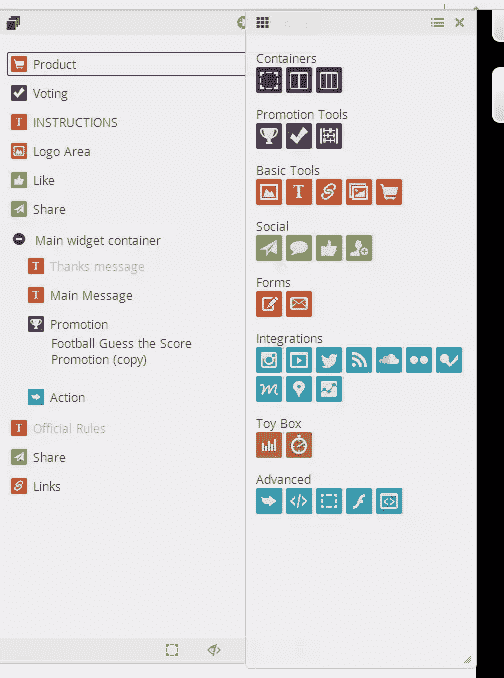

# 在脸书上推广你的网站的五大工具

> 原文：<https://www.sitepoint.com/top-5-tools-promote-your-site-on-facebook/>

在脸书上推广你的网站起初看起来很容易。

说真的，获得几个赞，让人们分享和评论你的帖子能有多难？

那你试试。您添加更多帖子。你发布有趣的图片。你开始关注比你有更多喜欢的人，希望他们也能关注你并分享你的帖子。

渐渐地，你会看到你的赞数在增长，偶尔会有一些评论。你甚至在广告上投入一些钱，并在这个过程中发现喜欢可能很昂贵。

获得喜欢和增加参与度可能是一项艰巨的任务。幸运的是，有很多方法可以自动完成这些任务，所以你可以专注于创新，而不是管理你的脸书账户。

大多数脸书促销活动要么着眼于获得喜欢，要么着眼于提高整体参与度。(参与度包括喜欢、评论和分享，它是脸书决定你的帖子是否“值得”放入粉丝时间表的最重要参数之一。)

为了获得更多的喜欢，你可以在脸书的广告上砸一大笔钱，但有更多有机的方法可以做到这一点。我将向你展示三个工具，它们将帮助你产生喜欢。

说到提高参与度，竞赛是一个很好的工具。脸书对他们的指导方针放松了一些，通过竞赛在脸书上推广你的网站变得更容易了。在这篇文章中，你会发现两个在脸书上开展竞赛的工具。

这些工具中的大多数也可以用来增加 Twitter、Pinterest、Instagram 等网站上的关注者。在这篇文章中，我将把重点放在脸书。

## 增加喜欢

### [社交储物柜](http://wordpress.org/plugins/social-locker/)

让我们从一个简单的内容锁定工具开始。你可能遇到过一些这样的工具，因为它需要输入 like(或 tweet，pin 等)。)来解锁网站上的特定内容。

一些访问者可能会觉得这很烦人，但是如果你有一些有价值的东西要分享，这肯定会获得喜欢。

Social Locker 是一个免费的 WordPress 插件。它允许你设置你的分享网址，并附带一个所见即所得编辑器。

要锁定内容，您只需在帖子中添加一个短代码。您可以锁定页面的特定部分或整个页面。之后，它就简单地工作了。

Social Locker 甚至附带了基本的统计数据。

几分钟内我就获得了几个赞。这是一个非常有效的工具，但是要小心使用，因为它真的会让访问者望而却步，并且会关注你的跳出率。不要在整个网站上使用它；相反，选择一些你知道人们会愿意给你赞的帖子。

### [Woobox](http://woobox.com/)

Woobox 有很多免费工具可以用来增加赞，这些工具都使用了脸书标签。

它给你的一个选择是使用 gate locker，它锁定脸书本身的内容，并要求访问者喜欢你的页面才能继续。例如，您可以提供内容、优惠券或参加抽奖的机会。要打开这些，访问者需要喜欢你的页面。然后 Woobox 发布内容，给他们发送优惠券或让他们参加抽奖。

它还附带了一组方便的统计数据。

Woobox 还有一个很好的功能，如果做得好，可以进行大量的分享。你可以这样设置，在你访问这个页面之前，需要你的朋友的最低点赞数。这样才能真正把朋友变成大使。

Woobox 对这里描述的功能是免费的。

### [秋冬](http://www.justuno.com/)

Justuno 允许您向您的访问者提供优惠券代码，以换取喜欢或分享。要使用它，你需要有一个支持优惠券的电子商务商店。

Justuno 的想法是，访问者总是喜欢优惠券，但你的脸书页面很难获得更多的喜欢。通过在弹出窗口中显示一个方便的优惠，你增加了你的喜欢，并可能吸引游客回来使用优惠券。

您可以设置各种显示时刻，以便随优惠券和行动号召一起弹出。其中还包括“打算离开”，这是一个相对较新的现象，当你看起来要离开时，它会弹出一个窗口。

如果你想看看它的实际效果，只需前往[Justuno.com](http://www.justuno.com/)，等待几秒钟，然后尝试关闭页面。

Justuno 一个月免费 30 赞。

## 内容

### [微光](https://gleam.io/)

虽然上面提到的一些工具提供了竞赛功能，但 Gleam 是一个专门为此而构建的工具。它通过举办比赛或提供优惠券等奖励来运作。

用 Gleam 进行比赛意味着设置不同的方式来收集参赛作品。一个赞可以是一个条目(或者更多，如果你想提供一些额外的激励)，或者你可以要求访问者分享你的页面以便进入。

还可以指定问题让进入者回答，甚至要求他们喜欢多个页面。允许访问者多次进入意味着他们赢得比赛的机会更大，你的页面曝光率也更高。

你可以很容易地将 Gleam 与脸书联系起来，在那里你可以将竞争对手放在一个标签中。Gleam 监控你所有账户的所有活动。

最棒的是，Gleam 对于上面提到的功能是免费的。

这是一个非常专业的工具，可以在瞬间快速设置脸书竞赛，而不必担心不断地监控他们。

### [短桩](http://www.shortstackapp.com/)

ShortStack 是另一个很好的竞赛工具。与 Gleam 不同的是你发起活动的方式。您可以完全控制为每个活动创建的登录页面。

这可能比 Gleam 更耗时，但如果你努力的话，它可以提供更个性化的体验。为了加快速度，你可以使用一系列的模板。

定制相当广泛。除了可以完全控制布局之外，你还可以添加大量的小工具来分享、点赞或调查问卷。

用 ShortStack 做一个好的广告可能会花费你几个小时——和你的设计师喝几杯咖啡——但是如果你很注重细节的话，这是一个很好的工具。所有这些部件都有自己的统计数据。

## 结论

有很多方法可以增加对脸书喜欢和参与。有些需要更多的努力，但它们都表明脸书是一个很好的合作平台。它的 API 允许所有这些类型的工具，你只受到你的想象力的限制(是的，我知道这听起来很老套，但这是真的)。

这些工具中的大多数能做的比我在这里介绍的要多得多，但是它们都是免费的或者提供免费试用。

请在评论中让我知道你喜欢这些工具中的哪一个。我错过你最喜欢的了吗？如果你自己用过这些工具，我很想知道你的结果。

注意:本文是根据当前的指南编写的。在开始比赛之前，请始终关注脸书指南页面。

## 分享这篇文章