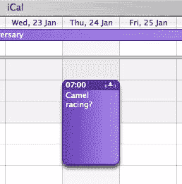

# vcalendar

> 原文：<https://www.sitepoint.com/hcalendar/>

## 描述

hCalendar 微格式在用法和有用性方面最接近于 [hCard](https://reference.sitepoint.com/html/hcard) 。正如您可能希望在各种设备(电话、PDA、台式机或笔记本电脑)和在线服务(基于网络的电子邮件、联系人和日历服务等)之间保持联系人的详细信息最新和同步一样，您可能对日历事件也有同样的感受。与 hCard 一样，日历事件也有一个现有的标准，即 [IETF iCalendar 标准](http://tools.ietf.org/html/rfc2445/)。这一标准是日历应用程序的基础，例如 Google Calendar、Lotus Notes 和 Apple 的 iCal 等等。如果您从日历应用程序中保存这些事件中的一个，并在文本编辑器中查看它，您会非常清楚地看到数据被标记出来。让我们来看看实际情况。我有一个暂定的日期去看看一些骆驼比赛，它出现在苹果的 iCal 中，如下图所示。

我可以将该日历条目拖到我的桌面上(在您的应用程序中，可能是右键单击并选择另存为的情况)，这将创建一个扩展名为. ics 的文件。在文本编辑器中打开该文件会显示以下有点冗长的底层数据:

```
BEGIN:VCALENDAR
VERSION:2.0
X-WR-CALNAME:Camel racing?
PRODID:-//Apple Computer\, Inc//iCal 2.0//EN
X-WR-RELCALID:046F4A00-D853-4F02-BE7B-7DF6B3CD49A7
X-WR-TIMEZONE:Asia/Dubai
CALSCALE:GREGORIAN
METHOD:PUBLISH
BEGIN:VTIMEZONE
TZID:Asia/Dubai
LAST-MODIFIED:20080120T212715Z
BEGIN:STANDARD
DTSTART:19321213T204552
TZOFFSETTO:+0400
TZOFFSETFROM:+0000
TZNAME:GST
END:STANDARD
END:VTIMEZONE
BEGIN:VEVENT
DTSTART;TZID=Asia/Dubai:20080124T070000
DTEND;TZID=Asia/Dubai:20080124T090000
SUMMARY:Camel racing?
UID:64923D95-98E9-47D7-8AD7-94D62F26B499
SEQUENCE:7
DTSTAMP:20080119T171029Z
BEGIN:VALARM
ACTION:AUDIO
TRIGGER:-PT1H30M
X-WR-ALARMUID:2C3DEF4A-4E7E-4FE5-95CF-E86321C9C5AF
ATTACH;VALUE=URI:Basso
END:VALARM
END:VEVENT
END:VCALENDAR

```

相当多的信息是由 iCal 自动生成的，但是您可以使用从上面收集的一些数据项创建一个有效的 hCalendar 条目，即:

*   `summary`，为事件的标题
*   `dtstart`，为开始日期和时间
*   `dtend`，为结束日期和时间
*   `location`，事件将在
    发生的物理位置

您可能还想添加一个`description`，它允许您在简单的`summary`上进行扩展，尽管这并不总是必要的或可取的。要使用 hCalender 标记骆驼比赛事件，您需要用“vcalendar”类将其包装在某种容器中(很可能是一个`[div](https://reference.sitepoint.com/html/div)`，但是您可以使用任何 HTML 元素)。如果这看起来令人困惑，请记住微格式重用现有的命名约定，但是将它们应用于 HTML，因此当我们引用 hCalendar 时，它使用 iCal 中定义的名称进行标记:

```
<div class="*vcalendar*">
 ⋮
</div>

```

一旦以这种方式标记了外部容器，微格式解析器(例如，Tails 或 Operator 扩展)就会期望与 hCard 相关的微格式内容出现在内部。接下来要做的是使用“`vevent`”类名来标识特定事件:

```
<div class="vcalendar">
 <p class="*vevent*">
 ⋮
 </p>
</div>

```

在这一点上，除了上面提到的那些数据之外，您还可以包括许多数据，但是为了这个例子，我们想知道事件是什么，什么时候发生，在哪里发生:

```
<div class="vcalendar">
 <p class="vevent">
 Tentative event:
 <span class="*summary*">Camel Racing</span>
 (<span class="*location*">Dubai</span>),
 Thursday 24th Jan,
 <abbr class="*dtstart*" title="*20080124T0700*">7</abbr> -
 <abbr class="*dtend*" title="*20080124T0900*">9am</abbr>
 </p>
</div>

```

注意时间戳的格式——它使用了`[abbr](https://reference.sitepoint.com/html/abbr)`元素，表明开始`<abbr>`和结束`</abbr>`标签中的内容是某种缩写。因此，对于人类来说，显示的是易于阅读的 9am 时间，但是微格式解析器(也称为机器)需要一个特定的日期/时间戳，它在`abbr`元素的`title`属性中提供，格式为 YYYY-MM-DDTHH:MM，其中 T 是数据和时间部分之间的分隔符。

注意，有一些担心，hCalendar 以这种方式使用`abbr`和`title`的事实实际上使使用辅助设备(如屏幕阅读器)的人更加困难，因为他们可能更喜欢公布`title`属性的内容，而不是`abbr`元素中对人友好的内容。在撰写本文时，关于是否需要一个解决方案——以及它可能采取什么形式——的辩论正在进行中(要更好地了解这个问题，请阅读在 Webstandards.org 的[http://snipurl.com/hcal-access](http://snipurl.com/hcal-access)的[上的帖子),并注意这种格式有可能在 hCalendar 标准的未来版本中发生变化。](http://webstandards.org/)

## 例子

这里有一个用 hCalendar 格式标记的非常基本的事件:

```
<div class="*vcalendar*">
 <p class="*vevent*">
 Tentative event:
 <span class="*summary*">Camel Racing</span>
 (<span class="*location*">Dubai</span>),
 Thursday 24th Jan,
 <abbr class="*dtstart*" title="*2008-01-24T07:00*">7</abbr> -
 <abbr class="*dtend*" title="*2008-01-24T09:00*">9am</abbr>
 </p>
</div>

```

## 使用 hCalendar 有什么好处？

随着 web 的发展，以及在线日历服务和社交软件的使用越来越多，这些服务和软件需要数据共享(或将从中受益匪浅),因此需要一种标准来标记事件的详细信息，使人们能够轻松阅读，同时允许数据在 Web 应用程序之间、桌面应用程序之间和手持设备之间共享和移植。如果您从事在网站中发布任何事件细节的业务，您最好考虑使用 hCalendar 格式来标记它们。

## 分享这篇文章