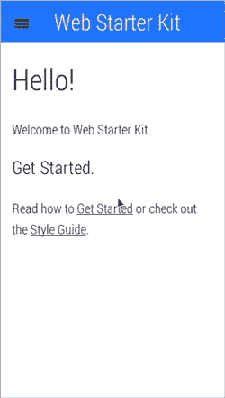
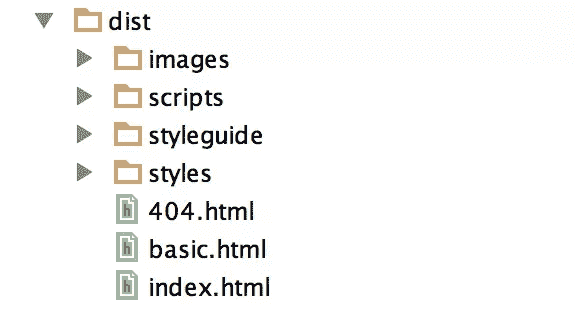
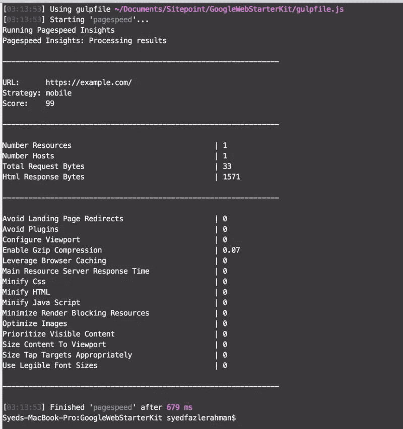

# 谷歌推出网络入门套件:多设备样板和工具包

> 原文：<https://www.sitepoint.com/google-launches-web-starter-kit/>

在旧金山举行的谷歌 I/O 大会前几天，谷歌宣布了一个大惊喜。他们推出了一款名为 [Web Starter Kit](https://developers.google.com/web/starter-kit/) 的全新工具，这是一款带有强大工具的样板文件，可以快速启动你的 Web 开发项目。

也许谷歌希望谷歌 I/O 与会者在活动开始前熟悉一下这个工具。无论是哪种情况，Web Starter Kit 都是一个强大的工具，它包含许多现代的第三方工具，可以帮助您在几分钟内开始编写强大的代码。

Google 之前发布了许多 web 基础教程，展示了现代 web 开发中的一些最佳实践。在这个版本中，他们提供了一组样板模板和工具，这些模板和工具更多地关注性能问题和多屏开发。谷歌似乎填补了当今大多数前端框架长期忽视的空白——web 应用**性能和优化**！

Web Starter Kit 虽然处于测试阶段，但具有以下特性:

*   多设备响应样板文件
*   跨设备同步
*   实时浏览器重新加载
*   代码精简
*   内置 HTTP 服务器
*   PageSpeed 洞察
*   Sass 支持

…以及更多。为了让这个工具包工作，您的系统应该安装 NodeJS、Ruby 和 Ruby Sass Gem。安装[大口](http://gulpjs.com)是可选的。

该工具包还包括一个多屏幕网格系统，灵感来自 Bootstrap 和 Zurb 的 Foundation 等框架。但是与这样的框架不同，这个工具包没有提供任何 UI 元素和组件。谷歌工程师 Addy Osmani [在黑客新闻](https://news.ycombinator.com/item?id=7917469)上表示，他们不打算在 UI 组件方面与 Bootstrap 竞争。

该工具包带有两个基本模板:index.html 和 basic.html。第一个，index.html，是应用程序的默认起点。它包含响应式设计和滑出式导航栏。

第二个模板，basic.html，可以作为一个基本的出发点，没有滑出式菜单。如果你想以此为起点，你必须用 index.html 来代替它。

集成了 Gulp 之后，使用 Google 的 Web Starter Kit 变得更加容易。所有 Gulp 任务都预先配置在根目录下的 gulpfile.js 文件中。在项目文件夹中运行命令`gulp`将生成一个名为`/dist`的发布就绪文件夹。该文件夹包含缩小的 CSS、JS 文件、优化的图像和压缩的 HTML 文件。

运行`gulp serve`会在浏览器中加载应用的构建版本。当您对代码进行任何更改时，它使用实时浏览器重载来刷新浏览器。

Gulp 工具也为 PageSpeed 特性进行了预配置。一旦您开始使用该套件开发应用程序，运行`gulp pagespeed`将显示特定页面的性能得分。

Web Starter Kit 最好的特性之一是开箱即用的 UX 风格的指南。它显示了网格系统的基本字体样式、字体图标和 CSS 类。

对于所有技能水平的开发人员来说，Web Starter Kit 看起来像是一个有前途的样板初学者工具包。检查性能、动态优化和响应性网格系统是它提供的一些最好的特性。

请务必[查看](https://developers.google.com/web/starter-kit/)并让我们知道您的观点。你会在下一个项目中尝试 Google Starter Kit 吗？

## 分享这篇文章