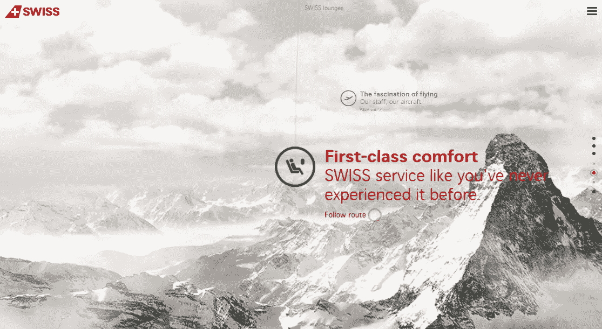
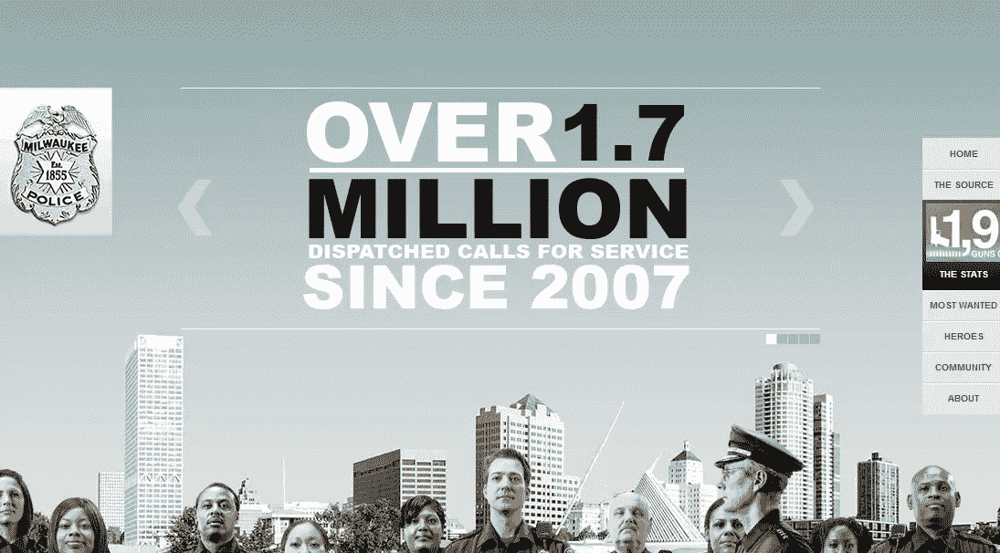
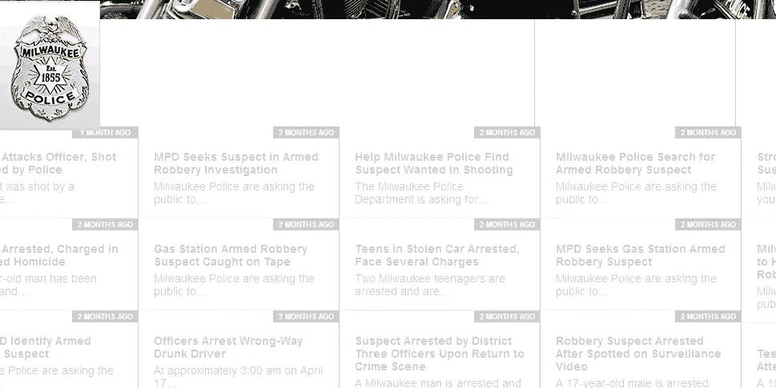
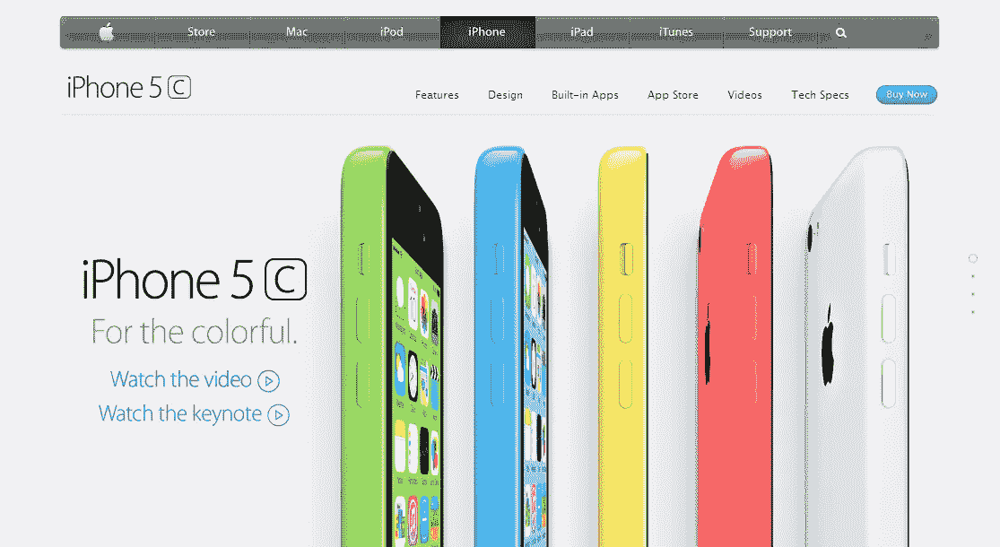

# 劫持和可访问性:我们正在破坏网络吗？

> 原文：<https://www.sitepoint.com/scrolljacking-accessibility/>

大品牌总是引领新的潮流和时尚。一百年前，凯洛格公司想出了向儿童销售他们的谷类食品的主意——这是谷类食品营销中一个以前被忽视的领域——通过在盒子里包含一个[‘奖品’](http://en.wikipedia.org/wiki/Cereal_box_prize)。几乎一夜之间，新的“儿童谷类食品”类别就诞生了。

最近，苹果公司在他们的产品页面上提出了“scrolljacking”的新概念。这种方法“重新连接”了浏览器滚动条的行为，将内容显示为一组幻灯片，而不是传统的垂直移动。

从那以后，尽管有些人对这部有争议的电影表现出了他们的喜爱，但大多数其他人一直持批评态度。

尽管 UX 有很多关于改变长期行为的优点的讨论，但很少关注这种新方法与可访问性的关系。

在本帖中，我们将看看一些采用这种方法的网站，以及使用辅助技术的用户如何访问它们。

可访问性是使网站的功能对所有能力和残疾的用户可用的实践。有视觉、认知和运动障碍的人使用辅助技术(AT)浏览网页。

作为网站开发者，确保我们的网站与这些技术兼容是我们的职责。在本帖中，我们将使用屏幕阅读器 [NVDA](http://www.nvaccess.org/) 并尝试仅通过键盘访问网站。用于此目的的网络浏览器是 Chrome 35。

## [瑞士国际航空](http://www.world-of-swiss.com/en)

瑞士国际网站一开始看起来的确令人印象深刻。它带你踏上云端之旅，让你了解这家航空公司的概况。当你向下滚动时，你会看到该航空公司的不同特征、运营中的机队及其航线。

这个网站有一个“故事弧”,如果你不参与互动，它会主动引导你经历那个故事。

这个网站的第一个问题是所需页面资源的大小(2.7Mb)。如果你的网速不够快，页面没有完全加载，那么 scrolljacking 功能就无法运行。

第二个 UX 问题发生在正常滚动期间。当你使用鼠标向下滚动时，你会被带到不同的方向，这取决于你在“故事”中的位置。

有时这是对着云，有时深入屏幕，有时标题是看世界各地的路线。这种行为并不总是直观的，并且很可能不受用户欢迎。

谈到可访问性，让我们检查不同的问题。对于某些用户来说，滚动速度可能会快一点，这会让人不舒服。

虽然在最右边提供了锚点(可以点击)，但是它们不会被屏幕阅读器读出(因为没有任何`title`文本)。

因为两个问题，通过键盘导航几乎是不可能的。第一，当我在键盘上按 tab 键时没有可见的焦点。其次，与鼠标滚动相比，通过键盘选择的元素不在同一序列中。

以下链接通常会启动制作精美的视频“过场动画”。不幸的是，如果你决定退出其中一个，浏览器的后退按钮是没有帮助的。每张“幻灯片”都是通过 JavaScript 加载的，不会暴露在浏览器的历史 API 中。

不幸的是，如果你使用辅助技术，你将很难浏览这个网站。

## [密尔沃基警方新闻](http://www.milwaukeepolicenews.com/)

密尔沃基警察新闻网站是一个社区网站，提供密尔沃基警察的一般信息。

值得注意的是，它实现了一种侵入性较小的滚动劫持形式，在这种形式下，过渡速度相对较慢，您不必被迫通过轻微的向下滚动来切换幻灯片。

在右侧，提供了锚点，当您通过键盘关注它时，屏幕阅读器会读取这些锚点的正确文本。选择这些项目中的一个会将您带到页面的相应部分，使键盘可以访问整个页面上的信息。

或者，如果您按 tab 键浏览菜单项，您将浏览幻灯片，并且随着键盘焦点的改变，视图端口也会改变。

总的来说，这个网站提供了适当的可访问性特性，如果有一件小事网站管理员能处理好，我会很高兴的。页面的第二部分是通过 AJAX 加载的新闻源列表。它采用水平无限滚动的新闻档案。

如果你通过键盘卡在那里，就没有办法出去。您可能会迷失在新闻档案中，而您的屏幕阅读器只会读出每个焦点项目的“链接”(因为内容是通过 JavaScript 加载的，没有正确的标题)。

总的来说，这个网站让你浏览起来有些困难，如果你没有迷失在新闻档案中，你应该能够浏览它。

## [苹果 iPhone 5C 演示页面](http://www.apple.com/iphone-5c/)

在审查的网站中，苹果的 scrolljacking 实现是最容易访问的。一开始转场速度较低，感觉侵入性较小。锚链接被提供在右边，然而，它们不能被键盘访问，这违背了拥有它们的目的。

顶部链接链接到不同的页面，并且与同一页面的各个部分无关，这可能会让用户感到困惑。您可以通过 tab 键浏览页面的各个部分，当焦点改变时，视窗会自动改变。

总的来说，页面的所有部分都可以通过键盘和屏幕阅读器来访问，尽管某些部分如颜色和大小写的选择可能会让用户感到不舒服。

## scrolljacking 有前途吗？

虽然 scrolljacking 收到了不同的反应，但许多网站至少正在尝试这项新功能。事实上，有 HTML5 模板，如 [Flappster](http://sitediscount.ru/flappster/index3.htm) 用于包含 scrolljacking 的产品演示。如果您使用这些模板，请确保您已经彻底测试了它们中可能破坏您网站的每一个元素。

web 开发人员必须记住的一点是，如果您实现了 scrolljacking，请尽量不要将它们与其他插件混合添加到您的页面中(就像密尔沃基警察新闻网站中的水平无限滚动)。

另一个特性是添加锚点，带有适当的标题文本，以便屏幕阅读器可以在它们被聚焦时读出它们。从可访问性的角度来看，实现 scrolljacking 可以类似于 tab，特别是在定义锚点及其 ARIA 角色方面。

Scrolljacking 本身是一种很难实现的技术，让它变得可访问说起来容易做起来难。正如我们所看到的，许多网民表达了他们对此事的担忧，我相信你应该听取他们的意见，远离此事。

这是一种时尚吗？我怀疑，一旦苹果放弃这一功能，它的支持者也会效仿。

## 分享这篇文章