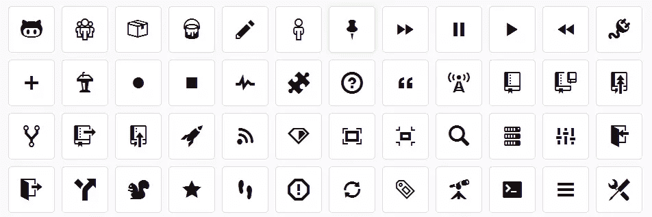

# 本周我们关注的有:RebeccaPurple、动画和更多！

> 原文：<https://www.sitepoint.com/radar-week/>

欢迎来到《在我们的雷达上》,这是一个在不断变化的网络开发世界中引起我们注意的趋势和主题的每周综述。

每周，我们都会收集一些文章和资源，让设计人员和开发人员的生活更加轻松，并帮助您在这个快节奏的行业中保持领先。

## Web 开发

本周我们听说[网络刚刚起步](https://www.sitepoint.com/web-just-getting-started/)，这很有趣，因为网络开发者的角色已经发生了一些[的历史性变化](https://twitter.com/netzzwerg/status/479369943746879488)。我们还了解到 [99%的问题在](https://go.sitepoint.com/t/ViewEmail/y/0CE4A126F74FDF53/D29C97CBF2D74045C35B3650D253B2D9)之前已经解决。

Github 已经发布了一个名为 Octicons 的界面图标集合。我们也有一些提示给你[把你的 Git 技能推向下一个水平](https://www.sitepoint.com/10-tips-git-next-level/)，说到这里，你也可以看看[Git 2.0](https://www.sitepoint.com/whats-new-git-2-0/)的新功能。

也值得:

*   [开始使用 Visual Composer](http://code.tutsplus.com/tutorials/getting-started-with-visual-composer--cms-21410)
*   在 WordPress:高级定制字段中创建一个简单的 CRM
*   [完全内置于 HTML5/Javascript 的 markdown CMS/Wiki](http://dynalon.github.io/mdwiki/#!index.md)

## 半铸钢ˌ钢性铸铁(Cast Semi-Steel)

#663399 rebeccapurple

你们中的一些人可能从 CSS 大师埃里克·迈耶最近的博客文章中了解到，最近发生了毁灭性的消息，[他的女儿失去了与癌症的斗争](http://meyerweb.com/eric/thoughts/2014/06/16/i-love-you-i-miss-you/)。[社区希望通过](http://www.zeldman.com/2014/06/10/the-color-purple/)[用她最喜欢的颜色](http://discourse.specifiction.org/t/name-663399-becca-purple-in-css4-color/225)给她命名来纪念他的损失。埃里克要求把它的名字从贝卡普尔改成丽贝卡紫色，因为她希望六岁时大家都叫她丽贝卡，她做到了。丽贝卡六岁将近十二个小时。丽贝卡紫色是我们都可以得到的东西。

萨斯这个星期也在每个人的脑海里。我们有[一些不同的 Sass 输出风格](http://web-design-weekly.com/2014/06/15/different-sass-output-styles/)，有一些[偏好的 Sass mixins](http://codepen.io/chriscoyier/blog/some-mini-sass-mixins-i-like) 来自 Chris Coiyer，[在 Sass 和 JavaScript 之间共享 JSON】，现在](http://viget.com/extend/sharing-data-between-sass-and-javascript-with-json) [Sass 处于它的第三个修订版](http://blog.sass-lang.com/posts/184094-sass-33-is-released)，我们有关于使用 Sass 映射的[细节。](https://www.sitepoint.com/using-sass-maps/)

同样有趣的是:

*   [静音颜色发生器](http://fifty2project.com/muted/)
*   CSS Shack-一个 Chrome 网络/桌面应用程序，用于创建图层样式
*   [用自定义书签预填充表单](http://css-tricks.com/prefilling-forms-custom-bookmarklet/)
*   [无家可归的字体](http://www.homelessfonts.org/)
*   [现代干净的 CSS“粘页脚”](http://mystrd.at/modern-clean-css-sticky-footer/)

## Java Script 语言

JavaScript 加密是不好的，但是正确使用的话，JS 加密也是有用的。其他人[已经解决了这个问题](https://go.sitepoint.com/t/ViewEmail/y/0CE4A126F74FDF53/D29C97CBF2D74045C35B3650D253B2D9)(如上所述)。这里有一些关于单页面应用认证的详细信息，以及关于如何用 jQuery 构建更好的用户注册页面的信息。

动画也是本周的一个焦点，一个优秀的画布飞行挑战[swoop](http://swooop.playcanvas.com/)，简单的网页动画的[motorcext](http://codevisually.com/motorcortex-js-easy-web-animations/)，快速 UI 动画的 [Velocity](https://www.sitepoint.com/incredibly-fast-ui-animation-using-velocity-js/) ，以及为 CSS 动画提供声明库的 [AniJS](https://www.sitepoint.com/anijs-declarative-handling-library-css-animations/) 。

## 移动的

[指导方针有利于设计师遵循](https://medium.com/@michalacler/hey-designers-theres-a-thing-called-guidelines-94d43d5daf75)。另外，关于[如何做产品评论的好细节](https://medium.com/the-year-of-the-looking-glass/how-to-do-a-product-critique-98b657050638)本周出现。有一些很好的[应用开发资源可以用来学习 iOS 设计和 Xcode](http://designcode.io/learn) ，而[改进汉堡按钮](http://azumbrunnen.me/blog/improving-the-hamburger-button/)绝对是一个好主意。

也很有用:

*   [使用 Parse 为您的 iOS 应用程序创建云后端](https://www.sitepoint.com/creating-cloud-backend-ios-app-using-parse/)

## 进一步阅读

*   [在线编辑设计的变化](https://the-pastry-box-project.net/jason-santa-maria/2014-june-15)
*   [微软推出 IE 开发者频道浏览器](http://www.zdnet.com/microsoft-launches-ie-developer-channel-browser-with-early-next-gen-features-7000030583/)，具备下一代早期功能
*   [开源 101:是什么？](http://code.tutsplus.com/tutorials/open-source-101-what-is-it--cms-21278)

## 再见，下周见

我们希望您喜欢了解最新消息。下周，我的合著者詹姆斯将为您带来更多精彩内容。

与此同时，世界杯仍在进行中，即使对于像我这样对其他事情更感兴趣的人来说,《纽约时报》这篇关于世界球的几何形状的文章也值得一看。

## 分享这篇文章