# 将你的 Git 技能推向下一个层次的 10 个技巧

> 原文：<https://www.sitepoint.com/10-tips-git-next-level/>

最近我们发布了几个教程，让你熟悉 [Git 基础知识](https://www.sitepoint.com/git-for-beginners/)和[在团队环境中使用 Git](https://www.sitepoint.com/getting-started-git-team-environment/)。我们讨论的命令足以帮助开发人员在 Git 世界中生存。在这篇文章中，我们将尝试探索如何有效地管理您的时间，并充分利用 Git 提供的功能。

*注意:本文中的一些命令包括方括号中的部分命令(如`git add -p [file_name]`)。在这些例子中，您将插入必要的数字、标识符等。不带方括号。*

## 1.Git 自动完成

如果您通过命令行运行 Git 命令，那么每次手动输入命令是一项令人厌烦的任务。为此，您可以在几分钟内启用 Git 命令的自动完成。

要获取脚本，请在 Unix 系统中运行以下命令:

```
cd ~
curl https://raw.github.com/git/git/master/contrib/completion/git-completion.bash -o ~/.git-completion.bash
```

接下来，将以下几行添加到您的`~/.bash_profile`文件中:

```
if [ -f ~/.git-completion.bash ]; then
    . ~/.git-completion.bash
fi
```

虽然我之前提到过这一点，但我怎么强调都不为过:如果您想充分利用 Git 的特性，您绝对应该转向命令行界面！

## 2.忽略 Git 中的文件

你是否厌倦了编译后的文件(比如`.pyc`)出现在你的 Git 存储库中？还是你已经厌倦了把它们添加到 Git 中？别再看了，有一种方法可以让 Git 完全忽略某些文件和目录。只需创建一个名为`.gitignore`的文件，并列出您不希望 Git 跟踪的文件和目录。您可以使用感叹号(！).

```
*.pyc
*.exe
my_db_config/

!main.pyc
```

## 3.谁弄乱了我的代码？

出了问题就指责别人，这是人类的自然本能。如果您的生产服务器坏了，很容易找到罪魁祸首——只需做一个`git blame`。这个命令向您显示了文件中每一行的作者、看到该行中最后一次更改的提交以及提交的时间戳。

```
git blame [file_name]
```

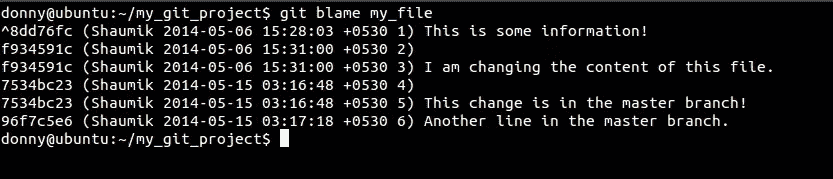

在下面的屏幕截图中，您可以看到该命令在更大的存储库上会是什么样子:

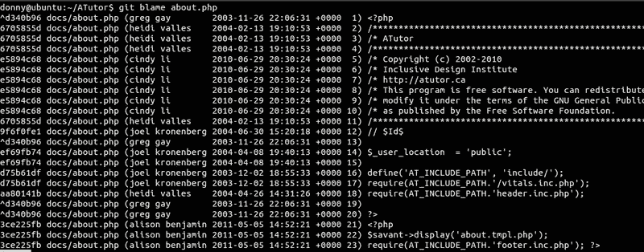

## 4.查看存储库的历史记录

我们在之前的教程中看到了`git log`的用法，但是，有三个选项你应该知道。

*   `--oneline`–将每个提交旁边显示的信息压缩为简化的提交散列和提交消息，全部显示在一行中。
*   `--graph`–该选项在输出的左侧绘制基于文本的历史图形。如果您查看单个分支的历史记录，这是没有用的。
*   `--all`–显示所有分支的历史。

以下是这些选项的组合:

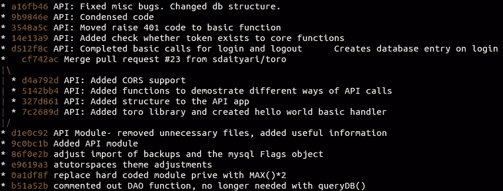

## 5.永远不要忘记提交

假设你犯了一些你不想犯的错误，最后做了一个硬复位来回到你之前的状态。后来，您意识到您在这个过程中丢失了一些其他信息，并且想要取回这些信息，或者至少查看这些信息。这就是`git reflog`可以帮忙的地方。

一个简单的`git log`向您显示最新的提交、其父提交、其父提交的父提交等等。然而，`git reflog`是头部指向的提交列表。请记住，它对于您的系统是本地的；它不是存储库的一部分，也不包含在推送或合并中。

如果我运行`git log`，我会得到提交，这是我的存储库的一部分:

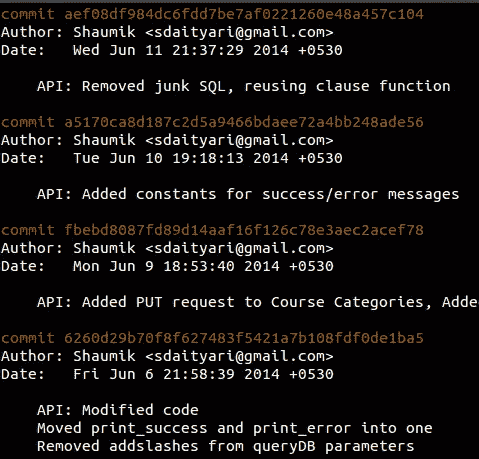

然而，`git reflog`显示了一个提交(`b1b0ee9`–`HEAD@{4}`)，当我进行硬复位时，它丢失了:

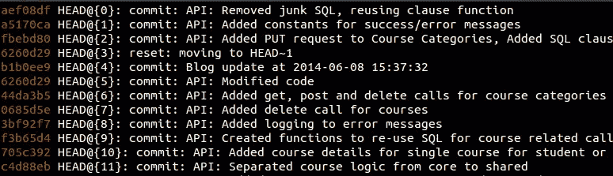

## 6.为提交准备已更改文件的各个部分

进行基于特性的提交通常是一个好的实践，也就是说，每次提交必须代表一个特性或一个 bug 修复。考虑一下，如果您修复了两个 bug，或者在没有提交更改的情况下添加了多个特性，会发生什么。在这种情况下，您可以将更改放在一次提交中。但是有一个更好的方法:单独存放文件并分别提交它们。

假设您对单个文件进行了多次更改，并希望它们出现在单独的提交中。在这种情况下，我们通过在添加命令前加上前缀`-p`来添加文件。

```
git add -p [file_name]
```

让我们试着证明这一点。我在`file_name`中添加了三行，我希望只有第一行和第三行出现在我的提交中。让我们看看一个`git diff`给我们展示了什么。

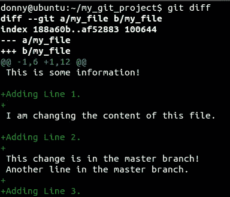

让我们看看当我们给命令`add`加上前缀`-p`时会发生什么。

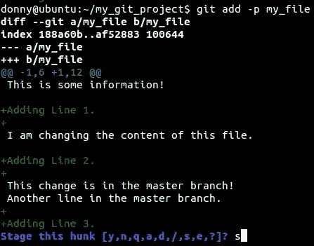

Git 似乎认为所有的变化都是同一个想法的一部分，因此将它组合成一个整体。您有以下选择:

*   输入 y 来展示那个大块头
*   输入 n 不登台该块
*   输入 e 手动编辑块
*   输入 d 退出或转到下一个文件。
*   输入 s 分割大块。

在我们的例子中，我们肯定想把它分成更小的部分，有选择地添加一些，忽略其余的。

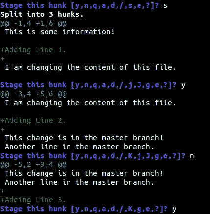

如您所见，我们添加了第一行和第三行，忽略了第二行。然后，您可以查看存储库的状态并提交。

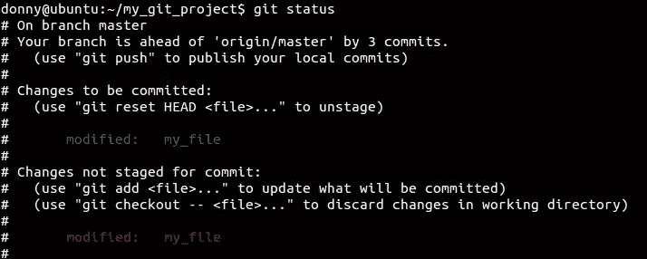

## 7.挤压多个提交

当您提交代码以供审查并创建一个 pull 请求(这在开源项目中经常发生)时，您可能会被要求在代码被接受之前对其进行更改。您进行了更改，但在下一次评估时却被要求再次更改。在你知道之前，你有一些额外的承诺。理想情况下，您可以使用`rebase`命令将它们压缩成一个。

```
git rebase -i HEAD~[number_of_commits]
```

如果您想压缩最后两次提交，您运行的命令如下。

```
git rebase -i HEAD~2
```

运行该命令时，您会看到一个交互式界面，其中列出了提交并询问您要压缩哪些提交。理想情况下，你`pick`最新的提交和`squash`旧的提交。

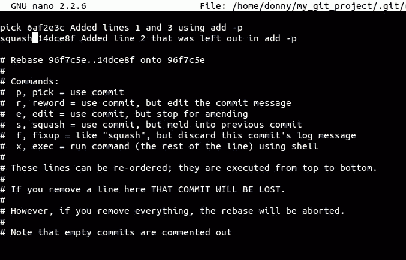

然后要求您为新的提交提供一条提交消息。这个过程实质上重写了您的提交历史。

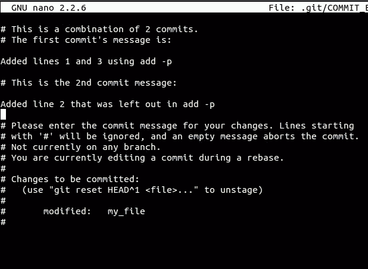

## 8.隐藏未提交的更改

假设您正在处理某个 bug 或某个特性，突然要求您演示您的工作。您当前的工作还没有完成到可以提交的程度，并且您不能在这个阶段进行演示(没有恢复更改)。在这种情况下，`git stash`来救援。Stash 本质上接受你所有的修改，并存储起来以备后用。要保存您的更改，您只需运行以下命令-

```
git stash
```

要检查隐藏列表，可以运行以下命令:

```
git stash list
```


如果您想要取消存储并恢复未提交的更改，您可以应用存储:

```
git stash apply
```

在最后一个屏幕截图中，您可以看到每个贮藏都有一个标识符，一个唯一的编号(尽管在本例中我们只有一个贮藏)。如果您只想应用选择性的存储，您可以将特定的标识符添加到`apply`命令中:

```
git stash apply stash@{2}
```

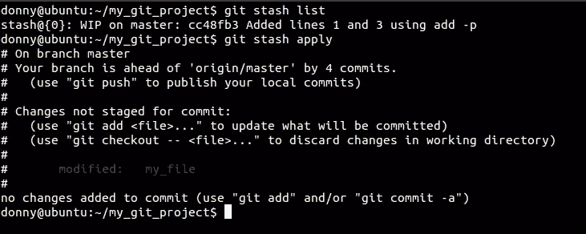

## 9.检查丢失的提交

尽管`reflog`是检查丢失提交的一种方式，但它在大型存储库中并不可行。这时`fsck`(文件系统检查)命令开始发挥作用。

```
git fsck --lost-found
```

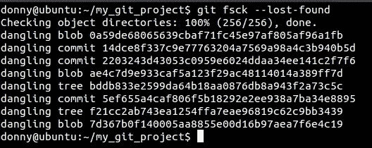

这里您可以看到一个丢失的提交。您可以通过运行`git show [commit_hash]`来检查提交中的更改，或者通过运行`git merge [commit_hash]`来恢复它。

`git fsck`比`reflog`有优势。假设您删除了一个远程分支，然后克隆了存储库。用`fsck`你可以搜索和恢复被删除的远程分支。

## 10.做出最佳选择

我把最优雅的 Git 命令留到了最后。`cherry-pick`命令是迄今为止我最喜欢的 Git 命令，因为它的字面意思和实用性！

用最简单的术语来说，`cherry-pick`就是从不同的分支中挑选一个提交，并将其与您当前的分支合并。如果您在两个或更多的分支上并行工作，您可能会注意到所有分支中都存在一个 bug。如果你在一个分支中解决了它，你可以*挑选*提交到其他分支中，而不会弄乱其他文件或提交。

让我们考虑一个我们可以应用它的场景。我有两个分支，我想将提交`b20fd14: Cleaned junk`到另一个分支中。

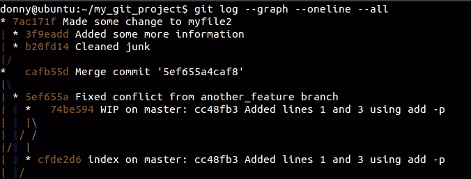

我切换到我想要提交的分支，并运行下面的代码:

```
git cherry-pick [commit_hash]
```

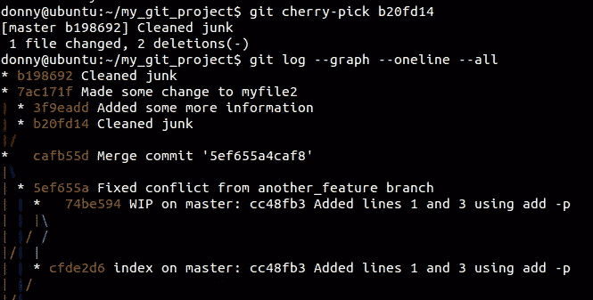

虽然这次我们做得很干净，但是你应该知道这个命令经常会导致冲突，所以要小心使用。

## 结论

至此，我们结束了我认为可以帮助你将 Git 技能提升到一个新水平的技巧列表。Git 是最好的，它可以完成你能想象的任何事情。因此，要经常尝试用 Git 挑战自己。很有可能，你最终会学到新的东西！

## 分享这篇文章