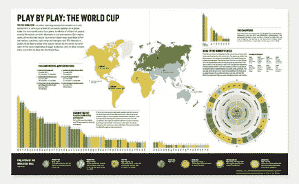
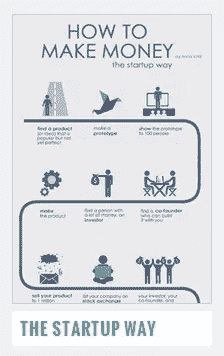
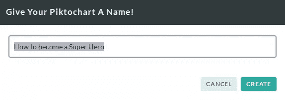
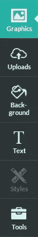
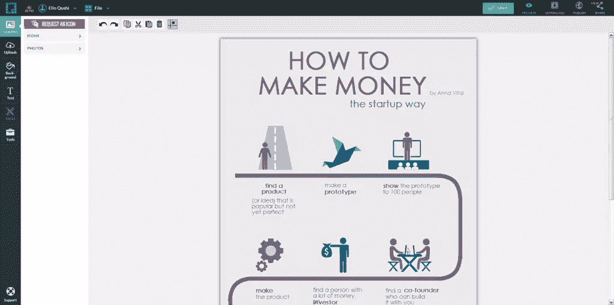
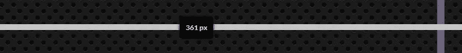
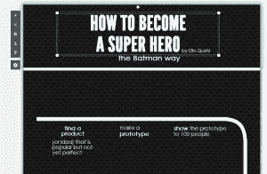
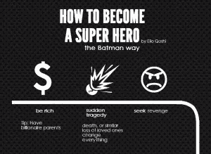
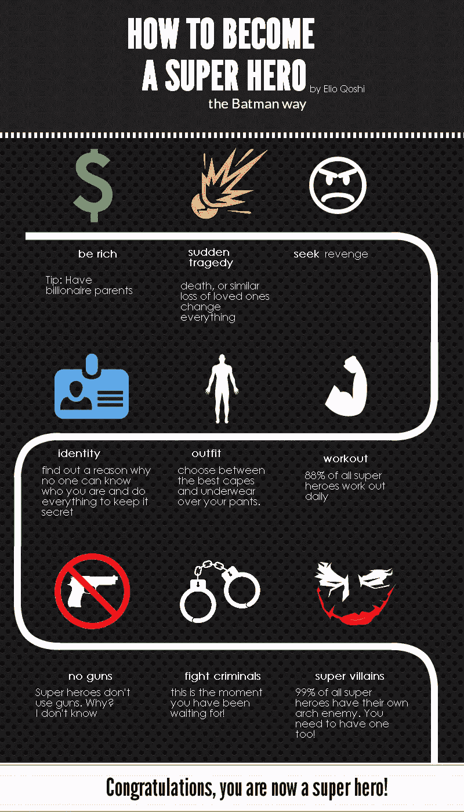

# 如何用 Piktochart 创建漂亮的信息图

> 原文：<https://www.sitepoint.com/create-slick-infographics-with-piktochart/>

UW 设计信息图:逐场比赛——世界杯

我们都喜欢信息图——那些巨大的、彩色的图形旨在将大而复杂的想法提炼为更易消化、更引人注目的视觉故事。

我们在网站和印刷品上遇到它们，它们已经成为每个人的主要武器，从设计师到记者到营销人员到公关公司。

他们都明白，一个精心设计的信息图不仅能改变人心，还能改变购买决策、政府政策，甚至选举结果。

近年来，对信息图表的需求迅速增长，现在整个网站都致力于众包他们的设计。它是一个强大的媒介，可以传递想法，同时保持视觉上的非正式，在某些情况下，甚至可以用健康的幽默传递你的信息。

这可能导致读者吸收他们在其他媒体上可能没有注意到的信息。

然而，使用经典设计工具创建自己的高质量信息图通常非常耗时。对于这种简化的视觉故事来说，通常的设计师工具箱可能“功能过多”。

令人高兴的是，现在已经有一些专门的信息图表制作工具瞄准了这个市场。今天，我们将带他们中的一个——Piktochart——进行一次试驾，看看我们会得到什么样的结果。

Piktochart.com 是一个在线工具，用于创建视觉上吸引人的、完全可定制的信息图表，但仍然简单易用，甚至对于非设计师来说也是如此。

让我们来看看它，并创建我们的第一个信息图。

## 创建您的第一个信息图

Piktochart 提供专业定价计划和免费计划。现在，让我们从免费计划开始。这可以让你完成很多事情，并且你可以在以后决定是否升级。

对于这次试驾，我想我们会有一些乐趣。我给自己设定了一个挑战，制作一个信息图表，解释成为一个真正的超级英雄需要完成的步骤！

创建帐户后，您可以登录(谷歌+或脸书是登录选项)，我们将开始。

### 选择你的主题

您有许多主题和模板可供选择。Piktochart pro 计划目前提供了 500 多个模板，而免费选项提供了一个小得多的子集。在这篇介绍中，我选择了 Anna Vital 的“创业之路”模板。

这是一个极好的模板，可以用来说明一个特别线性的过程的各个步骤。

不要担心颜色或任何特定的图像，我们将改变这一点。

接下来，我们将为我们的信息图文档命名。我把我的名字命名为“如何成为超级英雄”

### 设置您的文档

现在文档视图出现了——这是你创造奇迹的地方！

在左侧，您可以找到用于插入新元素、文本、图形等的核心工具。Piktochart 还允许你上传自己的图片，所以你可能会用到这个特性。

请记住，Piktochart 支持 SVG 上传，所以只要可行，就尽量利用这个选项。

在顶部，您可以找到变换工具，您可以使用它们来变换单个元素，给它们颜色，组合多个元素，并更改它们的样式。

在画布的左侧还有一个文档设置面板，您可以在其中添加、编辑、删除和调整内容块，还可以更改信息图的尺寸。

但是现在，我们将使用默认的尺寸。

当您打开文档时，它应该看起来像这样:

模板编辑器

让我们清理一下，这样就可以进行一些定制了。

删除现有图标，因为它们与我们的目的无关。

### 区块和主要元素

让我们现在分配一个不同的背景。我在这里选择了一个黑色的背景来形成一些漂亮的对比。

Piktochart 信息图是由块组成的，因此您可以根据自己的喜好调整其高度并更改其背景。在这个例子中，我给了所有的方块相同的黑色背景图案。

如果你选择一种图案，你会注意到它会在砖块之间产生接缝。

图案块之间的接缝可能是个问题

要消除这些连接，请通过单击指定块的底部边界来对齐块的高度，并上下拖动它，直到您看到接缝不再明显。

你可能需要尝试几次，但是一旦你掌握了窍门，以后对你来说就很容易了。

*   注意:当块被选中时，你也可以通过点击左边的小齿轮来调整块的大小。352 px 为我工作，没有创造任何块之间的接缝。

一旦你设置好背景，调整不同的元素，使它们符合你的想法。

在这种情况下，我已经使线条沿着画布白色，以便与黑色背景有足够的对比。文本也是如此。

我使用了哥特式专业和联盟哥特式字体，因为它正好适合时尚的蝙蝠侠&哥谭主题。

经过这些小小的修饰，我们应该有了一个很好的起点:

### 添加内容

现在让我们用一些内容来填充它。

在左侧工具栏上，您可以插入预设的图形和图标，也可以上传您自己的图像。

搜索栏会帮你找到想要的图形，在我这里是一个美元符号和一个愤怒的表情符号。我还上传了一个爆炸图标在这里使用(因为我在 Piktochart 库中没有找到)

*   注意:您可以更改从内置 Piktochart 库导入的图标和图形的颜色，但不能对导入的图像进行同样的操作，因此请确保在您使用的外部图像处理程序中为它们提供正确的颜色。

更新文本后，它应该是这样的:

### 调整和添加更多内容

让我们为下一个元素做同样的事情。您可能需要导入图像，因此利用这一点来定制您的信息图。

也要小心线条。它们很难对齐，因为从技术上讲，角是图像，而水平线和垂直线是动态元素。您可以在顶部的变换工具工具栏上调整它们的外观和厚度。

如你所见，它开始成形了:

我注意到它仍然缺乏色彩和变化，所以我改变了一两种背景色，添加了一些线条，并用一些更柔和的颜色来点缀它。

我还在底部添加了一个块，以及一个最终文本。

### 这是最终的结果

最后的结果是:现在，制作一个信息图。或者成为超级英雄..你选择。

## 结论

制作信息图从未如此简单，专业人士会马上找到自己的家，新来的人会在没有太多麻烦的情况下与编辑打交道。

我个人认为它是一个小小的设计玩具盒。感觉非常随意和放松，但又非常有力。

即使有资产限制，免费计划可能会给你足够的东西来完成你的小信息图表的日常需求。如果你需要更多的灵活性和工具，你可以考虑专业计划。

现在，向前迈进，掌握信息图表的艺术。这是值得的。

## 分享这篇文章