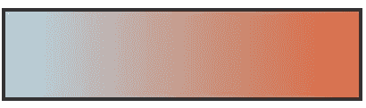
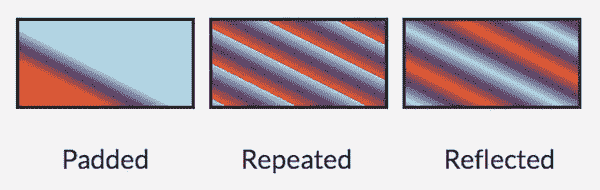

# SVG 渐变入门

> 原文：<https://www.sitepoint.com/getting-started-svg-gradients/>

虽然有许多支持和反对使用 SVG 渐变而不是 CSS 渐变的论点，但对于本文，如果 SVG 渐变恰好最适合您的需求，我们将重点关注如何开始使用 SVG 渐变。

使用 SVG 渐变让我们几乎可以毫不费力地用自定义渐变填充复杂的形状，这比生活在 DOM 中的 CSS 渐变更有优势。例如，当渐变对你的作品至关重要时，这种方法尤其有用。虽然我们的 CSS 样式会不断发展和变化，但我们的核心作品通常会保持不变，所以我们希望这些作品的代码存在于 SVG 本身和 DOM 中。

此外，如果您后来决定要制作渐变动画，也可以将其添加到 SVG 元素中。

## 建立基金会

SVG 提供了两种类型的渐变，线性和径向。线性和径向渐变的细节位于`<defs>`元素中。元素包含可以在整个文档中多次使用的可识别指令；它建立了一个定义，该定义在被调用之前不会显示。在`<defs>`元素中定义渐变元素有助于理解 SVG 内容并增强可访问性。

SVG 使用画图服务器的一般概念，这是一种允许通过在别处找到的资源来定义对象的“填充”或“描边”的方法。渐变是我们用来填充形状和文本的“背景”和“边框”的众多绘画选项之一。

一个非常简单的线性梯度是这样构成的:

```
<svg>
    <defs>
        <linearGradient id="gradientName">
            <stop offset="<%>" stop-color="<color>" />
            <stop offset="<%>" stop-color="<color>" />
        </linearGradient>
    </defs>
</svg>
```

一旦构建了渐变并为其分配了 ID，就可以通过 SVG 中的“填充”和/或“描边”属性来调用它。比如`fill= "url(#gradientName)"`。

## 线性渐变

线性渐变沿直线均匀地改变颜色。梯度由一个轴(方便地称为梯度线)和任何指定的角度来定义。

该行定义的每个点(停止点)将代表`<linearGradient>`元素中的相关颜色。在每个定义的点上，指定的颜色处于 100%饱和度，中间的空间表示从一种颜色到下一种颜色的过渡。颜色分布由一种定义的颜色组成，该颜色垂直于停止点处的渐变线，确保完全覆盖目标形状。

使用额外的颜色停止允许在这条线上的特定时刻使用更多的颜色，我们将在下面的部分中进一步讨论。

让我们来看一下 SVG 代码，它是一个简单的带有两个色标的线性渐变，然后浏览一下可用的属性选项。



```
<svg>
    <defs>
        <linearGradient id="Gradient-1"
             x1="0" y1="0" x2="100%" y2="0">
            <stop offset="0%" stop-color="lightblue" />
            <stop offset="100%" stop-color="#ef5b2b" />
        </linearGradient>
    </defs>
    <rect x="450" y="10" width="200" height="100" fill= "url(#Gradient-1)"                          stroke="#333333" stroke-width="4px" />
</svg>
```

## 线性渐变属性

如上所述，渐变细节是在一个`<linearGradient>`元素中定义的。在这个元素中，我们可以使用许多属性进行进一步的定制。

### 身份证明

渐变元素需要唯一的 id，以便它们可以被分配来填充我们的 SVG 形状或文本。

### x1，y1，x2，y2

x1、y1、x2 和 y2 属性值表示渐变停止点(颜色变化)映射到的起点和终点。这些百分比将沿着适当的轴分别映射梯度。如果未指定，这些值默认为“0”，除了 x2 值默认为 100%；如果它们都默认为“0 ”,它将无处可去！

在这些 x 和 y 值中，我们可以定义我们是否希望我们的渐变完全水平或垂直，或者在一个特定的角度。例如，y 值“100%”和 x 值“0”将产生水平渐变，反之将产生垂直渐变。将这两个值都设置为“100%”(或 0 以外的任何值)将渲染成角度渐变。

### 梯度单位

gradientUnits 属性定义 x1，x2，y1，y2 值的坐标系。这里的两个值选项是“userSpaceOnUse”或“objectBoundingBox”。`userSpaceOnUse`以绝对单位设置渐变协调系统，而`objectBoundingBox`在 SVG 形状本身的边界内建立该系统。

如果未指定，该属性的值默认为`objectBoundingBox`。

### 传播方法

`spreadMethod`属性的值指定如果渐变在目标(SVG)的边界内开始或结束，渐变将如何在形状中展开。基本上，如果渐变设置为不填充形状，它应该如何覆盖空白区域呢？这里有三个选项:`pad`、`repeat`或`reflect`。

值`pad`指示渐变的第一个和最后一个颜色在未覆盖的目标区域的剩余部分展开。值`repeat`指示渐变从开始连续重复该模式，直到填充整个目标区域。`reflect`的值将反映从开始到结束、从结束到开始连续交替的渐变模式，直到目标被填充。

如果未指定，该值默认为“pad”。

下图显示了不同的`spreadMethod`值如何在视觉上影响相同的渐变。需要再次注意的是，这些属性值对已经设置为填充整个目标的渐变没有影响(这是它的默认操作)。

下面渐变的起点和终点是:`x1="20%" y1="30%" x2="40%" y2="80%"`。



### 梯度变换

属性是可选的，它允许我们在应用渐变之前对其进行进一步的转换，就像 CSS 转换一样。

### xlink:href

在这个属性中，你可以调用这个渐变应该“继承”的另一个渐变的 ID。在上面的`speadMethod`图中，有三个矩形。这些矩形都调用相同的指定渐变颜色停止点，但也调用不同的一组`spreadMethod`值，这些值在附加的`<linearGradient>`元素中有一个特殊的 ID。

下面是这些渐变的代码:

```
<defs>
    <linearGradient id="Gradient-1"
    x1="20%" y1="30%" x2="40%" y2="80%">
        <stop offset="0%" stop-color= "#1cb98f" />
        <stop offset="50%" stop-color= "#f99450" />
        <stop offset="100%" stop-color= "#876fc3" />
    </linearGradient>

    <linearGradient id="pad" 
                    xlink:href="#Gradient-1" 
                    spreadMethod="pad" />

    <linearGradient id="repeat"
                    xlink:href="#Gradient-1"
                    spreadMethod="repeat" />

    <linearGradient id="reflect"
                    xlink:href="#Gradient-1"
                    spreadMethod="reflect" />
</defs>
```

每个矩形调用特定的 id，并更改了`spreadMethod`，所有这些 id 都继承了在“#Gradient-1”中定义的相同色标。

下面是如何在三个不同的矩形中调用这些渐变:

```
<rect x="10" y="10"
      width="200" height="100"
      fill= "url(#pad)"
      stroke="#333333"
      stroke-width="4px" />

<rect x="230" y="10"
      width="200" height="100"
      fill= "url(#repeat)"
      stroke="#333333"
      stroke-width="4px" />

<rect x="450" y="10"
      width="200" height="100"
      fill= "url(#reflect)"
      stroke="#333333"
      stroke-width="4px" />
```

## 停止节点

现在我们已经对`<linearGradient>`属性有了基本的了解，我们可以继续讨论好的东西，即`<stop>`节点中的属性。

渐变的色标在`<linearGradient>`元素中定义。在某一点上我们想看到什么颜色？这里有三个属性选项:偏移，停止颜色，停止不透明度。停止偏移告诉渐变在什么点分配相关的停止颜色。您还可以包含一个停止不透明度值，该值将设置停止点颜色的不透明度。

```
<defs>
    <linearGradient id="Gradient-2">
        <stop offset="0%"
              stop-color="purple"
              stop-opacity=".3" />
        <stop offset="100%"
              stop-color="blue"
              stop-opacity=".5" />
    </linearGradient>
</defs>
```

然后，基于其 ID，使用`<svg>`元素中的“填充”或“描边”属性调用完成的渐变。比如`fill= "url(#Gradient-2)"`。

## 更多线性渐变示例

让我们来看几个演示来把这一切结合起来。

对于“Apple”文本演示，在我们的`<svg>`元素中有一个`<text>`元素。渐变定义位于`<svg>`内的`<defs>`元素中。

参见 [CodePen](http://codepen.io) 上 SitePoint ( [@SitePoint](http://codepen.io/SitePoint) )的笔 [SVG 线性渐变示例](http://codepen.io/SitePoint/pen/nCeiJ/)。