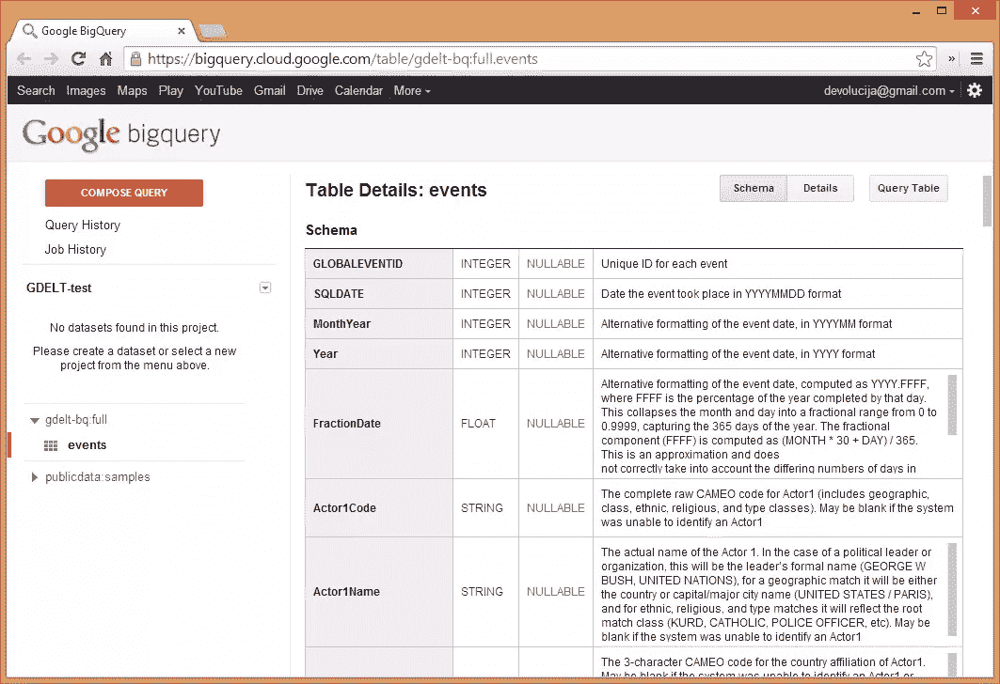
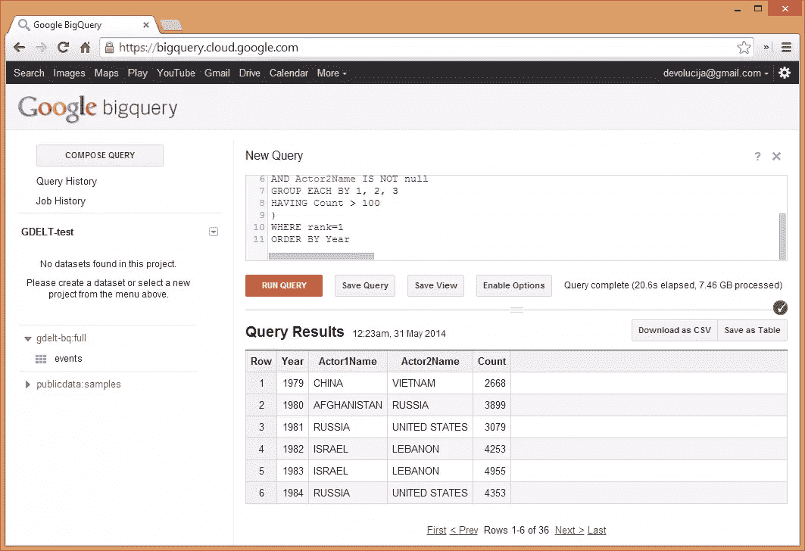

# Google 的 BigQuery 提供了对 GDELT 的免费访问

> 原文：<https://www.sitepoint.com/googles-bigquery-provides-free-access-gdelt/>

> 整个 2.5 亿条记录的 GDELT 事件数据库现在可以在 Google BigQuery 中作为公共数据集使用。

这是[发布帖](http://googlecloudplatform.blogspot.com/2014/05/worlds-largest-event-dataset-now-publicly-available-in-google-bigquery.html)最上面的一句话，真的是大事。

## GDELT

全球事件、语言和语调数据库是地球上最大的数据集之一。它是人类社会的定量数据库，依赖于自 1979 年以来来自全球各个角落的数以千计的新闻来源。

这个想法是由 Kalev Leetaru 提出的，他也是上面提到的谷歌发布文章的作者。GDELT 覆盖了全球所有国家，跨越了三分之一个世纪，在此期间每天都有更新。上亿条记录，每条记录都有 59 个字段，详细叙述了演员和发生的事件。每张唱片都有地理参考，所以你可以在全球范围内放置它，所有演员都有适当的种族和宗教归属。所有这些都是免费的，可供你阅读，你甚至不需要有计算能力来处理它。

Google BigQuery，“Google 强大的基于云的分析数据库服务”基本上是世界上最快的 SQL 引擎，它对 GDELT 的任何和所有使用都是完全免费的。由于 BigQuery 的强大功能，您可以接近实时地获得 GDELT 查询的结果，并且您能想到的任何字段和值的排列都不足以使它陷入停顿——除非您真的把事情搞砸了，违背了自己的意愿。如果你在任何方面与数据库打交道，并且下面的段落没有让你感到不寒而栗，那么你可能已经死了:

> 对我们来说，在 BigQuery 中使用 GDELT 最具突破性的部分是，它不仅为快速复杂的数据查询和提取打开了大门，而且首次允许完全在数据库中运行真实世界的分析。想象一下，在过去的 35 年里，按月计算世界上最重大的冲突互动，或者对一组国家之间不同类别的关系执行交叉选项卡关联。这种查询可以完全在 BigQuery 中运行，并且只需几秒钟就可以返回结果。这使您能够近乎实时地尝试全球范围趋势的“假设”假设。

目前，BigQuery 上的 GDELT 每天更新，但是有计划转向接近实时的更新时间表——每 15 分钟更新一次数据集。

在你变得太兴奋之前——这里有一个极限，但它不是一个你会轻易达到的限额。要了解更多关于免费配额的信息，请点击[这里](https://developers.google.com/bigquery/quota-policy)并记住，如果你真的在这些数据的基础上开发了一个商业上可行的应用程序，你总是可以支付更多的费用。

### 运行示例查询

您可以通过访问[这个 URL](https://bigquery.cloud.google.com/table/gdelt-bq:full.events) 开始在 BigQuery 上使用 GDELT 如果您还没有一个项目，您可能需要创建一个新项目。获得访问权限后，您应该会看到类似于以下内容的屏幕:

要从发布文章中运行示例查询，请单击红色的“编写查询”按钮，将 SQL 粘贴到新打开的 textarea 中，然后单击“运行查询”。我的用了 20 秒，你的可能用了 5 到 30 秒，但是你应该得到一个和这个差不多的结果:

### 在 PHP 中使用它

要了解如何使用 BigQuery 和 PHP，请关注 SitePoint 上针对这种特定组合的文章——它们将于 6 月发布。现在，你可以看看这个优秀的 [Lever.rs post](http://leve.rs/blog/using-google-big-query-in-php/) post，它以一种非常平易近人的方式贯穿其中。

简而言之，你需要使用谷歌提供的 [PHP 库](https://github.com/google/google-api-php-client)和[用 Composer](https://developers.google.com/api-client-library/php/start/installation) 或通过其他方式安装。完成后，您需要像平常一样通过 Composer 的自动加载文件将 lib 包含在项目中，然后您就可以开始使用 API 了。

关于如何开始、获取 API 密钥以及深入使用 Google APIs 访问 BigQuery 和类似服务的完整介绍，请参见[本指南](https://developers.google.com/api-client-library/php/start/get_started)。你也可以 RSS 订阅[谷歌应用引擎](https://www.sitepoint.com/google-app-engine-php-getting-started/)标签，你会立即收到该类别中的新帖子的通知。

## 结论

GDELT 项目长期以来一直是一个令人钦佩的项目，但其 BigQuery 版本的出现标志着一个新的里程碑——前所未有的对公众的普遍可用性。每个人现在都有能力查询世界历史，我们迫不及待地想看看你构建了什么——根据作者卡列夫的判断，GDELT 团队也不能。他们邀请你与他们分享你的疑问和实验，如果足够令人印象深刻，他们可能会在 T2 官方博客上与世界分享。如果你有什么惊人的发现，请告诉我们——我们很乐意发布相关的教程和分析！

## 分享这篇文章