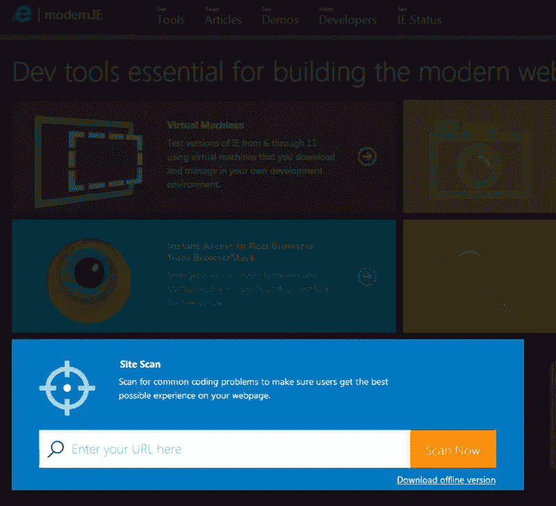
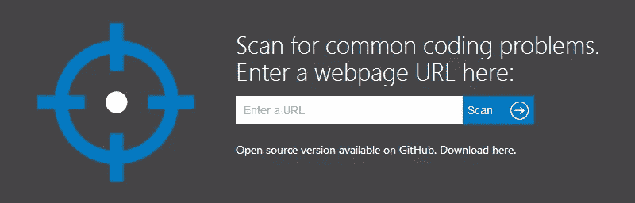
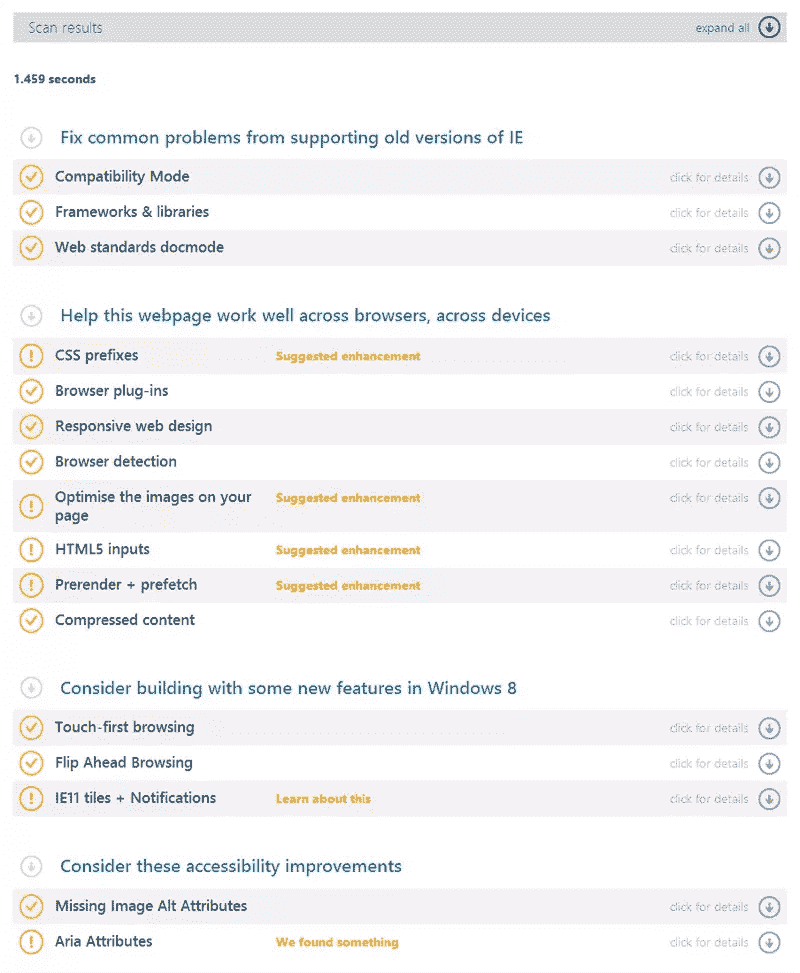
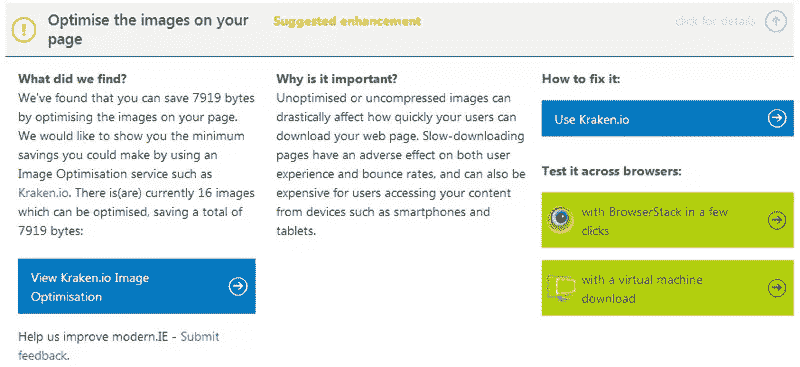
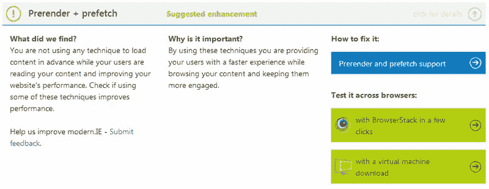
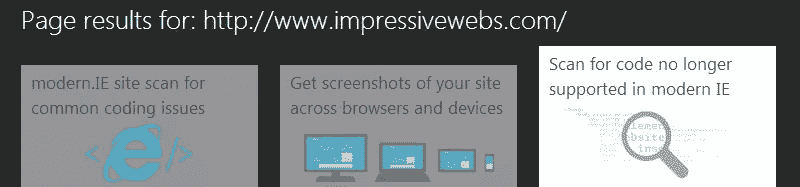
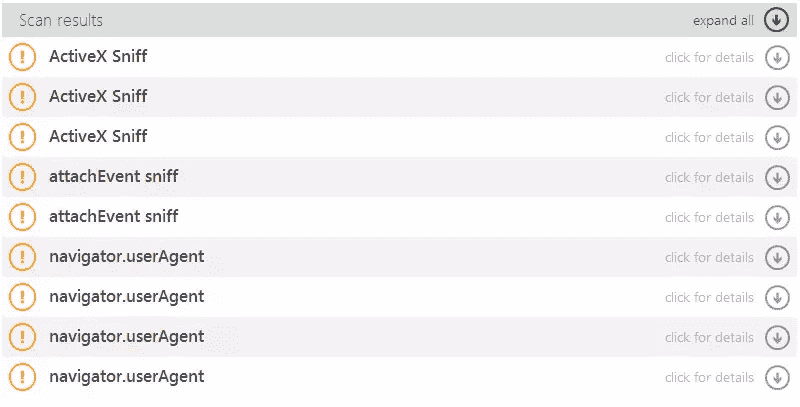
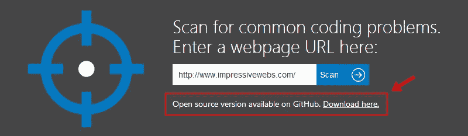

# 使用现代的。IE 识别常见的编码问题

> 原文：<https://www.sitepoint.com/using-modern-ie-identify-common-coding-problems/>

*本文由 [modern 赞助。即](http://modern.ie/)。感谢您对使 SitePoint 成为可能的赞助商的支持！*

到现在为止，你们中的许多人可能对现代很熟悉。IE 和它提供的许多测试工具。该项目的一个鲜为人知的特点是网站扫描功能，根据现代。IE 团队，允许你扫描你的网站“常见的编码问题，以确保用户获得最好的体验”。

你一定会想看看这个工具，在这篇文章中，我将详细描述它的功能。

您可以通过在 modern 上的相应字段中输入 URL 来访问该工具。IE 主页，下面突出显示:

或者转到[浏览器测试报告](http://modern.ie/en-gb/report)页面，这是站点扫描功能的主页，您可以在这里看到扫描结果:

对于这篇文章，我将使用我自己的网站，[印象深刻的网站](http://www.impressivewebs.com/)。我几乎两年没有重新设计或重新编码它了，它是一个 WordPress 网站，所以我认为它是一个很好的候选，可以让我们看到一些有趣的结果。

输入我的 URL 并允许扫描后，我得到了下图所示的结果。你可以直接进入我的结果页面[这里](http://modern.ie/en-gb/report#http%3A%2F%2Fwww.impressivewebs.com%2F)，这将允许你在各种选项之间打转。

如您所见，结果分为四个主要部分:

*   支持旧版本 IE 的常见问题
*   跨浏览器和跨设备问题
*   Windows 8 中的新功能
*   无障碍改进

好的一面是，即使对于你的网站通过测试的部分，也有一个扫描内容的描述，以及一个绿色的复选标记。扫描仪发现的没有通过测试的内容会用一个橙色的感叹号表示，并给出一些如何改进的建议。

让我们检查几个在我的站点扫描中失败的。首先，你会注意到我的网站可以在图像优化方面做一些改进:

该测试告诉我通过正确优化我的图像我可以节省多少字节，为什么这很重要，甚至提供了一个第三方工具，我可以考虑在这方面提供帮助。

该报告提供的另一个建议是，我使用 IE11 等现代浏览器中可用的 [prerender + prefetch](http://msdn.microsoft.com/en-gb/library/ie/dn265039(v=vs.85).aspx) 功能来提高网站的感知速度，从而增强用户体验:

简而言之，使用带有`rel="prerender"`特性的`<link>`标签允许你预加载整个网页，而`rel="prefetch"`允许你预加载特定的资源。

正如您所看到的，这份测试报告不仅仅是一个普通的验证程序，而是一个高级的站点扫描，它提供了前沿的建议来帮助您使您的应用程序更加有效。嘿，你甚至可能被介绍给一些你以前没有听说过或尝试过的功能(就像我看到 prerender 和 prefetch 一样)。

## Compat 检查员

另一份测试报告显示。IE 提供了一种叫做“扫描现代 IE 不再支持的代码”的东西，它使用了一种叫做 [Compat Inspector](http://ie.microsoft.com/testdrive/HTML5/CompatInspector/Default.html) 的东西:

在我的网站上运行该扫描仪产生了以下结果:

据我所知，所有这些都是关于浏览器嗅探技术的警告，我不应该使用。在我的例子中，所有的例子都在第三方脚本中，所以没什么大不了的。对于给出的每个警告，与站点扫描报告一样，您可以选择深入查看有关该特定问题的更多信息，以及如何修复该问题的建议。

## 脱机使用报告

最后，站点扫描工具的另一个伟大特性是它是开源的，可以从 GitHub 上下载:

这允许您获取该工具，将其安装在本地，并在您的本地网站上离线运行测试。

除了通常的验证、林挺和其他可能已经成为开发路线图一部分的过程之外，站点扫描和 Compat Inspector 特性是可以考虑添加到您的测试工作流程中的很好的选项。

## 分享这篇文章