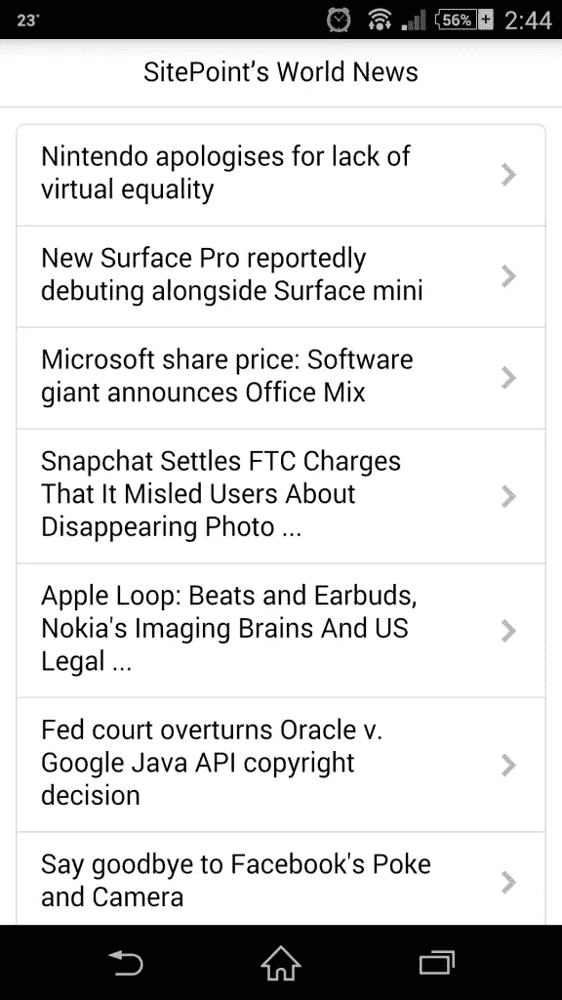
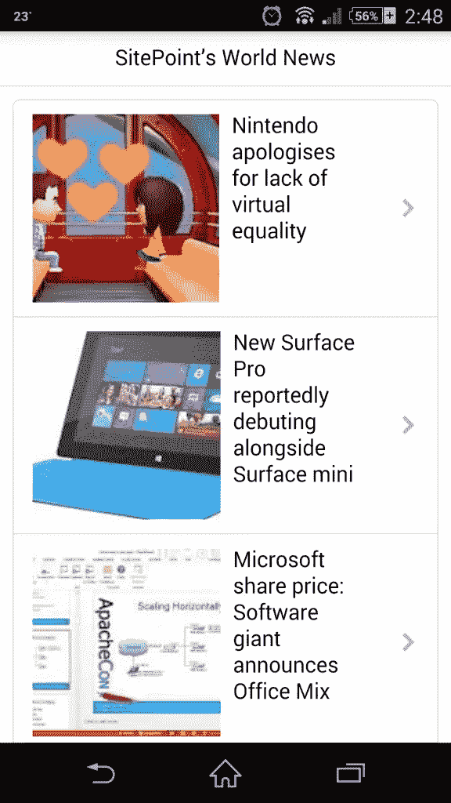
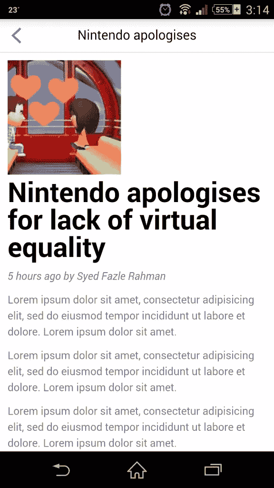
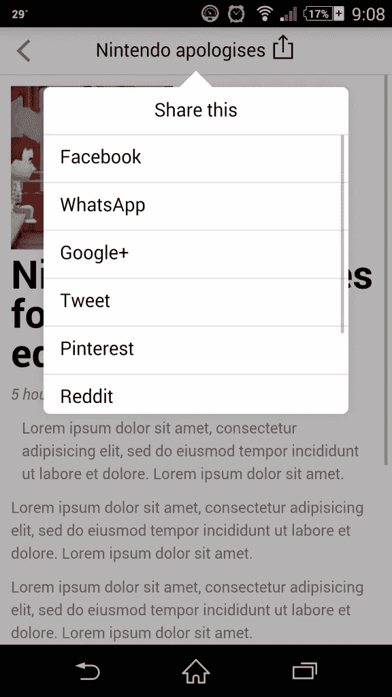
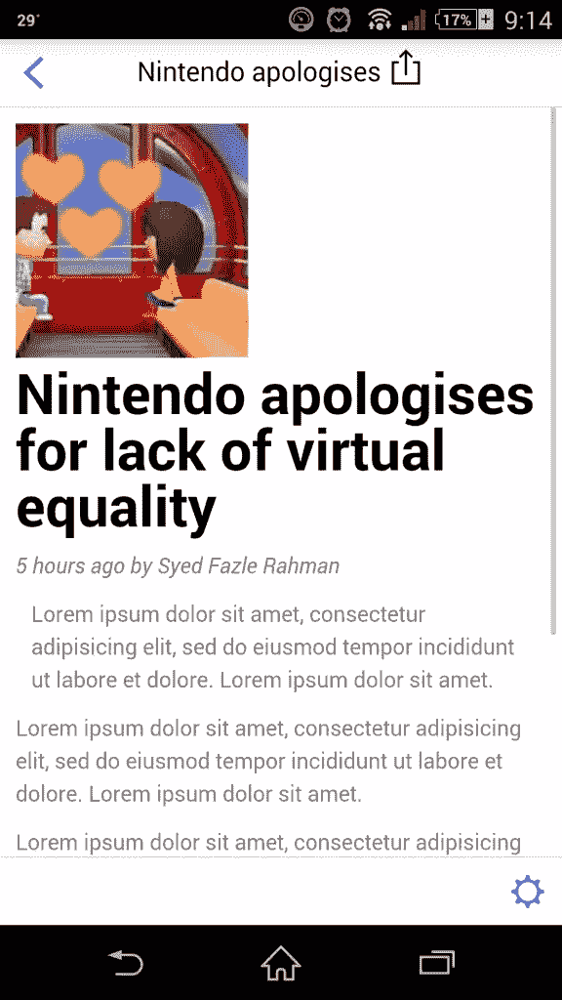
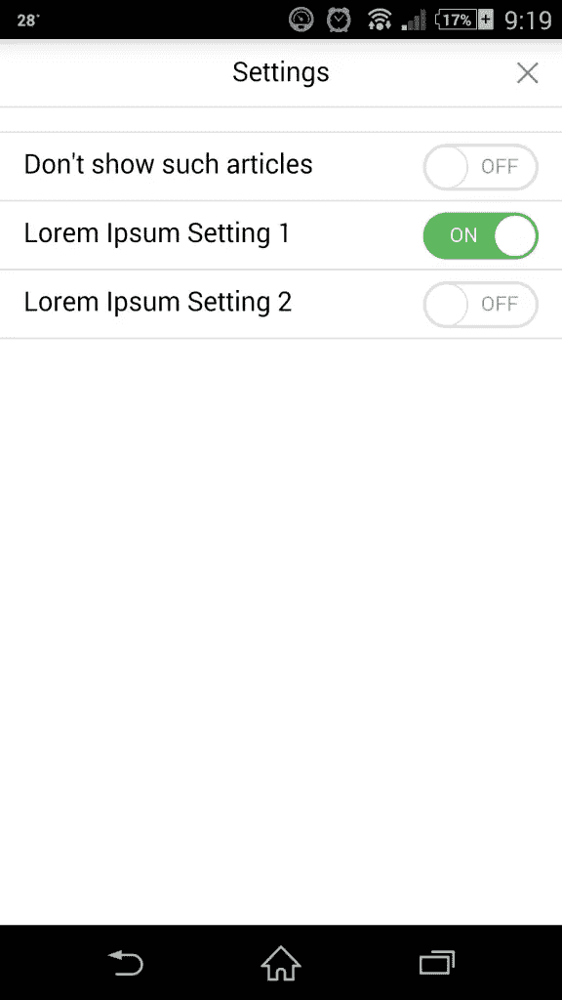

# Ratchet 的 push . js——多屏幕原型应用

> 原文：<https://www.sitepoint.com/ratchets-push-js-prototyping-mobile-apps-multiple-screens/>

Ratchet 是一个使用简单的 HTML、CSS 和 JS 组件快速构建移动应用程序和原型的框架。在我的上一篇文章[Ratchet——轻松构建移动应用原型](#)中，我们介绍了开始使用 Ratchet 框架的步骤。

我们还研究了如何在一个屏幕上放置重要的组件，如标题栏、表格视图、v 形图标、切换按钮和鼠标图标。

在本文中，我们将学习如何在单个应用程序中创建多个屏幕，并使用 Ratchet 的`push.js`脚本加载它们。

## push.js 是什么？

`push.js`是预先加载在 Ratchet 的默认 JS 文件`ratchet.js`中的一段 JavaScript 代码。不需要外部可下载文件。它通过 AJAX 连接棘轮应用程序中的各种 HTML 页面。

在移动应用原型中使用 AJAX 驱动的`push.js`有两大优势:**更快的与服务器的交互**和**它给人一种单页面应用**的感觉。

开发者可以使用棘轮创建移动应用，然后使用 PhoneGap 等软件将其转换为 iOS 和 Android 应用。因此，`push.js`可以帮助开发者快速从服务器上获取数据，并显示在屏幕上。

## 该应用程序

在本文中，我们将创建一个名为“ **SitePoint 的世界新闻**”的新闻提要应用程序。

> 我知道它不存在，但如果 SitePoint 考虑一下，那就好了。；)

这是这个应用程序将要拥有的功能列表。

1.  主屏幕将显示新闻条目列表。
2.  每个新闻条目将链接到另一个屏幕来显示新闻文章。
3.  通过标题栏上的后退按钮返回主屏幕的能力。
4.  每个新闻条目可以有一个设置屏幕。
5.  共享新闻条目的共享弹出窗口。

除了检查`push.js`的用法，我们还将尝试它的一些很酷的功能。在上面列出的所有功能中，`push.js`将仅用于功能 2，即加载不同的页面。它可能看起来是`push.js`的一个简单而微小的用法，但是有必要理解它的作用。

对于第一个特性，我们将使用棘齿的**表格视图和人字纹**组件。我们将列出各种带有相关图片的虚假新闻。第三个功能是在应用程序的顶栏图标上添加一个左箭头，并链接到主屏幕。

我们将为设置屏幕创建一个模态组件。该屏幕将有一个表格视图，其中包含代表每个设置项目的切换组件。

最后一个特性，共享选项，将使用 Ratchet 的 popover 组件来实现。

## 我们开始吧

从棘轮官网下载，[goratchet.com](http://goratchet.com)。将其内容提取到一个工作文件夹中，并在其中创建一个名为`index.html`的新文件。[或者从 github](https://github.com/sitepoint-examples/ratchet-with-push.js) 下载最终代码。这个页面将是我们应用程序的第一个屏幕。

接下来，我们需要将 Ratchet 推荐的 HTML 标记放在这个 HTML 页面中。如果你不记得重要的 meta 标签和棘轮 HTML 页面的基本结构，你可以在这里找到它们。

`index.html`页面现在应该包含以下标记:

```
<!DOCTYPE html>
<html>
  <head>
    <meta charset="utf-8">
    <title>SitePoint’s World News</title>

    <!-- Sets initial viewport load and disables zooming  -->
    <meta name="viewport" content="initial-scale=1, maximum-scale=1, user-scalable=no, minimal-ui">

    <!-- Makes your prototype chrome-less once bookmarked to your phone's home screen -->
    <meta name="apple-mobile-web-app-capable" content="yes">
    <meta name="apple-mobile-web-app-status-bar-style" content="black">
    <meta name="mobile-web-app-capable" content="yes">

    <!-- Include the compiled Ratchet CSS -->
    <link href="css/ratchet.css" rel="stylesheet">

    <!-- Include the compiled Ratchet JS -->
    <script src="js/ratchet.js"></script>
  </head>
  <body>

  <header class="bar bar-nav">
    <h1 class="title">SitePoint’s World News</h1>
  </header>

  <div class="content">

  </div>
  </body>
</html> 
```

我已经将页面的标题改为 **SitePoint 的世界新闻**，并删除了基本模板中`.content` div 内的所有内容。

正如我在上一篇关于棘轮的文章中所讨论的，每个棘轮页面都应该有两个重要的组成部分:**顶部栏**和**内容部分**。

顶栏应该是一个带有类`.bar`和`.bar-nav`的`<header>`元素，而内容部分应该有一个类`.content`。

关于运行棘轮应用程序的步骤，请参考我以前的文章。有多种选择。

我们的目标是用一些虚拟的新闻内容填充内容部分。我无耻地从[谷歌新闻](http://news.google.com)页面中挑选了一些新闻条目，给应用程序一种真实的感觉。

为了创建新闻条目列表，我们将使用 Ratchet 的“带 v 形的表格视图”HTML 组件。所以让我们继续将下面的标记放在`.content` div 中。

```
<div class="card">
    <ul class="table-view">
      <li class="table-view-cell">
        <a class="navigate-right" href="#">
            Nintendo apologises for lack of virtual equality
        </a>
      </li>
      <li class="table-view-cell">
        <a class="navigate-right" href="#">
            New Surface Pro reportedly debuting alongside Surface mini
        </a>
      </li>
      <li class="table-view-cell">
        <a class="navigate-right" href="#">
      Microsoft share price: Software giant announces Office Mix
        </a>
      </li>
      <li class="table-view-cell">
        <a class="navigate-right" href="#">
            Snapchat Settles FTC Charges That It Misled Users About Disappearing Photo ...
        </a>
      </li>
      <li class="table-view-cell">
        <a class="navigate-right" href="#">
            Apple Loop: Beats and Earbuds, Nokia's Imaging Brains And US Legal ...
        </a>
      </li>
      <li class="table-view-cell">
        <a class="navigate-right" href="#">
            Fed court overturns Oracle v. Google Java API copyright decision
        </a>
      </li>
      <li class="table-view-cell">
        <a class="navigate-right" href="#">
            Say goodbye to Facebook's Poke and Camera
        </a>
      </li>
      <li class="table-view-cell">
        <a class="navigate-right" href="#">
            Ford recalls Escape, C-Max and more vehicles to fix safety issues
        </a>
      </li>
      <li class="table-view-cell">
        <a class="navigate-right" href="#">
            Chrysler recalls 780000 minivans over window switch
        </a>
      </li>
    </ul>
  </div> 
```

表格视图是一个带有`.table-view`类的`<ul>`元素。表格视图中的每个`<li>`元素都应该有一个类`.table-view-cell`。这里，我为每个新闻条目使用了一个类为`.navigate-right`的`<a>`元素。类`.navigate-right`在每个`.table-view-cell`元素的右侧输出一个右箭头。

我们的屏幕到现在应该是这样的:



差不多准备好了。我们需要在每个项目旁边放置一个图像项目。这个图像项必须放在每个`<a>`元素中，以表示相应的新闻图像。这是图像的标记:

```
 
```

图像应该有类`media-object`来识别它是一个棘轮媒体组件。我使用了类`.pull-left`来使图片与新闻标题左对齐。继续将图像标签放在标记中的每一项内。我们应该得到一个如下图所示的屏幕。



现在是时候创建另一个 HTML 页面来显示一篇完整的新闻文章了。在同一个工作文件夹中创建另一个名为`article.html`的文件。

我们将把相同的基本 HTML 模板从棘轮在这一页。因此，标记`article.html`应该是:

```
<!DOCTYPE html>
<html>
  <head>
    <meta charset="utf-8">
    <title>Post's Title</title>

    <!-- Sets initial viewport load and disables zooming  -->
    <meta name="viewport" content="initial-scale=1, maximum-scale=1, user-scalable=no, minimal-ui">

    <!-- Makes your prototype chrome-less once bookmarked to your phone's home screen -->
    <meta name="apple-mobile-web-app-capable" content="yes">
    <meta name="apple-mobile-web-app-status-bar-style" content="black">
    <meta name="mobile-web-app-capable" content="yes">

    <!-- Include the compiled Ratchet CSS -->
    <link href="css/ratchet.css" rel="stylesheet">

    <!-- Include the compiled Ratchet JS -->
    <script src="js/ratchet.js"></script>
  </head>
  <body>

  <header class="bar bar-nav">
    <a class="icon icon-left-nav pull-left" href="index.html"></a>
    <h1 class="title">Post's Title</h1>
  </header>

  <div class="content">
  </div>
  </body>
</html> 
```

一切看起来都一样，除了在`<header>`元素中增加了一个链接。我已经用棘轮的鼠标在顶部的工具栏中创建了一个左边的图标。这个图标是使用类`.icon`和`.icon-left-nav`生成的。一个额外的类`.pull-left`用于将图标放置在顶部栏的最左侧。既然，这个图标是一个链接元素，让我们把`index.html`作为它的目标。因此，无论何时点击它，我们都会回到主屏幕。

让我们在`.content` div 中放一些内容来表示文章。

```
<div class="content-padded">
  
  <h1>Nintendo apologises for lack of virtual equality</h1>
  <p><i>‎5 hours ago by Syed Fazle Rahman</i></p>
  <p>Lorem ipsum dolor sit amet, consectetur adipisicing elit, sed do eiusmod tempor incididunt ut labore et dolore. Lorem ipsum dolor sit amet.</p>
  <p>Lorem ipsum dolor sit amet, consectetur adipisicing elit, sed do eiusmod tempor incididunt ut labore et dolore. Lorem ipsum dolor sit amet.</p>
  <p>Lorem ipsum dolor sit amet, consectetur adipisicing elit, sed do eiusmod tempor incididunt ut labore et dolore. Lorem ipsum dolor sit amet.</p>
  <p>Lorem ipsum dolor sit amet, consectetur adipisicing elit, sed do eiusmod tempor incididunt ut labore et dolore. Lorem ipsum dolor sit amet.</p>
  <p>Lorem ipsum dolor sit amet, consectetur adipisicing elit, sed do eiusmod tempor incididunt ut labore et dolore. Lorem ipsum dolor sit amet.</p>
  <p>Lorem ipsum dolor sit amet, consectetur adipisicing elit, sed do eiusmod tempor incididunt ut labore et dolore. Lorem ipsum dolor sit amet.</p> 
```

类`.content-padded`用于在屏幕和内容之间创建一些填充。我放置了一个代表新闻条目的图像，新闻条目的标题使用了`<h1>`标签，一些虚拟文本使用了多个`<p>`标签来代表新闻内容。

`article.html`应该如下图所示。



现在我们已经准备好了两个页面，让我们把它们连接起来。这是我们实际使用`push.js`功能的地方。

再次打开`index.html`。我们将把第一个新闻条目的`href`属性值改为`article.html`。默认情况下，棘轮应用中的所有链节都是`push.js`动力链节。这意味着它们将使用 AJAX 获取。

棘轮在当前页面和新获取的页面中寻找`.bar`和`.content`div。然后用新页面的内容更新旧页面中的 div。因此，在新获取的页面中，放置在`.bar`和`.content`div 之外的任何内容都将被忽略。

在我们的例子中，它将使用`article.html`页面相应组件的内容更新`index.html`页面的顶部标题栏和`.content` div。因此，我们将看到一个更新的顶栏和新闻文章，而不是新闻条目列表。

继续点击主屏幕上的第一条新闻，你会看到正在加载的新闻文章。点击顶栏上的后退按钮，它会带你回到主屏幕。

让我们在通过`push.js`改变屏幕的同时添加一些过渡。通过向链接`<a>`元素添加一个名为`data-transition`的自定义属性，将转换应用到应用程序中。这个属性有三个不同的值:`fade`、`slide-in`或`slide-out`。让我们给主屏幕中的第一条新闻添加一个`slide-in`效果，如下所示:

```
<a class="navigate-right" href="two.html" data-transition="slide-in">
  
    Nintendo apologises for lack of virtual equality
</a> 
```

另外在`article.html`页面的后退按钮上添加一个`slide-out`效果。

```
<a class="icon icon-left-nav pull-left" href="index.html" data-transition="slide-out"></a> 
```

继续运行您的应用程序。在获取新页面时，您应该会看到滑入效果，在返回时会看到滑出效果。根据棘轮应用程序中包含的主题，这些效果看起来可能略有不同。当使用 iOS 主题时应用 iOS 平台过渡，而在 Android 主题中应用 Android 平台过渡。

就是这样。我们的应用程序几乎已经具备了基本特性。还有 2 个功能需要实现:**分享选项**和**新闻文章上的设置屏幕**。由于这些选项仅在第二个屏幕上可用，我们将在`article.html`中创建它们。

分享选项是一个弹出窗口，它出现在顶栏上，上面有一长串社交网络选项。我们将使用棘轮的 popover 组件来创建它。让我们重新打开`article.html`。popover 组件的标记如下所示:

```
<div id="popover" class="popover">
<header class="bar bar-nav">
  <h1 class="title">Share this</h1>
</header>
<ul class="table-view">
  <li class="table-view-cell">Facebook</li>
  <li class="table-view-cell">WhatsApp</li>
  <li class="table-view-cell">Google+</li>
  <li class="table-view-cell">Tweet</li>
  <li class="table-view-cell">Pinterest</li>
  <li class="table-view-cell">Reddit</li>
  <li class="table-view-cell">Pocket</li>
  <li class="table-view-cell">Email</li>
</ul> 
```

每个 popover 都应该有一个标题和一个主体部分。标题用于给弹出窗口一个标题。就像应用程序的顶栏一样，这个标题也应该有类:`.bar`和`.bar-nav`。接下来，我们将使用 Ratchet 的表视图组件来列出共享网络的集合。最大的问题来了！我应该把这个 popover 的标记放在哪里？

如上所述，由于将使用`push.js`来获取`article.html`,因此将只提取顶部栏和`.content` div 中的内容。因此，上面的 popover 标记应该放在`.content` div 的`</div>`上面。

Popovers 是 Ratchet 的隐藏组件之一。这意味着，它们只有在被触发时才可见。因此，我们需要一个处理程序来触发弹出窗口。

在`article.html`的`<header>`组件中的文章标题旁边放置一个分享图标。这个图标将是我们触发共享弹出窗口的处理程序。`article.html`顶栏的标记现在应该是:

```
<header class="bar bar-nav">
<a class="icon icon-left-nav pull-left" href="index.html" data-transition="slide-out"></a>
<h1 class="title">Nintendo apologises <a class="icon icon-share" href="#popover"></a></h1> 
```

处理程序的`href`属性应该包含目标 popover 的 ID。这里的值是`#popover`。共享图标是一个鼠标图标，使用`icon`和`icon-share`类显示。让我们检查一下它在我们的应用程序中的工作情况。它应该如下图所示。



太神奇了！不是吗？我们不必为 popover 编写一行 CSS 和 JS 代码。向棘轮团队致敬。

是时候创建一个设置屏幕了。该屏幕将是棘轮模态的。就像 popovers 一样，modals 在默认情况下也是不可见的。它们必须被触发才能被看到。让我们在`article.html`屏幕中创建一个浮动的底部条。我们将在其中放置一个设置图标，它将是触发模式屏幕的处理程序。

要创建浮动栏，请在弹出框的标记下方添加以下标记。

```
<div class="bar bar-standard bar-footer">
<a class="icon icon-gear pull-right" href="#myModalexample"></a> 
```

默认情况下，浮动栏是可见的。我放置了一个齿轮图标来代表设置按钮。它的'`href`属性包含即将创建的模态组件的 ID。`article.html`屏幕现在看起来像这样:



模式组件的标记如下:

```
<div id="myModalexample" class="modal">
<header class="bar bar-nav">
  <a class="icon icon-close pull-right" href="#myModalexample"></a>
  <h1 class="title">Settings</h1>
</header>

<div class="content">
  <ul class="table-view">
  <li class="table-view-cell">
    Don't show such articles
    <div class="toggle">
      <div class="toggle-handle"></div>
    </div>
  </li>
  <li class="table-view-cell">
    Lorem Ipsum Setting 1
    <div class="toggle active">
      <div class="toggle-handle"></div>
    </div>
  </li>
  <li class="table-view-cell">
    Lorem Ipsum Setting 2
    <div class="toggle">
      <div class="toggle-handle"></div>
    </div>
  </li>
</ul>
</div> 
```

就像 popover 组件一样，modal 也有一个标题区域和一个`.content`区域。标题区域用于为模式提供一个标题。在内容区域，我使用了 Ratchet 的“带切换的表格视图”组件。因此，用户可以根据自己的要求切换特定的设置项目。

模式屏幕如下所示:



模态组件的标记也应该放在`article.html`页面的`.content` div 中。

## 防止 push.js

如果你想在你的应用程序中有些链接不应该使用`push.js`，你可以在这样的链接元素中使用带有值为`push`的`data-ignore`自定义属性。

例如:

```
<a href="http://www.sitepoint.com" data-ignore="push">SitePoint<a> 
```

上面的链接会将你从应用程序重定向到目标网址。

## 结论

最后，我们有一个使用棘轮的基本新闻提要应用程序。它具有大多数本机应用程序中常见的功能。我们能够通过使用 HTML、CSS 和 JS 技术创建一个高保真的应用程序。如果这个原型使用 PhoneGap 这样的框架进行集成，它可以成为一个成熟的混合应用程序，并作为原生应用程序与 iOS 和 Android 设备一起使用。

希望您和我一样喜欢创建这个虚拟应用程序。我期待着使用 AngularJS、ExpressJS 和 MongoDB 来增强这些应用程序，并使其成为一个功能齐全的应用程序。如果你对这个话题有任何疑问，你可以直接用我的推特账号( [@fazlerocks](http://www.twitter.com/fazlerocks) )给我发微博，或者在下面留言。我很乐意回答这些问题。

## 分享这篇文章