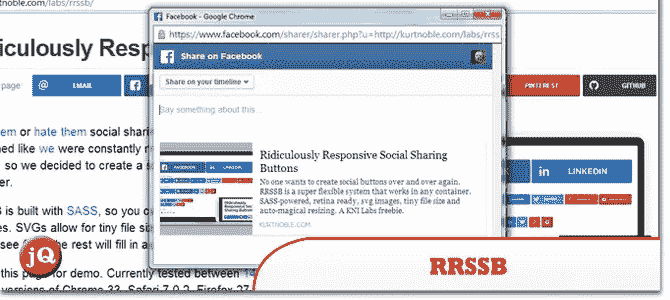
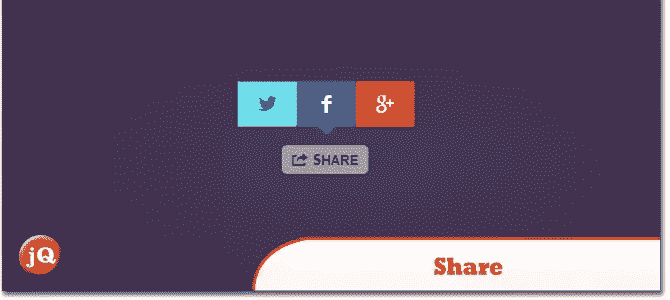
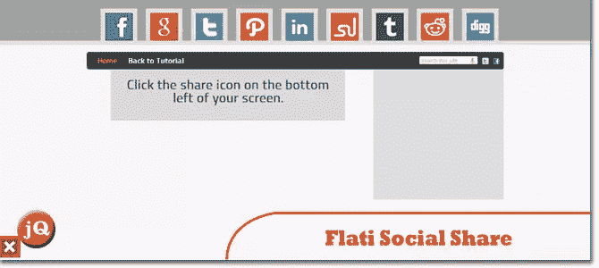
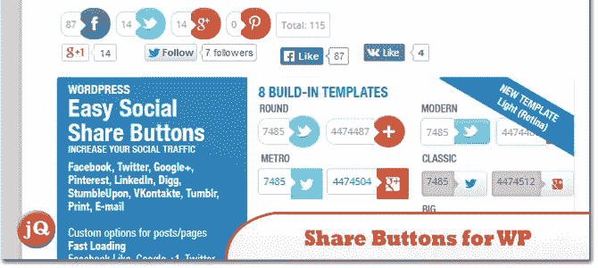
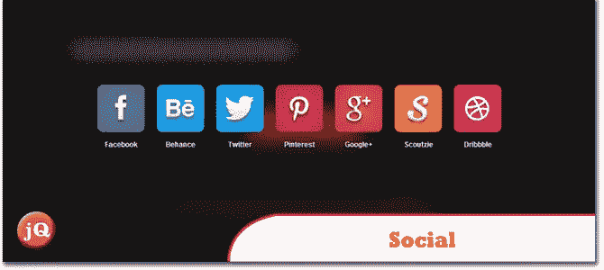
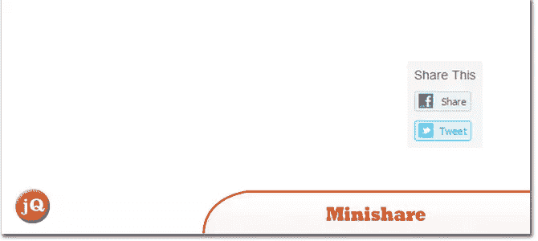
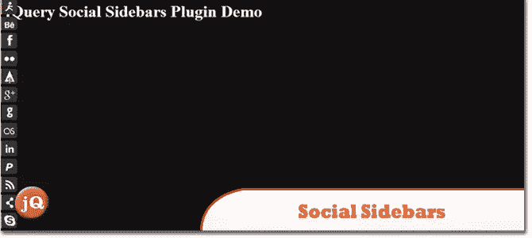
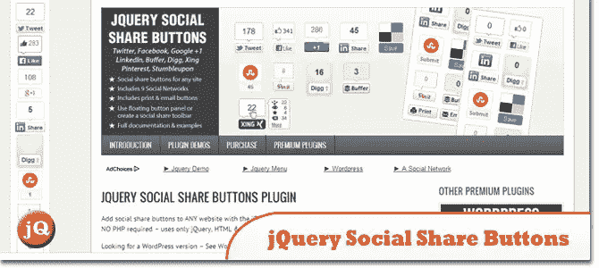
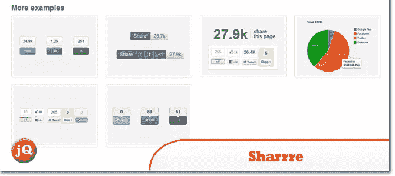

# 你可能错过的 10 个社交分享 jQuery 插件

> 原文：<https://www.sitepoint.com/10-social-sharing-jquery-plugins-missed/>

有很多方法可以鼓励你的用户分享你的内容。这里有 10 个最好的 jQuery 插件来帮助你管理社交分享。

## 1.RRSSB

可笑的社交分享按钮。在这里查看一个演示。

## 2.分享

[Share](https://github.com/carrot/share-button) 是一个 jQuery 插件，可以生成简单、轻便、灵活、好看的分享按钮。在这里查看一个演示。

## 3.jQuery 中的 Flati 社交共享插件

[Flati](http://voidtricks.com/flati-social-share-plugin-jquery/) 是一个用 jQuery 库编写的社交分享插件，采用扁平化 UI 设计。在这里看一个例子[。](http://demo.voidtricks.com/flati-social-share-plugin)

## 4.WordPress 的简易社交分享按钮

分享 WordPress 的按钮——顾名思义。这里有一个演示。

## 5.社会的

一个 jQuery 插件,用于列出配置文件和共享

## 6.迷你共享

David Hewitson 开发的一个非常简单的分享工具。该插件被设计成极简的，不需要任何 FB SDKs 或任何类型的配置。

## 7.隐藏共享

用于插入社交分享功能的 jQuery 插件。要求安装字体超棒的字体和 CSS。这里有一个演示。

## 8.社交侧栏

一个用于动画社交分享栏的 jQuery 插件。这里的一个演示是。

## 9.jQuery 社交分享按钮插件

使用 [jQuery 社交分享按钮插件](http://codecanyon.net/item/jquery-social-share-buttons-plugin/1742435?ref=sdeering)向任何网站添加社交分享按钮。这里的一个演示是。

## 10.沙雷

一个 jQuery 插件,允许你为脸书、Twitter、Google Plus(带 PHP 脚本)等创建漂亮的小部件共享。在这里查看一个演示。

## 分享这篇文章