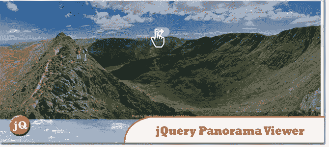
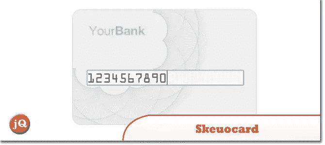
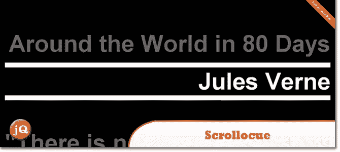
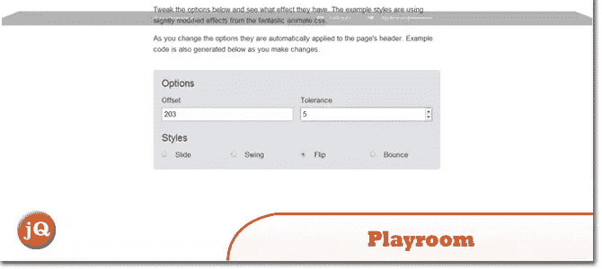
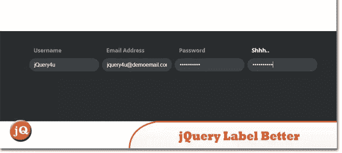
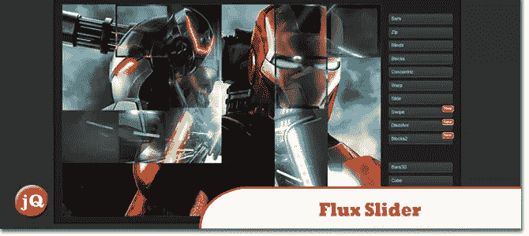
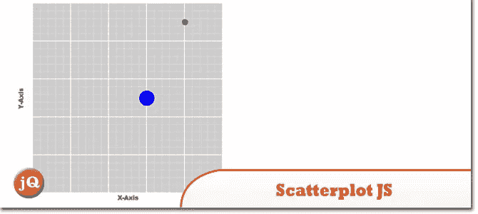
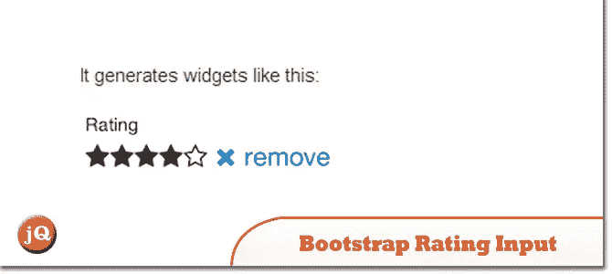
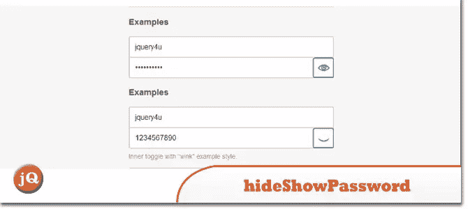

# jQuery 抓取包:10 个新插件

> 原文：<https://www.sitepoint.com/10-random-jquery-plugins-10/>

无论是全景图、散点图还是逼真的信用卡，上周公布的最好的 jQuery 插件应该对每个人都有帮助。

## 1.JQuery 全景查看器

使用[全景查看器](https://github.com/peachananr/panorama_viewer)在您的网站上嵌入全景照片。这里的一个演示是。

## 2.斯库卡

Skeuocard 逐步增强信用卡输入，以提供一个 skeuormic 界面。

## 3.Scrollocue

一个 jQuery 插件,用于构建一个简单的自动提词/提词系统，滚动文本行。

## 4.游戏室

一个[互动游乐场](http://wicky.nillia.ms/headroom.js/playroom/)，你可以在这里修改 headroom 的选项

## 5.jQuery 标签更好

这个插件让你像老板一样给你的表单输入加标签，有漂亮的动画，而且不会占用太多空间。

## 6.Zoomerang.js

Zoomerang 是一个嵌入式库，允许你的用户放大(几乎)你现有页面上的任何元素。没有设置，任意造型。

## 7.通量滑块

一个基于 CSS3 动画的图像过渡插件。

## 8.散点图. js

用于创建 2D 散点图和图表的 jQuery 插件。

## 9.以 2Kb 为单位的自举评级输入

这是另一个插件,它简化了 jQuery 和 Bootstrap 的评分。

## 10.hideShowPassword

hideShowPassword 让你通过 JavaScript 或一个漂亮的插入开关轻松隐藏和显示密码。

## 分享这篇文章