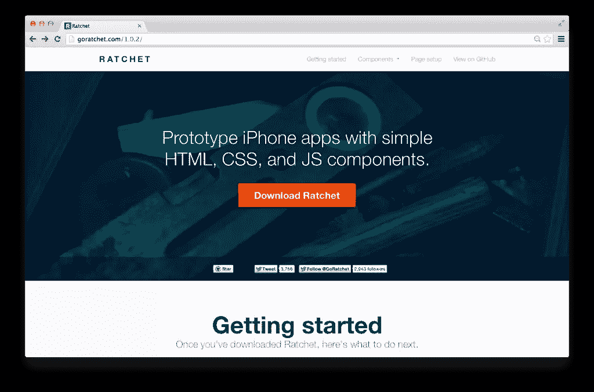
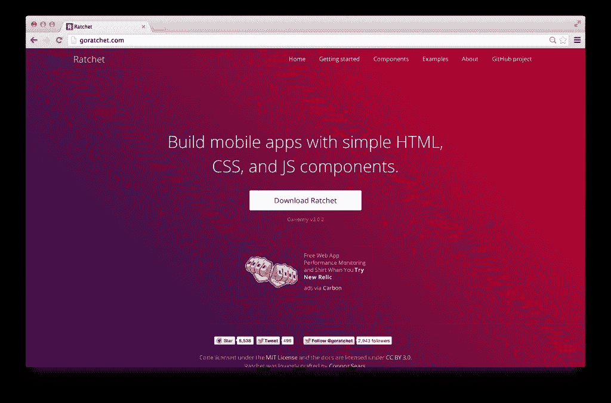
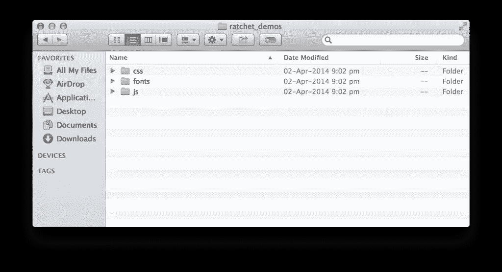
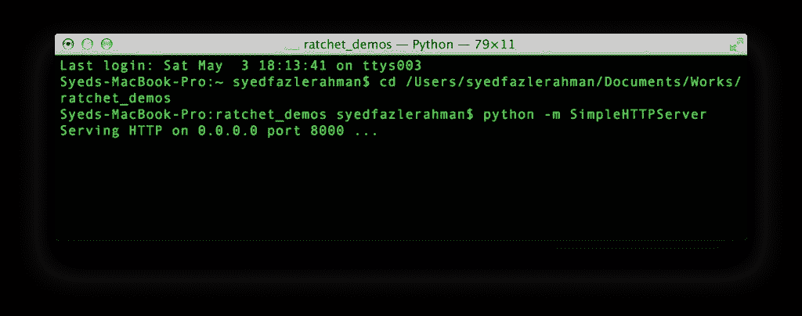
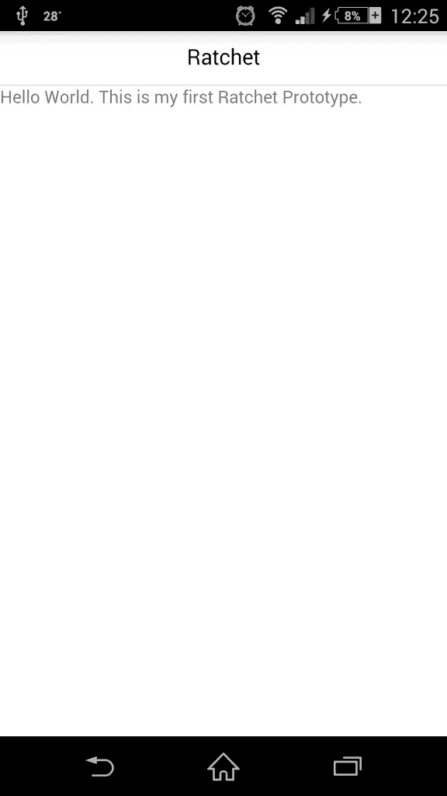
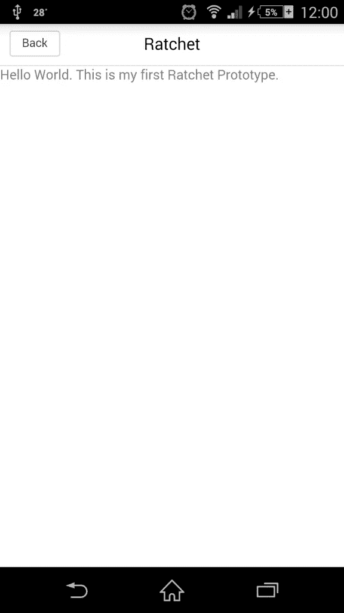
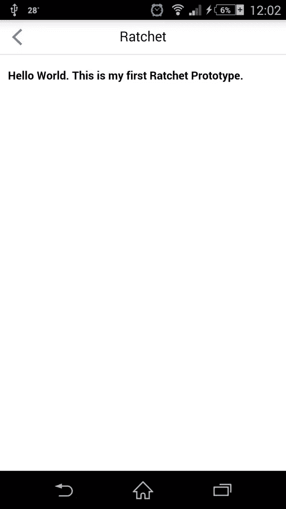
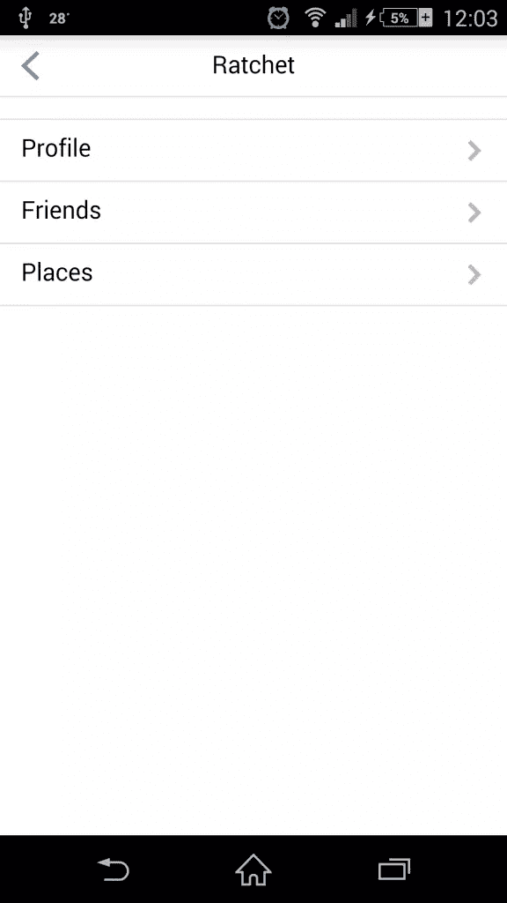
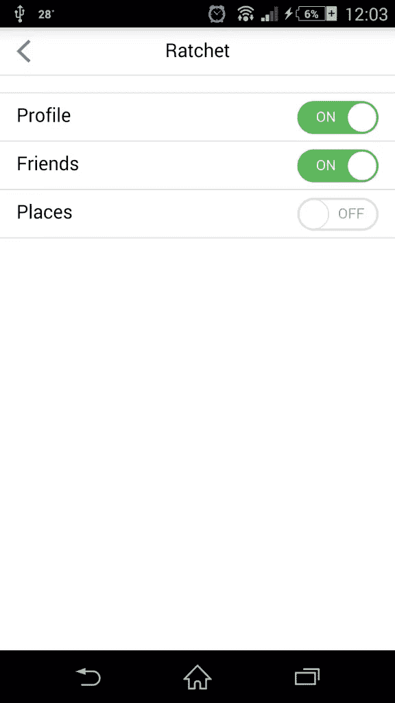

# 使用棘轮轻松构建移动应用原型

> 原文：<https://www.sitepoint.com/prototype-mobile-apps-easily-ratchet/>

使用响应式 web 设计技术来原型化本地移动应用是困难的，因为它们不模拟本地行为。

开发人员通常需要编写大量的 JavaScript 来创建单页面架构，或者使用 Angular.js 和 Ember.js 等技术。

有一些开发人员认真对待这个问题，并开始开发一个框架来简化移动应用程序的原型制作。这些开发者属于 [Bootstrap](http://getbootstrap.com) 背后的团队。



他们想出的框架是[棘轮](http://goratchet.com/1.0.2/)。使用 CSS、JS 和 HTML 等网络技术，你可以为移动应用创建强大的原型。在 Ratchet 1.0.2 之前，只支持 iOS 应用。现在，带有[棘轮 2.0](http://goratchet.com/) 的主题支持 Android 和 iOS 应用程序。使用这些主题，您可以为一个平台制作一个原型，并轻松地切换到另一个平台。



当我们已经有了像 Bootstrap 和 Foundation 这样的框架时，为什么还要考虑使用 Ratchet 来创建移动 web 应用呢？这里有几个他们之间的比较。

## 棘轮与前端框架

1.  像 Bootstrap 和 Foundation 这样的前端框架创建 web 应用程序。由于这些 web 应用程序本质上是响应性的，它们会在移动屏幕上动态地重新绘制它们的布局。棘轮为移动平台创造原型。这些原型非常类似于本地移动应用，它们不适合桌面屏幕。
2.  前端框架没有复制 iOS 和 Android 应用行为的主题。这些主题与棘轮一起开箱即用。
3.  棘轮自带对`push.js`的支持。这使得该应用程序成为一个“单页面应用程序”，通过`push.js`使用 AJAX 技术加载页面。这种支持在 Bootstrap 和 Foundation 中不存在。
4.  棘轮有专门针对 iOS 和 Android 设备的图标。这些图标有助于创建一个更好的移动原型。这样的图标在前端框架中是不存在的，它们必须被显式包含。
5.  棘轮有广泛的支持来创建**标题栏**，就像在本地移动应用程序中一样。标题栏的行为与本机平台标题栏完全一样。
6.  最后，棘轮原型通常比响应式 web 应用要轻得多。这导致实际移动设备上的页面加载速度更快。

如果你认为使用前端框架会更适合你的项目，去看看我们关于 Bootstrap 3 的[教程，了解更多细节。](https://www.sitepoint.com/twitter-bootstrap-3-javascript-components/)

[Github 本文示例](https://github.com/sitepoint-examples/Ratchet-demo "Github for examples in this article")

## 棘轮入门

要使用棘轮，你需要从它的[官方页面](http://goratchet.com)下载这个包。本文使用的版本是 v2.0.2。它是一个开源项目，托管在 GitHub 中，作为引导帐户的[库之一。](https://github.com/twbs/ratchet)

从下载的`.zip`文件中提取所有文件，并将它们复制到您的项目文件夹中。



棘轮有 3 个文件夹的文件:`css`、`js`和`fonts`。让我们逐一探索。

`css`文件夹包含 3 对不同的 CSS 文件。每对包含一个`un-minified`版本和一个`minified`版本。`ratchet.css`和`ratchet.min.css`是主要的棘轮 CSS 文件。它们包含不特定于平台的默认 CSS 样式。

要应用特定的平台样式，您需要使用主题文件。你会发现 2 对不同的主题文件，分别以`ratchet-theme-android.*`和`ratchet-theme-ios-*`开头。你需要按照你的要求使用一个特定的主题。未缩小版本包含注释，可读性更好，而缩小版本是压缩版本。在缩小版中没有注释或多余的空格。它在部署项目时使用。

`js`文件夹包含两个文件，`ratchet.js`和`ratchet.min.js`。同样，前者是未缩小的版本，而后者是缩小的版本。它是棘轮工作所需的主要的也是唯一的 JS 文件。

`fonts`文件夹包含所有的棘轮字体。这些文件从 CSS 文件内部链接。确保保持`css`和`fonts`文件夹在同一个结构中，这样 CSS 就可以找到字体文件。

让我们创建第一个 HTML 文件`index.html`，并在其中使用 Ratchet。棘轮推荐了一个基本的 HTML 模板。这是:

```
<!DOCTYPE html>
<html>
  <head>
    <meta charset="utf-8">
    <title>Ratchet template page</title>

    <!-- Sets initial viewport load and disables zooming  -->
    <meta name="viewport" content="initial-scale=1, maximum-scale=1, user-scalable=no, minimal-ui">

    <!-- Makes your prototype chrome-less once bookmarked to your phone's home screen -->
    <meta name="apple-mobile-web-app-capable" content="yes">
    <meta name="apple-mobile-web-app-status-bar-style" content="black">
    <meta name="mobile-web-app-capable" content="yes">

    <!-- Include the compiled Ratchet CSS -->
    <link href="ratchet.css" rel="stylesheet">

    <!-- Include the compiled Ratchet JS -->
    <script src="ratchet.js"></script>
  </head>
  <body>

    <!-- Make sure all your bars are the first things in your <body> -->
    <header class="bar bar-nav">
      <h1 class="title">Ratchet</h1>
    </header>

    <!-- Wrap all non-bar HTML in the .content div (this is actually what scrolls) -->
    <div class="content">
       <p>Hello World. This is my first Ratchet Prototype.</p>
    </div>

  </body>
</html> 
```

在上面的代码中，你会发现一些不熟悉的 meta 标签。棘轮需要这些来使原型在使用移动浏览器时看起来接近原生移动应用。第一个名为`viewport`的 meta 标签用于禁用浏览器的缩放功能。它还建议 web 应用程序通过将`initial-scale`设置为 1 来覆盖整个可用的浏览器屏幕空间。

接下来，我们有一组 3 个 meta 标签来强制浏览器进入 chromeless(或全屏模式)。在这个特定的应用程序中，前两个 meta 标签是 iOS 专用的(Safari 浏览器)，最后一个是 Android 设备专用的(Google Chrome for Mobile)。

一旦所有的元标签都设置好了，我们就可以链接 Ratchet 的主要 CSS 和 JS 文件。正如你在上面看到的，我们在这个原型中没有使用任何主题文件。我们使用默认的棘轮模板。

在`body`标签中，您需要遵循棘轮建议的特定架构。如果你的原型需要一个顶部固定栏，你必须在 HTML 文件的最顶层包含它的标记。Ratchet 使用`<header>`标签来创建这个固定的导航栏。它应该有类`bar`和`bar-nav`。如果你想在应用程序的所有页面中显示一个标题，用一个类别设置为`title`的`<h1>`标签把它放在这个栏中。

所有非标题内容都应该放在一个拥有类`content`的`<div>`元素中。这个`content`元素是整个应用程序中唯一的可滚动区域。我们将很快用各种棘轮组件填补这个空间。

## 运行棘轮原型

Ratchet 原型是 web 应用程序，可以像任何其他 web 应用程序一样运行。您需要确保它们可以从您构建原型的移动设备上访问。这里有几个选项可以做到这一点。

### 在 Mac 上使用 Wi-Fi 连接和`localhost`

如果您使用的是 Mac，可以运行默认的 python 服务器来访问 prototype 应用程序。您还需要将移动设备和 mac 连接到同一个 Wi-Fi 连接。

1.  开放终端。
2.  导航到您的棘轮项目。
3.  粘贴以下命令来运行 python 服务器。`python -m SimpleHTTPServer`
4.  打开 **`System Preferences`** ，转到 **`Network`** ，记下 IP 地址。
5.  打开移动设备的，输入以下 url。`http://[YOUR IP ADDRESS]:8000/`。

在移动设备上，上面的原型应该如下所示:



### 在 Windows 上使用 Wi-Fi 连接和`localhost`

如果你已经在你的 Widows 机器上安装了 WAMP 或者 XAMPP，你需要将 Ratchet 项目移动到部署文件夹中(`www`文件夹在 WAMP)。启动服务器后，您可以通过以下 URL 访问该项目:`http://localhost/[project name]`。

打开命令提示符并键入`ipconfig`来获取你的机器的 IP 地址。使用以下 URL 在移动设备上访问该项目:`http://[YOUR IP ADDRESS]/[project name]`。确保移动设备和 windows 机器使用相同的 Wi-Fi 连接。

### 在实时服务器上托管

如果您有一个 web 服务器和一个与之关联的域，那么您可以直接将 Ratchet 项目上传到托管服务器。需要上传到域名指向的同一个文件夹。您可以在以下 URL 找到您的原型 live:http://your domain name . com/[project name]。

### 谷歌浏览器的桌面模拟模式

谷歌 Chrome v32 以后增加了模拟模式。它同时支持 Android 和 iOS 设备。阅读 Craig 的文章《如何在 Chrome 浏览器中使用移动仿真模式》,了解更多信息。这可能是在桌面屏幕上运行原型的最简单的方法。

## 向原型添加组件

现在我们知道了如何创建一个棘轮项目并在移动浏览器上运行，让我们用一些很酷的棘轮组件来填充`index.html`。

让我们从用一些很酷的导航按钮填充顶部导航开始。正如已经看到的，顶部导航栏的基本标记如下:

```
<header class="bar bar-nav">
    <h1 class="title">Ratchet</h1>
</header> 
```

我们给它加个后退按钮吧。

```
<header class="bar bar-nav">
    <button class="btn pull-left">
        Back
    </button>
    <h1 class="title">Ratchet</h1>
</header> 
```

要创建一个按钮，您需要添加一个带有类`btn`的`<button>`元素。为了让它出现在左手边，你需要添加一个额外的类`pull-left`。棘轮也有一个类`pull-right`让它出现在右手边。



让我们替换 back 按钮上的文本“back ”,并显示一个图标来表示后退操作。

```
<header class="bar bar-nav">
    <a class="icon icon-left-nav pull-left"></a>
    <h1 class="title">Ratchet</h1>
</header> 
```

您需要使用`<a>`元素而不是`<button>`元素，并添加以下类:`icon`、`icon-left-nav`和`pull-left`。

棘轮有一套图标。要使用这些图标，您需要向元素添加一个`icon`类。接下来，您还需要指定想要使用的图标，比如`icon-left-nav`。你可以在[棘轮的文档](http://goratchet.com/components)中看到所有的图标和它们各自的类别。

到目前为止，我们开发的应用原型存在一个问题。您可以看到顶部导航栏下方添加的内容位置不正确。它粘在屏幕的左侧。使用以下标记修复此问题。

```
<div class="content-padded">
    <h5>Hello World. This is my first Ratchet Prototype.</h5>
</div> 
```

只要您想向可滚动区添加内容，就可以使用类为`content-padded`的`<div>`元素。



在许多情况下，你需要创建一个链接列表，它应该滑动并加载一个新的页面。这在棘轮中被称为**人字形**。要创建一个 v 形组件，请在可滚动区域中使用以下标记。

```
<ul class="table-view">
  <li class="table-view-cell">
    <a class="navigate-right">
      Profile
    </a>
  </li>
  <li class="table-view-cell">
    <a class="navigate-right">
      Friends
    </a>
  </li>
  <li class="table-view-cell">
    <a class="navigate-right">
      Places
    </a>
  </li>
</ul> 
```

`table-view`用于在棘轮中创建一个事物列表。它的孩子应该上课`table-view-cell`。最后使用`<a>`标签放置链接。使用`navigate-right`或`navigate-left`向链接元素添加方向图标。



让我们在上面的人字形上添加一些花哨的切换按钮。对于切换按钮，您需要添加以下标记。

```
<div class="toggle">
  <div class="toggle-handle"></div>
</div> 
```

带有切换按钮的人字形的完整标记如下:

```
<ul class="table-view">
    <li class="table-view-cell">
        Profile
        <div class="toggle">
            <div class="toggle-handle"></div>
        </div>
    </li>
    <li class="table-view-cell">
        Friends
        <div class="toggle">
            <div class="toggle-handle"></div>
        </div>
    </li>
    <li class="table-view-cell">
        Places
        <div class="toggle">
            <div class="toggle-handle"></div>
        </div>
    </li>
</ul> 
```



棘轮中有许多组件可供使用，在这里找到它们:[goratchet.com/components](http://goratchet.com/components)。

## 棘轮主题的变化

在上面的演示中，我们使用了默认的棘轮主题。要添加特定于平台的主题，您需要在默认 css 文件旁边添加一个额外的主题文件。这个主题应该放在默认 CSS 文件的下面，这样它才能正常工作。

要添加 iOS 风格的主题，您需要使用以下 CSS 文件:

```
<link href="css/ratchet.css" rel="stylesheet">
<link href="css/ratchet-theme-ios.css" rel="stylesheet"> 
```

对于 Android:

```
<link href="css/ratchet.css" rel="stylesheet">
<link href="css/ratchet-theme-android.css" rel="stylesheet"> 
```

## 结论

Ratchet 是使用 web 技术开发移动原型的一个很好的工具，它有很多现成的很酷的组件。如果从头开始构建，这些组件会消耗大量时间。

我可以预见棘轮在不久的将来会成长，因为它来自互联网上最著名的开发团队之一，Bootstrap 团队。

前往 [Stackoverflow 的棘轮 2](http://stackoverflow.com/questions/tagged/ratchet-2) 部分获得更多支持。

我希望你喜欢阅读这篇文章。请在下面留下你的建议或赞赏(如果有的话)。我很想收到你的来信。

## 分享这篇文章