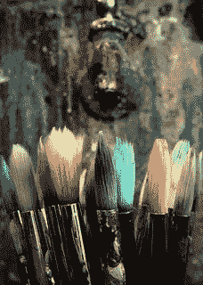
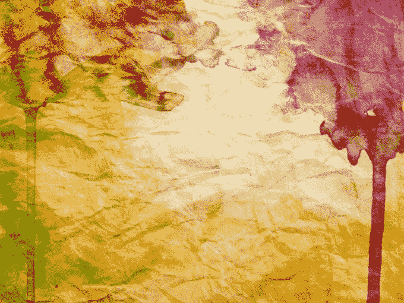
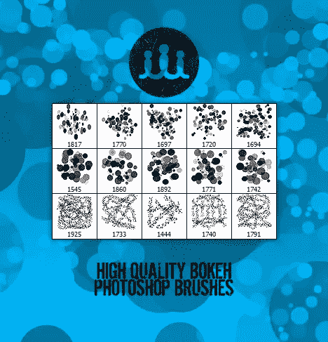
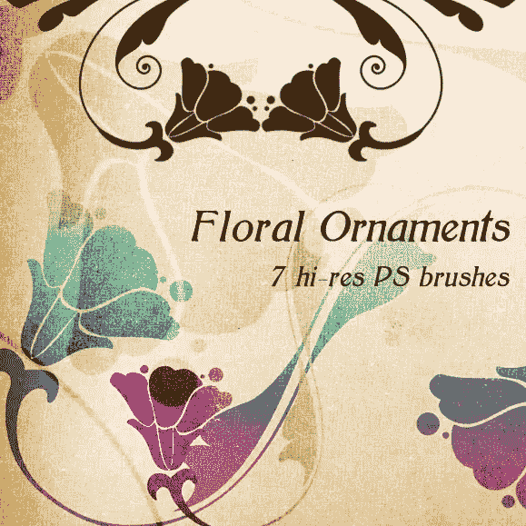
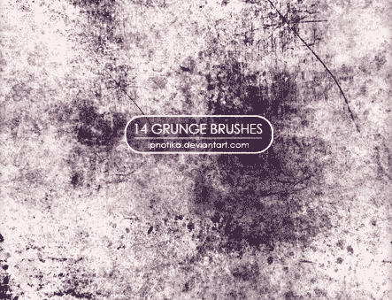
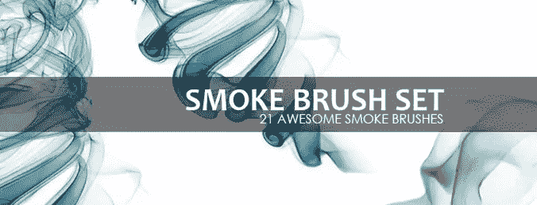
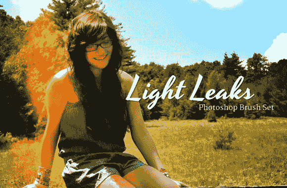

# 5 个必备的 Photoshop 笔刷

> 原文：<https://www.sitepoint.com/5-must-photoshop-brushes/>

图片:艺术怪胎

每个优秀的设计师都需要自己收藏的可靠的 Photoshop 笔刷。这些都是制作精美作品的无价工具，不会浪费宝贵的时间来复制项目的每一部分。

你不用费力在网上找画笔。然而，问题在于发现那些最高质量的东西——那些能真正帮助你改善设计外观的东西。

我认为选择 Photoshop 笔刷和滤镜有两个规则:

1.  **只下载你需要的滤镜:**下载你发现的每一个看起来很有趣的画笔，这很有诱惑力，但现实是，你收集的越多，你实际使用它们的次数似乎越少。
2.  **避免“一招到位”:**就像一把好刀比披萨刀更有用一样，寻找多功能的刷子。

让我们浏览一些最有用的 Photoshop 笔刷来下载。

## 水彩画笔

由于水彩一直是设计中最受欢迎的风格之一，我们要看的第一个画笔是“wegraphics”的“水彩颜料集”。

顾名思义，你可以用它在纸上或墙上复制水彩的效果。结果将是一个自然，现实和冷静的外观应用到您的作品。

你可以在这里下载这套设备，完全免费。

这个包由 20 个高分辨率笔刷组成，所以有很多变化。

##### [下载此处](http://www.freebrusharchive.com/free-watercolor-paint-brushes/)

## 散景笔刷

“散景”是用来识别图像中那些柔和、模糊、失焦的部分的术语。由“inspiiired”制作的散景 Photoshop Brushes 是一套很棒的工具，可以让你毫不费力地模仿这种著名而流行的效果。

这些画笔给你创造惊人的和时尚的背景的可能性，在照片编辑和平面设计中非常有用。

例如，如果你是一个网站或移动应用程序开发人员，我建议你利用这个强大的工具来实现引人注目的用户界面。

这套工具有 15 把刷子，可以通过这个链接免费下载。

##### [下载此处](http://www.brusheezy.com/brushes/14476-15-high-quality-bokeh-photoshop-brushes)

## 花卉饰品

你电脑上的另一个有用的笔刷类别是花卉笔刷。推荐你看看“佩哈”的“[花饰](http://www.brushking.eu/390/floral-ornaments.html)”。

通过使用这些天然画笔，你可以展现从复古到清新现代的多种风格。只看你选择哪种刷子，怎么用了。事实上，在这个包中，你不会发现只有一个元素，而是 7 种不同的高质量的刷子，而且它们都是免费的。

##### [下载此处](http://www.brushking.eu/390/floral-ornaments.html)

## 垃圾画笔

我们要看的下一种笔刷类型是所谓的“垃圾效果”。这是一种以肮脏的外表、不规则的形状和破碎的视觉元素为特征的风格。在网络上，有许多画笔试图复制这种效果，但并不是所有的画笔都是高质量的。

我可以推荐 [Ipnotika](http://ipnotika.deviantart.com/) 设置的“[垃圾笔刷](http://www.brushking.eu/305/grunge-brushes-2.html)”吗？这个包由 14 把不同大小的刷子组成，而且，你不用花一毛钱就能得到它。

这些笔刷非常适合给背景添加轻微的纹理，或者让现代照片看起来像是多年前拍摄的。

##### [下载此处](http://www.brushking.eu/305/grunge-brushes-2.html)

## 烟刷套装

在你作为 Photoshop 用户的日常工作中，在某个阶段你可能需要创建一个真实的烟雾效果。然而，处理“液化工具”，或其他过滤器，可以相当击中和错过。

一个很好的解决这些问题的方法是使用现成的刷子。特别是格雷厄姆·杰弗瑞的“[烟刷套装](http://qbrushes.net/21-smoke-brush-set/)”给我留下了超级深刻的印象。

下载此包后，您将免费获得 21 把刷子，非常划算！

它们非常适合创作抽象艺术作品或产生令人惊叹的效果，如黑暗背景上的发光阴影，而无需太多努力。

##### [下载此处](http://qbrushes.net/21-smoke-brush-set/)

## 漏光–Photoshop 笔刷组

这款比其他的更“新潮”，但仍能产生一些可爱的效果。

“漏光”是指光线漏入传统胶片相机，导致胶片曝光过度。原本是一个缺陷，现在被视为一个艺术触摸，可以使用 Photoshop 图层样式或动作来模仿。然而，它也可以用合适的画笔熟练地再现。

平面设计师内森·布朗(Nathan Brown)创造了一个由 15 种不同笔刷组成的奇妙包，完美再现了漏光现象。

通过少量的鼠标点击，你可以给你的照片添加出色的效果，使它们看起来既复古又时髦。

虽然这些画笔不是免费的——它们的价格是 4.99 美元——但它们确实能让你的作品脱颖而出，所以我认为任何优秀的设计师都应该去买一个。

##### [下载此处](http://wegraphics.net/downloads/light-leaks-photoshop-brush-set/)

## 分享这篇文章