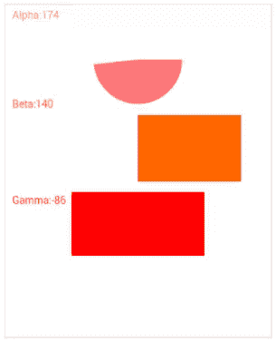
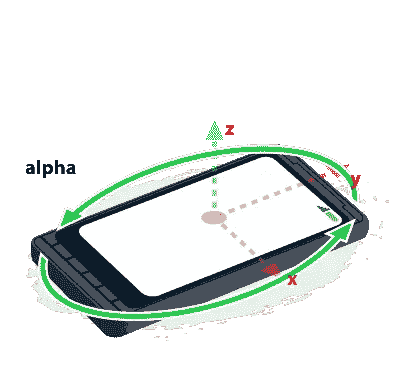
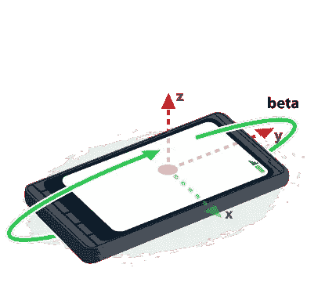
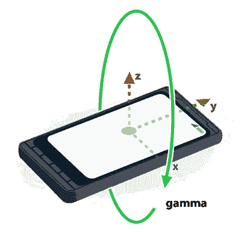

# 在 HTML5 中使用设备方向

> 原文：<https://www.sitepoint.com/using-device-orientation-html5/>

设备定向是 HTML5 的另一个很酷的特性。设备方向允许设备检测其相对于重力的物理方向。如果你曾经旋转过智能手机或平板电脑，而屏幕也随之旋转，那么你就会看到设备方向在起作用。使用三个角度来测量方向——α、β和γ——描述设备的当前位置。我们可以在支持 HTML5 的 web 应用中使用这些角度。

在本文中，我们将编写一个简单的利用设备定位的 web 应用程序。这个应用程序将包括圆形和矩形形状，其大小根据阿尔法，贝塔和伽玛的值而变化。下面两张截图展示了我们的示例应用程序根据方向的行为。如果你不明白这些角度的意思，不要担心，因为你会在过程中学习。




## 浏览器兼容性

在使用设备定向 API 之前，您需要确保您的浏览器支持它。你可以很容易地检查[我能 Use.com](http://caniuse.com/#feat=deviceorientation)来确定你的浏览器是否支持这个 API。然而，您的用户不太可能这样做，所以您需要在代码中构建一些东西。以下代码可用于动态检测对设备定向 API 的支持。

```
if (window.DeviceOrientationEvent) {
  // Our browser supports DeviceOrientation
} else {
  console.log("Sorry, your browser doesn't support Device Orientation");
}
```

## 入门指南

让我们首先创建一个包含应用程序的框架 HTML 文件。注意使用了一个`canvas`元素，它将保存我们的形状。元素检测用户的浏览器是否支持设备方向。如果是的话，那么我们添加一个`deviceorientation`事件监听器——在下面的 a 中会有更多的介绍。

```
<!DOCTYPE html>
<html>
  <body>
    <canvas id="myCanvas" width="360" height="450" style="border:1px solid #d3d3d3;">
    </canvas>
    <script>
      if (window.DeviceOrientationEvent) {
        window.addEventListener("deviceorientation", deviceOrientationListener);
      } else {
        alert("Sorry, your browser doesn't support Device Orientation");
      }
    </script>
  </body>
</html>
```

## `deviceorientation`事件

当设备方向改变时，我们的代码正在监听的`deviceorientation`事件被触发。当这个事件被触发时，我们的事件处理程序`deviceOrientationListener()`被调用。一个 [`DeviceOrientationEvent`](https://www.w3.org/TR/orientation-event/#deviceorientation) 对象是传递给我们的处理程序的唯一参数。前面提到的α、β和γ角度被定义为`DeviceOrientationEvent`的属性。在继续之前，是时候了解一下这些神秘的角度了。

## α、β和γ角度

在解释每个角度代表什么之前，我们需要定义它们存在的空间。下图由 Mozilla 提供，展示了移动设备上使用的 3D 坐标系统。


### 希腊字母的第一个字母

alpha 角度表示绕 z 轴的旋转。因此，沿 z 轴的任何旋转都会导致 alpha 角度发生变化。阿尔法角的范围可以在 0 到 360 度之间。当设备顶部直接指向地球北极时，Alpha 为 0。下图显示了 alpha 旋转。



### 贝塔

绕 x 轴旋转会导致β角改变。β的范围在-180 度到 180 度之间。当设备平行于地球表面时，β为零。一个例子是躺在桌子上。下图显示了β角。



### 微克

伽玛角度与 y 轴相关联。该角度范围从-90 度到 90 度，并且当设备平行于地球表面时为零。如下图所示，旋转设备时，gamma 值会发生变化。



## `deviceorientation`事件处理器

下一步是实现`deviceorientation`事件的处理程序。下面的代码示例显示了该函数。这段代码从清除整个画布开始。接下来，根据 alpha、beta 和 gamma 的值绘制圆形和矩形。元素如何工作的细节超出了本文的范围，但是鼓励读者查看[这篇 SitePoint 文章](https://www.sitepoint.com/html5-canvas-tutorial-introduction/)。

```
function deviceOrientationListener(event) {
  var c = document.getElementById("myCanvas");
  var ctx = c.getContext("2d");

  ctx.clearRect(0, 0, c.width, c.height);
  ctx.fillStyle = "#FF7777";
  ctx.font = "14px Verdana";
  ctx.fillText("Alpha: " + Math.Round(event.alpha), 10, 20);
  ctx.beginPath();
  ctx.moveTo(180, 75);
  ctx.lineTo(210, 75);
  ctx.arc(180, 75, 60, 0, event.alpha * Math.PI / 180);
  ctx.fill();

  ctx.fillStyle = "#FF6600";
  ctx.fillText("Beta: " + Math.round(event.beta), 10, 140);
  ctx.beginPath();
  ctx.fillRect(180, 150, event.beta, 90);

  ctx.fillStyle = "#FF0000";
  ctx.fillText("Gamma: " + Math.round(event.gamma), 10, 270);
  ctx.beginPath();
  ctx.fillRect(90, 340, 180, event.gamma);
}
```

## 把所有的放在一起

成品如下图所示。这个页面没有外部依赖性，所以只需在你选择的面向设备的友好浏览器中打开它，然后尽情享受吧！

```
<!DOCTYPE html>
<html>
  <body>
    <canvas id="myCanvas" width="360" height="450" style="border:1px solid #d3d3d3;">
    </canvas>
    <script>
      function deviceOrientationListener(event) {
        var c = document.getElementById("myCanvas");
        var ctx = c.getContext("2d");

        ctx.clearRect(0, 0, c.width, c.height);
        ctx.fillStyle = "#FF7777";
        ctx.font = "14px Verdana";
        ctx.fillText("Alpha: " + Math.Round(event.alpha), 10, 20);
        ctx.beginPath();
        ctx.moveTo(180, 75);
        ctx.lineTo(210, 75);
        ctx.arc(180, 75, 60, 0, event.alpha * Math.PI / 180);
        ctx.fill();

        ctx.fillStyle = "#FF6600";
        ctx.fillText("Beta: " + Math.round(event.beta), 10, 140);
        ctx.beginPath();
        ctx.fillRect(180, 150, event.beta, 90);

        ctx.fillStyle = "#FF0000";
        ctx.fillText("Gamma: " + Math.round(event.gamma), 10, 270);
        ctx.beginPath();
        ctx.fillRect(90, 340, 180, event.gamma);
      }

      if (window.DeviceOrientationEvent) {
        window.addEventListener("deviceorientation", deviceOrientationListener);
      } else {
        alert("Sorry, your browser doesn't support Device Orientation");
      }
    </script>
  </body>
</html>
```

## 结论

本文介绍了面向设备的 API。这个 API 很简单，并且在现代浏览器中得到了很好的支持。通过利用设备定向的力量，您的网页可以变得更加灵敏和强大。除了本页的演示之外，我还鼓励您阅读下面列出的这篇文章的参考资料。

### 参考

[文章演示](http://mekya.com/labs/device_orientation.html)
[https://www.w3.org/TR/orientation-event/](https://www.w3.org/TR/orientation-event/)
[https://developer . Mozilla . org/en-US/docs/WebAPI/Detecting _ device _ orientation](https://developer.mozilla.org/en-US/docs/WebAPI/Detecting_device_orientation)

## 分享这篇文章