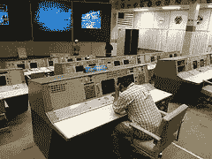
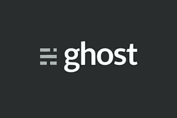
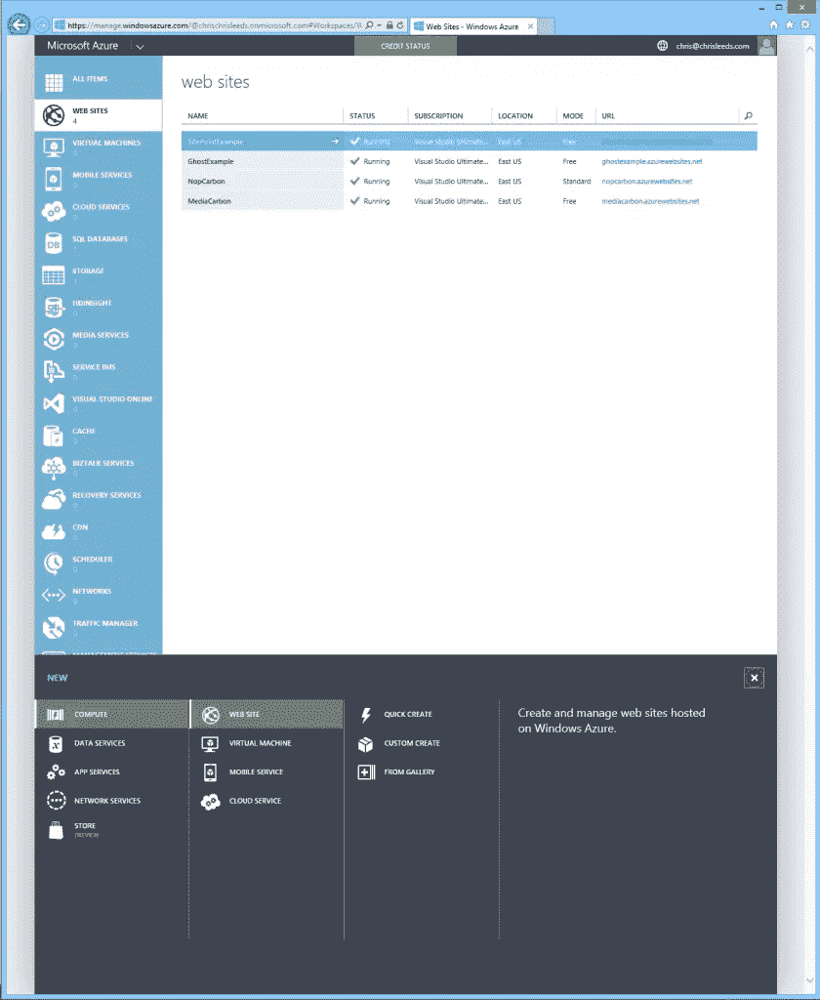
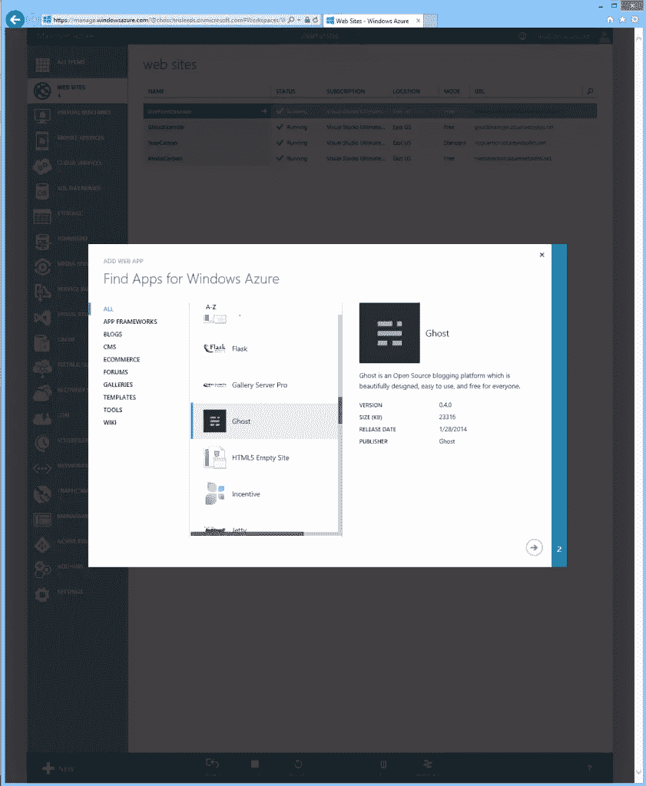
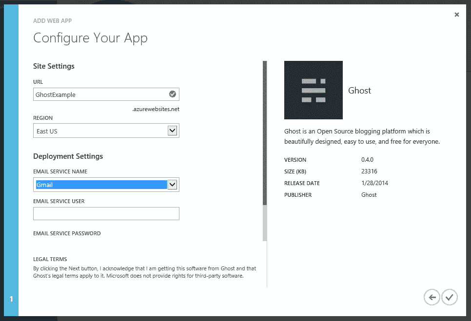
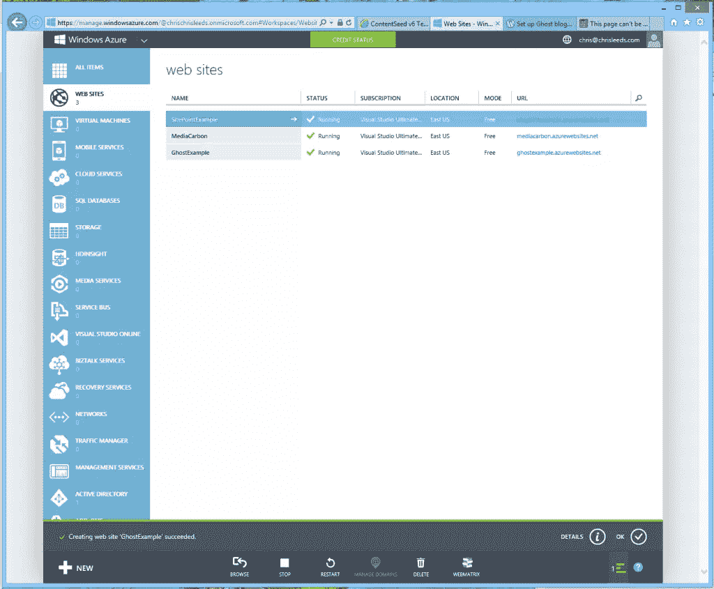
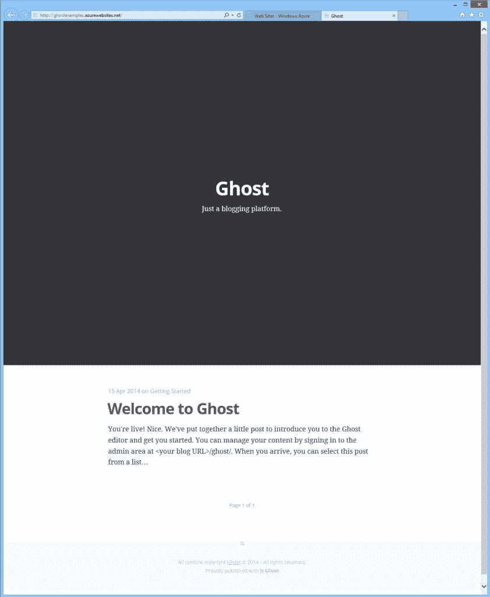
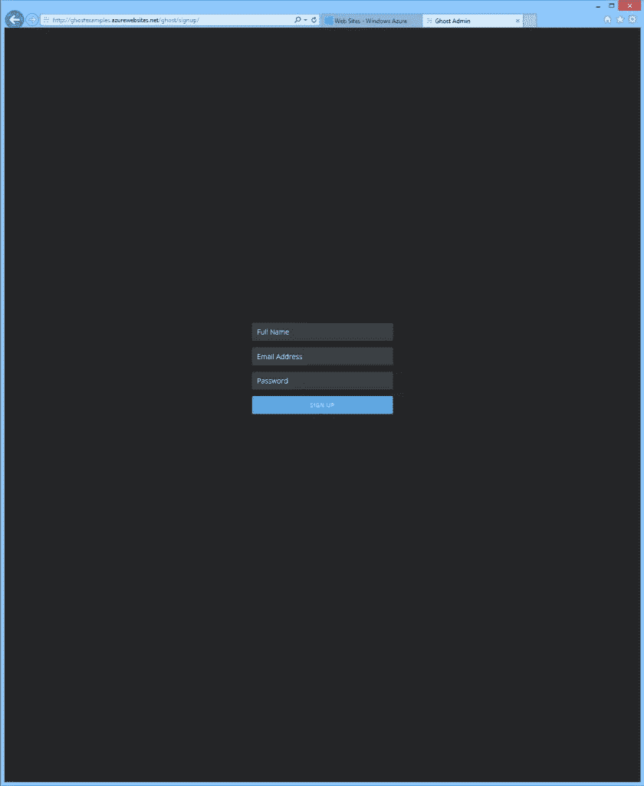
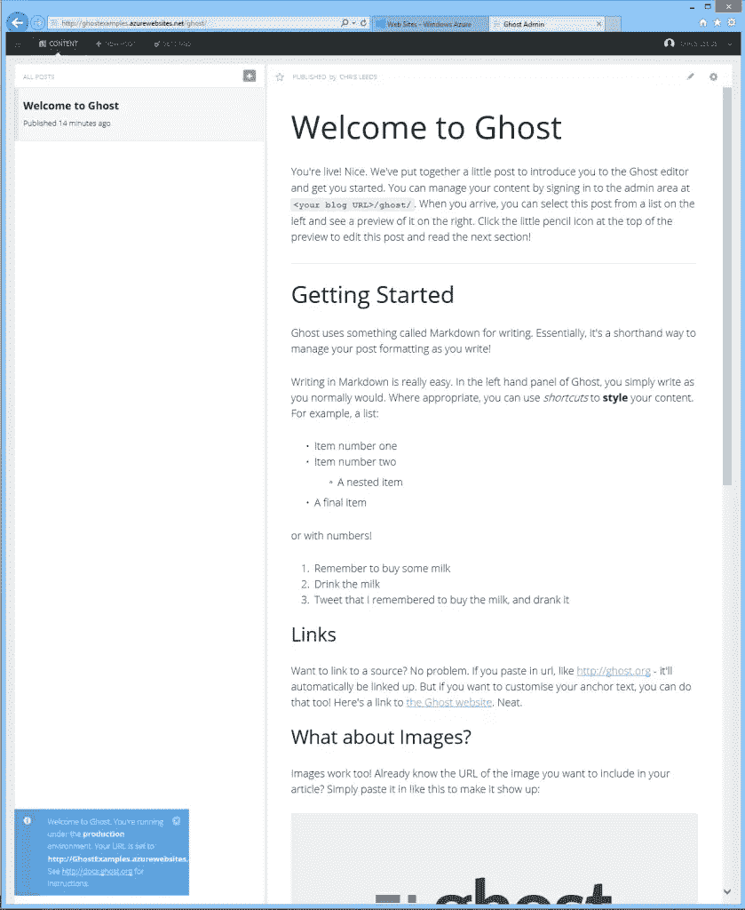

# Ghost 设计人员入门指南

> 原文：<https://www.sitepoint.com/getting-started-with-ghost/>

图片:神圣收割机

很多设计师就是那种:*设计师*。

他们不想成为程序员，因此学会了利用现有的内容管理系统来提供客户需要的功能。

这绝对没有错。

但是我们很多人遇到的问题是，我们一直在利用的应用程序:Joomla、WordPress 和 Drupal 等等是伴随着我们成长起来的。

不幸的是，它们不再是曾经的轻量级、简单的 CMS 和/或博客引擎。

这会导致开销。当我们试图将它们的外观设计成客户签字同意的样子时，会产生额外的开销。

服务器的开销，因为它们更大，要求更高。

当我们可怜的客户试图登录并实际做一些事情时，就会产生信息过载的开销。

"*欢迎来到 WordPress！*”图片:mtsn

你最近有没有退一步看看 WordPress 管理面板？

将客户放入管理面板就像将他们放入 NASA 任务控制中心一样。对他们和你来说，这通常意味着头疼。

需要一个优雅、快速、灵活的 CMS。

### 嘘！介绍 Ghost

这就是[幽灵](https://ghost.org/)出现的地方！Ghost 是一个博客引擎，仅此而已。Ghost.org[T3 的开发者希望保持这种方式。](https://ghost.org/ "Ghost website")

这确实是一个好消息，原因有很多:在应用程序中没有范围蔓延。当你只想做一件事并把它做好时，事情就会变得简单。

Ghost 的管理面板不仅简单，而且非常漂亮，还可以进行拖放调整。

因为这是一个设计非常好的管理界面，你将会比以前更少地受到客户的抵制。Ghost 干净、简单、容易，并且没有比更好地做它想要做的事情更高的期望。

除了哲学上的简单性、外观上的美感和客户端使用的便利性，还有别的东西。

Ghost 的底层编程语言基于 [node.js](http://nodejs.org/) 。本质上，这是在服务器端运行的 JavaScript，所以你不需要学习 PHP、Ruby 或任何其他服务器端编程语言。这与您可能至少有些熟悉的 JavaScript 语法是相同的。

所以，无论你是一个正在为你的服务产品寻找新东西的新设计师，还是一个正在为你的服务产品寻找新鲜空气的资深设计师，请继续阅读。

### 召唤鬼魂

今天，我只是想让你安装一个正常工作的 Ghost，让你自己动手修改。像任何新技术一样，你会想要体验它，以真正了解它的威力。

在下一篇文章中，我们将看看如何控制 Ghost 强大的主题化系统。

现在有很多托管公司为幽灵网站提供服务，包括一些像亚马逊和数字海洋这样的大公司。许多很便宜——有些甚至是免费的。

因为 node.js 有一些与所有共享主机不兼容的服务器端需求，所以在这个例子中我将使用 [Microsoft Azure](http://www.azure.microsoft.com/en-us/ "Azure home page") 。如果你目前没有 Azure 账户，不用担心。你仍然可以跟随 Azure 主页上的免费演示。

### 在 Microsoft Azure 上部署 Ghost。

1).使用您最喜欢的浏览器访问 http://azure.microsoft.com/。登录进入管理门户(【https://manage.windowsazure.com/】T2)。

从 Azure 管理页面，点击屏幕左侧的**网站选项卡**，然后点击屏幕左下方的**+新建按钮**打开菜单选项卡。

2).在+New 菜单中，从左到右依次选择 Compute、Web Site，然后单击 From Gallery 打开 Add Web App 对话框。滚动浏览应用程序列表，然后单击 Ghost 条目。

从应用程序列表中选择 Ghost。

在“添加 Web 应用程序”对话框的右下角，单击“下一步”箭头打开“添加 Web 应用程序”对话框的配置页面。这里您有几个选择:

*   #### 统一资源定位器

    这是您的 Ghost 部署将公开可见的 URL。最初，你将使用一个子域，如在我的例子:GhostExample.azurewebsites.net。部署后，您可以将域名应用于部署。

*   #### 地区

    这是托管您的部署的数据中心的地理位置。就我而言，我选择了美国东部。根据您的需求选择合适的位置。

*   #### 电子邮件服务名称

    此条目用于建立部署的电子邮件功能，用于发送自动电子邮件、密码恢复等。这也可以在部署后进行更改。

    在这个例子中，为了简单起见，我选择了我的 Gmail 帐户。如果您使用 Gmail，请确保检查您的垃圾邮件陷阱，因为 Gmail 通常会将 Ghost 的登录尝试视为未经授权的尝试，在这种情况下，Gmail 会向您发送一封关于这种情况和补救措施的邮件。

*   #### 电子邮件服务用户名

    该条目几乎总是与电子邮件服务名称相关联的实际电子邮件地址。

*   #### 电子邮件服务密码

    这是您在用户名字段中输入的电子邮件帐户名称的实际密码。

配置您的应用

根据需要配置这些表单字段，然后点击对话框右下角的**复选标记**图标。

Azure 开始供应过程。您将在页面底部看到一条状态消息，状态指示器将为“正在创建”。

这有时需要几分钟，所以不要担心它会失败，请耐心等待。

资源调配完成后，您将在页面底部看到一条确认消息，新站点的状态将变为“正在运行”。

4).在 **URL 列**中，单击新 Ghost 部署的链接，在浏览器中打开它。

假设部署成功，您将看到一个类似如下的页面。

5).按照欢迎信息的指示，将“/ghost/”添加到浏览器地址栏中的 URL。

在我的例子中，它将是*http://GhostExample.AzureWebSites.net/ghost/.*这个 URL 也是您将返回以管理部署的地方。

第一次访问 Ghost 时，您需要为自己创建一个帐户。这些值适用于您在新部署中的内部帐户。

6).输入您的姓名、电子邮件地址并添加密码，然后点按“注册”按钮。

创建您的初始帐户后，Ghost 会重定向到管理界面。

花些时间探索一下界面，熟悉一下那里有什么，试着发表一篇新文章，等等。

想想你在不到五分钟的时间里完成了什么:你在最先进的服务器上部署了最先进的博客平台。就在五年前，这还不是一个选项。虽然结果是一个很好的成就，不费吹灰之力，但这只是开始。剩下的任务包括修改部署的视觉外观、修改设置、创建内容等等。

在本系列的下一期中，您将学习如何将站点文件下载到您的本地计算机上，并修改主题，使您的部署具有自己独特的外观。

第 2 部分再见！

## 分享这篇文章