# 升级到通用分析:分步指南

> 原文：<https://www.sitepoint.com/upgrading-universal-analytics-guide/>

截至 2014 年 4 月，谷歌新的通用分析软件[已经退出测试版](http://analytics.blogspot.com.au/2014/04/universal-analytics-out-of-beta-into.html)。它自 2013 年 3 月以来一直处于公开测试阶段，很快将强制升级所有谷歌分析属性的代码。因为这不是自动升级，你有一个选择:升级，或者好好看看一些[谷歌分析替代品](https://www.sitepoint.com/upgrading-universal-analytics-guide/)。那么应该选择什么呢？执行升级涉及哪些内容？

在这篇文章中，我将简要讨论做出这种改变的利与弊，然后我将使用我自己的一个网站向你展示如何做到这一点。因为我已经在更新我的代码了，我还会加入[人口统计&兴趣](https://support.google.com/analytics/answer/2799357)特性。

## 缺点

关于新的通用分析有很多好的东西要说，但是让我们先把坏的东西去掉。

### 手动升级

升级中最大的问题是，你必须采取行动，弄乱你的分析代码，并手动执行升级。虽然这看起来很简单，但是你的 Google Analytics (GA)代码出现在你网站的每一页上——在很多情况下，你必须手动修改代码。

幸运的是，现在升级比测试版容易，在测试版中，您必须执行几个步骤才能升级。现在只需要两步(其中一步只是请求升级)和一点等待。

升级过程的一部分是添加新代码。我管理着 20 个网站，所以我害怕这一步。对于我们这些运营数百个网站的人来说，这将是一次耗时的升级。

如果您是高级 GA 用户，情况会变得更糟。如果您使用[自定义变量](https://www.sitepoint.com/google-analytics-custom-variables/)，您也必须将它们更新到[自定义尺寸](https://support.google.com/analytics/answer/2709829)中。目前有一个解决办法(升级到 Universal Analytics，但保留变量和旧代码)，但这不会持续太久:谷歌将在两年内停止从旧的分析代码中收集数据。

还有一点:你不能回到你的旧代码。升级不仅意味着更换跟踪代码，而且您的个人资料也被转换。所以你应该先在开发网站上试试。

### 学习曲线

通用分析的另一个缺点是学习曲线。为了完全理解 GA，你已经不得不做一些认真的学习。对通用分析的初始升级不会对您的仪表板产生太大影响，但似乎 GA 正在排队等待一些重大变化，这将需要一些时间来适应。

另一个障碍是谷歌官方分析文档的低质量。文档应该会随着时间的推移而改进，但是如果您计划提前升级，请为一些不确定性做好准备。

## 奖励

升级到 Universal Analytics 可能会很乏味，但它确实提供了一些巨大的好处。让我们来看看它们:

### 用户标识

Universal Analytics 的第一个重大变化是一个非常酷的功能，称为[用户 ID](https://support.google.com/analytics/answer/3123662) ，它最适合已经为特定用户分配标识符的网站(例如，使用登录名)。然后，您可以在 Analytics 中为该登录分配一个特定的用户 ID，并跟踪访问者何时以及如何回到您的网站，包括在特定设备上。

我将在我运行的工作板网站上使用用户 ID。看到登录的用户如何随着时间的推移搜索工作，以及他们最终使用哪种设备申请工作，这将是非常令人惊讶的。这给了独特的访客指标一个全新的含义。有了这些信息，你就可以为网站的未来改进制定路线图。

### 跨设备报告

用户 ID 功能只是跨设备可能性的一种实现。使用新代码，你可以获得三种不同的测量方式:良好的旧网站跟踪(更容易跨域跟踪)，移动应用程序跟踪，以及用于跟踪任何其他数字设备的[测量协议](https://developers.google.com/analytics/devguides/collection/protocol/v1/)。该协议将分析数据从您的正常网站中移除，并允许与几乎任何环境进行通信。

测量协议的一些示例:

*   跟踪发生在外部，但来自您的网站的交易，如会员更新。
*   高级:您可以在您的网站上发放优惠券，访问者可以在线使用或打印出来在您的实体店使用。由此产生的收入可以发送回 GA，汇总到一个性能报告中。
*   更先进的是:很快冰箱将可以直接在网上订购。想象一下，如果你能把这笔收入与你争取客户的营销活动联系起来。终身价值怎么样？

### 定制变量豪华版

正如我上面提到的，自定义变量已经被[自定义维度](https://support.google.com/analytics/answer/2709829?hl=en)所取代。这些本质上是相同的，但是您不再局限于 5 个维度(现在限制为 20 个)，并且每个维度都可以命名(这是一个很小的变化，极大地简化了自定义变量的使用)。

借助 Universal Analytics，您还可以向维度添加自定义指标。这允许你量化你的数据。维度是“什么？”，度量是“有多少？”。

以电子商务为例:GA 已经有了预定义的维度指标来报告交易价值。但那只是收入。使用自定义指标，您可以通过添加销售商品的成本来扩展这一点，并计算您的利润。

GA 已经有了大量的默认维度和指标，但是通过定制选项，您可以简单地构建您所缺少的维度和指标。

### 人口统计和兴趣

好吧，我在这个问题上作弊了一点，因为它不仅限于通用分析。如果你打算花时间更新你的谷歌分析代码，别忘了打开[人口统计和兴趣](https://support.google.com/analytics/answer/2799357?hl=en&ref_topic=2799375)。通过使用谷歌已经收集的关于访问者的数据，这给了你一些很好的洞察。

通过这种方式，我发现我的网站之一，[HIPAAHQ.com](http://www.hipaahq.com)，主要是由技术爱好者访问的(这是一个完美的匹配)，而不是那么多的购物者。这用真实数据验证了一个假设。

## 该不该升级？

据估计，在最初的 Google Analytics 退役之前还有两年，现在没有升级的迫切理由。最重要的是，一旦升级完成，你将开始在你的通用分析上收集数据，让你立即利用新功能。

另一个优势是:谷歌只会发布通用分析的改进。如果一个整洁的新功能即将发布，你将无法使用它，除非你已经升级，或者能够快速改变你的分析代码。

现在，如果您选择尽快完成升级，让我们来看看执行升级的过程。

## 第一步:将你的财产转移到通用分析

前两步，我将使用[通用分析升级指南](https://developers.google.com/analytics/devguides/collection/upgrade/guide)来升级我的一个网站，运行在 WordPress 上的【HeathrowCareers.co.uk】。这个过程从将您的酒店(即您网站的 GA 配置文件)转移到 Universal Analytics 开始。你会在 GA 的 admin 中找到这个选项，而且这个选项只有在你还没有转换配置文件的时候才会出现。

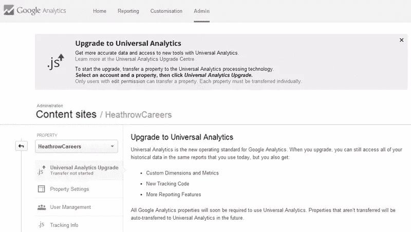

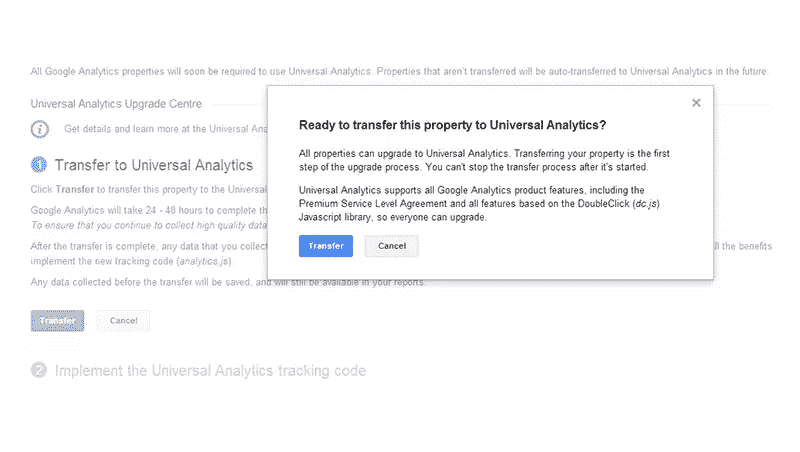

## 步骤 2:升级您的代码(没有自定义变量)

大约需要 48 小时，你的帐户将被转移到通用分析。但是它不会做任何事情，直到你更新你的代码。

需要注意的是，在升级过程中，您的配置文件将正常工作，即使您在升级属性后继续使用旧代码，也不会丢失任何数据。

在我的网站上，我使用的是 Yoast Google Analytics for WordPress 插件。不幸的是，这一个仍然使用旧的跟踪代码。如果你喜欢 WordPress 插件，它的主要竞争对手 Google Analyticator 允许你使用新代码。它还允许你为人口统计&兴趣添加必要的代码。但是，它不允许自定义维度和指标。

对于这个例子，我将采用传统的方法，自己将代码添加到 header.php 文件中。如果你想做得好，你必须创建一个基于子主题的 header.php，以防止在更新时被覆盖。不幸的是，我的网站的主题没有正确配置，所以我不得不改变主题的 header.php。[或者你可以使用一个代码插入插件](https://wordpress.org/plugins/q2w3-inc-manager/)。

必要的代码可以在 GA 的 admin 中找到。请记住，这是默认的跟踪代码。

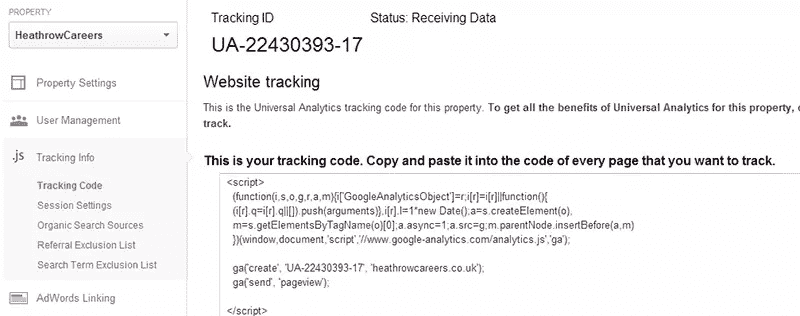

要添加人口统计和兴趣，您需要添加一点额外的代码。首先确保您启用了人口统计和兴趣报告。

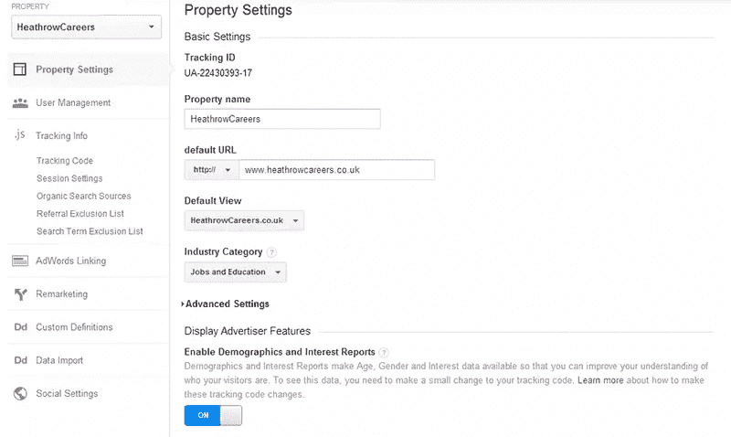

然后，您需要添加一行额外的代码来实现这一点。要添加的代码是:

```
ga('require', 'displayfeatures'); 
```

它看起来会像这样:

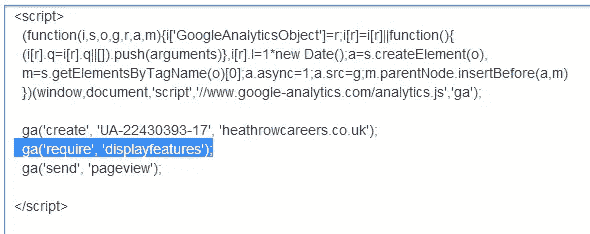

看看你是否正确实现了代码的一个快速提示:GA 提供实时统计数据，只要这些数据进来，你就知道你做对了(别忘了清理你站点的缓存)。

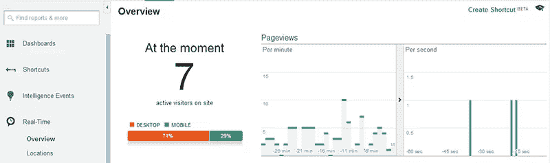

检查你的人口统计和兴趣代码是否有效甚至更容易，因为你必须验证代码。只要去人口统计报告核实一下就行了。

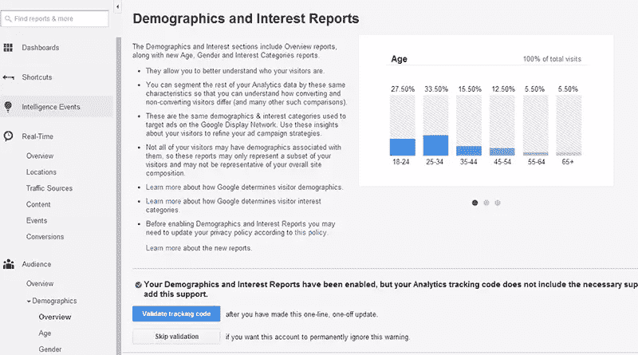

快速提示:如果验证信息一直说你没有安装你的代码，只需选择“跳过验证”，在大多数情况下它会开始工作。如果你看不到这其中的逻辑，你并不孤单…

## 步骤 3:升级您的自定义变量

让我们看看修改和改进的自定义维度和度量部分，以前称为自定义变量。您不能同时使用自定义变量和自定义维度，所以当您升级代码时，您必须立即设置它们。

这也是一个完美的方式来检查你是否升级到通用分析，因为这一功能只有在你执行升级时才可用。你可以在管理区的“属性”栏下找到它。

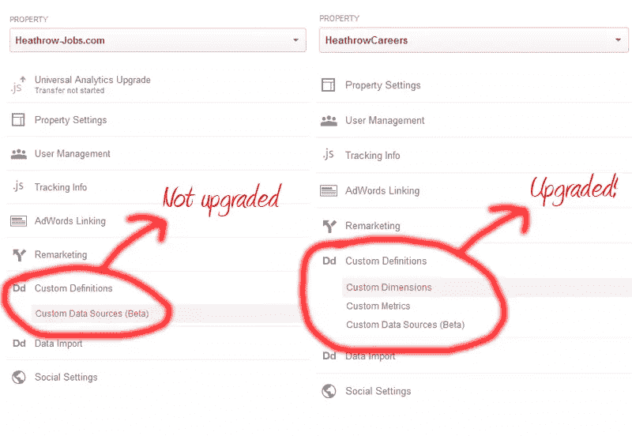

维度和指标的概念在这篇文章中有很好的解释。作者将维度和度量之间的关系描述为表格中的列(维度)和行(度量)。它允许比自定义变量更多的细节。

添加维度和指标实际上比想出如何使用它们更容易。GA 已经给了你一些示例代码，但是你可以从[这篇](https://developers.google.com/analytics/devguides/collection/analyticsjs/custom-dims-mets?hl=nl) Google 支持文章中读到，还有更多选择。

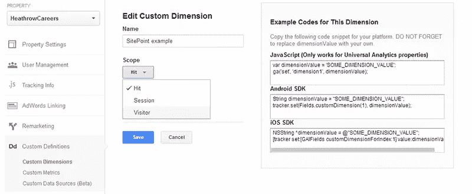

维度和指标允许你衡量谷歌分析目前没有跟踪的任何东西。如果你想更进一步，你甚至可以把离线交易和在线交易联系起来。只要测量到任何形式的交互(简单的点击就足够了)，就可以发送到 GA。我见过一些令人印象深刻的例子，比如[追踪你的内容是否被阅读](http://cutroni.com/blog/2014/02/12/advanced-content-tracking-with-universal-analytics/)，或者[测量产品级别的利润](http://www.analytics-ninja.com/blog/2013/08/measuring-profit-using-googles-universal-analytics.html)。

**使用自定义变量升级前的重要注意事项**:当您升级您的配置文件但仍使用旧代码时，您的自定义变量会继续工作。但是当你开始使用通用分析代码时，你需要马上开始使用定制维度和度量，否则你的定制变量将停止工作。

## 第四步:玩弄人口统计和兴趣

让我们先来看看人口统计和兴趣报告。人口统计让你对访问者的年龄和性别有一个有趣的看法。然后，您可以了解每个群组的平均访问持续时间、浏览的页面数量等更多信息。你可以看到他们在电子商务和 AdSense 方面的表现。

正如你从这份报告中看到的，我的网站主要是由女性访问的。我已经猜到了，因为我网站上最受欢迎的内容是我写的一系列关于空姐的帖子。25-34 岁年龄组的人倾向于比年轻年龄组(我不知道的那个年龄组)的人多呆 5 倍。

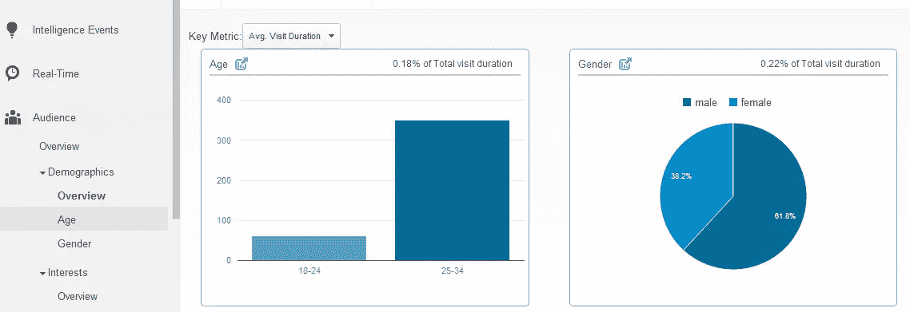

对于兴趣部分，我将向您展示一份深入报告。兴趣让您深入了解:

*   相似性类别(他们觉得什么有趣)
*   内部细分市场(他们最有可能购买什么)
*   其他类别(基本上是两者的组合，更具体和组合)

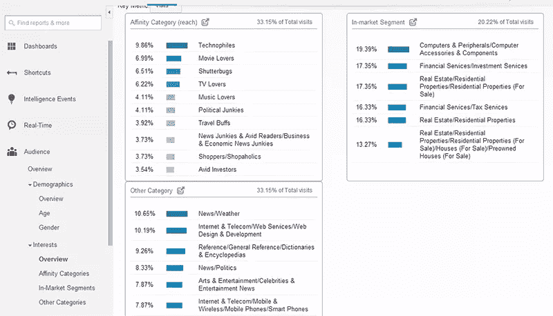

我的工作网站在这些报告中显示了一点点东西，这使得它对于那个特定的网站来说相当无用。我的另一个网站(hipaahq.com)有一个更有趣的结果，我可以看到我为这个专门的托管网站找到了合适的访问者类型。

## 步骤 5:自定义维度和指标

在正确设置了您的定制维度和度量标准之后，您可以在一个漂亮的定制报告中完成它(您可以在 customization 下找到它)。您可以将您的定制数据与 GA 本身的默认指标相结合，以生成一些非常有趣(当然也非常有用)的报告。

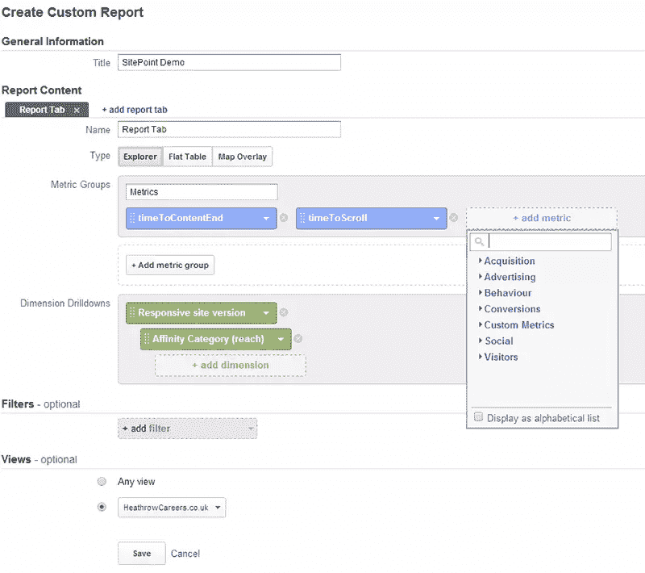

如果您已经将所有数据整合到报告中，您会得到如下令人印象深刻的结果:

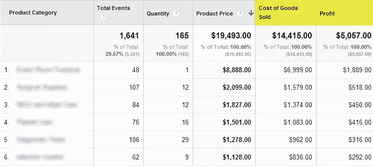

## 结论

如您所见，除非您在旧代码中使用自定义变量，否则升级本身相当容易，即使您包含了人口统计和兴趣代码。要是他们能提供一种方法来一次更新几十或几百个网站就好了。如果你正在使用一个插件，你可以等待它为你更新，因为现在不急。

请再次记住，升级您的财产将需要大约两天才能完成，这是一张单程票。祝你升级成功！

## 分享这篇文章