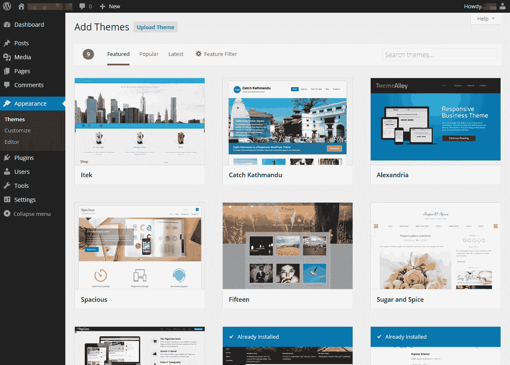
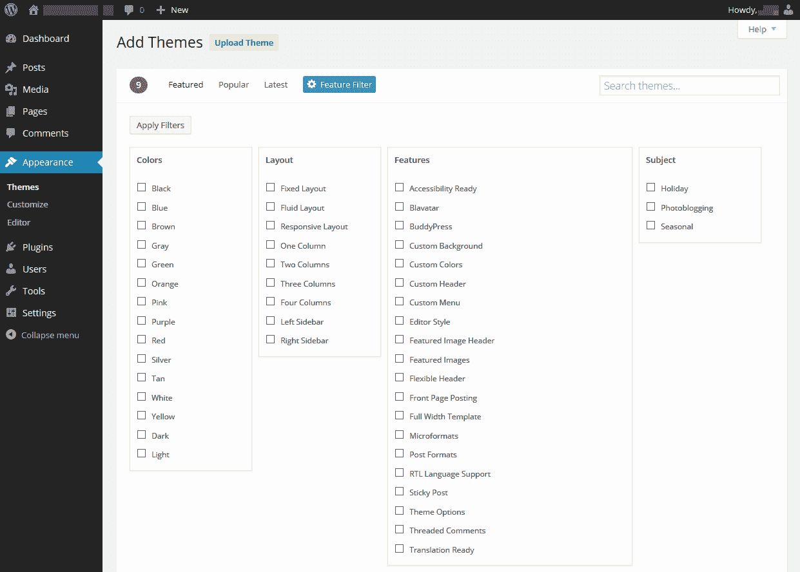

# WordPress 3.9 的新功能

> 原文：<https://www.sitepoint.com/whats-new-wordpress-3-9/>

*这篇文章已经过时了，[点击](https://www.sitepoint.com/whats-new-in-wordpress-4-6/)查看 WordPress 4.6 的新功能。*

WordPress 是世界上最流行的内容管理系统。(有人会说这不是 CMS。我对他们说:WordPress 是一个管理内容的系统——不要再吹毛求疵了！)其巨大成功的原因包括:

*   WordPress 是免费的。
*   它易于安装、使用和扩展。新手开发者和内容编辑的学习曲线比同类产品要浅。
*   有插件和主题来满足每一个需求。
*   活跃的社区意味着支持和开发资源比大多数软件更容易找到。

WordPress 的采用已经达到临界质量。其他系统可能更漂亮或有更优雅的代码库，但当 WordPress 如此普遍时，很难推荐替代系统。

[WordPress 3.9](http://wordpress.org/) 于 2014 年 4 月 16 日发布。这是一个主要版本，所以您现有的安装不会自动更新；您需要登录并按照更新说明进行操作。插件和主题不兼容的情况很少发生，但是你应该在开始之前备份并进一步调查。你已经备份了，不是吗？

用户和开发者对 3.9 版本有什么期待？…

## 缩小编辑和出版之间的差距

内容编辑比以前的版本更先进:

*   可以将图像拖到编辑器中，进行裁剪、旋转和调整大小。
*   图库预览出现在编辑窗口中。
*   “无干扰”书写模式反应灵敏，可适应任何屏幕尺寸。
*   定制器中提供了实时小部件和标题图像预览。
*   TinyMCE 已更新至 4.0 版。

内容编辑器有更复杂的控制，不可避免的从微软 Word 中剪切和粘贴会导致更少的问题。*理论上*。以我的经验来看，用户在获得访问权限的三秒钟之内就会毁掉一个精心创建的网站。不管你采取什么样的保护措施，他们都会想办法插入一张 5Mb 的图片或者用难以理解的 HTML 填充页面。我经常希望 WordPress 能够切换到像 [Ghost](https://ghost.org/) 这样的 markdown 语法——但是很少有内容编辑会同意。

## 主题浏览器

WordPress 3.9 有一个新的主题浏览器，允许你点击几下就可以预览和安装新的布局:

强大的过滤器和搜索表单允许您定义符合您心情的主题:

## 音频和视频播放列表

你不再局限于只有图片的图库:用户可以在 WordPress 3.9 中创建他们自己的音频和视频播放列表。添加到库中的媒体文件可以像任何其他图库一样使用短代码进行组织并插入到页面中。WordPress 甚至可以获取包含适当 ID3 标签的 MP3 文件的歌曲封面缩略图。

## 开发者更新

为主题和插件开发者增加了几个新功能。在撰写本文时，文档还很少— *如果不是不存在的话* —但是最有趣的新功能是:

*   `wp_get_playlist()`、`wp_playlist_shortcode()`和`wp_video_playlist_shortcode()`功能允许控制播放列表。此外，WordPress 现在将 HTML5 用于图库和播放列表控件。
*   `has_image_size()`和`remove_image_size()`加入了`add_image_size()`功能，可以对图像大小进行精细控制。
*   新的`post_supports_thumbnails()`和`theme_supports_thumbnails()`功能。
*   新的`doing_filter()`和`doing_action()`函数识别进程中的钩子。
*   多站点 WordPress 安装现在可以使用`get_network_by_path()`和`wp_get_network()`功能。
*   新增了`wp_install`、`wp_upgrade`和`wp_playlist_scripts`的动作钩子。

## 是时候升级了？

那些更容易紧张的人可能更愿意等待几周，直到问题得到解决，插件代码得到更新。搜索*“WordPress 3.9 升级问题”*已经返回了一长串页面。也就是说，我升级了几个独立的和多站点的安装，没有任何问题——尽管很少有人有大量的第三方主题和插件。

我的建议是:问题很少发生，如果你有文件和数据库备份，你不会有任何损失。WordPress 3.9 非常好——你会很高兴你升级了。WordPress 4.0 应该很特别…

## 分享这篇文章