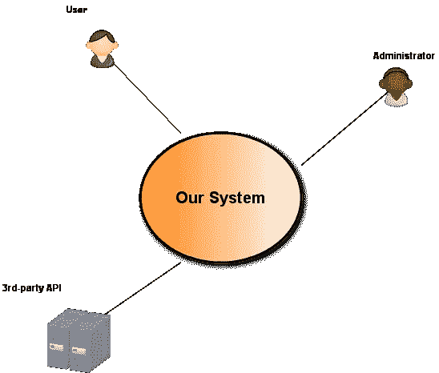
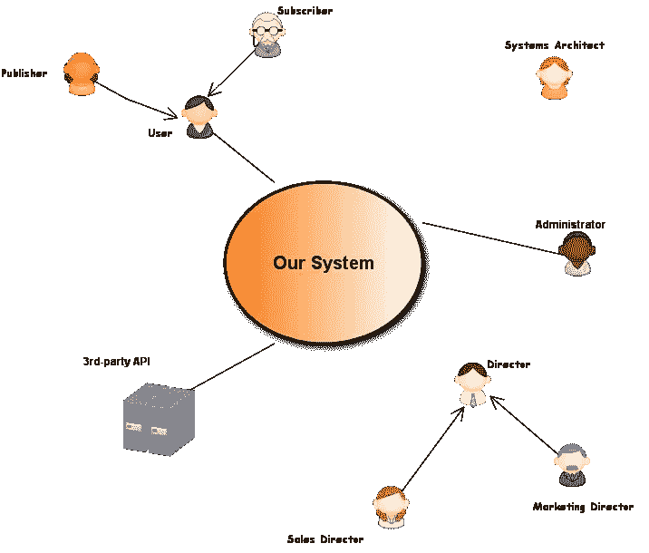

# BDD:像演员一样思考

> 原文：<https://www.sitepoint.com/bdd-think-like-actor/>


毫无疑问，BDD 并不容易！这实际上是非常困难的，需要时间去掌握和做好。幸运的是，收益远远超过初始成本。如果你已经决定实践 BDD，那么你已经有意识地决定打破[‘烧了再刮’](http://blog.mattwynne.net/2013/02/24/building-software-backwards/)的循环，这的确是一个明智的选择！

然而，仅有良好的意愿并不总是足够的。许多开发人员对似乎不适合他们的过程感到失望和沮丧。在这篇文章中，我将探索 BDD 新采用者遇到的一些最常见的障碍和陷阱，并提供一些帮助克服它们的技巧。

我假设，像大多数 Ruby BDD 开发人员一样，您正在使用[cumber](http://cukes.info/)来实现。如果您碰巧使用不同的工具，甚至是另一种语言，不要惊慌:这里描述的原则是相同的，不管您选择什么工具。

## 当初是…系统定义！

“我从哪里开始呢？我如何定义行为？”

这个最常见的问题也是 BDD 生命周期中最大绊脚石的原因。幸运的是，这也是最容易回答的:

当开始一个新项目时*总是*——我的意思是*总是*——定义你的系统内部和外部是什么。



中间的圆圈是我们的系统。这是我们正在建模、设计和将要开发的东西。连接到我们系统的小雕像是*演员*。如果我们想有一个好的开始，我们需要开始像他们一样思考。

### 什么是“演员”？

嗯，当然不是亚当·桑德勒，哈哈！(编者注:我们会因此被起诉吗？？).传统上，回到这个术语起源的的[，一个*参与者*是一个在我们系统之外的实体，它与我们的系统交互或者被我们的系统作用。因此，我们的最终用户、系统管理员和第三方 API 都是*角色*。](http://en.wikipedia.org/wiki/Actor_%28UML%29)

现在，我将大胆地扩展这个定义，特别是针对 BDD:

> 参与者是一个外部实体，它在系统中有既得利益或股份，并且有权力通过规定系统行为来保护这种利益。

注意，我在这里根本没有提到交互。这是因为系统行为可以由从未接触过您的系统、从未直接与之交互的实体来决定。你公司的所有者或董事都是你系统的参与者，因为他们在系统中有既得利益。您的销售经理以及任何有资格期望您的系统有某种行为的人或事也是如此。

实际上，你的许多非功能特性(安全、性能等)将来自这些‘被动’角色，所以要知道它们的重要性，不要低估它们。

#### 提示:概括你的演员

一些*参与者*倾向于扮演不同的角色，这取决于他们如何与我们的系统互动。例如，在消息传递或聊天系统中，最终用户可能是发布者，也可能是订阅者，通常两者都是。使用通用参与者的名称(例如用户)简化了图表和简要描述。使用具体参与者的名字(例如发布者或订阅者)有助于充实特定的行为，从一般的角度来看，这些行为并不总是显而易见的。

#### 提示:“外部”就是这个意思

假设我们有一个系统需要读/写的数据库。如果这个数据库在我们的控制之内(即我们创建了它，维护它。等等。)那么它就是我们系统的一部分，在系统内部。如果我们对它没有控制权，除了对它进行读写，那么数据库对于我们的系统来说就是外部的*并且应该被当作一个*角色*。*

考虑到一般化和“被动”参与者，让我们看看我们的图表现在应该是什么样子。



一旦我们清楚谁是我们的演员，我们就可以开始写特写了。这是通过检查我们的*演员*并识别*演员*期望我们的系统或我们的系统期望*演员*的行为或行为集来完成的。成功定义行为和编写特征的关键是我们必须像参与的*演员*一样思考。

这就是我们要做的。

## 每个功能都必须讲述一个故事。

不是普通的故事。一个*特定格式的故事*:

```
As an [Actor]
I want [some System Behavior]
So that I can [have a tangible benefit]
```

如果第一个语句中的参与者没有出现在您的系统图中，问问自己它们是否应该出现。如果答案是“是”，将它们添加到您的图表中。这个演员还可能有其他的特点。如果你一开始就不知道演员在那里，你永远也不会发现。

*‘这样一来..’*陈述必须指向推动该功能的演员的切实利益。如果不符合，改写或拒绝它。

### 例子

```
Feature: User Presence
As the Web-User, 
I want to see if other users are logged in, 
so that I can know if my friends are present.
```

你知道网民先生吗？除了满足你对朋友上网习惯的好奇心，对你有什么实实在在的好处？照目前的情况来看，这个特写的故事并不能证明它的有效性。然而，这个可以:

```
Feature: User Presence
As the Web-User, 
I want to see if other users are logged in, 
so that I can contact them.
```

看出区别了吗？第一个故事产生了一个突发奇想，第二个故事产生了一个坚实的、可操作的利益。

### 我为什么要在乎？

首先，第二个故事导致了一个额外行为/特征的发现。第一个没有。你能猜到额外的功能是什么吗？

更重要的是，为我们的特性拥有一个有效的用户故事有助于我们理解和定义特性是什么。考虑一下这个:

```
Feature: Account Profile
As a New User, 
I want to create an account profile, 
so that I can register with the system.
```

这个功能有些缺陷。预期收益(注册)并不是真正的收益，而是达到目的的一种手段。新用户并不真正关心注册，她只是想创建一个帐户，这样她就可以去使用系统，这是她的最终目标，这是增加她的互动价值。所以，让我们重写这个特性:

```
Feature: Account Profile
As a New User, 
I want to create an account profile, 
so that I can be allowed to use the system.
```

好了，现在我们对演员有了切实的好处。尽管如此，有些事情似乎不太对劲。为了允许用户使用该系统，她需要做的不仅仅是创建一个帐户配置文件。她需要创建凭证，确认她的电子邮件地址，等等。换句话说，她将不得不*经历一系列系统行为来实现她的目标。这套行为就是我们系统需要的特性*。因此，功能描述应该是这样的:

```
Feature: Account Creation
As a New User, 
I want to create an account, 
so that I can be allowed to use the system.
```

个人行为(凭证、帐户资料、电子邮件确认等)将在我们的功能场景中捕获。它们并不保证每一个都有独立的特征，因为它们都无法实现演员的目标。一个好的专题报道有助于我们只见树木不见森林。

## 说演员的语言

语言是个有趣的东西。同一个词可能有不同的意思，取决于何时、何地或由何人说出。我听说过“会话”这个词指的是三个不同的人在同一个对话中谈论的三件不同的事情(一个产品所有者、一个开发人员和一个网络工程师)。在写特写的时候，我们总是采用演员的语言。如果我们的演员认为“会议”是和他的朋友一起喝咖啡的快速聚会，那么这就是我们在我们的特写中对待它的方式。写一个任何人都可以查找的模糊术语的词汇表会非常有帮助。

## 演员关心的是“什么”,而不是“怎么样”

事情是这样的，*演员*只在乎结果。您的最终用户希望在屏幕上看到他们的银行余额。您的系统管理员想要查看一些系统日志。您的第三方 API 希望看到某种特定格式的数据负载。他们不关心*系统如何*产生银行余额、日志文件或有效载荷，只要它能正确产生。

**问题**:以下场景有什么问题？

```
Feature: Logging in
(..story omitted for brevity)
Scenario: Valid login
    Given I am on the "login" screen
    When I enter "me@domain.com" in "email" field
        And I enter "password1" in "password" field
        And I click the "login" button
    Then the message "you are logged in" appears
```

**回答**:是开发商写的，不是演员写的。这是关于“如何”而不是“什么”的问题。如果我们脱下开发人员的帽子，戴上演员的帽子，重新编写特性，我们应该得到这样的结果:

```
Feature: Logging in
(..story omitted for brevity)
Scenario: Valid login
    Given I have an authorized account
    Then I can login
```

是的，我能听到你们中的一些人在想什么:

“那又怎么样？当我们指定一个基于 web 的系统时，使用标准的基于 web 的 UI 方法不是很好吗？! "

嗯，不，这有点不好，尤其是在我们写特写的时候。首先，我们重写的场景可读性更好，它不会陷入附带的细节中。其次，很有可能在不久的将来，登录方式将会改变，需要虹膜扫描或其他一些新奇的技术。我们不希望每次它们的实现发生变化时，我们的功能场景都发生变化。这就是我们的步骤定义的目的。“如何”在我们的步骤中，“什么”在我们的特征中。

另一种看待它的方式是从*命令式* vs *陈述式*的角度。作为开发人员，我们喜欢命令式风格:If A then B，后跟 C，等等。另一方面，行动者以声明的方式思考:B(A):- C(A)。我们现在知道如何像《T4》的演员一样思考，对吗？

## 摘要

BDD 为那些能够掌握它的人提供了巨大的回报。通过遵循一定的原则和坚持特定的心智模型，我们可以写出稳定的、有价值的和可读的特性。在那一点上，我们在战斗开始之前就已经成功了一半。另一半是思考我们的步骤定义。不过那是另一个时间的另一个话题了:)

## 分享这篇文章