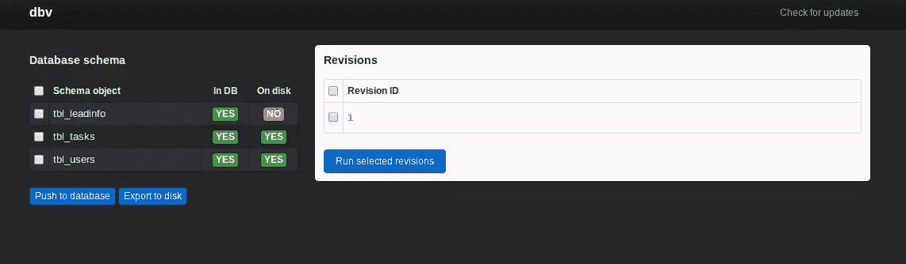
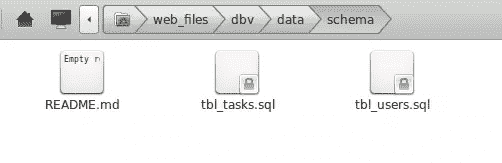
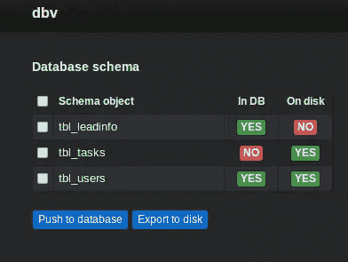
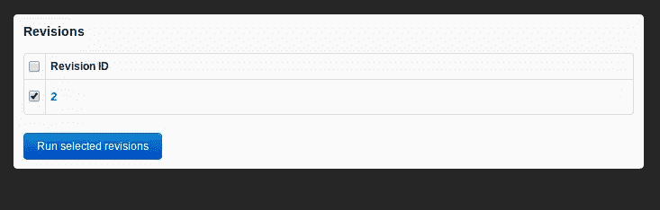

# DBV 数据库版本控制

> 原文：<https://www.sitepoint.com/database-versioning-dbv/>

在你的任何项目中总是使用版本控制系统是一个好习惯。无论是你是唯一的开发人员的附带项目，还是五个或更多人一起工作的团队项目。但是将数据库置于版本控制之下的想法并没有那么普遍。很多时候我们认为数据库是理所当然的。

但是就像我们项目中的源文件一样，数据库也在不断变化。这就是为什么我们还需要一种方法来跟踪我们所做的更改，并轻松地将其分享给我们团队的其他成员。

在这篇文章中，我们将了解一下 [DBV](https://github.com/victorstanciu/dbv) ，这是一个用 PHP 为 MySQL 数据库编写的数据库版本控制系统，所以在使用它之前，你需要安装 PHP 和 MySQL，以及 Apache 或 Nginx 这样的 web 服务器。

关于该软件的一个重要注意事项是，它不是一个独立的数据库版本控制系统，因为它需要一个版本控制系统，如 Git、Mercurial 或 SVN，以便与您的团队同步更改。

#### 安装 DBV

要开始使用 DBV，首先你必须从他们的[网站](http://dbv.vizuina.com/)下载安装程序，将其解压到你的项目目录中，然后将结果文件夹重命名为`dbv`。这将为您提供以下路径:

```
my_project/dbv
```

另一种方法是从 Github 克隆。

#### DBV 构型

您可以通过创建一个`config.php.sample`文件的副本并将其重命名为`config.php`来开始配置 DBV 的选项。

这里需要更新的最重要的是前两个部分。只需用`my_username`、`my_password`、`my_database`的值替换当前数据库配置中的值:

```
<?php
/**
 * Your database authentication information goes here
 * @see http://dbv.vizuina.com/documentation/
 */
define('DB_HOST', 'localhost');
define('DB_PORT', 3306);
define('DB_USERNAME', 'my_username');
define('DB_PASSWORD', 'my_password');
define('DB_NAME', 'my_database');

/**
 * Authentication data for access to DBV itself
 * If you leave any of the two constants below blank, authentication will be disabled
 * @see http://dbv.vizuina.com/documentation/#optional-settings
 */
define('DBV_USERNAME', 'my_username');
define('DBV_PASSWORD', 'my_password');
?>
```

上面配置文件的第一部分是关于机器中 MySQL 数据库的详细信息。

第二部分是 dbv 本身的登录细节。

接下来打开`.gitignore`文件。默认情况下，它包含以下内容:

```
config.php .buildpath .project .settings
```

Git 会忽略这些文件。但是如果您知道您和您的团队成员拥有相同的数据库信息(用户、密码、数据库名称),那么您可以从`.gitignore`文件中删除`config.php`。如果没有，那么他们将不得不创建自己的配置文件，并将其从源代码控制中排除。

接下来，您还必须将`data/meta/revision`文件添加到`.gitignore`中，因为 dbv 将数据库的本地副本信息放在那里。对于你的团队成员来说可能是不同的，所以它需要从源代码控制中排除。

完成配置后，您现在可以将 dbv 添加到版本控制中:

```
git add dbv
git commit -m "add dbv into project"
```

然后将其推送到您的中央存储库，供团队的其他成员提取:

```
git push
```

#### 要跟踪哪些更改？

在我们开始实际使用 dbv 之前。我想谈一谈要跟踪哪些变化。在数据库世界中，几乎任何更改都可以放入源代码控制中。这包括以下内容:

*   新表格
*   重命名的表
*   删除的表格
*   新字段
*   更新的字段
*   删除的字段
*   新表格行(默认表格数据)
*   更新的表格行
*   删除的表格行
*   视图
*   存储过程
*   扳机
*   函数(用户定义的函数)

#### DBV 工作流程

您可以通过访问以下 URL 从浏览器启动 dbv:

```
http://localhost/your_project/dbv
```

或者如果您定义了虚拟主机，通过访问它的 URL。

这将为您提供一个类似如下的界面:



从上面的截图中，您将看到您在前面的`config.php`中提供的数据库中当前的表。还有一个`In DB`字段显示特定的表当前是否在数据库中，还有一个`On disk`字段显示当前的表是否保存在您的文件系统中。有了这些信息，您就很清楚当前是否有数据库的最新副本。

使用 dbv 时要记住的一件重要事情是，您对数据库的本地副本所做的任何更改都应该有一个本地副本，您可以将其提交到源代码控制中。

这意味着，如果您在数据库中创建一个新表，您必须将其导出到磁盘。所有导出到磁盘的表都保存在 dbv 安装的`data/schema`目录中。您可以从下面的截图中看到，我们的文件系统中目前没有`tbl_leadinfo`表:



将新创建的表导出到磁盘后，您必须将其提交到版本控制中:

```
git add data/schema/tbl_tasks.sql
git commit -m "add tbl_task table"
```

然后，您可以将它推送到您的中央存储库:

```
git push
```

此时，您可以告诉您的团队成员，您已经在数据库中创建了一个新表，并且已经将它推送到中央 repo。现在，他们可以把它复制到本地。

```
git pull
```

接下来告诉你的队友访问 dbv 页面(`http://localhost/your_project/dbv`)。
你的队友可能会看到类似如下的屏幕:



此时，他只需勾选`tbl_tasks`表旁边的复选框，然后点击“Push to database”按钮。这将在数据库中创建`tbl_tasks`表。

这就是使用 dbv 的工作流程。很简单，不是吗？但是，如果您需要对当前的数据库模式进行更改，该怎么办呢？在将字段分发给团队之前，您可能遗漏了某个字段或忘记将其添加到特定的表上。这就是修改的地方。

#### 修订

如果您像我一样，尝试更新模式(添加新字段、删除字段、更新数据类型等)。)对于一个特定的表，您可能已经注意到 dbv 在默认情况下并不知道它。对于这些更改，您需要创建一个修订文件。您可以通过在 dbv 安装中的`data/revisions`目录下创建一个新文件夹来实现这一点。命名文件夹的惯例是使用一个数字。所以你第一次修改的时候，文件夹的名字是`1`，下一次就是`2`，以此类推。请注意，修订是可以应用于整个数据库的更改。这意味着您可以自由地修改多个表的结构，但是最好只对单个表进行修改并对其进行修订。这是为了让您和您的团队能够轻松地管理变更，并在以后理解它。这种做法的唯一例外是当变更彼此相关时。在这种情况下，将这些修改放在一个版本中是有意义的。

让我们尝试在`tbl_users`表中创建一个新字段，并将其命名为`email`:

```
ALTER TABLE `tbl_users`
ADD `email` varchar(160) COLLATE 'latin1_swedish_ci' NOT NULL
```

接下来，在 dbv 安装中的`data/revisions/1`目录下创建一个新文件，并将刚刚执行的查询作为内容。将文件命名为`tbl_users.sql`。这里的约定是使用修改后的表的名称作为修订文件的名称。
如果您要对多个表格进行修改，请为每个表格创建一个单独的文件。

之后，您可以将新文件提交到您的源代码控制中:

```
git add data/revisions/1/tbl_users.sql
git commit -m "add email field to tbl_users"
```

然后将其推送到您的中央存储库:

```
git push
```

同样，你可以通知你的队友关于特定的变化。对数据库进行更改时，沟通是关键。您希望确保团队中的每个人都和您意见一致。

现在，如果他们从浏览器访问 dbv，他们现在可以看到修订。他们现在要做的就是勾选修订旁边的复选框，然后点击“运行选定的修订”按钮。这将把您的更改提交到他们的本地数据库副本:



### 结论

DBV 是轻松管理数据库版本控制需求的好方法。它让您和您的团队可以轻松地跟踪数据库中所做的更改。它还允许通过使用 Git 与团队的其他成员轻松共享您的更改。这确保了每个人总是拥有数据库的最新副本。

在这篇文章中，我们已经看到了 DBV 和 Git 的结合使用，但是你几乎可以使用任何你选择的版本控制系统。反馈？请在下面的评论中留下吧！

## 分享这篇文章