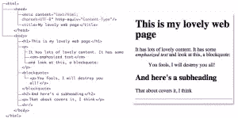

# 网页的基本结构

> 原文：<https://www.sitepoint.com/basic-structure-of-a-web-page/>

虽然本参考旨在提供各种 HTML 元素及其各自属性的详细分类，但是您还需要理解这些项目如何融入更大的画面。网页的结构如下。

## 文档类型

出现在网页源代码中的第一项是 [doctype](https://www.sitepoint.com/doctypes/ "doctypes") 声明。这为 web 浏览器(或其他用户代理)提供了有关编写页面的标记语言类型的信息，这可能会也可能不会影响浏览器呈现内容的方式。乍一看可能有点吓人，但好消息是，在您从对话框中选择了要创建的文档类型后，大多数 WYSIWYG web 编辑器会自动为您创建 doctype。如果你没有使用 WYSIWYG web 编辑包，你可以参考包含在这个参考文件中的文档类型列表，并复制你想要使用的那个。

doctype 看起来是这样的(在没有任何内容的非常简单的 HTML 4.01 页面的上下文中可以看到):

```
*<!DOCTYPE html PUBLIC "-//W3C//DTD HTML 4.01//EN""https://www.w3.org/TR/html4/strict.dtd">*<html><head><title>Page title</title></head><body></body></html>
```

在上面的例子中，文档类型与 HTML 4.01 严格相关。在本参考中，您将看到 HTML 4.01 以及 XHTfML 1.0 和 1.1 的示例，它们都是如此标识的。虽然许多元素和属性可能具有相同的名称，但是不同版本的 HTML 和 XHTML 之间存在一些明显的语法差异。您可以在标题为 [HTML 与 XHTML](https://www.sitepoint.com/web-foundations/differences-html-xhtml/) 和 [HTML 和 XHTML 语法](https://reference.sitepoint.com/html/html-xhtml-syntax) 的章节中找到更多关于这方面的信息。

## 文档树

一个网页可以被认为是一个文档树，它可以包含任意数量的分支。关于每个分支可以包含什么项目，有一些规则(这些规则在“包含”和“包含者”部分的每个元素的引用中有详细说明)。为了理解文档树的概念，考虑一个简单的网页及其树视图是很有用的，如[图 1](#page-structure__fig-doc-tree) 所示。

Figure 1\. The document tree of a simple web page


如果我们看看这个比较，我们可以看到，`html`元素实际上包含两个元素:`head`和`body`。`head`有两个子分支——一个`meta`元素和一个`title`。元素包含许多标题、段落和一个`block quote`。

请注意，标签打开和关闭的方式有些对称。例如，“它有很多可爱的内容……”这一段包含三个文本节点，其中第二个包含在一个`em`元素中(以示强调)。在内容结束之后，树中的下一个元素开始之前，段落被关闭(在本例中，它是一个`blockquote`)；将结束的`</p>`放在`blockquote`之后会破坏树的结构。

## `html`

紧接在 doctype 之后的是  元素——这是文档树的根元素，后面的所有元素都是该根元素的后代。

如果根元素存在于由文档类型标识为 XHTML 的文档的上下文中，那么`html`元素也需要一个`xmlns` (XML 名称空间)属性(HTML 文档不需要这个属性):

```
<html *>*
```

 *下面是一个 XHTML 过渡页面的例子:

```
<!DOCTYPE html PUBLIC "-//W3C//DTD XHTML 1.0 Transitional//EN""https://www.w3.org/TR/xhtml1/DTD/xhtml1-transitional.dtd">*<html >*<head><title>Page title</title></head><body></body>*</html>*
```

`html`元素将文档分成两个主要部分:  和  。*  *## `head`

`head`元素包含元数据——描述文档本身的信息，或者将它与相关资源(如脚本和样式表)相关联的信息。

下面这个简单的例子包含了必需的  元素，它代表了文档的标题或名称——本质上，它标识了这个文档是什么。`title`中的内容可能用于提供一个出现在浏览器标题栏中的标题，当用户将页面保存为收藏夹时。对于为搜索引擎提供有意义的页面摘要来说，这也是一条非常重要的信息，搜索引擎会在搜索结果中显示`title`的内容。下面是`title`不作为:

```
<!DOCTYPE html PUBLIC "-//W3C//DTD XHTML 1.0 Transitional//EN""https://www.w3.org/TR/xhtml1/DTD/xhtml1-transitional.dtd"><html ><head>*<title>Page title</title>*</head><body></body></html>
```

除了`title`元素之外，`head`还可以包含:

*   定义页面上链接或资源的 baseURLs，以及打开链接内容的目标窗口

*   指的是某种类型的源，最常见的是提供关于如何设计网页上各种元素样式的说明的样式表

*   提供有关页面的附加信息；例如，页面使用哪种字符编码、页面内容的摘要、给搜索引擎的关于是否索引内容的指示等等

*   表示媒体对象的通用、多用途容器

*   用于嵌入或引用外部脚本

*   提供用于定义嵌入式(特定于页面的)CSS 样式的区域

所有这些元素都是可选的，可以在`head`中以任何顺序出现。注意，这里列出的元素实际上都不会出现在呈现的页面上，但是它们用来影响页面上的内容，所有这些都在`body`元素中定义。

## `body`

这是包含页面大部分内容的地方。您在浏览器窗口(或视口)中看到的所有内容都包含在该元素中，包括段落、列表、链接、图像、表格等等。  元素有一些自己独特的属性，这些属性现在都被弃用了，但是除此之外，关于这个元素就没什么好说的了。页面的外观将完全取决于您决定填充的内容；参考所有 HTML 元素的字母顺序列表来确定这些内容可能是什么。

## 分享这篇文章*