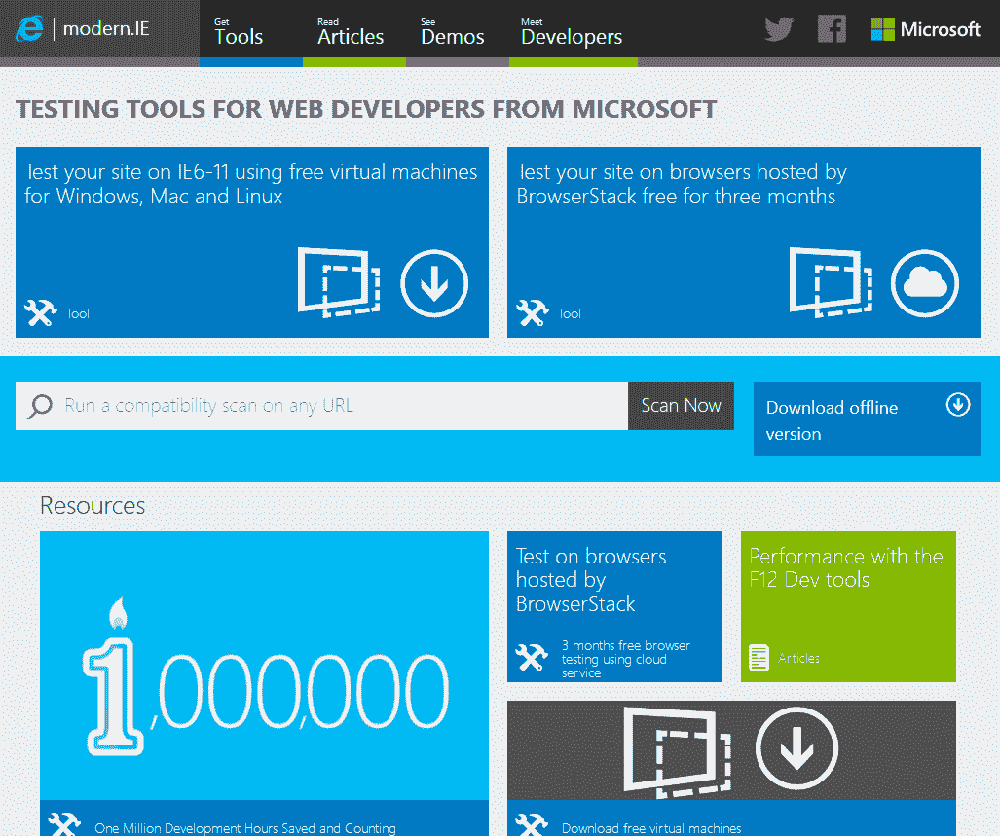
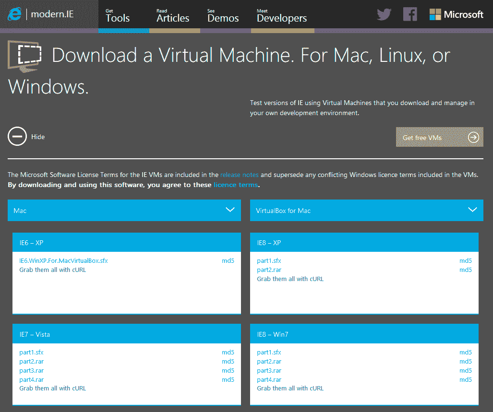
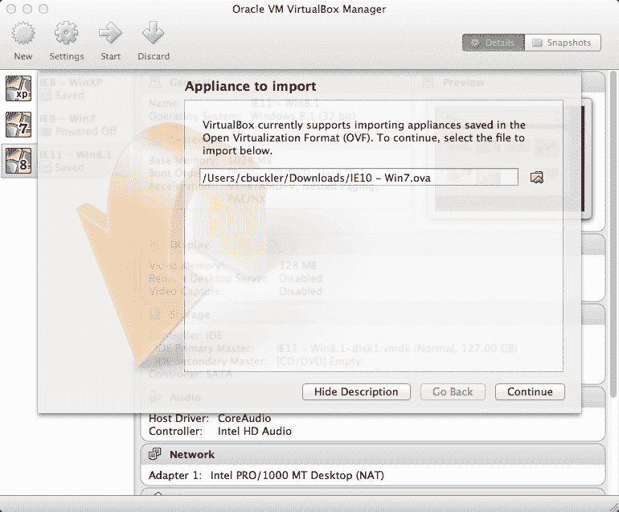
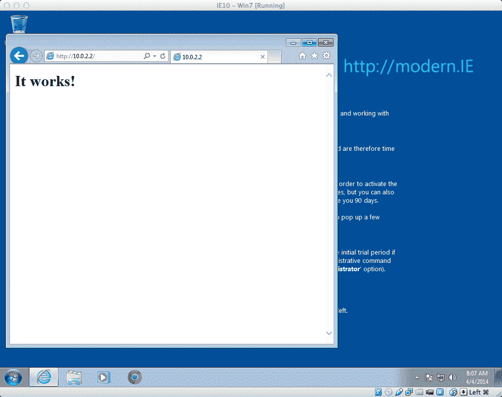
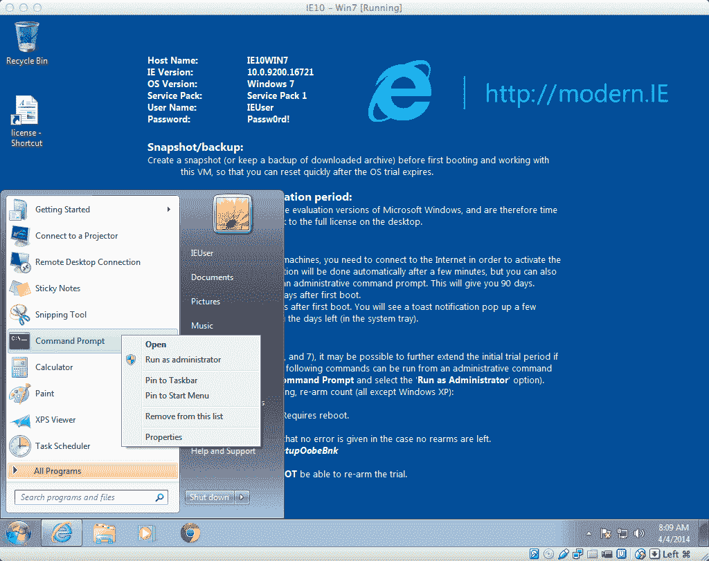

# 如何从现代测试虚拟机上的浏览器？工业管理学(Industrial Engineering)

> 原文：<https://www.sitepoint.com/virtual-machine-browser-testing-modern-ie/>

*本文由 [modern.ie](http://www.modern.ie/) 赞助。感谢您对使 SitePoint 成为可能的赞助商的支持！*

Internet Explorer 仍然是世界上第二大最常用的浏览器，几乎四分之一的用户使用桌面浏览器。其中很大一部分来自大型企业和政府机构，然而，尽管有商业机会，我们很少有人花足够的时间来测试 IE，直到为时已晚。解决方案是尽早测试并经常测试——尤其是老版本的浏览器。

测试 IE 带来了挑战；它只能在 Windows 上使用，即使这样，你也只能一次安装一个版本。模拟器和 IE 自带的文档模式会有所帮助，但是除了基本的布局检查，你不应该相信它们。

几年前，安装和维护一套带有各种 Windows 和 IE 组合的个人电脑是必要的。幸运的是，我们可以使用虚拟机在没有硬件的情况下做到这一点。

## 什么是虚拟机？

您可能见过运行旧操作系统(如 Amiga OS、游戏机或 Windows、Mac 或 Linux 上的街机)的模拟器。本质上，这些是虚拟机(VM ),使原始操作系统和软件认为它运行在真实的硬件上。实际上，这一切都发生在主机的内存中。

我们不局限于旧的操作系统，我们可以模拟真实的 PC，运行我们想要的任何平台。例如，我们可以在 Windows 8.1 上的虚拟机应用中运行 Windows XP，这样我们就可以保留旧的、不兼容的软件。因为它是作为一个数据文件来处理的，我们可以随时选择启动、停止移动或恢复 XP。

因此，虚拟机提供了一种从 Windows、Mac 或 Linux 主机上运行任何版本的 Internet Explorer 的机制。几乎没有借口——你可能已经有了软件，微软在 [modern.ie](http://www.modern.ie/) 提供了一系列免费的 Windows/IE 虚拟机。

## 虚拟机主机软件

最受欢迎的虚拟机主机有:

*   [VirtualBox](http://www.virtualbox.org/) (开源——Windows、Mac、Linux)
*   [VMware](http://www.vmware.com/) (商用——Windows、Mac、Linux)
*   [Hyper-V](http://www.microsoft.com/en-us/server-cloud/solutions/virtualization.aspx)(Windows 8 和 Server 2012 的免费附加软件)
*   [虚拟电脑](http://www.microsoft.com/en-us/download/details.aspx?id=3702)(免费 Windows 7 的附加软件)
*   [Parallels](http://www.parallels.com/) (商用-仅 Mac)

出于本文的目的，我们将使用运行在 Mac 上的 VirtualBox。它可以在所有平台上使用，易于安装，速度快，而且是免费的。前往[virtualbox.org](http://www.virtualbox.org/)，然后为你的操作系统下载并安装应用程序。

其他 VM 主机也有类似的过程——完整的指令可以在 [modern.ie](http://www.modern.ie/) 获得。

## 安装虚拟机

访问 [modern.ie](http://www.modern.ie/) 并点击**使用免费虚拟机测试你的网站**链接:

[](https://blogs.sitepointstatic.cimg/tech/943-modern.ie-vms-start.png)

现在选择您的主机操作系统和虚拟主机平台——我们使用在 Mac 上运行的 VirtualBox:

[](https://blogs.sitepointstatic.cimg/tech/943-modern.ie-vms-download.png)

呈现了各种窗口和 IE 虚拟机。在撰写本文时，有以下几种组合可供选择:

*   Windows XP + IE6
*   Windows Vista + IE7
*   Windows XP + IE8
*   Windows 7 + IE8
*   Windows 7 + IE9
*   Windows 7 + IE10
*   Windows 8 + IE10
*   Windows 7 + IE11
*   Windows 8.1 + IE11

这些是完整安装的整个操作系统的镜像:下载文件有几千兆字节大小——准备好在较慢的连接上等待很长时间吧。

也就是说，您不太可能需要所有的虚拟机。对于一般站点来说，IE6 和 IE7 都是死的。IE9 和 10 通常表现良好，并且大部分已经被 IE11 取代。因此，我建议最低限度在 XP 上使用 IE8，在 Windows 8.1 上使用 IE11，但是你应该分析你自己网站的流量，以确保你测试的是合适的组合。

选择图像后，下载所有文件。Mac VirtualBox 映像有许多 RAR 文件和一个 SFX 文件。假设您已经下载到“下载”文件夹，打开命令终端并输入:

```
cd ~Downloads
chmod +x filename.sfx
./filename.sfx 
```

其中 *filename.sfx* 是的全名。SFX 文件。这将把你的文件扩展成一个单独的 OVA 文件。

接下来，启动 VirtualBox 并从主菜单中选择**虚拟机>导入**:

[](https://blogs.sitepointstatic.cimg/tech/943-modern.ie-vms-open-ova.png)

选择 OVA 文件，点击**继续**，导入虚拟机。它将很快出现在左侧窗格的列表中。点击一次选择它，然后点击**开始**启动虚拟机。几秒钟后，您将被引导至 Windows，并可以运行 Internet Explorer:

[](https://blogs.sitepointstatic.cimg/tech/943-modern.ie-vms-test.png)

VirtualBox 在 http://10.0.2.2/上提供了一个特殊的 IP 地址，它会返回到主机的 IP 地址，因此您可以在本地服务器上测试页面。虚拟机也被添加到您的网络中，因此您可以输入主机的 IP 地址作为替代。然而，记住`http://localhost/`和`http://127.0.0.1/`是新虚拟机的本地地址——它们不能用于测试，除非您更新虚拟机的[主机文件](http://www.howtogeek.com/howto/27350/beginner-geek-how-to-edit-your-hosts-file/)。

## Windows 授权限制

所有的 [modern.ie](http://www.modern.ie/) 虚拟机都是 Windows 的完整版——你可以安装和使用任何你喜欢的软件，包括其他浏览器。

为了防止任何人使用这些映像无限期运行未经许可的 Windows 副本，它们将在 30 天后过期(除非您输入激活密钥)。此时，操作系统将随机重启，并变得几乎不可用。但是，您可以保留下载文件(或 VirtualBox OVA)的副本，并再次导入虚拟机。

幸运的是，**有一种方法可以延长 Windows 过期时间**。当您开始接收激活消息时，以管理员身份在虚拟机内运行命令提示符。这可以通过右击快捷方式并选择**以管理员身份运行**来实现。

[](https://blogs.sitepointstatic.cimg/tech/943-modern.ie-vms-extend.png)

然后，对于 XP 虚拟机，输入:

```
rundll32.exe syssetup,SetupOobeBnk
```

或者，对于 Windows Vista 7 或 8.1，请输入:

```
slmgr /rearm
```

这可以做两次，所以，实际上，你的许可证延长到 90 天。

虚拟机是在 IE 和其他 Windows 浏览器上测试你的站点的最好方法。Modern.ie 让这个过程变得更加简单和自由。*你还在等什么？*

## 分享这篇文章