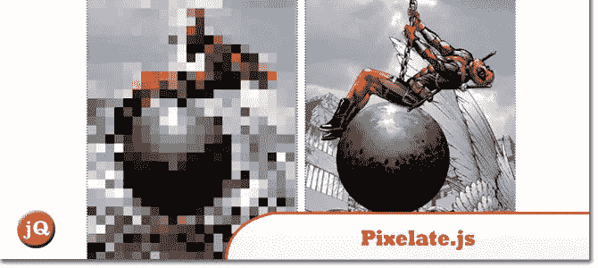
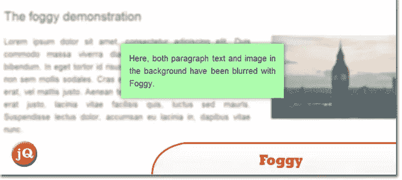
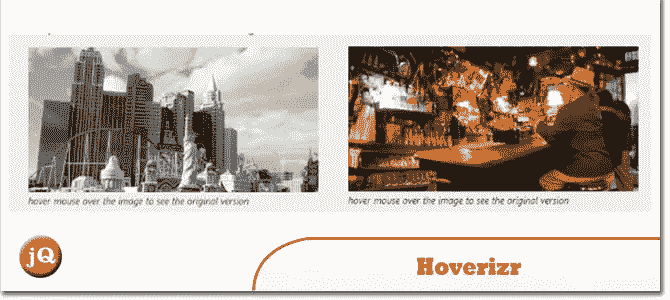
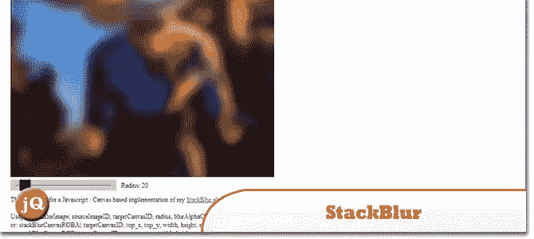

# 5+像素化和图像模糊 jQuery 插件

> 原文：<https://www.sitepoint.com/5-pixelate-image-blur-jquery-plugins/>

在本帖中，我们将与您分享 5+像素化和图像模糊 jQuery 插件。他们大多是轻量级的，易于与您的图像一起使用，以获得您的“模糊线”的效果。看看他们。

## 1.pixelate.js

是一个简单的库和 jQuery 插件，可以像素化任何一组图像，并在悬停时随意显示它们。

 
[来源](https://github.com/43081j/pixelate.js) [演示](http://43081j.github.io/pixelate/)

## 2.Vague.js

这是一个实验性的脚本，借助 SVG 过滤器，你可以模糊任何类型的 html 元素

 
[来源](https://github.com/GianlucaGuarini/vague.js) [演示](http://gianlucaguarini.github.io/Vague.js/)

## 3.有雾的

一个模糊页面元素的 jQuery 插件。它支持 IE (8 及以上)、Firefox、Safari 和 Chrome。

 
[源+演示](http://nbartlomiej.github.io/foggy/)

## 4.模糊. js

一个 jQuery 插件，可以在其他元素上生成伪透明的模糊元素

 
[来源](http://blurjs.com/) [演示](http://www.designedbyaturtle.co.uk/demos/blur-bg/)

## 5.Hoverizr

一个非常小的(2.5KB 缩小版)响应 jQuery 插件，在你的目标图像之上(或之下)输出处理过的图像。

 
[源+演示](http://www.iliasiovis.com/hoverizr/)

## 6.StackBlur

一个快速，几乎高斯模糊的画布由马里奥克林格曼，卡西蒙多。

 
[源+演示](http://www.quasimondo.com/StackBlurForCanvas/StackBlurDemo.html)

## 分享这篇文章