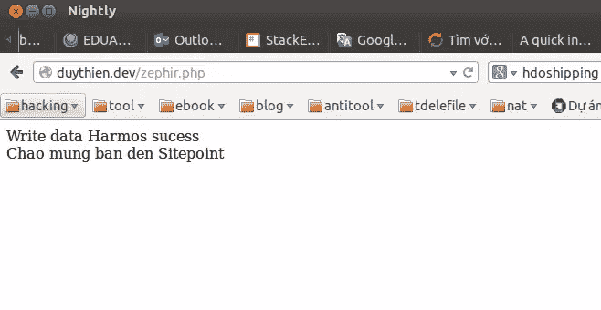
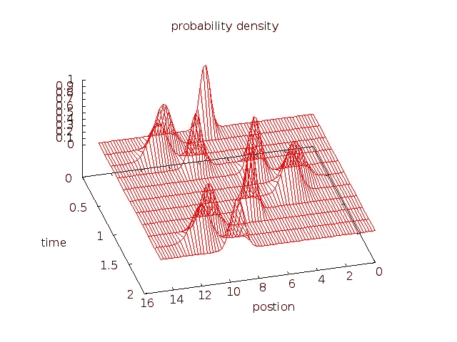

# 通过 Zephir 开始 PHP 扩展开发

> 原文：<https://www.sitepoint.com/getting-started-php-extension-development-via-zephir/>

本教程将解释如何使用一种新的语言来创建 PHP 扩展:Zephir，它类似于 C 和 Fortran。你可以从 [github](https://github.com/duythien/zephir-example) 下载完整的源代码。我们之前已经接触过泽菲尔的概念，所以如果你有兴趣获得一个广泛的概述，请看[我们之前的文章](https://www.sitepoint.com/zephir-build-php-extensions-without-knowing-c/)。

Zephir 可以被视为一种混合语言，它允许您编写看起来像 PHP 的代码，但随后被编译为原生 C，这意味着您可以从它创建一个扩展，并获得非常高效的代码。

## 装置

要构建 PHP 扩展并使用 Zephir，您需要以下内容:

*   gcc >= 4.x/clang >= 3.x/vc++ 9
*   gnu make 3.81 或更高版本
*   php 开发头文件和工具
*   re2c 0.13 或更高版本
*   json-c 型文件

每个平台的安装说明各不相同，所以我相信，如果您正在阅读一篇主题与本文一样先进的文章，您会知道如何获得它们。郑重声明——我推荐使用基于 Linux 的系统来开发 Zephir 应用程序。

获得所有必备软件后，从 Github 下载最新版本的 Zephir，然后运行 Zephir 安装程序，如下所示:

```
git clone https://github.com/phalcon/zephir
cd zephir &&  ./install -c
```

它应该会自动安装——试着输入`zephir help`。如果不起作用，将“bin”目录添加到 PATH 环境变量中。我的情况:`/home/duythien/app/zephir/bin`，像这样:

```
vi $HOME/.bash_profile 
```

追加以下导出命令:

```
export PATH=$PATH:/home/duythien/app/zephir/bin 
```

要验证新路径设置并测试安装，请输入:

```
echo $PATH
zephir help 
```

你可以找到关于 Zephir 的基础和语法，以及它的输入系统，并在他们的网站上看到一些演示脚本。

### 用 Zephir 编程

现在，我们将使用 Zephir 重新编写一个数学方程，C 和 Fortran 可以很好地处理它。这个例子相当深奥，不会解释太多细节，除非是为了展示泽菲尔的力量。

#### 有限差分求解含时薛定谔方程

[依赖于时间的薛定谔方程](http://en.wikipedia.org/wiki/Schr%C3%B6dinger_equation)可以用隐式(大矩阵)和显式(蛙跳)方法求解。我将使用显式方法。

首先，发出以下命令来创建扩展的框架:

```
zephir init myapp 
```

当这个命令完成时，在当前工作目录下创建一个名为“myapp”的目录。这看起来像:

```
myapp/
 |-----ext/
 |-----myapp/
 |-----config.json 
```

在“myapp”文件夹中，创建一个名为“quantum.zep”的文件(这将为我们提供`Myapp\Quantum`名称空间)。将以下代码复制粘贴到内部:

```
namespace Myapp;
class Quantum{

    const PI = 3.14159265358979323846;
    const MAX = 751;

    public function Harmos(double x){
        int  i,j,n;
        var  psr, psi, p2, v,paramater,fp;
        double dt,dx,k0,item_psr,item_psi;

        let dx = 0.02,
            k0 = 3.0*Myapp\Quantum::PI,
            dt = dx*dx/4.0;
        let paramater =[dx,k0,dt,x];
        let i   = 0,
            psr = [],
            psi = [],
            p2  = [],
            v   = [],
            fp  = [];           

        let fp = fopen ("harmos.txt", "w");
            if (!fp) {
            return false;
            }
        while i <= Myapp\Quantum::MAX{
            let item_psi = sin(k0*x) / exp(x*x*2.0),
                item_psr = cos(k0*x) / exp(x*x*2.0);
            let psr[i] = [item_psr],
                psi[i] = [item_psi],
                v[i] = [5.0*x*x],   
                x = x + dx,
                i++;
        }
        var tmp; 
        let i =1, j=1,tmp=[2.0];
        for n in range(0, 20000){

            for i in range(1,Myapp\Quantum::MAX - 1 ){
                let psr[i][3] =psr[i][0] - paramater[2]*(psi[i+1][0] + psi[i - 1][0]
                            - tmp[0]*psi[i][0]) / (paramater[0]*paramater[0]) + paramater[2]*v[i][0]*psi[i][0],

                p2[i] = psr[i][0]*psr[i][4] + psi[i][0]*psi[i][0];
            }
            for j in range(1,Myapp\Quantum::MAX - 1 ) {
                let psr[0][5] = 0,
                    psr[Myapp\Quantum::MAX][6]= 0 ;
                let psi[j][7] = psi[j][0] + paramater[2]*(psr[j+1][8] + psr[j - 1][9]
                             - tmp[0]*psr[j][10]) / (paramater[0]*paramater[0]) - paramater[2]*v[j][0]*psr[j][11];
            }
        //output split
        if (n ==0 || n % 2000 == 0) {
            let i =1;
            while i < Myapp\Quantum::MAX - 1 {
            fprintf(fp, "%16.8lf %16.8lf %16.8lf \n",i*dx,n*dt,p2[i]);
                let i = i + 10;
            }
            fprintf(fp, "\n");
        }
        // change new->old
        let j = 1;
        while j <  Myapp\Quantum::MAX - 1 {
                let psi[j][0] = psi[j][12],
                    psr[j][0] = psr[j][13];
                let j++;
        }

    }
    return true;    

    }
} 
```

我们已经使用了许多 PHP 函数，如 fopen()、sin()、fprintf()等——请随意研究语法。我还会再举一个例子。在使用 Phalcon PHP 框架的过程中，如果您使用越南语或德语，函数 Phalcon\Tag::friendlyTitle()是无效的。这个例子远比上面的等式简单，它创建了文件`normalizeChars.zep`。将以下代码插入文件中:

```
namespace Myapp;

class NormalizeChars{
    public function trans(var s)
    {
            var replace;
        let replace = [
            "ế" : "e",
            "ề" : "e",
            "ể" : "e",
            "ễ" : "e",
            "ệ" : "e",
            //--------------------------------E^
            "Ế" : "e",
            "Ề" : "e",
            "Ể" : "e",
            "Ễ" : "e",
            "Ệ" : "e",
            //--------------------------------e
            "é" : "e",
            "è" : "e",
            "ẻ" : "e",
            "ẽ" : "e",
            "ẹ" : "e",
            "ê" : "e",
            //--------------------------------E
            "É" : "e",
            "È" : "e",
            "Ẻ" : "e",
            "Ẽ" : "e",
            "Ẹ" : "e",
            "Ê" : "e",
            //--------------------------------i
            "í" : "i",
            "ì" : "i",
            "ỉ"  : "i",
            "ĩ" : "i",
            "ị" : "i",
            //--------------------------------I
            "Í" : "i",
            "Ì" : "i",
            "Ỉ"  : "i",
            "Ĩ" : "i",
            "Ị" : "i",
            //--------------------------------o^
            "ố" : "o",
            "ồ" : "o",
            "ổ" : "o",
            "ỗ" : "o",
            "ộ" : "o",
            //--------------------------------O^
            "Ố"  : "o",
            "Ồ" : "o",
            "Ổ"  : "o",
            "Ô" : "o",
            "Ộ"  : "o",
            //--------------------------------o*
            "ớ"  : "o",
            "ờ" : "o",
            "ở"  : "o",
            "ỡ" : "o",
            "ợ"  : "o",
            //--------------------------------O*
            "Ớ"  : "o",
            "Ờ" : "o",
            "Ở"  : "o",
            "Ỡ" : "o",
            "Ợ"  : "o",
            //--------------------------------u*
            "ứ"  : "u",
            "ừ" : "u",
            "ử"  : "u",
            "ữ" : "u",
            "ự"  : "u",
            //--------------------------------U*
            "Ứ"  : "u",
            "Ừ" : "u",
            "Ử"  : "u",
            "Ữ" : "u",
            "Ự"  : "u",
            //--------------------------------y
            "ý"  : "y",
            "ỳ" : "y",
            "ỷ"  : "y",
            "ỹ" : "y",
            "ỵ"  : "y",
            //--------------------------------Y
            "Ý"  : "y",
            "Ỳ" : "y",
            "Ỷ"  : "y",
            "Ỹ" : "y",
            "Ỵ"  : "y",
            //--------------------------------DD
            "Đ"  : "d",
            "đ" : "d",
            //--------------------------------o
            "ó"  : "o",
            "ò" : "o",
            "ỏ"  : "o",
            "õ" : "o",
            "ọ"  : "o",
            "ô" : "o",
            "ơ"  : "o",
            //--------------------------------O
            "Ó"  : "o",
            "Ò" : "o",
            "Ỏ"  : "o",
            "Õ" : "o",
            "Ọ"  : "o",
            "Ô" : "o",
            "Ơ"  : "o",
            //--------------------------------u
            "ú"  : "u",
            "ù" : "u",
            "ủ"  : "u",
            "ũ" : "u",
            "ụ"  : "u",
            "ư" : "u",
            //--------------------------------U
            "Ú"  : "u",
            "Ù" : "u",
            "Ủ"  : "u",
            "Ũ" : "u",
            "Ụ"  : "u",
            "Ư" : "u",

            //--------------------------------a^
            "ấ"  : "a",
            "ầ" : "a",
            "ẩ"  : "a",
            "ẫ" : "a",
            "ậ"  : "a",
            //--------------------------------A^
            "Ấ"  : "a",
            "Ầ" : "a",
            "Ẩ"  : "a",
            "Ẫ" : "a",
            "Ậ"  : "a",
            //--------------------------------a(
            "ắ"  : "a",
            "ằ" : "a",
            "ẳ"  : "a",
            "ẵ" : "a",
            "ặ"  : "a",
            //--------------------------------A(
            "Ắ"  : "a",
            "Ằ" : "a",
            "Ẳ"  : "a",
            "Ẵ" : "a",
            "Ặ"  : "a",
            //--------------------------------A
            "Á"  : "a",
            "À" : "a",
            "Ả"  : "a",
            "Ã" : "a",
            "Ạ"  : "a",
            "Â" : "a",
            "Ă"  : "a",
            //--------------------------------a
            "ả"  : "a",
            "ã" : "a",
            "ạ"  : "a",
            "â" : "a",
            "ă"  : "a",
            "à" : "a",
            "á"  : "a"];
        return strtr(s, replace);

    }
} 
```

现在，我们需要告诉 Zephir，我们的项目必须被编译，并且生成扩展:

```
cd myapp
zephir build 
```

第一次运行时，会执行一些内部命令，产生必要的代码和配置，将这个类导出到 PHP 扩展。如果一切顺利，您将在输出的末尾看到以下消息:

> 正在编译…
> 正在安装…
> 扩展已安装！
> 将 extension=myapp.so 添加到你的 php.ini 中
> 不要忘记重启你的网络服务器

请注意，由于 Zephir 还处于起步阶段，因此可能会遇到错误和问题。我第一次尝试编译它时，它没有工作。我尝试了以下命令，最终成功了:

```
zephir compile
cd ext/
phpize
./configure
make && sudo make install 
```

最后一个命令将把模块安装在 PHP 扩展文件夹中(在我的例子中是:`/usr/lib/php5/20121212/`)。最后一步是通过添加下面一行将这个扩展添加到 php.ini 中:

```
extension=/usr/lib/php5/20121212/myapp.so
//or
extension=myapp.so 
```

重启 Apache，就大功告成了。

#### 测试代码

现在，创建一个名为 zephir.php 的新文件:

```
$flow = new Myapp\Quantum();

$ok = $flow->Harmos(-7.5);

if ($ok == true) {
    echo "Write data Harmos sucess <br>";
}

$normalize = new Myapp\NormalizeChars();

echo $normalize->trans("Chào mừng bạn đến Sitepoint"); 
```

最后，请访问您的`zephir.php`页面。它应该类似于以下输出:



如果你在数学上是封闭的，安装 [gnuplot](http://www.gnuplot.info/download.html) 并用。我们从 Zephir 扩展中得到的 txt 输出:

```
gnuplot
splot './harmos.txt' w l 
```

该命令将使用数据文件 harmos.txt 绘制图像，如下所示，证明我们的方程计算正确。



### 保护码

在某些情况下，编译不会显著提高性能，可能是因为应用程序的 I/O 边界存在瓶颈(很可能)，而不是因为计算或内存的限制。然而，编译代码也可以给你的应用程序带来一定程度的知识保护。当使用 Zephir 生成本机二进制文件时，您也可以对用户或客户隐藏代码——Zephir 允许您编写封闭源代码的 PHP 应用程序。

### 结论

本文给出了如何在 Zephir 中创建扩展的基本指南。请记住，Zephir 不是为了取代 PHP 或 C 而创建的，而是作为它们的补充，允许开发人员进入代码编译和静态类型。Zephir 试图将 C 和 PHP 世界中最好的东西结合起来，让应用程序运行得更快，因此它与 HHVM 和 T2 黑客直接竞争。

想了解更多关于 Zephir 的信息，请查看在线文档。你喜欢这篇文章吗？请在评论中告诉我！

## 分享这篇文章