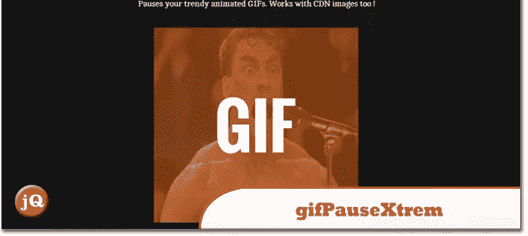
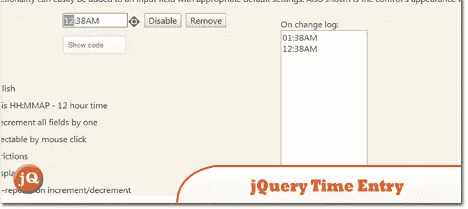
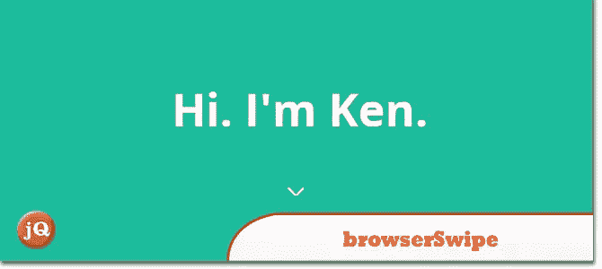
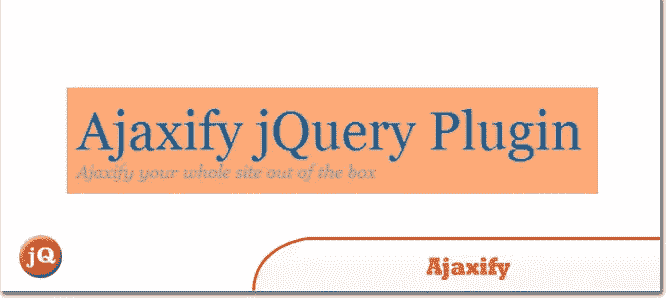
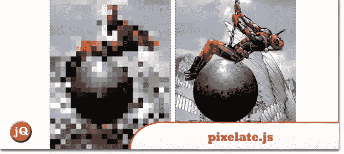
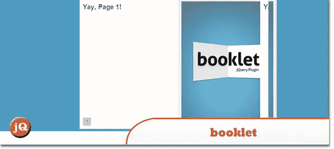
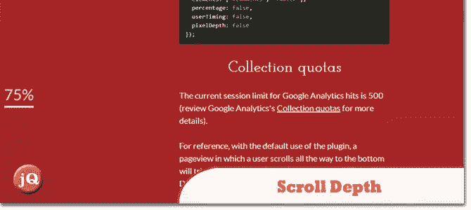
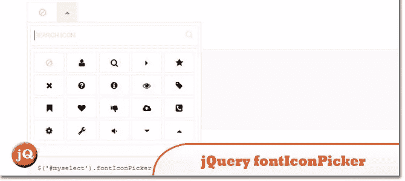
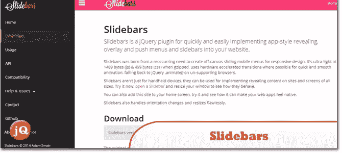
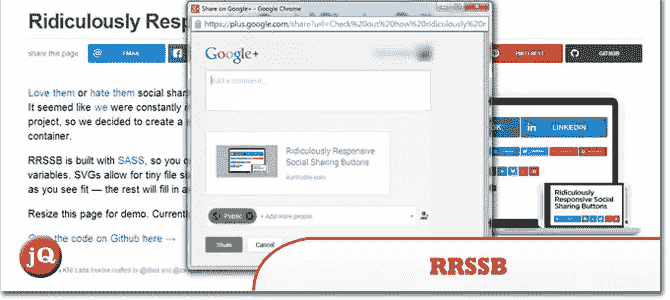

# 10 个新的随机 jQuery 插件 2014 年 3 月

> 原文：<https://www.sitepoint.com/10-random-jquery-plugins-march-2014/>

这里是我们认为应该分享的 2014 年 3 月 10 个新的随机 jQuery 插件的集合！图标选择器很酷。享受吧。=)

## 1.gifPauseXtrem

暂停动画 gif 的小 jQuery 插件

 
[来源](http://tjphweb.com/2014/03/09/gifpausextrem-a-tiny-jquery-plugin-to-pause-animated-gifs/) [演示](http://tjphweb.com/demo/gifpausextrem/)

## 2.jQuery 时间条目

一个 jQuery 插件，它设置一个输入字段来使用微调器选择时间值。

 
[源+演示](http://keith-wood.name/timeEntry.html)

## 3.browserSwipe.js

像刷手机一样刷浏览器。这是一个简单的工具，当你在你的网站上禁用滚动时，允许触控板滑动事件。

 
[来源](https://github.com/kenwheeler/browserSwipe) [演示](http://thekenwheeler.herokuapp.com/)

## 4.Ajaxify jQuery 插件

Ajax 化你的整个网站。

 
[源+演示](http://4nf.org/)

## 5.pixelate.js

jQuery 插件，用于像素化图像，并且可以选择在悬停时显示

 
[来源](https://github.com/43081j/pixelate.js) [演示](http://43081j.github.io/pixelate/)

## 6.小册子 jQuery 插件

一个 jQuery 工具，用于在“动画书”布局中显示 web 上的内容。它是使用 jQuery 库构建的。

 
[来源](http://builtbywill.com/code/booklet/installation) [演示](http://builtbywill.com/code/booklet/demos/)

## 7.滚动深度

一个用于测量页面滚动的谷歌分析插件

 
[源+演示](http://scrolldepth.parsnip.io/)

## 8.jQuery fontIconPicker

一个小的(1.58kb gzipped) jQuery 插件，允许你在你的管理表单中包含一个简单的带有搜索和分页的图标选择器。图标列表可以使用选择字段手动加载，加载图标数组或直接从 Fontello config.json 文件加载。

 
[来源](http://codeb.it/fonticonpicker/) [演示](http://codeb.it/fonticonpicker/#e1)

## 9.滑动条

一个 jQuery 插件，可以快速方便地实现应用风格的展示，覆盖和推送菜单和侧边栏到你的网站。

 
[源+演示](http://plugins.adchsm.me/slidebars/)

## 10.可笑的社交分享按钮

RRSSB 是用 SASS 构建的，所以您可以通过调整几个变量来轻松地定制它。SVG 允许微小的文件大小和视网膜支持。添加或删除你认为合适的图标——其余的将自动填充到容器中。

 
[来源](https://github.com/kni-labs/rrssb)

## 分享这篇文章