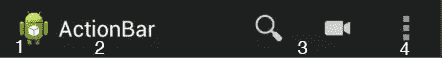
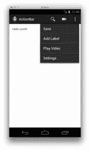
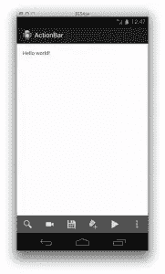
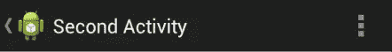
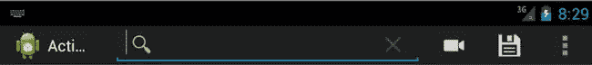
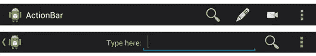

# 更好的 Android 操作栏用户界面

> 原文：<https://www.sitepoint.com/better-user-interfaces-android-action-bar/>

动作栏是一个重要的设计元素，通常位于应用程序每个屏幕的顶部，在 Android 应用程序之间提供一致的熟悉外观。它通过支持选项卡和下拉列表的轻松导航来提供更好的用户交互和体验。它还为应用程序或活动的身份提供了一个空间，从而使用户能够知道他们在应用程序中的位置，并方便地访问可以执行的操作。

动作栏是在 Android 3.0 中引入的，尽管对旧版本的支持可以通过使用 [Android 支持库](http://developer.android.com/tools/support-library/index.html)来实现。在其发布之前，选项菜单通常用于提供现在放在动作栏上的动作和功能。默认情况下，动作栏包含在`minSdkVersion`为 11 的应用程序的所有活动中。您可以禁用它并选择只使用选项菜单，但为了更好的用户体验，最好使用操作栏，因为它对用户是可见的，而选项菜单需要用户请求它，用户可能不知道它的存在。

本教程探索如何设置操作栏，并讨论它提供的不同配置。

## 设置操作栏

首先，我们将创建一个新项目。我们不会使用 Android 支持库，所以请确保选择最低版本为 11 或以上的 SDK。当您运行项目时，操作栏将包含在应用程序屏幕的顶部。它包含在所有使用或继承了[主题的活动中。赫萝](http://developer.android.com/reference/android/R.style.html#Theme_Holo)主题——当`minSdkVersion`设置为 11 或更大时，这是默认设置。下图显示了一个典型的操作栏。



操作栏包括:

*   应用程序图标-这是用来识别你的应用程序的标志或图标。
*   视图控制–这也可以用来通过标题识别应用程序或用户正在进行的特定活动。如果您的应用程序有不同的视图，它也可以用来显示这些视图，并允许在视图之间轻松切换。
*   动作按钮–这些按钮用于显示最重要和/或最常用的动作。如果没有足够的空间来显示所有的动作按钮，那些不适合的按钮会自动移动到动作溢出区。
*   动作溢出–这用于较少使用的动作。

### 将动作添加到动作栏

要将动作添加到动作栏，请在`res/menu`目录中创建一个 XML 文件，您将在其中定义每个动作。用 Java 代码定义动作是可能的，但是如果使用 XML，您将编写较少的代码。`res/menu/main_activity_bar.xml`的内容如下所示。在这个例子中，我们使用[动作栏图标包](http://developer.android.com/design/downloads/index.html#action-bar-icon-pack)作为动作图标。下载并复制必要的图标到不同屏幕密度的`res/drawable-xxxx`目录。

```
<menu xmlns:android="http://schemas.android.com/apk/res/android" >
  <item android:id="@+id/action_search"
    android:icon="@drawable/ic_action_search"
    android:title="@string/action_search"
    android:showAsAction="ifRoom" />
  <item android:id="@+id/action_record"
    android:icon="@drawable/ic_action_video"
    android:title="@string/action_record"
    android:showAsAction="ifRoom" />
  <item android:id="@+id/action_save"
    android:icon="@drawable/ic_action_save"
    android:title="@string/action_save"
    android:showAsAction="ifRoom" />
  <item android:id="@+id/action_label"
    android:icon="@drawable/ic_action_new_label"
    android:title="@string/action_label"
    android:showAsAction="ifRoom" />
  <item android:id="@+id/action_play"
    android:icon="@drawable/ic_action_play"
    android:title="@string/action_play"
    android:showAsAction="ifRoom" />
  <item android:id="@+id/action_settings"
    android:title="@string/action_settings"
    android:showAsAction="never" />
</menu>
```

接下来，将字符串文字添加到`res/values/strings.xml`，如下所示。

```
<?xml version="1.0" encoding="utf-8"?>
<resources>
  <string name="app_name">ActionBar</string>
  <string name="action_settings">Settings</string>
  <string name="action_search">Search</string>
  <string name="action_record">Record Video</string>
  <string name="action_save">Save</string>
  <string name="action_label">Add Label</string>
  <string name="action_play">Play Video</string>
  <string name="hello_world">Hello world!</string>
</resources>
```

`icon`属性获取一个图像的资源 ID，无论有没有`title`它都会出现在动作栏上。为了显示动作`title`，将`withText`添加到`showAsAction`。例如，您可以使用`android:showAsAction="ifRoom|withText"`来表示如果工具条上有空间放置动作按钮和文本，那么它们都应该显示出来。要强制总是显示一个动作，使用`showAsAction`上的`always`。但是，这并不可取，因为它可能会对较小的屏幕产生不良的布局效果。如果必须的话，把它限制在一到两个项目。

您应该始终定义`title`属性，即使您不想同时显示图标和标题，原因如下:

*   如果动作栏上没有足够的空间放置动作项，标题将用于溢出区。
*   仅仅从图标来看，用户可能不清楚操作项做了什么，因此提供标题使他们能够长按它来显示显示标题的工具提示。
*   标题为视力受损的用户提供了可访问性，因为屏幕阅读器可以阅读菜单项的标题。

接下来，我们需要在活动中实现`onCreateOptionsMenu()`回调方法。这将菜单资源膨胀到给定的`Menu`对象中，以便在动作栏中使用。这个函数的代码如下所示。

```
@Override
public boolean onCreateOptionsMenu(Menu menu) {
  MenuInflater inflater = getMenuInflater();

  inflater.inflate(R.menu.main_activity_bar, menu);
  return super.onCreateOptionsMenu(menu);
}
```

运行项目，您应该会看到类似下图的内容。一些动作按钮出现在动作栏上，而其余的可以在展开的动作溢出栏上看到。在切换到横向视图时，动作栏会自动适应新的宽度，并根据 XML 文件中给出的指导方针显示更多的动作。



### 拆分操作栏

由于操作项与应用程序图标和标题共享操作栏空间，您可能需要拆分操作栏，以便操作项显示在屏幕底部。这将为它们提供更多的空间，因此用户可以看到更多的项目。如果有足够的空间，例如在较大的屏幕上或在横向模式下，动作栏将不会被拆分。



要分割动作栏，将`android:uiOptions="splitActionBarWhenNarrow"`添加到您的清单文件中您希望分割动作栏的每个活动。这只支持 API 级及以上。要添加对较低级别的支持，请使用下面的`meta-data`元素。

```
<activity
  android:name="com.example.actionbar.MainActivity"
  android:label="@string/app_name"
  android:uiOptions="splitActionBarWhenNarrow" >
  <meta-data android:name="android.support.UI_OPTIONS"
    android:value="splitActionBarWhenNarrow" />
  <intent-filter>
    <action android:name="android.intent.action.MAIN" />

    <category android:name="android.intent.category.LAUNCHER" />
  </intent-filter>
</activity>
```

### 隐藏操作栏

您可能不希望操作栏始终对用户可见。一个常见的例子是 Gallery 应用程序，它在用户查看图像时隐藏操作栏，在用户触摸图像时显示操作栏。要在触摸时切换动作栏的可见性，请将以下内容添加到您的活动文件中。

```
@Override
public boolean onTouchEvent(MotionEvent event) {
  if(event.getAction() == MotionEvent.ACTION_DOWN) {
    toggleActionBar();
  }
  return true;
}

private void toggleActionBar() {
  ActionBar actionBar = getActionBar();

  if(actionBar != null) {
    if(actionBar.isShowing()) {
      actionBar.hide();
    }
    else {
      actionBar.show();
    }
  }
}
```

在运行应用程序时，您可以通过点击屏幕来显示/隐藏操作栏。您会注意到屏幕上的内容会随着每次显示/隐藏而改变位置。这是因为当您隐藏/显示操作栏时，活动会调整大小，从而影响内容的大小和位置。为了防止这种情况，您应该覆盖操作栏，如下所述。

### 覆盖操作栏

覆盖操作栏提供了更好的隐藏/显示体验，因为活动不会在每次隐藏/显示时调整大小，从而允许您的内容保持不变。您可以通过在主题文件中将`android:windowActionBarOverlay`设置为`true`来启用叠加。你应该使用[主题。赫萝](http://developer.android.com/reference/android/R.style.html#Theme_Holo)主题(或其后代之一)。如果你的`minSdkVersion`被设置为 11，应该是这样的。

在`res/values/styles.xml`中，添加以下内容:

```
<resources>
  <style name="AppBaseTheme" parent="android:Theme.Light">
  </style>

  <!-- Application theme. -->
  <style name="AppTheme" parent="AppBaseTheme">
    <item name="android:windowActionBarOverlay">true</item>
  </style>
</resources>
```

运行应用程序，注意当操作栏隐藏和显示时，屏幕上的内容没有改变位置。

### 添加向上导航

应用程序中所有不是应用程序主入口的屏幕(“主页”屏幕)都应该为用户提供一种方法，通过按下操作栏中的向上按钮来导航到应用程序层次结构中的逻辑父屏幕。从 API 级别 14 开始，您可以通过在清单文件的`activity`元素中指定`android:parentActivityName`属性来声明每个活动的逻辑父级。为了支持更低的版本，包括支持库，并指定父 activity 作为`android.support.PARENT_ACTIVITY`的值，匹配`android:parentActivityName`属性。

我们将添加另一个活动来演示这一点。添加另一个名为`SecondActivity`的活动文件，如下面的代码清单所示。我们调用`setDisplayHomeAsUpEnabled()`来允许操作栏中的应用图标向上导航。这将在应用程序图标旁边添加一个朝左的插入符号。当它被按下时，活动接收到对`onOptionsItemSelected()`的呼叫。

```
package com.example.actionbar;

import android.app.Activity;
import android.os.Bundle;
import android.support.v4.app.NavUtils;
import android.view.Menu;
import android.view.MenuInflater;
import android.view.MenuItem;

public class SecondActivity extends Activity {

  @Override
  protected void onCreate(Bundle savedInstanceState) {
    super.onCreate(savedInstanceState);
    setContentView(R.layout.second_activity);
    getActionBar().setDisplayHomeAsUpEnabled(true);
  }

  @Override
  public boolean onCreateOptionsMenu(Menu menu) {
    // Inflate the menu items for use in the action bar
    MenuInflater inflater = getMenuInflater();

    inflater.inflate(R.menu.second_activity_bar, menu);
    return super.onCreateOptionsMenu(menu);
  }

  @Override
  public boolean onOptionsItemSelected(MenuItem item) {
    switch (item.getItemId()) {
      // Respond to the action bar's Up/Home button
      case android.R.id.home:
        NavUtils.navigateUpFromSameTask(this);
        return true;
    }

    return super.onOptionsItemSelected(item);
  }
}
```

在`res/layout/second_activity.xml`中，添加以下内容:

```
<RelativeLayout xmlns:android="http://schemas.android.com/apk/res/android"
  android:id="@+id/RelativeLayout1"
  android:layout_width="fill_parent"
  android:layout_height="fill_parent"
  android:orientation="vertical" >

  <TextView
    android:id="@+id/TextView1"
    android:layout_width="wrap_content"
    android:layout_height="wrap_content"
    android:layout_centerHorizontal="true"
    android:layout_centerVertical="true"
    android:text="@string/hello_world_again" />
</RelativeLayout>
```

接下来，将以下字符串添加到`res/values.strings.xml`。

```
<string name="hello_world_again">Hello world, again!</string>
<string name="second">Go To Second Activity</string>
<string name="second_activity_title">Second Activity</string>
```

然后，为第二个活动的操作栏创建一个资源文件。将该文件命名为`res/menu/second_activity_bar.xml`，并添加以下 XML。

```
<menu xmlns:android="http://schemas.android.com/apk/res/android" >
  <item
    android:id="@+id/action_settings"
    android:orderInCategory="100"
    android:showAsAction="never"
    android:title="@string/action_settings"/>
</menu>
```

接下来，将活动添加到清单文件中:

```
<application>
  ...
  <activity
    android:name="com.example.actionbar.SecondActivity"
    android:label="@string/second_activity_title"
    android:parentActivityName="com.example.actionbar.MainActivity" >
    <meta-data
      android:name="android.support.PARENT_ACTIVITY"
      android:value="com.example.actionbar.MainActivity" />
  </activity>
  ...
</application>
```

然后，向`res/layout/activity_main.xml`中的主活动添加一个按钮:

```
<Button
  android:id="@+id/second"
  android:layout_width="fill_parent"
  android:layout_height="wrap_content"
  android:layout_alignLeft="@+id/TextView1"
  android:layout_centerVertical="true"
  android:onClick="openSecondActivity"
  android:text="@string/second" />
```

另外，在`MainActivity.java`中添加`onClick`处理程序。这个函数，如下所示，将在单击按钮时启动第二个活动。

```
public void openSecondActivity(View view) {
  Intent intent = new Intent(this, SecondActivity.class);
  startActivity(intent);
}
```

运行应用程序。在第一个屏幕上会有一个按钮，当按下该按钮时，会调出第二个屏幕，其操作栏如下所示。请注意单击时导航到父活动的插入符号。



## 动作栏交互性

到目前为止，我们已经创建了点击时什么也不做的动作项。接下来，我们将看到如何给动作栏添加一些交互性。

### 处理行动项目上的点击

当一个动作被点击时，活动的`onOptionsItemSelected()`方法被调用。动作可以通过调用`getItemId()`来识别。将`onOptionsItemSelected()`方法添加到`MainActivity.java`，如下例所示。这里，当每个动作被点击时，我们显示不同的消息。

```
@Override
public boolean onOptionsItemSelected(MenuItem item) {
  // Handle presses on the action bar items
  switch (item.getItemId()) {
    case R.id.action_search:
      // Code you want run when activity is clicked
      Toast.makeText(this, "Search clicked", Toast.LENGTH_SHORT).show();
      return true;
    case R.id.action_record:
      Toast.makeText(this, "Record clicked", Toast.LENGTH_SHORT).show();
      return true;
    case R.id.action_save:
      Toast.makeText(this, "Save clicked", Toast.LENGTH_SHORT).show();
      return true;
    case R.id.action_label:
      Toast.makeText(this, "Label clicked", Toast.LENGTH_SHORT).show();
      return true;
    case R.id.action_play:
      Toast.makeText(this, "Play clicked", Toast.LENGTH_SHORT).show();
      return true;
    case R.id.action_settings:
      Toast.makeText(this, "Settings clicked", Toast.LENGTH_SHORT).show();
      return true;
    default:
      return super.onOptionsItemSelected(item);
  }
}
```

### 行动视图

动作视图是出现在动作栏中的交互式小部件，作为动作按钮的替代品。它们允许将偶尔使用的 UI 项放在动作栏上，从而避免不必要的屏幕空间消耗和使用它们的活动切换。

要声明一个动作视图，使用`actionLayout`或`actionViewClass`属性分别指定要使用的布局资源或小部件类。举个简单的例子，要在我们的例子中添加一个`SearchView`小部件，修改`res/menu/main_activity_bar.xml`中的搜索动作如下。

```
<item android:id="@+id/action_search"
  android:icon="@drawable/ic_action_search"
  android:title="@string/action_search"
  android:showAsAction="ifRoom|collapseActionView"
  android:actionViewClass="android.widget.SearchView" />
```

在运行应用程序时，当单击搜索动作时，将出现编辑文本视图。



我们将在动作栏中添加我们自己的自定义视图。创建一个名为`res/layout/my_action.xml`的布局文件。这将是自定义视图的布局资源。

```
<LinearLayout xmlns:android="http://schemas.android.com/apk/res/android"
  android:layout_width="fill_parent"
  android:layout_height="fill_parent" >
  <TextView
    android:id="@+id/myActionTextView"
    android:layout_width="fill_parent"
    android:layout_height="wrap_content"
    android:layout_weight="1"
    android:text="Type here:"
    android:gravity="right" />
  <EditText
    android:id="@+id/myActionEditText"
    android:layout_width="fill_parent"
    android:layout_height="wrap_content"
    android:layout_weight="1"
    android:gravity="left" />
</LinearLayout>
```

然后，将动作项添加到`res/menu/main_activity_bar.xml`，如下图所示。

```
<item android:id="@+id/my_action"
  android:icon="@drawable/ic_action_edit"
  android:title="My Action"
  android:showAsAction="ifRoom|collapseActionView"
  android:actionLayout="@layout/my_action" />
```

这将使用我们上面添加的布局。`collapseActionView`折叠动作视图，以便只有图标显示在动作栏上，点击时，它会展开以显示编辑文本视图。单击向上插入符号退出动作视图。



接下来，更新了主活动文件`MainActivity.java`，如下所示。请注意整个代码中的注释。

```
package com.example.actionbar;

import android.os.Bundle;
import android.app.ActionBar;
import android.app.Activity;
import android.content.Intent;
import android.support.v4.view.MenuItemCompat;
import android.support.v4.view.MenuItemCompat.OnActionExpandListener;
import android.view.KeyEvent;
import android.view.Menu;
import android.view.MenuInflater;
import android.view.MenuItem;
import android.view.MotionEvent;
import android.view.View;
import android.widget.EditText;
import android.widget.TextView;
import android.widget.Toast;

public class MainActivity extends Activity implements TextView.OnEditorActionListener {

  private MenuItem myActionMenuItem;
  private EditText myActionEditText;

  @Override
  protected void onCreate(Bundle savedInstanceState) {
    super.onCreate(savedInstanceState);
    setContentView(R.layout.activity_main);
  }

  @Override
  public boolean onCreateOptionsMenu(Menu menu) {
    // Inflate the menu items for use in the action bar
    MenuInflater inflater = getMenuInflater();
    inflater.inflate(R.menu.main_activity_bar, menu);

    // Here we get the action view we defined
    myActionMenuItem = menu.findItem(R.id.my_action);
    View actionView = myActionMenuItem.getActionView();

    // We then get the edit text view that is part of the action view
    if(actionView != null) {
      myActionEditText = (EditText) actionView.findViewById(R.id.myActionEditText);

      if(myActionEditText != null) {
        // We set a listener that will be called when the return/enter key is pressed
        myActionEditText.setOnEditorActionListener(this);
      }   
    }

    // For support of API level 14 and below, we use MenuItemCompat
    MenuItemCompat.setOnActionExpandListener(myActionMenuItem, new OnActionExpandListener() {
      @Override
      public boolean onMenuItemActionCollapse(MenuItem item) {
        // Do something when collapsed
        return true;  // Return true to collapse action view
      }

      @Override
      public boolean onMenuItemActionExpand(MenuItem item) {
        // Do something when expanded
        if(myActionEditText != null) {
          myActionEditText.setText("");
        }

        return true;  // Return true to expand action view
      }
    });

    return super.onCreateOptionsMenu(menu);
  }

  @Override
  public boolean onTouchEvent(MotionEvent event) {
    if(event.getAction() == MotionEvent.ACTION_DOWN) {
      toggleActionBar();
    }

    return true;
  }

  private void toggleActionBar() {
    ActionBar actionBar = getActionBar();

    if(actionBar != null) {
      if(actionBar.isShowing()) {
        actionBar.hide();
      }
      else {
        actionBar.show();
      }
    }
  }

  public void openSecondActivity(View view) {
    Intent intent = new Intent(this, SecondActivity.class);
    startActivity(intent);
  }

  @Override
  public boolean onOptionsItemSelected(MenuItem item) {
    // Handle presses on the action bar items
    switch (item.getItemId()) {
      case R.id.action_search:
        // Code you want run when activity is clicked
        Toast.makeText(this, "Search clicked", Toast.LENGTH_SHORT).show();
        return true;
      case R.id.action_record:
        Toast.makeText(this, "Record clicked", Toast.LENGTH_SHORT).show();
        return true;
      case R.id.action_save:
        Toast.makeText(this, "Save clicked", Toast.LENGTH_SHORT).show();
        return true;
      case R.id.action_label:
        Toast.makeText(this, "Label clicked", Toast.LENGTH_SHORT).show();
        return true;
      case R.id.action_play:
        Toast.makeText(this, "Play clicked", Toast.LENGTH_SHORT).show();
        return true;
      case R.id.action_settings:
        Toast.makeText(this, "Settings clicked", Toast.LENGTH_SHORT).show();
        return true;
      default:
        return super.onOptionsItemSelected(item);
    }
  }

  @Override
  public boolean onEditorAction(TextView textView, int i, KeyEvent keyEvent) {
    if(keyEvent != null) {
      // When the return key is pressed, we get the text the user entered, display it and collapse the view
      if(keyEvent.getAction() == KeyEvent.ACTION_DOWN && keyEvent.getKeyCode() == KeyEvent.KEYCODE_ENTER) {
        CharSequence textInput = textView.getText();
        // Do something useful with the text
        Toast.makeText(this, textInput, Toast.LENGTH_SHORT).show();
        MenuItemCompat.collapseActionView(myActionMenuItem);
      }
    }
    return false;
  }
}
```

在这段代码中，我们在动作视图布局`myActionEditText`中获得了编辑文本视图，并在其上设置了一个监听器。我们希望当用户键入一些文本并按下 return 时进行操作。默认情况下，当用户按下 Return 键时，光标会转到新的一行。相反，我们希望折叠 action 视图并获得用户的输入。这是通过`onEditorAction`方法完成的，该方法检查编辑文本视图上按键事件的类型。如果是 Enter，则捕获并显示文本输入。然后，操作视图被折叠。

我们在带有`MenuItemCompat.setOnActionExpandListener`的动作视图上设置了一个监听器，以了解视图何时展开和折叠。`MenuItemCompat`用于支持旧的 API 版本。

默认情况下，当用户输入文本并离开 action 视图时，再次展开它时，前面的文本仍然可见。我们使用`onMenuItemActionExpand()`在动作视图展开之前删除任何文本，这样编辑文本视图将是空白的。

## 结论

动作栏是一个重要的设计元素，它可以用来极大地改善应用程序的用户体验。我们已经看到了一些你可以在应用程序 UI 的操作栏上使用的配置，但是还有更多。欲了解更多信息，请查看[文档](http://developer.android.com/guide/topics/ui/actionbar.html)。你可以[在 GitHub 上看到本文使用的代码](https://github.com/sitepoint-examples/android-action-bar)。

## 分享这篇文章