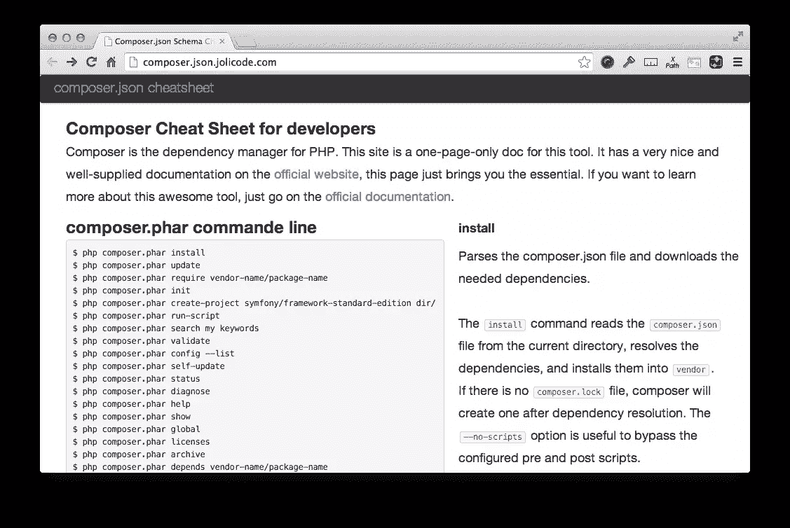
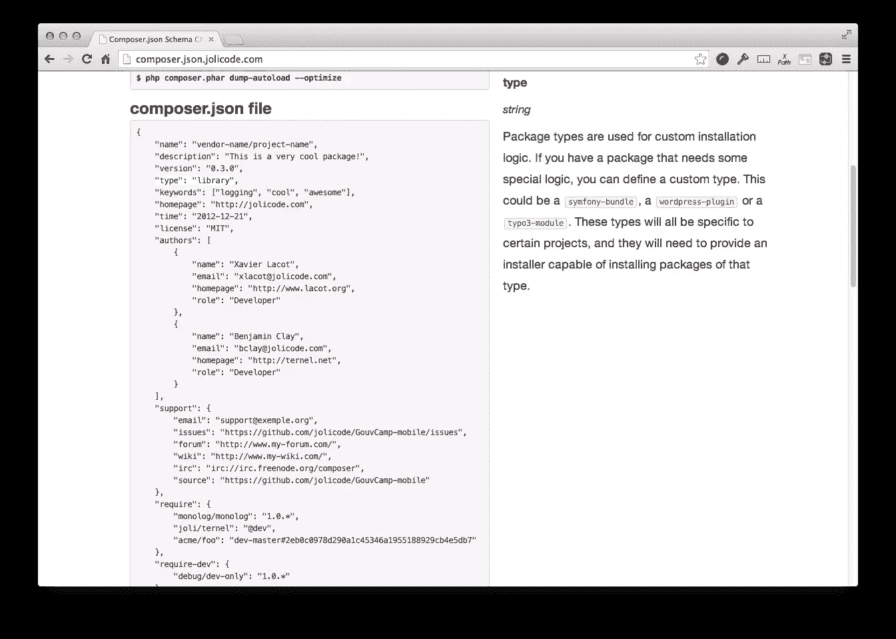

# 作曲家备忘单

> 原文：<https://www.sitepoint.com/composer-cheatsheet/>

*本文由 [AppDynamics](http://www.appdynamics.com/solutions/php-monitoring-solution) 赞助。感谢您对使 SitePoint 成为可能的赞助商的支持！*

除非你一直生活在岩石下，否则今天的 PHP 不是你祖母的 PHP；这是一种完全不同的、更加优雅和成熟的语言，有无数的改进和增加。

其中一个关键的新增功能[是 Composer](http://getcomposer.org) ，这是管理 PHP 项目依赖关系的事实上的标准，默认情况下，通过 Packagist.org 的[，你可以访问数百个现成的库。](http://packagist.org "The PHP package archivist.")

我不打算讨论如何使用 Composer，因为它已经在 SitePoint 上讨论得很好了；尤其是这篇文章，作者亚历山大·科尼奥。

相反，我正从一个不同的角度接近它，带你浏览我最近偶然发现的[优秀作曲家小抄](http://composer.json.jolicode.com/)。

如果你想看一个快速的视频概览，请播放下面嵌入的视频。否则，继续阅读。我鼓励你两样都做。

[//www.youtube.com/embed/RuGMRXbpdVA](//www.youtube.com/embed/RuGMRXbpdVA)

像任何复杂、功能丰富的工具一样，使用 Composer 可以做很多事情。例如，您可以使用 composer.phar 文件来:

*   向现有项目添加作曲支持
*   运行脚本[以响应各种事件](https://getcomposer.org/doc/articles/scripts.md#event-names)，例如*预安装和后安装*、*预安装和后安装包更新*
*   指定自定义自动加载器
*   根据项目是处于*开发*、*测试*、*现场*还是另一个特定的环境，区分依赖关系
*   通过[Packagist.org](http://packagist.org "The PHP package archivist.")使用数百个现成的软件包

仅通过这些示例，您就可以看到有许多功能，以及**许多需要记住的东西**。

所以当你在每个项目中使用它的时候，你知道它能提供什么吗？或者您是否一次又一次地使用同一套命令行开关和配置选项，而不考虑还有什么可用的？

我建议，如果你和我一样，你应该属于后一种阵营。今天，我想通过阅读备忘单来帮助您纠正这一点，并真正充分利用 Composer。

我相信你会明白为什么它名副其实；不久之后，您将开始在一个固定的标签中拥有它，就像 PHP 手册一样。**有那么好！**

## 2 个关键部分

本质上，它由两个关键部分组成:

1.  composer.phar 命令行开关
2.  composer.json 文件

## composer.phar 命令行开关



本节列出了您可以在命令行传递给`composer.phar`的所有命令行开关。更重要的是，将鼠标悬停在它们的右侧，您会看到对每一个功能的更全面的描述。

它列出了从最常见、最常用到更高级的选项。这里有一个例子:

*   **安装**–在供应商目录中设置依赖关系
*   **自我更新**–将 composer.phar 文件更新至最新版本
*   **init**–在现有的或新的项目中设置 composer 支持
*   **验证**——验证现有的 composer.json 文件
*   **诊断**–用于执行自动检查
*   **存档**–创建 composer 包的存档。

通过使用备忘单，我了解到通过将`--optimize`开关传递给`dump-autoload`，您可以在您的项目中获得高达 20%的性能提升的任何东西**。**

不算太寒酸，你说呢？好吧，我本可以通过测试发现这一点，或者翻看文档，但是备忘单使它变得快速而容易找到。

## composer.json 文件配置



我建议您在这一部分花大部分时间阅读备忘单。虽然调用 composer.phar 很大程度上可以通过脚本来完成，但是您需要的每个项目的配置可能会经常不同，每次都需要各种不同的选项。

所以 composer.json 板块在这方面绝对是你的朋友。和 composer.phar 一样，它展示了一个例子，利用了每一个选项。它从最常见的选项开始列出所有选项，比如**名称**、**描述**、**作者**和**需求**，它们提供了关于包的关键信息，以及它的依赖项。

Authors 就是一个很好的例子，展示了 2 个样本作者的*姓名*、*邮箱*、*主页*和*角色*，如下图所示:

```
"authors": [
    {
        "name": "Xavier Lacot",
        "email": "xlacot@jolicode.com",
        "homepage": "http://www.lacot.org",
        "role": "Developer"
    },
    {
        "name": "Benjamin Clay",
        "email": "bclay@jolicode.com",
        "homepage": "http://ternel.net",
        "role": "Developer"
    }
], 
```

还有更高级的，我们可能不经常使用的。

*   **支持**–当用户需要帮助时，您可以在这里找到支持选项列表
*   **自动加载**–您可以在这里为 PHP 自动加载器设置特定的自动加载映射选项
*   **存储库**——允许你超越标准的 Packagist 后端，添加 PEAR，使用版本控制工具，如 GitHub、Bitbucket 或一个使用 [Satis](https://getcomposer.org/doc/articles/handling-private-packages-with-satis.md) 的自托管私有包。

这是脚本部分的一个示例。您可以看到它列出了如何使用命名空间类的静态类方法来响应几个事件。

```
"scripts": {
    "post-update-cmd": MyVendor\\MyClass::postUpdate",
    "post-package-install": [
        "MyVendor\\MyClass::postPackageInstall"
    ],
    "post-install-cmd": [
        "MyVendor\\MyClass::warmCache",
        "phpunit -c app/"
    ]
}, 
```

与 composer.phar 部分一样，将鼠标悬停在它们上面，您会在右侧看到该部分的细节，以及示例用法。

## 结论

我相信它是充分利用 Composer 的一个很好的工具。有人可能会说只有一页，不够详细；**我不同意**。

备忘单的编写方式是展示每个命令行选项的示例用法，列出一个完整的 composer.json 文件示例，结合每个方面的详细描述和进一步的用法示例，这是一种优雅的方法。

你可以获得你需要的尽可能多的信息，而不会超负荷。你怎么想呢?你认为它能更进一步，提供更多的信息吗？还是长度刚刚好？请在评论中分享你的想法。

由于它是开源的，如果你看到一些需要改进的地方，一个错别字，或者一般想添加更多的信息，进入那里，[分叉它并发送一个拉请求](https://github.com/jolicode/composer-cheatsheet/blob/gh-pages/index.html)。

否则，享受吧。

## 分享这篇文章