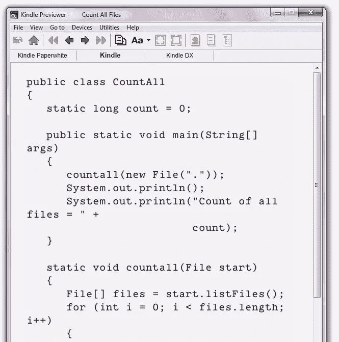
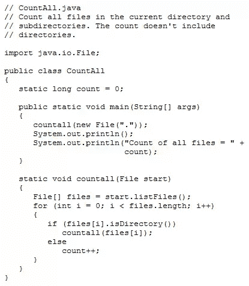
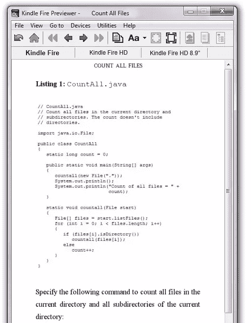
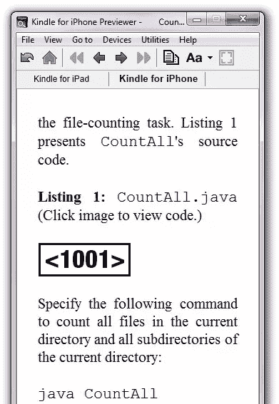
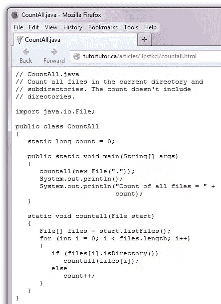
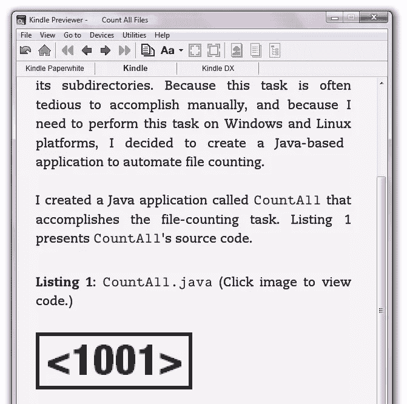

# 如何在 Kindle 设备上显示代码列表:3 个解决方案

> 原文：<https://www.sitepoint.com/code-listings-kindle-devices/>

亚马逊的 Kindle 电子阅读器非常适合呈现小说。然而，当显示技术内容时，它们是有问题的。一个问题是代码列表通常看起来很糟糕，导致许多开发者不愿使用 Kindle 作为分发媒介。

在本文中，我首先回顾了格式不良的代码清单的问题。然后，我提供了三种呈现格式良好的代码的策略。我依靠 Kindle 预览器的电子阅读器模拟器来显示结果。

## 首先:关于 pdf 的说明

除了最老的 Kindles 之外，你可以创建一个所有人都可以显示的 PDF，而不是创建一个原生电子书。然而，pdf 有一个问题:虽然代码清单和其他内容的格式很好，但是 pdf 很难阅读。当 PDF 页面完全适合屏幕时，字体太小，或者需要更大的字体，从而需要过多的水平滚动。

## Kindle 代码列表的问题是

亚马逊已经发布了几款不同屏幕尺寸的 Kindle 设备。此外，Kindle 允许用户改变设备的字体大小。因为水平和垂直空间的数量变化很大，所以不可能创建一个适合所有设备/配置的代码列表。

代码行通常会从一行换行到下一行，使得代码难以阅读，尤其是在字体较大的情况下，行与行之间有更多的换行。例如，下图显示了 Kindle 预览器模拟器中用于 Kindle 电子墨水设备的带换行的代码列表。



基本的 Kindle 电子墨水设备显示了一个混乱的代码列表。

在上图中，您可以看到名为 CountAll 的 Java 应用程序的源代码——Java 源文件具有. Java 文件扩展名。您会注意到源代码从一行的末尾绕到下一行的开头，看起来很乱。

在本文中，我探讨了改善 CountAll.java 源代码外观的三种策略。但是，首先，请查看下面的代码，它显示了导致上图的 HTML。

```
<pre>// CountAll.java
// Count all files in the current directory and
// subdirectories. The count doesn't include
// directories.

import java.io.File;

public class CountAll
{
static long count = 0;

public static void main(String[] args)
{
countall(new File("."));
System.out.println();
System.out.println("Count of all files = " +
count);
}

static void countall(File start)
{
File[] files = start.listFiles();
for (int i = 0; i &amp;lt; files.length; i++)
{
if (files[i].isDirectory())
countall(files[i]);
else
count++;
}
}
}</pre>
```

您可以在本文底部的下载链接中看到完整的 HTML 文档。为了演示我在本文中提出的每个解决方案，我将修改您在上面看到的部分。

## 解决方案 1:使用图像

也许改进代码清单格式的最简单策略是用代码清单的图像来替换它。这意味着您只需截取代码清单的截图，然后将生成的图像嵌入到电子书中。例如，下图展示了一张`CountAll.java`的截图。



此图片取代了`CountAll.java`代码列表。

要将这个截图作为我们的代码清单，我们可以简单地删除`<pre>`标签及其所有内容，并用一个图像替换它们，如下所示:

```

```

下面的截图显示了图像在 Kindle 预览器的 Kindle Fire 电子墨水设备模拟器中的外观。



`CountAll.java`代码列表被替换为列表的图像。

尽管实现简单，但这种解决方案存在问题:

*   图像文本的字体大小是固定的。尽管用户可以调整常规文本的字体大小，但这种调整不适用于图像。视力不好的用户阅读这篇文章会有困难。
*   [亚马逊声明](https://kdp.amazon.com/self-publishing/help?topicId=A1B6GKJ79HC7AN)“Kindle 文件格式内部支持最大 127KB 的 JPEG 和 GIF 图像”，尽管有人观察到你可以超过这个大小。您需要确保单个图像不会太大，这对非常详细的图像来说可能是个问题。
*   压缩图像以减小其尺寸很可能会引入[压缩伪像](http://kdp.amazon.com/community/message.jspa?messageID=691876)。此外，文本可能会显得模糊不清，使其难以阅读，并导致眼睛疲劳。
*   一个很长的垂直列表的图像可能会出现在后续页面的顶部，在前面的页面上留下许多垂直空白。这种难看的间隙可能会惹恼读者。
*   亚马逊收取每兆字节 15 美分的送货费。一本有很多图片的书可能会变得越来越大，导致运输费消耗掉你每本书的利润。

在一本书里放几张高质量的图片通常不成问题。然而，依靠这个解决方案来呈现所有的代码清单可能会让您付出代价。

## 解决方案 2:使用占位符图像和链接

尽管存在各种各样的问题，以前的形象战略还是有一些优点的。但是，考虑为清单创建一个小的占位符图像并将该图像呈现给用户，而不是用这些清单的图像替换代码清单，如下所示:



读者可以单击占位符图像，通过设备的浏览器查看代码列表。

这里我们看到一个小的占位符图像(`<1001>`)，用于 iPhone 模拟器上下文中的代码列表。单击该图像会导致设备的浏览器运行并显示代码，您可以将该代码放在您的网站上，如下所示:



Firefox 显示了我网站上的代码。

为了改变我们的 HTML 来使用这个方法，我们将再次替换原始代码中的`<pre>`部分，或者替换我们在第一个解决方案中使用的图像:

```
<a href="http://tutortutor.ca/articles/3psfkcl/countall.html"></a>
```

这里我们包括一个链接的占位符图像，它存储在`code.png`中。当您点击此图像时，设备的浏览器会显示`http://tutortutor.ca/articles/3psfkcl/countall.html`的内容。

## 解决方案 3:使用媒体查询、CSS 和链接

引入一个可点击的占位符图像来代替单独的代码列表图像是一个改进。不仅最终的电子书更小(从而最大限度地减少了亚马逊的送货费用)，这种解决方案还能让你利用设备的浏览器更好地查看代码。

但我认为我们可以做得更好。例如，我们可以在屏幕更宽的 Kindle Paperwhite 和 Kindle Fire 设备上显示代码列表，我们还可以为其他 Kindle 设备(屏幕更窄)显示占位符图像/可点击链接。

较新的 Kindles 提供了更好的 CSS 样式支持，这让您可以呈现格式良好的代码清单。你可以通过利用亚马逊的 [CSS 媒体查询](https://www.sitepoint.com/web-foundations/understanding-media-queries/)来确定使用的是新的还是旧的 Kindle。

亚马逊支持以下媒体查询，用于区分 Kindle Fire 类设备和其他 Kindle 设备:

*   `@media amzn-kf8`:此媒体查询适用于 Kindle Format 8 (KF8)格式，该格式是为 Kindle Fire 设备推出的，也受 [Kindle Paperwhite 设备](http://www.amazon.com/Kindle-Paperwhite-Touch-light/dp/B007OZNZG0)支持。
*   `@media amzn-mobi`:此媒体查询适用于 Mobi 格式，其他设备也支持。

在为网页设置 CSS 样式时，您会用到这些媒体查询。例如，查看以下 CSS:

```
.kf8content { display: block; }
.mobicontent { display: none; }

@media amzn-mobi {
.kf8content { display: none; }
.mobicontent { display: block; }
}

@media amzn-kf8 {
pre {
background: #ffffcc;
border: thin solid #ccccff;
clear: both;
color: black;
font-family: monospace;
font-size: small;
line-height: 100%;
margin: 0;
padding: 0.5em;
text-align: left;
word-wrap: normal;
overflow: hidden
}
}
```

这部分 CSS 引入了`kf8content`和`mobicontent`类选择器(当然，名字是任意的)。任何 class 属性设置为`kf8content`的元素都将显示为块元素。相反，设置为`mobicontent`的元素将不可见。

接下来介绍两个媒体询问。`amzn-mobi`媒体查询适用于不支持 KF8 的设备(比如最初的 Kindle 电子墨水设备)。这确保了属于`mobicontent`类的元素被显示，而属于`kf8content`类的元素被隐藏。

另一方面，`amzn-kf8`媒体查询仅适用于支持 KF8 的设备。这为`<pre>`元素添加了样式，以便代码列表出现在一个窄边框区域，并具有浅黄色背景，这将仅在 Kindle Fire 设备上看到(Kindle 镇纸显示浅灰色背景)。

`overflow:hidden`声明防止多余的水平文本换行到下一行的开头。相反，任何多余的文本都在边框的右侧被截断。这在用户增加设备字体大小时特别有用。

以下代码片段向您展示了如何在`CountAll`上下文中使用这些媒体查询:

```
<div class="mobicontent">
<b>Listing 1:</b> <code>CountAll.java</code> (Click image to view code.)

<br><br>
<a href="http://tutortutor.ca/articles/3psfkcl/countall.html"></a>
</div>

<div class="kf8content">
<b>Listing 1:</b> <code>CountAll.java</code>

<br><br>
<pre>// CountAll.java
// Count all files in the current directory and
// subdirectories. The count doesn't include
// directories.

import java.io.File;

public class CountAll
{
static long count = 0;

public static void main(String[] args)
{
countall(new File("."));
System.out.println();
System.out.println("Count of all files = " +
count);
}

static void countall(File start)
{
File[] files = start.listFiles();
for (int i = 0; i < files.length; i++)
{
if (files[i].isDirectory())
countall(files[i]);
else
count++;
}
}
}</pre>
</div>
```

这段代码显示我们的 HTML 页面使用两个`<div>`元素划分:第一个`<div>`(带有一个`mobicontent`类)适用于 Mobi 设备，第二个`<div>`(带有一个`kf8content`类)适用于 KF8 设备。

*注意:我没有在正文中使用段落元素(`<p>`)，因为它们不会在所有 Kindles 上留下空行分隔符。此外，一些 Kindle 设备/应用程序会缩进每个段落。我选择使用`<br>`元素，而不是设计这些元素的样式来省略缩进(例如`<p style="text-indent: 0">`)。*

如果当前设备是 Mobi 设备，第一个`<div>`将可见。如果设备是 KF8，第二个`<div>`将可见。第一个`<div>`展示了可点击的占位符图像策略，而第二个`<div>`展示了在`<pre>`标签中的代码清单。

下图显示了您将在 Kindle 电子墨水设备模拟器上看到的内容:



在 Kindle 电子墨水设备模拟器上查看可点击的占位符图像。

下一张图片展示了你在 Kindle Fire HD 设备模拟器上看到的内容。


查看 Kindle Fire HD 设备模拟器上的代码列表。

## 结论

在这篇文章中，我们研究了在 Kindle 设备上查看格式良好的代码列表的 3 种策略。每一种都有其优点和缺点，根据您的情况，您可能会基于我们在此讨论的因素选择一种。

为了简洁起见，我没有探讨其他可能的策略。如果你知道另一个解决方案，请在评论中分享。

你可以在这个位置下载这三个解决方案[的所有代码。](https://uploads.sitepoint.com/wp-content/uploads/2014/03/1395824367kindle-code.zip)

## 分享这篇文章