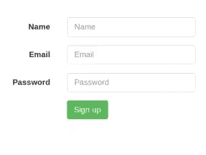

# AngularJS 格式的 HTML 表单

> 原文：<https://www.sitepoint.com/html-forms-angularjs/>

本教程将向您展示如何使用 AnguarlJS 的双向数据绑定来收集和验证 HTML 表单数据。在本教程中，我们将学习如何使用 Angular 实现一个简单的用户注册表单。在这个过程中，我们将看看基本的 HTML，并展示为了加入 AngularJS 需要改变什么。

## 先决条件

*   安装 [Node.js](http://nodejs.org) 。
*   克隆 [AngularJS 种子项目](https://github.com/angular/angular-seed)。

## 表单 HTML

我们的注册表单的 HTML 如下所示。Bootstrap 已被用于使网站在视觉上更具吸引力。

```
<html lang="en" ng-app="myApp">
  <head>
    <meta charset="utf-8">
    <meta http-equiv="X-UA-Compatible" content="IE=edge">
    <meta name="viewport" content="width=device-width, initial-scale=1">
    <title>Bootstrap 101 Template</title>
    <link href="css/bootstrap.min.css" rel="stylesheet" />
    <link rel="stylesheet" href="css/app.css" />
  </head>
  <body>
    <form class="form-horizontal" role="form">
      <div class="form-group">
        <label for="inputName3" class="col-sm-2 control-label">Name</label>
        <div class="col-sm-4">
          <input class="form-control" id="inputName3" placeholder="Name">
        </div>
      </div>
      <div class="form-group">
        <label for="inputEmail3" class="col-sm-2 control-label">Email</label>
        <div class="col-sm-4">
          <input class="form-control" id="inputEmail3" placeholder="Email">
        </div>
      </div>
      <div class="form-group">
        <label for="inputPassword3" class="col-sm-2 control-label">Password</label>
        <div class="col-sm-4">
          <input class="form-control" id="inputPassword3" placeholder="Password">
        </div>
      </div>
      <div class="form-group">
        <div class="col-sm-offset-2 col-sm-10">
          <button type="submit" class="btn btn-success">Sign up</button>
        </div>
      </div>
    </form>
    <script src="lib/common/jquery.min.js"></script>
    <script src="lib/common/bootstrap.min.js"></script>
    <script src="lib/angular/angular.js"></script>
    <script src="lib/angular/angular-route.js"></script>
    <script src="js/app.js"></script>
    <script src="js/services.js"></script>
    <script src="js/controllers.js"></script>
    <script src="js/filters.js"></script>
    <script src="js/directives.js"></script>
  </body>
</html>
```

该窗体应该类似于下图。



## 收集数据

在 jQuery 中，使用如下代码读取单个表单输入:

```
$('#txtInput').val()
```

因为 AngularJS 支持双向数据绑定，所以我们不需要显式读取输入。相反，当表单输入发生变化时，它会自动反映在控制器的`$scope`中。为了验证这一点，在结束的`form`标签之前添加下面的`span`。这个 snipper 依赖于一个名为`formInfo`的变量。

```
<span>{{formInfo}}</span>
```

AngularJS 有一个名为`ng-model`的指令，帮助将输入绑定到变量。让我们将`ng-model`指令应用于表单中的三个输入元素。以下是更新后的 HTML 表单:

```
<form class="form-horizontal" role="form">
  <div class="form-group">
    <label for="inputName3" class="col-sm-2 control-label">Name</label>
    <div class="col-sm-4">
      <input class="form-control" id="inputName3" placeholder="Name" ng-model="formInfo.Name">
    </div>
  </div>
  <div class="form-group">
    <label for="inputEmail3" class="col-sm-2 control-label">Email</label>
    <div class="col-sm-4">
      <input class="form-control" id="inputEmail3" placeholder="Email" ng-model="formInfo.Email">
    </div>
  </div>
  <div class="form-group">
    <label for="inputPassword3" class="col-sm-2 control-label">Password</label>
    <div class="col-sm-4">
      <input type="password" class="form-control" id="inputPassword3" placeholder="Password" ng-model="formInfo.Password">
    </div>
  </div>
  <div class="form-group">
    <div class="col-sm-offset-2 col-sm-10">
      <button type="submit" class="btn btn-success">Sign up</button>
    </div>
  </div>
  <span>{{formInfo}}</span>
</form>
```

如您所见，`ng-model`指令已经附加到每个输入元素上。每个输入都绑定到`formInfo`对象中的特定字段。现在，当用户在输入元素中输入数据时，`formInfo`会自动更新。您可以通过查看这个工作中的[演示](http://protected-chamber-9267.herokuapp.com/app/firstDemo.html)来查看这段代码的运行情况。使用同一个`formInfo`变量，我们可以访问表单数据，而不用单独读取控制器中的每个元素值。为此，我们需要在控制器内部定义一个`$scope.formInfo`变量`MyCtrl1`。完成这些更改后，这就是`app/js/controllers.js`的样子:

```
'use strict';

/* Controllers */

angular.module('myApp.controllers', []).
  .controller('MyCtrl1', ['$scope', function($scope) {
    $scope.formInfo = {};
    $scope.saveData = function() {

    };
  }])
  .controller('MyCtrl2', [function() {

  }]);
```

我们还定义了一个名为`saveData()`的函数，当用户点击注册按钮时将调用这个函数。

接下来，我们需要将一个`ng-controller`指令附加到表单本身。

```
<form class="form-horizontal" role="form" ng-controller="MyCtrl1">
```

接下来，在注册按钮上附加一个`ng-click`指令:

```
<button type="submit" ng-click="saveData()" class="btn btn-success">Sign up</button>
```

在`saveData()`函数中，添加一个`console.log($scope.formInfo);`来检查我们是否正在使用`$scope`在控制器中获取表单数据集合。重新启动节点服务器，浏览到 HTML 页面，并检查浏览器控制台。您应该会看到类似这样东西:

```
Object {Name: "Jay", Email: "jay3dec@gmail.com", Password: "helloworld"}
```

现在，这些收集的数据可以存储在数据库中。

## 验证输入

我们还需要验证从`$scope`接收的数据是否有效。如果不是，我们必须显示一些验证错误。`ng-show`指令根据表达式的值显示或隐藏元素。我们将使用它来显示错误消息。首先定义三个`$scope`变量—`$scope.nameRequired`、`$scope.emailRequired`和`$scope.passwordRequired`。我们将在更新后的`app/js/controllers.js`中验证`saveData()`函数中的名称、电子邮件和密码。

```
'use strict';

/* Controllers */

angular.module('myApp.controllers', [])
  .controller('MyCtrl1', ['$scope', function($scope) {
    $scope.formInfo = {};
    $scope.saveData = function() {
      $scope.nameRequired = '';
      $scope.emailRequired = '';
      $scope.passwordRequired = '';

      if (!$scope.formInfo.Name) {
        $scope.nameRequired = 'Name Required';
      }

      if (!$scope.formInfo.Email) {
        $scope.emailRequired = 'Email Required';
      }

      if (!$scope.formInfo.Password) {
        $scope.passwordRequired = 'Password Required';
      }
    };
  }])
  .controller('MyCtrl2', [function() {

  }]);
```

在 HTML 页面中，为每个 input 元素添加一个`span`来显示错误信息，如下所示；

```
<span ng-show="nameRequired">{{nameRequired}}</span>
<span ng-show="emailRequired">{{emailRequired}}</span>
<span ng-show="passwordRequired">{{passwordRequired}}</span>
```

重新启动节点服务器，尝试使用空的输入元素单击注册按钮。您应该会看到相应的错误消息。

## 结论

在本教程中，我们学习了如何从表单中读取数据，并使用 AngularJS 进行验证。我建议阅读 [AngularJS API 文档](http://docs.angularjs.org/)以获得更深入的见解。同时，一个工作演示可以在[这里](http://protected-chamber-9267.herokuapp.com/app/signUp.html)获得。

## 分享这篇文章