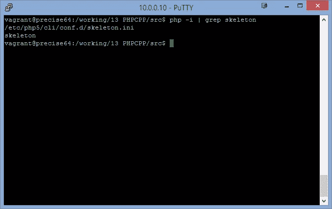
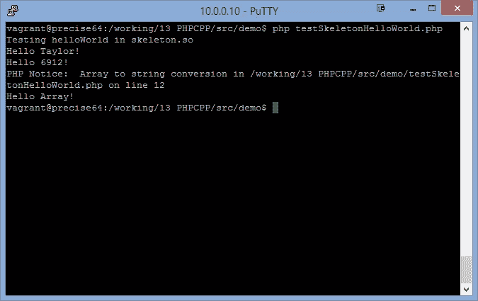

# 通过 PHP-CPP 开始 PHP 扩展开发

> 原文：<https://www.sitepoint.com/getting-started-php-extension-development-via-php-cpp/>

在与 PHP 打交道的过程中，您可能会考虑自己编写一个 PHP 扩展。我能想到的激励我这样做的原因有几个:

*   为一些非常特殊的用途(数学、统计、几何等)扩展 PHP 功能。
*   与纯 PHP 实现相比，具有更高的性能和效率
*   利用用另一种以前掌握的语言(对我来说是 C++)编程的快捷性。

当谈到选择工具来构建 PHP 扩展时，我们看到两种不同的方法:

*   使用更多的 pro-PHP 语义，比如 [Zephir](http://zephir-lang.com/) 。
*   使用更多的 pro-C/C++语义，比如 [PHP-CPP](http://www.php-cpp.com/) ，这将在本文中讨论。

对我来说，选择第二种方法的主要驱动力很简单:我是从 C/C++开始我的编程爱好的，所以我仍然觉得用 C/C++编写那些低级模块更舒服。PHP-CPP 的官方网站给出了这样做的其他理由。

### 安装和配置

PHP-CPP 发展很快。在撰写本文时，它的版本是 0.9.1(大约 2 天前发布了 0.9.0)。根据它的文档，“这是一个为即将到来的 1.0 版本做准备的功能冻结版本”，所以我们有信心很快就会看到它的 1.0 主要版本。

因此建议，至少在这个过渡时期，使用`git`来克隆[存储库](https://github.com/CopernicaMarketingSoftware/PHP-CPP.git)，并通过`git pull`获得最新的更新。

**注意:**PHP-CPP[关于安装的文档](http://www.php-cpp.com/documentation/install)声明暂时“只支持单线程 PHP 安装”，因为“在内部，Zend 引擎使用一个非常奇怪的系统来确保线程安全”。未来的版本可能会支持多线程 PHP 安装，但现在让我们记住这一点，并坚持其当前的限制。幸运的是，“单线程 PHP 安装”应该是大多数 PHP 安装的情况。

PHP-CPP 是用 [C++11](http://en.wikipedia.org/wiki/C++11) 写的。因此，我的 Ubuntu 12.04 LTS 版中安装的旧版本 g++不支持它。我们需要将我们的 g++编译器升级到 4.8.x 以上版本。有一篇[文章](http://ubuntuhandbook.org/index.php/2013/08/install-gcc-4-8-via-ppa-in-ubuntu-12-04-13-04/)详细介绍了升级的步骤。请遵循那里列出的说明。

同样，PHP-CPP 编译将使用`php.h`头文件。这个文件通常是在 Ubuntu 盒子里丢失的，除非安装了`php-dev`。我们可以通过发出以下命令来安装 PHP5 相关的开发文件:

```
sudo apt-get install php5-dev
```

升级 g++并安装必要的头文件后，我们可以发出以下命令来编译并安装 PHP-CPP 库文件(`libphpcpp.so`):

```
make && sudo make install
```

编译会很快。安装完成后，`libphpcpp.so`文件将被复制到`/usr/lib`，所有 PHP-CPP 头文件将被复制到`/usr/include`和`/usr/include/phpcpp`文件夹。

PHP-CPP 库的安装现在已经完成。这很简单，我们现在可以进入编程部分了。

在此之前，我们将讨论 PHP-CPP 中使用的一些重要概念和术语。完整的文档可以在它的官方网站上找到，鼓励每个人在进行任何真正的编程之前通读它。

### 框架(空)扩展项目文件

PHP-CPP 为[提供了一个框架扩展项目](http://www.php-cpp.com/EmptyExtension.zip)，包含以下 3 个文件:

*   `main.cpp`:包含一个`get_module`函数的主 cpp 文件(将在后面详细讨论)
*   `Makefile`:编译扩展名的示例 MAKE 文件
*   `yourextension.ini`:仅包含一行用于扩展加载

#### 生成文件

如果你熟悉*nix 开发，你就熟悉这个 Makefile。应该做一些细微的修改来定制这个文件，以满足我们的需要:

*   把`NAME = yourextension`改成更有意义的，比如`NAME = skeleton`。
*   更改`INI_DIR = /etc/php5/conf.d`以匹配您的系统配置。我的情况是`INI_DIR = /etc/php5/cli/conf.d`。我修改了 INI 路径，首先为 PHP 的 cli 环境启用扩展。

这些都是我做的改变。其余的`Makefile`可以保持原样。

#### yourextension.ini

我将该文件重命名为`skeleton.ini`，并将该文件中唯一的一行修改为:

```
extension=skeleton.so
```

#### 主页面

在 PHP-CPP 提供的空项目中，这个文件只包含一个函数:`get_module()`，摘录如下:

```
#include <phpcpp.h>

/**
 *  tell the compiler that the get_module is a pure C function
 */
extern "C" {

    /**
     *  Function that is called by PHP right after the PHP process
     *  has started, and that returns an address of an internal PHP
     *  strucure with all the details and features of your extension
     *
     *  @return void*   a pointer to an address that is understood by PHP
     */
    PHPCPP_EXPORT void *get_module() 
    {
        // static(!) Php::Extension object that should stay in memory
        // for the entire duration of the process (that's why it's static)
        static Php::Extension extension("yourextension", "1.0");

        // @todo    add your own functions, classes, namespaces to the extension

        // return the extension
        return extension;
    }
} 
```

现在，让我们修改这一行以匹配我们打算创建的扩展名:

```
static Php::Extension extension("skeleton", "1.0"); // To be humble, we can change the version number to 0.0.1
```

当 PHP 试图加载一个需要的库时，PHP 调用`get_module()`。它被认为是库的入口点。它是使用`extern "C"`修饰符声明的，以符合 PHP lib 对`get_module()`函数的要求。它还使用了一个宏`PHPCPP_EXPORT`，确保`get_module()`是公开导出的，因此可以被 PHP 调用。

到目前为止，我们已经对空项目进行了一些修改，以满足我们的需要。我们现在可以编译和安装这个项目，并安装扩展:

```
make && sudo make install
```

接下来，我们需要将所需的文件复制到适当的文件夹中:

```
cp -f skeleton.so /usr/lib/php5/20121212 cp -f skeleton.ini /etc/php5/cli/conf.d
```

我们只需要确保`skeleton.so` lib 被复制到 PHP 扩展的正确位置(在我的 Ubuntu 设置中，应该是如上图的`/usr/lib/php5/20121212`)。

然后，我们可以通过`php -i | grep skeleton`在 CLI 中验证该扩展是否已加载，终端应该显示如下内容:



(回想一下，`skeleton.ini`就是我们上面修改的文件，它包含了`extension=skeleton.so`行。)

到目前为止，我们已经使用 PHP-CPP 编译并安装了我们的第一个 PHP 扩展。当然，这个扩展还没有做任何事情。我们现在将创建前几个函数，以进一步理解构建 PHP 扩展的过程。

### “你好，泰勒”功能

我们创建的第一个函数将是“Hello，World”的略微修改版本。先来看看`main.cpp`的完整代码:

```
#include <phpcpp.h>
#include <iostream>

void helloWorld (Php::Parameters &params)
{
    std::string name=params[0];
    std::cout<<"Hello "<<name<<"!"<<std::endl;

}

extern "C" {

    PHPCPP_EXPORT void *get_module() 
    {
        static Php::Extension extension("skeleton", "1.0");
        extension.add("helloWorld", helloWorld);

        return extension;
    }
}
```

根据 PHP-CPP 文档中关于“ [Register native functions](http://www.php-cpp.com/documentation/functions) ”的描述，它支持从 PHP 调用四种类型的函数签名:

```
void example1();
void example2(Php::Parameters &params);
Php::Value example3();
Php::Value example4(Php::Parameters &params);
```

在本例中，我使用第二个签名，参数以数组形式通过值传递(PHP 特性)。

但是在`helloWorld`中，我们已经专门使用了 C++ type `std::string`来抓取第一个参数。我们还使用 C++ `std` lib 来输出欢迎消息。

在`get_module()`函数中，在声明了`extension`变量之后，我们添加了我们想要导出的函数(`helloWorld()`)，并为 PHP 脚本指定了一个可见的名称(`helloWorld`)。

现在让我们编译并安装扩展。如果一切顺利，新的`skeleton.so`文件将被复制到扩展目录中。

我们可以编写一个简单的脚本来测试刚刚创建的函数:

```
<?php

echo "Testing helloWorld in skeleton.so\n";
echo helloWorld('Taylor'); 
echo helloWorld(1234+5678);
echo helloWorld(['string', 123+456]);
```

请花些时间看看输出:



我们稍后将回到我们在这里观察到的东西。

#### 通过引用的函数参数

接下来，我们将看到另一个通过引用传递参数的函数，一个`swap()`函数。在这个函数中，我们还将尝试指定参数的数量及其类型。

在`main.cpp`中，我们增加了一个函数`swap()`:

```
void swap(Php::Parameters &params) {
    Php::Value temp = params[0];
    params[0] = params[1];
    params[1] = temp;
}
```

并通过指定参数的数量及其类型来导出函数:

```
extension.add("swap", swap,{
            Php::ByRef("a", Php::Type::Numeric),
            Php::ByRef("b", Php::Type::Numeric)
        });
```

我们明确地说:

*   将有两个参数(`a`和`b`)；
*   它们应该通过引用传递(而不是通过值传递)；
*   它们应该是数字类型。

让我们再次编译并安装更新的扩展，并编写一些代码片段来看看这个新功能是如何工作的:

```
<?php

$a=10;
$b=20;

// swap($a); 
// Above will create a segment fault

swap($a, $b);
echo $a."|".$b."\n";

$c=10;
$d="string";
swap($c, $d);
echo $c."|".$d."\n";

$e=10;
$f=new \DateTime();
swap($e, $f);
var_dump($e);
var_dump($f);
```

`swap($a)`会失败。这是意料之中的，也是意料之外的。预期的部分是我们需要两个参数，而只给了一个。但是，当 PHP 调用函数`swap`并提示我们类似`Not enough parameters`的东西时，难道不应该捕捉到这个错误吗？

第一次调用(`swap($a, $b)`)显示预期结果:`20|10`。该函数交换传入的两个**数字**。

第二个调用有点出乎意料:我们已经告诉 PHP 我们要交换两个**号**！但是它忽略了传递的第二个参数是一个字符串的事实，仍然进行了交换！

好吧，某种程度上来说，还是意料之中的。PHP 并没有真正区分数字类型和字符串类型。这种行为符合 PHP 标准。同样由于这种行为，我们没有也不能对函数(`temp`)中使用的临时变量使用 C++内部类型，而是使用`Php::Value`作为变量类型。

第三个电话会起作用。第一个`var_dump`将显示日期时间对象，第二个将显示整数。这多少有点出乎意料(至少对我来说)。毕竟，一个对象和一个数字/字符串是完全不同的。但是考虑到这种“交换”行为在 PHP 中也是可行的，它符合 PHP 的奇特之处。

那么，这是否意味着“类型”规范不会有任何影响呢？不完全是。为了进一步阐述这一点，我们创建了第三个函数:

```
void swapObject(Php::Parameters &params)
{
    Php::Value temp = params[0];
    params[0] = params[1];
    params[1] = temp;
}
```

我们这样注册这个函数:

```
extension.add("swapObject", swap,{
            Php::ByRef("a", "sampleClass"),
            Php::ByRef("b", "sampleClass")
});
```

测试代码将如下所示:

```
class sampleClass {
    var $i;
    public function __construct($n) {
        $this->i = $n;
    }
}

$o1 = new sampleClass(10);
$o2 = new sampleClass(20);

swapObject($o1, $o2);
echo $o1->i . "|" . $o2->i . "\n";

class anotherClass {
}

$d1 = new anotherClass();
$d2 = new anotherClass();

swapObject($d1, $d2);
```

对`swapObject()`的第一次调用将会工作，因为我们传递了正确的类类型(`sampleClass`)。第二个将失败，显示“`PHP Catchable fatal error: Argument 1 passed to swapObject() must be an instance of sampleClass, instance of anotherClass given...`”。

上面的代码段说明了类型限制的一个重要方面:标量类型声明并没有真正实现。PHP 和 PHP-CPP 只强制对象类型声明。此外，参数的数量在 PHP 端并没有真正强制执行。

### 结论

在本文中，我们举例说明了为 PHP 环境准备 PHP-CPP 的步骤。我们还讨论了使用 PHP-CPP(和 C++语义)创建 PHP 扩展的一些基本步骤。

我们讨论了扩展项目文件、函数签名、函数导出/注册以及函数参数类型。

在我们的下一篇文章中，我们将进一步阐述 PHP-CPP 中的一些关键特性，并提供一个真实的用例，展示使用 PHP-CPP 实现 C++类和名称空间的用法。

## 分享这篇文章